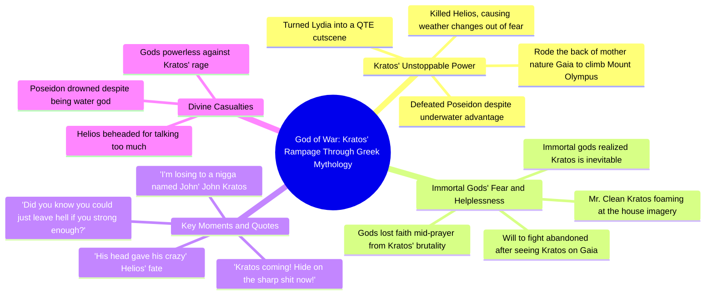

# Kratos 6 Rerun: Poseidon Drowned

> 🌐 **Read this in:** [English](../../en/2026-06/tiktok-transcript-kratos-6-rerun-kratos-godofwar-gow-godofwarragnarok-godofwar-940b.md) · **中文**

> **Creator:** [@jaypierlis](https://www.tiktok.com/@jaypierlis) · **Views:** 109.3K · **Posted:** 2026-06-06 · **Niche:** entertainment
>
> **TL;DR:** Immediate panic and urgency hook viewers by tapping into shared gaming fear.

[Watch original video →](https://vm.tiktok.com/ZNRvk1SBH/)

## Why This Went Viral

## 钩子（前3秒）
- 原话："奎托斯来了！快躲到尖刺上！冷静！老兄，别他妈喊冷静！"
- 钩子模式：**场景 + 紧迫感**（混乱的警报、即时的危机，以及直接的矛盾）
- 为何能留住观众：恐慌具有传染性。说话者瞬间自相矛盾（"冷静"→"别他妈喊冷静"），制造出令人困惑的喜剧效果。观众需要了解这种荒谬恐惧的来龙去脉。

## 情绪节奏
1. **困惑 + 紧迫感**（0:00–0:05）：对"奎托斯来了"感到恐慌——观众完全不知为何。
2. **好奇 + 幽默**（0:05–0:15）："他淹死了波塞冬"——荒谬的逻辑击中笑点。观众因这个设定而发笑。
3. **紧张升级**（0:15–0:30）："他全名叫什么？约翰·奎托斯。我居然输给一个叫约翰的家伙。"——平凡的名字与弑神之力形成极致喜剧张力。
4. **共鸣 + 惊喜**（0:30–0:45）："信徒在祈祷中途失去信仰"——意想不到的深度。观众感受到分量。
5. **高潮**（0:45–0:55）："他杀了太阳神，天气都因纯粹的恐惧而改变。"——夸张、形象、令人难忘。
6. **释放**（0:55–结尾）："那天我失去了战斗的意志"——泄气。喜剧性的投降。

## 关键词密度
- **奎托斯**（6次）——算法锚点（游戏角色名驱动搜索/发现）
- **老兄**（5次）——情感牵引（方言的亲密感、幽默、黑人游戏文化中的共鸣）
- **神 / 太阳神 / 波塞冬**（4次）——算法覆盖（神话 + 游戏跨界）
- **恐惧 / 意志**（3次）——情感牵引（将笑话人性化，制造危机感）
- **奥林匹斯山 / 地狱 / 淹死 / 头 / 呼吸**（各2次）——场景设定关键词，强化荒谬前提

## 为何能传播
1. **颠覆已知角色的力量等级**  
   - "他淹死了波塞冬。他不是能在水下呼吸吗？"——将一个已知的弑神者变得*更加*可怕。《战神》粉丝分享是因为它验证了他们的敬畏。

2. **用"普通人"名字制造喜剧反差**  
   - "我输给一个叫约翰的家伙"——将神话人物变成 relatable 的笑话。观众会@觉得这好笑的朋友。

3. **在60秒内完成完整叙事弧**  
   - 从恐慌→逻辑→投降。每句话都在升级。没有冷场。完美适合 TikTok/Reels 的留存率。

4. **提供可引用的高潮短语**  
   - "他杀了太阳神，天气都因纯粹的恐惧而改变"——可独立传播的台词。适合做成表情包。

5. **荒谬中隐藏 relatable 的情感真相**  
   - "你有没有醒来看到清洁先生站在你面前，满嘴泡沫？"——将恐怖与日常幽默结合。观众会评论自己"不公平的 boss"故事。

## 你可以借鉴的
1. **以矛盾开场**——"冷静！别他妈喊冷静！"让观众倒回去重看。用自相矛盾的台词制造即时困惑→好奇心。

2. **将已知角色扩展到其原有设定之外**——选取一个流行角色（游戏、电影、表情包），编造一个更荒谬的新壮举。期待与夸张之间的差距驱动分享。

3. **以泄气的投降结尾**——"那天我失去了战斗的意志"收尾。不要过度解释。让笑点落地就结束。短视频靠突然而自信的结尾取胜。

## Mind Map

## Full Transcript (Generated by [TokTranscript 转录工具](https://toktranscript.com/?utm_source=github&utm_medium=breakdown&utm_campaign=tool_attribution))

> 📝 Transcripts on this page are auto-generated and show the first 60%. Want to transcribe any TikTok in 30 seconds and get the full version? [Try TokTranscript free →](https://toktranscript.com/?utm_source=github&utm_medium=breakdown&utm_campaign=transcript_cta)

Kratos coming! Hide on the sharp shit now! Calm down! Nigga, don't call the fuck down! How the fuck you make an example out of zoos, dog? He drowned Poseidon! Can't he breathe underwater? Did you know you could just leave hell if you strong enough? No. Either did I! What's his full name? John Kratos. I'm losing to a nigga named John. He turned my nigga Lydia into a QTE cutscene. I can't. Helios was running his fucking mouth. What happened? Let's just say his head gave his crazy. So this nigga can fly too, huh? You ain't never been put so hard that your believers lose faith mid-prayer. You ever wa

*[Read the full transcript on TokTranscript →](https://toktranscript.com/plaza/tiktok-transcript-kratos-6-rerun-kratos-godofwar-gow-godofwarragnarok-godofwar-940b?utm_source=github&utm_medium=breakdown&utm_campaign=transcript_full)*

## Browse More

- All [entertainment](../../by-niche/zh-CN/entertainment.md) breakdowns
- All [Urgent Call to Action](../../by-pattern/zh-CN/hook-urgent-call-to-action.md) examples

## Video Info

| | |
|---|---|
| Creator | [@jaypierlis](https://www.tiktok.com/@jaypierlis) |
| Original video | [https://vm.tiktok.com/ZNRvk1SBH/](https://vm.tiktok.com/ZNRvk1SBH/) |
| Original title | Kratos 6.(rerun) #kratos #godofwar #gow #godofwarragnarok #godofwar3  |
| Views | 109.3K (109300) |
| Posted | 2026-06-06 |
| Duration | 0s |
| Niche | `entertainment` |
| Hook pattern | `Urgent Call to Action` |
| Original language | `en` (this page translated by AI) |
| Available languages | en, zh-CN |
| Generated | 2026-06-09 by [TokTranscript](https://toktranscript.com/) |

---

*This breakdown is for educational analysis under fair use. Original video © [@jaypierlis](https://www.tiktok.com/@jaypierlis). All transcripts are auto-generated and may contain errors.*

*Want to analyze your own TikToks like this? [TokTranscript →](https://toktranscript.com/viral-breakdown?utm_source=github&utm_medium=breakdown&utm_campaign=footer_cta)*