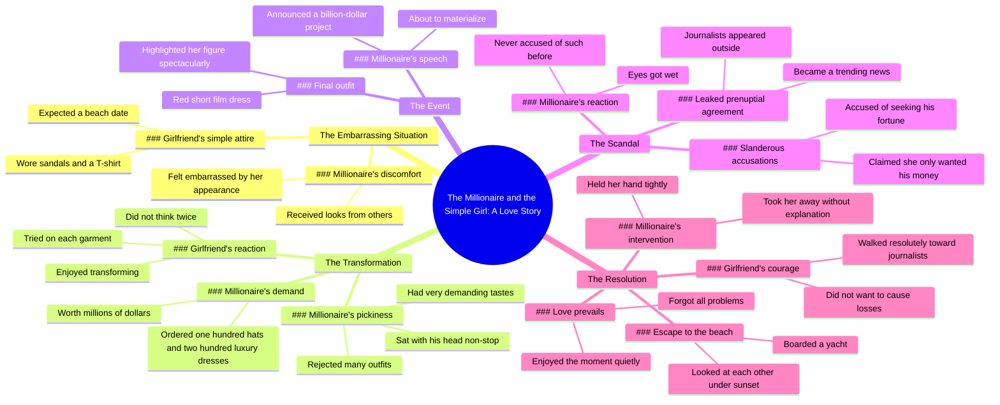

# Millionaire Buys 100 Hats and 200 Dresses for Embarrassed...

> 🌐 **Read this in:** [English](../../en/2026-06/tiktok-transcript-latintiktok-viralusaticktok-movieexplained-f6ec.md) · **中文**

> **Creator:** [@jgkgstiufsjf](https://www.tiktok.com/@jgkgstiufsjf) · **Views:** 2.4M · **Posted:** 2026-06-23 · **Niche:** other
>
> **TL;DR:** Sets up a relatable underdog scenario with immediate social tension.

[Watch original video →](https://vt.tiktok.com/ZSCRESToq/)

## Why This Went Viral

## 钩子（前3秒）
- **逐字开场白：**“这个男人尴尬极了，别人的女伴看起来都像公主，而他的女朋友却穿着朴素，走到哪里都招来目光。”
- **钩子模式：**场景+对比（尴尬 vs. 公主，朴素 vs.奢华）
- **为何能让人停下滑动：**即时的社交紧张和身份焦虑——一种因伴侣外表而被评判的普遍恐惧。“尴尬极了”一词触发情感紧迫感，“公主”与“穿着朴素”的对比则铺垫出灰姑娘式的冲突。

## 情感节奏
- **节拍1——好奇+紧张：**男人尴尬，女友穿着朴素，招来“四面八方的目光”→观众想看到如何解决。
- **节拍2——升级+解脱：**百万富翁订购100顶帽子和200件奢华礼服→财富幻想，转变开始。女友试穿，享受其中→情感宣泄。
- **节拍3——转折（共鸣）：**她穿着凉鞋和T恤——不知道这是商务会议→让她更人性化，同情心转移。
- **节拍4——高潮（悬念+情感巅峰）：**记者泄露婚前协议，她被污蔑为拜金女，眼眶湿润→高风险，身份危机。
- **节拍5——结局（解脱+浪漫）：**他抓住她的手，无视丑闻，带她登上日落时的游艇→爱情战胜金钱和名誉。“爱意在空气中弥漫”→情感回报。

## 关键词密度
- **“百万富翁”**（5次以上）——算法覆盖：高抱负关键词，触发财富幻想标签。
- **“尴尬”/“污蔑”/“指责”**——情感吸引力：羞耻和不公推动参与度。
- **“礼服”/“帽子”/“服装”**——视觉+抱负：时尚内容在短视频平台上表现良好。
- **“合同”/“数十亿”/“声誉”**——算法+情感：商业利益增加感知价值和戏剧性。
- **“爱情”/“日落”/“对视”**——情感吸引力：浪漫结局触发分享欲（美好结局）。
- **“记者”/“泄露”/“热搜”**——算法覆盖：丑闻+新闻形式勾起好奇心。

## 为何能传播
1. **灰姑娘情节，权力动态性别反转**——贫穷女孩被评判，然后被改造，最后被富人保护。这种公式（弱者+财富+浪漫）具有跨人群的巨大吸引力。具体：“别人的女伴看起来都像公主” vs. “女孩穿着朴素。”
2. **90秒内的高风险情感过山车**——从尴尬→奢华→丑闻→泪水→拯救→日落。每个节拍都是悬念，奖励留存率。具体：“眼眶湿润” → “他把她拥入怀中。”
3. **丑闻+救赎弧线**——泄露的婚前协议和“拜金女”指控创造了一种普遍恐惧（公众评判），最终以浪漫的反抗解决。具体：“面对谣言，无需解释。”
4. **财富幻想+道德回报**——观众能想象100顶帽子和200件礼服，然后获得爱情战胜金钱的情感奖励。具体：“这件作品价值数百万美元” → “他把她拥入怀中，走向海滩。”
5. **开放式循环结构**——每句话都以钩子结尾，引向下一句（尴尬→帽子→转变→丑闻→拯救）。观众无法预测结局，从而推动观看时长和重播。

## 你可以借鉴的
1. **以身份威胁开场，而非赞美。**“尴尬极了”比“美丽”更快触发焦虑。从问题开始，而非正确的事。
2. **使用“三袋技巧”——以三为单位升级风险。**第一：尴尬。第二：奢华转变。第三：公开丑闻。每一袋风险都比上一袋更大。将故事映射为：问题→解决方案→更大问题→终极解决方案。
3. **以视觉隐喻结尾，而非说教。**“在日落余晖中对视”比任何道德陈述都更有效。以暗示情感结局的感官画面收尾——让观众感受，而非告知。

## Mind Map

## Full Transcript (Generated by [TokTranscript](https://toktranscript.com/?utm_source=github&utm_medium=breakdown&utm_campaign=tool_attribution))

> 📝 Transcripts on this page are auto-generated and show the first 60%. Want to transcribe any TikTok in 30 seconds and get the full version? [Try TokTranscript free →](https://toktranscript.com/?utm_source=github&utm_medium=breakdown&utm_campaign=transcript_cta)

this man was terribly embarrassed the companions of the others looked like princesses his girlfriend, on the other hand, dressed very simply received looks of everywhere the millionaire could not take it anymore ordered the bringing of one hundred hats and two hundred luxury dresses the piece was worth millions of dollars the young woman did not think twice about it each of the garments was tested one after the other had planned to go on a trip that day she thought it would be a date at the beach who only wore sandals and a T-shirt I didn't know he had to attend a meeting very important business the man had very demanding tastes that each clothing fit him well none were able to convince him sat there his head non-stop the girl did not bother at all enjoyed transforming and looking much better when he finished painting in the afternoon the woman who used to be so haughty looked from head to toe with total astonishment. the millionaire was speechless drank a sip of water to calm down the event was about to begin she wore a dress red short film that highlighted his figure in a spectacular way. the millionaire gave his speech on stage of a billion-dollar project was about to materialize suddenly a group of journalists appeared outside the prenuptial agreement between them had been leaked to the press news became a trend immediately slandered her claiming that he was only looking for his money and who accepted the relationship solely be

*[Read the full transcript on TokTranscript →](https://toktranscript.com/plaza/tiktok-transcript-latintiktok-viralusaticktok-movieexplained-f6ec?utm_source=github&utm_medium=breakdown&utm_campaign=transcript_full)*

## Browse More

- All [other](../../by-niche/zh-CN/other.md) breakdowns
- All [Contrast & Embarrassment](../../by-pattern/zh-CN/hook-contrast-embarrassment.md) examples

## Video Info

| | |
|---|---|
| Creator | [@jgkgstiufsjf](https://www.tiktok.com/@jgkgstiufsjf) |
| Original video | [https://vt.tiktok.com/ZSCRESToq/](https://vt.tiktok.com/ZSCRESToq/) |
| Original title | #latintiktok #viralusaticktok🇺🇸 #movieexplained  |
| Views | 2.4M (2400000) |
| Posted | 2026-06-23 |
| Duration | 0s |
| Niche | `other` |
| Hook pattern | `Contrast & Embarrassment` |
| Original language | `en` (this page translated by AI) |
| Available languages | en, zh-CN |
| Generated | 2026-06-24 by [TokTranscript](https://toktranscript.com/) |

---

*This breakdown is for educational analysis under fair use. Original video © [@jgkgstiufsjf](https://www.tiktok.com/@jgkgstiufsjf). All transcripts are auto-generated and may contain errors.*

*Want to analyze your own TikToks like this? [TokTranscript →](https://toktranscript.com/viral-breakdown?utm_source=github&utm_medium=breakdown&utm_campaign=footer_cta)*