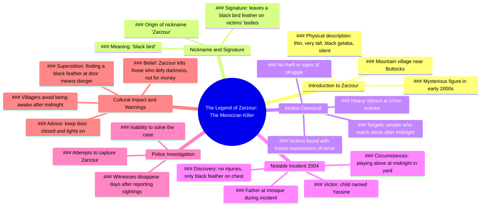

# The Moroccan Killer Zarzour: A Silent Stranger

> 🌐 **Read this in:** [English](../../en/2026-06/tiktok-transcript-le-tueur-marocain-zarzour-horreurtiktok-horreur-histoire-mys-bfe8.md) · **中文**

> **Creator:** [@murmuresdelarealite](https://www.tiktok.com/@murmuresdelarealite) · **Views:** 730.5K · **Posted:** 2026-06-11 · **Niche:** entertainment
>
> **TL;DR:** Opens with a mysterious name and location to immediately intrigue and draw in viewers.

[Watch original video →](https://www.tiktok.com/@murmuresdelarealite/video/7535214623457365270?lang=fr)

## Why This Went Viral

## 钩子（前3秒）
- **逐字开场白：**"你听说过那个绰号叫扎祖尔的摩洛哥杀手吗？"
- **钩子模式：**提问 + 好奇心缺口（引入一个带有神秘绰号的未知特定人物）
- **为何能阻止滑动：**这个问题暗示了一个观众从未听过的秘密或传说，而"扎祖尔"是一个陌生、异域的名字，瞬间引发好奇。"摩洛哥杀手"加上绰号的组合，构建了一个黑暗、具体的谜团，让人迫切想要答案。

## 情感节奏
- **节拍1 – 好奇心：**"你听说过……"——打开知识缺口。
- **节拍2 – 不安感：**"瘦削、非常高、身穿黑色杰拉巴、从不说话"——视觉上的诡异感。
- **节拍3 – 紧张升级：**"总是在尸体上留下一根黑色鸟羽"——标志性细节制造了模式与恐惧。
- **节拍4 – 悬念：**"那些在午夜后独自观看的人"——设定了一条规则和时间限制。
- **节拍5 – 恐怖转折：**"一个名叫亚辛的孩子在午夜独自玩耍……胸前有一根黑色羽毛"——无辜受害者，没有暴力，只有恐惧。
- **节拍6 – 偏执感：**"所有声称见过它的人，几天后都消失了"——目击者被清除，提高了风险。
- **节拍7 – 高潮/寓意：**"扎祖尔……杀死那些藐视黑暗的人"——赋予传说一个目的，一个警告。
- **节拍8 – 最后的寒意：**"如果有一天你发现一根黑色羽毛……不要关灯"——直接的行动号召，在视频结束后久久萦绕。

## 关键词密度
1. **"扎祖尔"** – 7次。驱动算法覆盖（独特、可搜索的名字）和情感吸引力（神秘、恐惧）。
2. **"午夜" / "午夜后"** – 4次。算法层面：特定时间触发好奇心。情感层面：制造恐惧、打破规则。
3. **"黑色羽毛"** – 4次。算法层面：视觉化、易记忆。情感层面：杀手的标志性象征。
4. **"独自"** – 3次。情感层面：孤立感放大恐惧，引发共鸣的脆弱感。
5. **"消失"** – 2次。情感层面：后果、消失的威胁。
6. **"恐惧"** – 1次。情感层面：强度最高的词语。
7. **"沉默"** – 2次。情感层面：诡异、感官细节。
8. **"孩子" / "亚辛"** – 2次。情感层面：纯真被侵犯，加剧恐怖感。
9. **"门"** – 2次。情感层面：入室恐惧，可操作的警告。
10. **"黑暗"** – 2次。情感层面：原始恐惧，象征未知。

## 为何能传播
1. **传说式叙事** – 视频感觉像古老的篝火故事，而非新闻报道。"据说"和"没人知道他的真名"这样的句子营造出神话般的、易于分享的氛围。人们分享传说，而非事实。
2. **具体、视觉化的细节** – "黑色杰拉巴"、"黑色鸟羽"、"冻结的恐惧表情"易于想象和复述。羽毛成为一个简单、诡异的象征，观众可以用一句话描述。
3. **基于规则的恐怖** – "午夜后独自观看的人"和"不要关灯"给观众提供了清晰、可操作的恐惧。这让故事深植记忆，并引发评论，如"我再也不熬夜了。"
4. **未解的谜团** – 杀手从未被抓住，目击者消失，结局是一个警告。这种开放性引发猜测、理论和转发（例如："这是真的吗？""还有人听说过扎祖尔吗？"）。
5. **直接对观众说话** – 最后一句"如果有一天你在门前发现一根黑色羽毛，关好门，不要关灯"打破了第四面墙，让观众感到个人受到威胁。这推动了参与度（评论、分享、收藏），因为它感觉像是专门针对*他们*的警告。

## 你可以借鉴什么
1. **用一个暗示秘密的问题开场** – "你听说过……"瞬间制造知识缺口。将此模式用于任何小众话题："你听说过闹鬼的7号站台的幽灵吗？"或"你听说过能预测你分手的算法吗？"
2. **将恐怖锚定在一个简单、可重复的符号上** – 黑色羽毛易于记忆和识别。在你的下一个视频中，选择一个物体（一个红气球、一只手套、一面裂开的镜子）作为故事的标志。这使故事易于分享，视觉上令人难忘。
3. **以直接、基于规则的警告结尾** – "如果你看到X，就做Y。"这将被动观看转化为个人参与。对于非恐怖内容："如果你收到这封邮件，不要点击链接"或"如果你的手机在凌晨3点响起，不要接。"它迫使观众想象自己身处场景中，从而提高参与度和记忆度。

## Mind Map

## Full Transcript (Generated by [我们用的转录工具](https://toktranscript.com/?utm_source=github&utm_medium=breakdown&utm_campaign=tool_attribution))

> 📝 Transcripts on this page are auto-generated and show the first 60%. Want to transcribe any TikTok in 30 seconds and get the full version? [Try TokTranscript free →](https://toktranscript.com/?utm_source=github&utm_medium=breakdown&utm_campaign=transcript_cta)

Have you ever heard of the Moroccan killer nicknamed zarzour? In the early two thousand years, in a mountain village near the buttocks, the inhabitants started talking about a strange man, thin, very tall, dressed in a black gelaba and who never spoke. Nobody knew his real name, but he nicknamed him zarzour, because he always left a black bird feather on the bodies of his victims, his victims. Always people who watched alone after midnight. Nothing was stolen, no sign of struggle, only a heavy silence and a frozen expression of terror on their faces. In two thousand four, a child named yassine played alone at midnight in the yard of his house while his father was at the mosque. When he return

*[Read the full transcript on TokTranscript →](https://toktranscript.com/plaza/tiktok-transcript-le-tueur-marocain-zarzour-horreurtiktok-horreur-histoire-mys-bfe8?utm_source=github&utm_medium=breakdown&utm_campaign=transcript_full)*

## Browse More

- All [entertainment](../../by-niche/zh-CN/entertainment.md) breakdowns
- All [Rhetorical question with exotic hook](../../by-pattern/zh-CN/hook-rhetorical-question-with-exotic-hook.md) examples

## Video Info

| | |
|---|---|
| Creator | [@murmuresdelarealite](https://www.tiktok.com/@murmuresdelarealite) |
| Original video | [https://www.tiktok.com/@murmuresdelarealite/video/7535214623457365270?lang=fr](https://www.tiktok.com/@murmuresdelarealite/video/7535214623457365270?lang=fr) |
| Original title | le tueur marocain zarzour #horreurtiktok #horreur #histoire #mystery ... |
| Views | 730.5K (730500) |
| Posted | 2026-06-11 |
| Duration | 0s |
| Niche | `entertainment` |
| Hook pattern | `Rhetorical question with exotic hook` |
| Original language | `en` (this page translated by AI) |
| Available languages | en, zh-CN |
| Generated | 2026-06-12 by [TokTranscript](https://toktranscript.com/) |

---

*This breakdown is for educational analysis under fair use. Original video © [@murmuresdelarealite](https://www.tiktok.com/@murmuresdelarealite). All transcripts are auto-generated and may contain errors.*

*Want to analyze your own TikToks like this? [TikTok 转录工具 →](https://toktranscript.com/viral-breakdown?utm_source=github&utm_medium=breakdown&utm_campaign=footer_cta)*