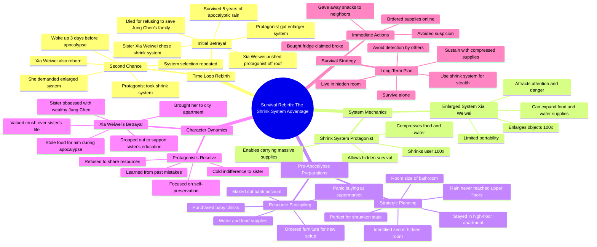

# Sisters Get Shrink and Enlarge Systems Before Apocalypse

> 🌐 **Read this in:** [English](../../en/2026-06/tiktok-transcript-loredeepdive-tiktoktvfilmcontest-shortdramareview-tiktok-fyp-6822.md) · **中文**

> **Creator:** [@etuscx](https://www.tiktok.com/@etuscx) · **Views:** 1.4M · **Posted:** 2026-06-20 · **Niche:** entertainment
>
> **TL;DR:** The hook presents a random, high-stakes choice between two systems, instantly creating intrigue and conflict.

[Watch original video →](https://vt.tiktok.com/ZSQ3pu6ro/)

## Why This Went Viral

## 钩子（前3秒）
- **逐字开场白：** "我和我妹妹随机获得了两个系统。一个能把东西缩小100倍，一个能把东西放大100倍。"
- **钩子模式：** **场景 + 对比**（两种对立的能力，立即营造出姐妹竞争的氛围）。
- **为何能让人停下滑动：** "两个系统"的设定瞬间引人入胜且新颖。"缩小"与"放大"的对比创造了一个清晰、高风险的抉择。姐妹间的互动（"她甚至都没犹豫"）立即增添了情感张力和代入感（谁没被兄弟姐妹冷落过呢？）。

## 情感节奏
- **节拍：**
    1.  **好奇**（0–5秒）："两个系统，她抢了缩小，我拿到了放大"——设置了一个谜题。
    2.  **紧张**（5–15秒）："末日暴雨……残酷的五年……她把我推下了屋顶。"——风险瞬间飙升。
    3.  **震惊/反转**（15–20秒）："就在一切陷入黑暗前，我眨了眨眼。然后突然回到了末日降临前三天。"——揭示时间循环。
    4.  **释然/决心**（20–30秒）："我要选缩小系统。"——主角重获掌控。
    5.  **扬眉吐气**（30–45秒）："她一把拉开前门，径直去敲了郑俊的门。"——反派的错误在意料之中。
    6.  **满足/策略**（45秒至结束）："我跳上车，直奔一家大超市。开启疯狂囤货模式。"——主动、聪明的准备。
- **高潮时刻：** "她也重生了，就像我一样。我在心里冷笑了一声。"——主角意识到自己并非唯一进入时间循环的人，复仇与生存游戏真正开始。

## 关键词密度
- **重复最多的词语/短语：**
    1.  **"系统"**（8次）——核心机制，驱动算法可发现性（生存/游戏类别的关键词）。
    2.  **"缩小" / "放大"**（合计12次）——独特的能力对比，高记忆度。
    3.  **"末日" / "雨"**（6次）——类型标签，搜索量高。
    4.  **"妹妹"**（10次）——情感锚点，家庭背叛的套路。
    5.  **"郑俊"**（6次）——反派的恋爱对象，制造浪漫副线张力。
    6.  **"上次" / "重生"**（5次）——时间循环/第二次机会叙事，高参与度。
    7.  **"保护" / "背叛"**（4次）——情感吸引力，驱动评论（"她杀了自己的妹妹！"）。
- **算法覆盖驱动因素：** "系统"、"末日"、"重生"——在网络小说/游戏类/生存类题材中搜索量高。
- **情感吸引力驱动因素：** "妹妹"、"背叛"、"保护"——触发强烈反应（愤怒、同情、正义感）。

## 为何能传播
1.  **高风险的背叛 + 时间循环复仇钩子：** "她把我推下了屋顶" → "我眨了眨眼，就回来了。" 这是一个经典、经过验证的叙事引擎（参见《Re:从零开始的异世界生活》、《魔法学徒》）。姐妹俩都重生的反转（"她也重生了，就像我一样"）增加了一个独特的策略层面，激发了"你会怎么做？"的猜测和评论。
2.  **清晰、令人共鸣的反派：** 肖薇薇立刻令人厌恶（贪婪、自私、把暗恋对象置于家庭之上）。"你为了郑俊和他家人就把我抛弃了？"——这句话是愤怒和认同的导火索。观众喜欢恨她。
3.  **聪明、令人满意的主角策略：** "我要选缩小系统。它也能压缩食物和水。这样我就能带更多东西。"——这是一种*战术性*的复仇，而不仅仅是情感上的。这让观众觉得自己支持她是很明智的。"疯狂囤货"的段落（"囤积了水和食物。甚至还拿了一批小鸡。"）非常令人满足且易于分享（人们喜欢生存准备类内容）。
4.  **悬念 + 世界观构建：** "我卧室里的暗室……大概一个浴室那么大，但对我来说是缩小版的。"——以承诺更多巧妙的生存策略结束。这推动了"第二部？"的评论，让观众留在算法循环中。
5.  **普遍的情感共鸣：** 姐妹竞争、背叛、第二次机会，以及智胜曾经伤害过你的人的幻想。这些都是原始、跨文化的主题，能引发强烈的情感反应和分享。

## 你可以借鉴什么
1.  **从一个即时、高风险的选择开始：** 不要解释世界；直接把观众扔进一个有明确后果的两难境地。"她抢了缩小系统"比"让我给你讲讲这些系统"更好。钩子是*决定*，而不是前提。
2.  **使用"双重揭示"反转：** 观众以为主角是唯一时间旅行的人，然后你揭示反派也做到了。这创造了一个新的张力层面，让主角的冷笑显得理所应当。在你的下一个视频中，先建立一个假设，然后用第二个揭示来颠覆它。
3.  **以一个具体、可执行的计划结束：** 不要只让主角"做准备"。展示她*买小鸡*和*找密室*。具体性让准备显得真实，并给观众一个可以抓住的具体幻想。"我跳上车，直奔一家大超市"比"我为末日做了准备"更容易被分享。

## Mind Map

## Full Transcript (Generated by [TokTranscript](https://toktranscript.com/?utm_source=github&utm_medium=breakdown&utm_campaign=tool_attribution))

> 📝 Transcripts on this page are auto-generated and show the first 60%. Want to transcribe any TikTok in 30 seconds and get the full version? [Try TokTranscript free →](https://toktranscript.com/?utm_source=github&utm_medium=breakdown&utm_campaign=transcript_cta)

Me and my little sister randomly got two systems. One that shrinks things 100 x, 1 that enlarges things 100 x. She didn't even hesitate. She straight up grabbed the shrink system. And all I got was the enlarger. Three days later, the apocalyptic downpour hit right on schedule. I had the enlarged system, so I stretched every last bit of supplies. We had barely kept it together, but I got us through five brutal years. Then the second the rain finally stopped, Xia Weiwei went and shoved me off the roof. The look in her eyes was pure venom. If you weren't so selfish, I could have used the enlarged ability to save Jung Chen's whole family. You heartless woman. Right before everything went dark, I blinked. And suddenly I was back three days before the apocalypse. That cold, robotic voice echoed in my head again. Please choose your system immediately. I was completely disoriented. Then I looked over at Xiao Weiwei. She froze for, like, a split second. Then she lost it, screaming, I want the enlarged system! One look at that greedy expression on her face, and everything clicked for me. She went back in time, too. She's been reborn, just like me. I let out a cold laugh inside. You throw me away for John Chen and his family? You wanted your own sister gone? Fine. I'll make that happen. The shrink system doesn't just shrink me. It can also compress food and water. So I Can carry way more. Once I figured that out, I kept my voice completely flat. All right then. I'll take the shrink system. Xiaoweiwei couldn't wait to test her new power. She waved her hand and blew up the water glass on the table 100 times. Oh, my god, it actually works. I stood there watching her show off, stone faced. This is the sister I nearly died protecting last time around. That rain fell for five straight years. Everyone got trapped inside their buildings. Outside supplies were long gone. I kept enlarging the last of our instant noodles and bread with that system. That's the only reason we survived. Xiao Weiwei's boyfriend, Jung Chen, lived right across the hall. She got down on her knees and begged me to save his family. But I knew how dark people got in the apocalypse. I said no because we flat out didn't have enough. Jung Chen's family didn't make it through those five years. They starved to death in their apartment. The irony. I survived the disaster, only to get killed by the very sister I've been protecting all along. The enlarged system is mine now. Bet you're dying of jealousy, huh? I let out a slow breath and played it cool, smiling like I didn't care. It's just a system. Not a big deal. You want it, it's yours. I don't care. I must have looked convincing enough. Xiaoweiwei finally relaxed. Watching her grin like she'd already won, I knew Exactly what was coming. She'd worshiped Jung Chen's family like royalty. But the moment she let anyone know about that system, she wouldn't last a single day in the apocalypse. Sure enough, just like I expected, she yanked the front door open and went straight to knock on Jung Chen's door. Xia Weiwei. What's up, Jung Chen? I need to talk to you. Inside, I watched their door close and pulled out my phone. August 15th. Three full days until the rain hits. There was still time to fix everything. I jumped in my car and headed straight to a big supermarket. Full on panic buy mode. Stocked up on water and food. Even grabbed a batch of baby chicks. Then I shot over to a furniture store, ordered a whole furniture set for my new setup. My apartment was already on a high floor. The rain never reached us last time, so I wasn't moving, just living differently. Every single minute. After that, I was buying. Didn't stop until I'd maxed out every last cent in my account. That night, Xiao Weiwei came home all giddy, acting like her and Jung Chen were already married. If I saved Jung Chen's whole family, you think he'd fall head over heels for me? She had this full on simp face. I hit her with the Cold Truth. No, don't even think about it. She snapped like I'd stepped on her tail. You're lying. Jung Chen totally likes me. For r

*[Read the full transcript on TokTranscript →](https://toktranscript.com/plaza/tiktok-transcript-loredeepdive-tiktoktvfilmcontest-shortdramareview-tiktok-fyp-6822?utm_source=github&utm_medium=breakdown&utm_campaign=transcript_full)*

## Browse More

- All [entertainment](../../by-niche/zh-CN/entertainment.md) breakdowns
- All [Choice with consequence](../../by-pattern/zh-CN/hook-choice-with-consequence.md) examples

## Video Info

| | |
|---|---|
| Creator | [@etuscx](https://www.tiktok.com/@etuscx) |
| Original video | [https://vt.tiktok.com/ZSQ3pu6ro/](https://vt.tiktok.com/ZSQ3pu6ro/) |
| Original title | #loredeepdive #tiktoktvfilmcontest #ShortDramaReview#tiktok#fyp |
| Views | 1.4M (1400000) |
| Posted | 2026-06-20 |
| Duration | 0s |
| Niche | `entertainment` |
| Hook pattern | `Choice with consequence` |
| Original language | `en` (this page translated by AI) |
| Available languages | en, zh-CN |
| Generated | 2026-06-21 by [TokTranscript](https://toktranscript.com/) |

---

*This breakdown is for educational analysis under fair use. Original video © [@etuscx](https://www.tiktok.com/@etuscx). All transcripts are auto-generated and may contain errors.*

*Want to analyze your own TikToks like this? [免费 TikTok 文稿生成器 →](https://toktranscript.com/viral-breakdown?utm_source=github&utm_medium=breakdown&utm_campaign=footer_cta)*