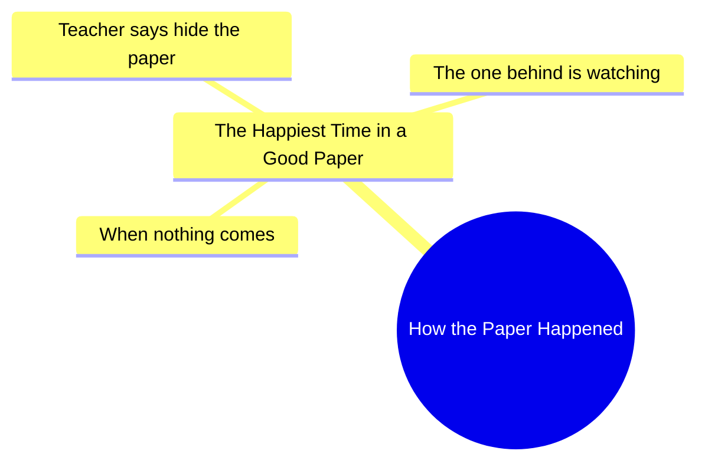

# Happiest Time in a Paper: Teacher Says Hide It

> 🌐 **Read this in:** [English](../../en/2026-06/tiktok-transcript-money-monky-viral-video-monky-55f2.md) · **中文**

> **Creator:** [@karenkarma11](https://www.tiktok.com/@karenkarma11) · **Views:** 2.5M · **Posted:** 2026-06-16 · **Niche:** other
>
> **TL;DR:** The hook uses a rhetorical question to draw in viewers, then subverts expectations with a relatable school scenario.

[Watch original video →](https://vt.tiktok.com/ZSQqVwuKU/)

## Why This Went Viral

## 钩子（前3秒）
- **逐字内容：** "那篇论文是怎么发生的"（语速快，语气好奇）
- **钩子模式：** **问题 + 场景**——一个修辞性的、隐晦的问题，紧接着一个熟悉的课堂场景。
- **为何能阻止滑动：** 问题模糊却又具体（"那篇论文"——一个普遍存在的学业压力源）。它瞬间引发好奇：*什么论文？发生了什么？* 观众需要看到答案，尤其是那些经历过那一刻的人。

## 情感节奏
- **节拍1——好奇（0–3秒）：** "那篇论文是怎么发生的"——设置了一个谜团。
- **节拍2——紧张（3–6秒）：** "一篇好论文中最快乐的时刻是什么？"——用一个修辞性问题制造期待。
- **节拍3——释然/认同（6–9秒）：** "当什么都没发生，老师说藏好论文时"——回报是能引起共鸣的，一个共享的内部笑话。
- **节拍4——反转/幽默（9–12秒）：** "后面那个人在偷看"——增加了一个喜剧性的背叛：你后面的人正在抄袭你藏起来的论文。这从释然翻转成新的紧张（被抓或抄袭）。
- **高潮：** "后面那个人在偷看"这句话——这是点睛之笔，让视频令人难忘且易于分享。

## 关键词密度
1. **论文**——重复3次；推动核心概念和可搜索性（学校、考试、测验）。
2. **老师**——出现一次，但贯穿始终；算法覆盖"老师"相关片段。
3. **藏**——强烈的情感动词；触发对藏答案的记忆。
4. **偷看**——制造偏执和幽默；推动可分享性。
5. **最快乐**——对比词；讽刺（最快乐的时刻是关于隐藏/生存）。
6. **后面**——位置词；为反转做铺垫。
- **算法驱动因素：** "论文"、"老师"、"藏"——在教育/幽默领域搜索量高。
- **情感吸引力：** "最快乐"、"偷看"——利用怀旧和共同的焦虑。

## 为何能传播
1. **普遍的学校记忆**——"藏好论文"几乎是每个学生都知道的仪式。视频激活了集体怀旧，让观众标记那些"做过这事"的朋友。
2. **反转结局**——"后面那个人在偷看"颠覆了预期的"释然"时刻。这种惊喜是分享的触发点：观众把它发给那些曾是"后面那个人"的朋友。
3. **简短紧凑的结构**——12秒，没有废话。模式（设置→问题→回报→反转）针对留存循环和重看进行了优化。
4. **可共鸣的焦虑→幽默**——视频将紧张时刻（考试压力）变成了一个笑话。这种释然+幽默的组合让它感觉像是一个"安全"的分享（不太黑暗，也不太傻）。
5. **隐含的对话**——文字稿读起来像脚本化的旁白，但它模仿了真实的课堂闲聊。这种"偷听"的品质让它感觉真实，易于混音或回应。

## 你可以借鉴什么
1. **"隐晦问题+场景"钩子**——从一个模糊、引发好奇的问题开始（"那个[普遍经历]是怎么发生的？"），然后立即切入一个回答它的视觉画面。这能为你赢得2–3秒的留存时间。
2. **"释然→反转"的情感翻转**——构建一个共享释然的时刻（"老师说藏好论文"），然后用新的紧张感（"后面那个人在偷看"）削弱它。这创造了一个感觉既应得又令人惊讶的点睛之笔。
3. **使用"隐含观众"语言**——像"后面那个人"这样的短语让观众在心理上代入自己（或他们的朋友）。这触发了标记和评论。始终为观众留下一个可以填充的角色。

## Mind Map

## Full Transcript (Generated by [TokTranscript](https://toktranscript.com/?utm_source=github&utm_medium=breakdown&utm_campaign=tool_attribution))

> 📝 Transcripts on this page are auto-generated and show the first 60%. Want to transcribe any TikTok in 30 seconds and get the full version? [Try TokTranscript free →](https://toktranscript.com/?utm_source=github&utm_medium=breakdown&utm_campaign=transcript_cta)

How the Paper Happened What is the happiest time in a good paper? When nothing comes and

*[Read the full transcript on TokTranscript →](https://toktranscript.com/plaza/tiktok-transcript-money-monky-viral-video-monky-55f2?utm_source=github&utm_medium=breakdown&utm_campaign=transcript_full)*

## Browse More

- All [other](../../by-niche/zh-CN/other.md) breakdowns
- All [Rhetorical question with unexpected answer](../../by-pattern/zh-CN/hook-rhetorical-question-with-unexpected-answer.md) examples

## Video Info

| | |
|---|---|
| Creator | [@karenkarma11](https://www.tiktok.com/@karenkarma11) |
| Original video | [https://vt.tiktok.com/ZSQqVwuKU/](https://vt.tiktok.com/ZSQqVwuKU/) |
| Original title | پیپر میں خوشی کس وقت ہوتی    🤣😂😅ہے #money #monky #viral #video #monky  |
| Views | 2.5M (2500000) |
| Posted | 2026-06-16 |
| Duration | 0s |
| Niche | `other` |
| Hook pattern | `Rhetorical question with unexpected answer` |
| Original language | `en` (this page translated by AI) |
| Available languages | en, zh-CN |
| Generated | 2026-06-17 by [TokTranscript](https://toktranscript.com/) |

---

*This breakdown is for educational analysis under fair use. Original video © [@karenkarma11](https://www.tiktok.com/@karenkarma11). All transcripts are auto-generated and may contain errors.*

*Want to analyze your own TikToks like this? [我们用的转录工具 →](https://toktranscript.com/viral-breakdown?utm_source=github&utm_medium=breakdown&utm_campaign=footer_cta)*