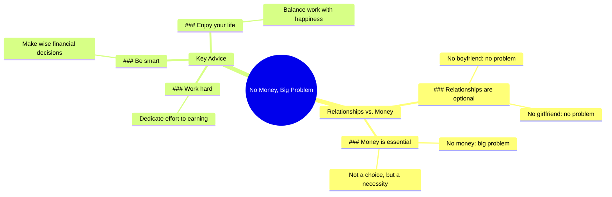

# No Money, Big Problem: Work Hard and Be Smart

> 🌐 **Read this in:** [English](../../en/2026-06/tiktok-transcript-no-boy-friend-no-problem-no-girl-friend-no-problem-no-money-b0e9.md) · **中文**

> **Creator:** [@mediverse_3d](https://www.tiktok.com/@mediverse_3d) · **Views:** 76.3M · **Posted:** 2026-06-02 · **Niche:** finance
>
> **TL;DR:** Uses a relatable contrast between relationships and money to create a sudden shift in priority.

[Watch original video →](https://vm.tiktok.com/ZNR7Yx55w/)

## Why This Went Viral

## 钩子（前3秒）
- **逐字开场白：**“没男朋友，没问题。没女朋友，没问题。但没钱，大问题。”
- **钩子模式：**对比 + 大胆断言（将可选的恋爱关系与金钱的必要性并列）
- **为何能让人停下刷屏：**“没X，没问题”的重复营造出一种有节奏、近乎催眠的模式，随后突然转向“大问题”，制造出紧张感的冲击。它将一种常见的社会焦虑（孤独）翻转成更普遍、更务实的恐惧（财务不安全），让观众暂停下来，看看逻辑会走向何方。

## 情感节奏
- **节拍1 – 轻描淡写（0–2秒）：**“没男朋友，没问题。没女朋友，没问题。”——营造出一种冷静、超脱的语气。观众可能会感到一丝反抗或解脱。
- **节拍2 – 紧张感（3秒）：**“但没钱，大问题。”——“但”字是一个语言上的减速带。节奏被打断，“大”字加重了分量。焦虑感飙升。
- **节拍3 – 合理化（4–5秒）：**“恋爱关系可以是选择，但钱是必需品。”——理性逻辑落地。观众会感到认知上的认同感。
- **节拍4 – 解决（6–7秒）：**“所以努力工作，聪明行事，享受你的生活。”——高潮在于“享受”这个词。它用一张允许自我关注的许可单化解了紧张感，带来微小的情感宣泄。
- **高潮时刻：**“大问题”这个短语是情感峰值。之后的一切都是逐渐下降、趋于平静的解释。

## 关键词密度
- **“没”**（4次）——驱动节奏感钩子，营造出二元、鲜明的对比。算法覆盖：高重复触发模式识别。
- **“问题”**（3次）——情感吸引词，暗示威胁/危险。让观众保持参与，以看到解决方案。
- **“钱”**（2次）——核心算法关键词（个人理财、奋斗文化、自我提升）。驱动发现。
- **“努力工作”**（1次）——行动导向，高参与度短语，适用于励志细分领域。
- **“享受”**（1次）——情感回报词。创造共鸣和可分享性（人们希望获得享受生活的许可）。
- **“选择”**（1次）——力量词，将恋爱关系重新定义为可选的，强化视频的自主主题。

## 为何能传播
1. **普遍恐惧 + 许可结构：**“恋爱关系可以是选择，但钱是必需品”这句话触及了广泛的焦虑（财务不安全），同时给观众许可，让他们优先考虑自己而非恋爱压力。人们分享它，作为一种微妙的炫耀或一记警钟。
2. **有节奏、可重复的钩子：**三连模式（“没X，没问题……没Y，没问题……但Z，大问题”）几乎像音乐一样。容易记忆和引用，使其高度可混搭（配音、文字叠加、合拍）。
3. **低摩擦，高共鸣：**视频只有7秒。没有复杂的论点，没有个人故事。它是一个单一、严密的逻辑三段论。观众可以立即同意或反对，推动评论和辩论。
4. **可分享包装中的自我肯定：**结尾“努力工作，聪明行事，享受你的生活”是一个自我修饰的口头禅。人们分享它来表明自己的价值观（奋斗、独立、务实），而无需自己写任何东西。

## 你可以借鉴什么
1. **使用“三连转折”钩子：**以两个轻描淡写的陈述（不重要的事情）开始，然后是一个尖锐的“但”+ 一个高风险第三个陈述。这种模式适用于任何细分领域：“没点赞，没问题。没观看，没问题。但没留存？大问题。”
2. **以许可单结尾：**制造紧张感后，用一个简单、可操作的许可来解决它（例如，“享受你的生活”）。这让视频感觉像一份礼物，增加收藏和分享。
3. **保持10秒以内，零废话：**每个词都必须有其价值。脚本中没有填充形容词，没有“嗯”，没有铺垫。写好脚本，然后砍掉一半。视频越短，完成率越高，算法越青睐。

## Mind Map

## Full Transcript (Generated by [TokTranscript](https://toktranscript.com/?utm_source=github&utm_medium=breakdown&utm_campaign=tool_attribution))

> 📝 Transcripts on this page are auto-generated and show the first 60%. Want to transcribe any TikTok in 30 seconds and get the full version? [Try TokTranscript free →](https://toktranscript.com/?utm_source=github&utm_medium=breakdown&utm_campaign=transcript_cta)

No boyfriend, no problem. No girlfriend, no problem. But no money, big problem. Relationships can be a choi

*[Read the full transcript on TokTranscript →](https://toktranscript.com/plaza/tiktok-transcript-no-boy-friend-no-problem-no-girl-friend-no-problem-no-money-b0e9?utm_source=github&utm_medium=breakdown&utm_campaign=transcript_full)*

## Browse More

- All [finance](../../by-niche/zh-CN/finance.md) breakdowns
- All [contrast escalation](../../by-pattern/zh-CN/hook-contrast-escalation.md) examples

## Video Info

| | |
|---|---|
| Creator | [@mediverse_3d](https://www.tiktok.com/@mediverse_3d) |
| Original video | [https://vm.tiktok.com/ZNR7Yx55w/](https://vm.tiktok.com/ZNR7Yx55w/) |
| Original title | No Boy Friend No Problem No Girl Friend No Problem No Money Big Probl... |
| Views | 76.3M (76300000) |
| Posted | 2026-06-02 |
| Duration | 0s |
| Niche | `finance` |
| Hook pattern | `contrast escalation` |
| Original language | `en` (this page translated by AI) |
| Available languages | en, zh-CN |
| Generated | 2026-06-03 by [TokTranscript](https://toktranscript.com/) |

---

*This breakdown is for educational analysis under fair use. Original video © [@mediverse_3d](https://www.tiktok.com/@mediverse_3d). All transcripts are auto-generated and may contain errors.*

*Want to analyze your own TikToks like this? [TokTranscript →](https://toktranscript.com/viral-breakdown?utm_source=github&utm_medium=breakdown&utm_campaign=footer_cta)*