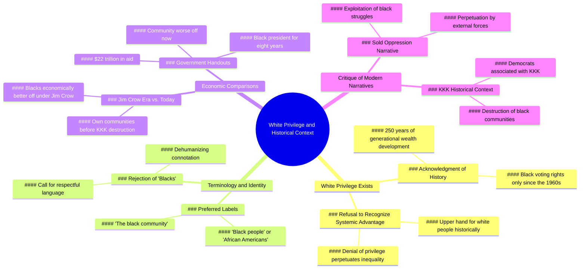

# Black Woman Explains Why White Privilege Exists

> 🌐 **Read this in:** [English](../../en/2026-06/tiktok-transcript-onthisday-36b0.md) · **中文**

<a href="https://www.tiktok.com/@charliekirkdebateclips/video/7651369032280558862?_r=1&u_code=df0k2j5b15legb&preview_pb=0&sharer_language=en&_d=ef9010d52628gk&share_item_id=7651369032280558862&source=h5_m&timestamp=1781912077&user_id=6882025710753317893&sec_user_id=MS4wLjABAAAArJVF44B10P3hOc2VfEQuuxGVUElvdF2ABC8Hhc8cACEZh1m1ihn8V3Fajs2oqDmg&social_share_type=0&utm_source=copy&utm_campaign=client_share&utm_medium=android&share_iid=7646817896225015568&share_link_id=2dede328-8abc-425e-9d11-1914180076f9&share_app_id=1233&ugbiz_name=MAIN&ug_btm=b5836%2Cb2878&sp_root_share_link_id=2dede328-8abc-425e-9d11-1914180076f9&link_reflow_popup_iteration_sharer=%7B%22click_empty_to_play%22%3A1%2C%22dynamic_cover%22%3A1%2C%22follow_to_play_duration%22%3A-1.0%2C%22profile_clickable%22%3A1%7D&panel_source_v2=share_panel&share_enter_from=others_homepage&item_author_type=2&enable_checksum=1&sp_level=1&sp_root_u=df0k2j5b15legb&sp_root_d=ef9010d52628gk" target="_blank"></a>

> **Creator:** [@charliekirkdebateclips](https://www.tiktok.com/@charliekirkdebateclips) · **Views:** 546.3K · **Posted:** 2026-06-19 · **Niche:** other
>
> **TL;DR:** Opens with a bold, identity-driven claim that immediately sparks debate and curiosity.

[Watch original video →](https://www.tiktok.com/@charliekirkdebateclips/video/7651369032280558862?_r=1&u_code=df0k2j5b15legb&preview_pb=0&sharer_language=en&_d=ef9010d52628gk&share_item_id=7651369032280558862&source=h5_m&timestamp=1781912077&user_id=6882025710753317893&sec_user_id=MS4wLjABAAAArJVF44B10P3hOc2VfEQuuxGVUElvdF2ABC8Hhc8cACEZh1m1ihn8V3Fajs2oqDmg&social_share_type=0&utm_source=copy&utm_campaign=client_share&utm_medium=android&share_iid=7646817896225015568&share_link_id=2dede328-8abc-425e-9d11-1914180076f9&share_app_id=1233&ugbiz_name=MAIN&ug_btm=b5836%2Cb2878&sp_root_share_link_id=2dede328-8abc-425e-9d11-1914180076f9&link_reflow_popup_iteration_sharer=%7B%22click_empty_to_play%22%3A1%2C%22dynamic_cover%22%3A1%2C%22follow_to_play_duration%22%3A-1.0%2C%22profile_clickable%22%3A1%7D&panel_source_v2=share_panel&share_enter_from=others_homepage&item_author_type=2&enable_checksum=1&sp_level=1&sp_root_u=df0k2j5b15legb&sp_root_d=ef9010d52628gk)

## Why This Went Viral

## 钩子（前3秒）
- **逐字原文：** "我是个黑人女性，我他妈相信白人特权确实存在。"
- **钩子模式：** 大胆主张 + 身份揭示 + 禁忌语言
- **为何能阻止滑动：** 说话者以高风险身份（黑人女性）开场，并带着情绪强烈、粗俗地肯定了一个有争议的概念（"白人特权确实存在"）。这立刻表明她并非中立——她即将挑战辩论的双方，从而瞬间制造紧张感和好奇心。

## 情绪节奏
1. **好奇心 + 紧张感**（0:00–0:05）：关于白人特权的大胆主张——观众期待一个标准的左翼观点。
2. **挑战与反抗**（0:06–0:20）：她通过指责"拒绝承认历史"来反转剧本，然后抛出250年的代际财富论点——听起来像是一个熟悉的进步主义观点。
3. **惊喜 / 转折**（0:20–0:40）：她转向与一位白人对话者的问答环节（"我们就不能只是黑人吗？"）。当她模仿对方的回避态度时（"除了你所说的，还有别的吗？"），紧张感上升。
4. **高潮 / 震惊**（0:40–0:55）："在吉姆·克劳时代，黑人在经济上比我们今天做得更好。"这是病毒式传播的转折点——一个反直觉、有争议的主张，与主流叙事相矛盾。
5. **共鸣 + 愤怒**（0:55–1:10）：她指责"他们向你兜售了我们的压迫，而你却买账了"——直接指控观众，引发共鸣或愤怒。
6. **最后一击**（1:10–结束）："黑人在吉姆·克劳时代过得更好"——重复最具挑衅性的台词，让观众感到不安。

## 关键词密度
| 关键词 / 短语 | 频率 | 功能 |
|---|---|---|
| "白人特权" | 3 | 算法覆盖（高搜索词）+ 情绪触发 |
| "黑人" | 10+ | 身份锚点——驱动情感吸引和搜索 |
| "吉姆·克劳" | 3 | 历史引用，制造冲击价值和辩论 |
| "压迫" | 2 | 情感吸引——将论点框定为背叛 |
| "买账" / "兜售" | 3 | 情感共鸣——指责观众被欺骗 |
| "还有别的吗" | 5 | 对话钩子——在问答中制造节奏紧张感 |
| "三K党" / "民主党人" | 1 | 有争议的历史主张——驱动分享性 |

**算法驱动因素：** "白人特权"、"吉姆·克劳"、"黑人社区"——高搜索量、易引发辩论的词汇。
**情感驱动因素：** "压迫"、"买账"、"兜售"——制造个人利害关系和愤怒。

## 为何能传播
1. **身份诱饵 + 剧本反转：** 她以黑人女性身份开场，肯定白人特权，然后转向指责*进步主义叙事*导致黑人经济衰退。这种诱饵式反转让左右两派观众都分享——左派为了驳斥，右派为了验证。
2. **反直觉的历史主张：** "黑人在吉姆·克劳时代过得更好"是一个令人震惊、接近数据的主张，迫使人们参与。人们评论是为了争论、事实核查或表示赞同——所有这些都提升了算法覆盖。
3. **对话紧张模式：** 问答环节（"我们就不能只是黑人吗？" → "除了你所说的，还有别的吗？"）制造了一种有节奏的、近乎戏剧性的对抗，让观众持续观看，看谁"赢了"。
4. **直接指责观众：** "他们向你兜售了我们的压迫，而你却买账了"将观众变成了对手。这引发了防御性的评论，这是短视频平台最高价值的互动。
5. **禁忌语言 + 身份可信度：** 粗话（"他妈"）标志着真实性，而她作为黑人女性的身份让她有资格提出那些如果由白人说出就会受到攻击的主张。这种组合是算法的黄金。

## 你可以借鉴什么
1. **"身份 + 禁忌"开场：** 以你的身份和一个情绪强烈的词（"他妈"、"狗屁"、"谎言"）开场，表明你不是在打安全牌。这能立即阻止滑动。
2. **对话转折：** 使用问答或角色扮演环节，引用一个想象中的对手，然后解构他们的话。一来一回的节奏能让观众更长时间地保持兴趣。
3. **反直觉的数据抛出：** 找到一个与主流叙事相矛盾的统计数据或历史事实。在视频中间——而不是开头——抛出它，制造一个迫使观众重看和分享的转折。

## Mind Map

## Full Transcript (Generated by [拆解你自己的 TikTok](https://toktranscript.com/?utm_source=github&utm_medium=breakdown&utm_campaign=tool_attribution))

> 📝 Transcripts on this page are auto-generated and show the first 60%. Want to transcribe any TikTok in 30 seconds and get the full version? [Try TokTranscript free →](https://toktranscript.com/?utm_source=github&utm_medium=breakdown&utm_campaign=transcript_cta)

I'm a black woman and I believe that white privilege fucking exists. And the reason why white privilege exists is because you guys refuse to acknowledge the history that put people in this position. You want to tell me that white privilege doesn't exist when white people had a fucking upper hand for 250 years to develop generational wealth and that black people didn't get the right to fucking vote until the 60s? What's funny about that is blacks were doing better during that time. Why do we always call people blacks? Because you're black. Can't we just be black people? Can't we just be like African Americans or something? The black community? How would you like it said? What makes you feel better on the inside? Really anything else other than what you're saying? I'll say how you want it to. Anything else other than what you need it. Tell me what makes you feel better. Literally anything else other than what you're saying. Okay, anything else. Why is that anything else? In the Jim Crow era, blacks w

*[Read the full transcript on TokTranscript →](https://toktranscript.com/plaza/tiktok-transcript-onthisday-36b0?utm_source=github&utm_medium=breakdown&utm_campaign=transcript_full)*

## Browse More

- All [other](../../by-niche/zh-CN/other.md) breakdowns
- All [Controversial Identity Declaration](../../by-pattern/zh-CN/hook-controversial-identity-declaration.md) examples

## Video Info

| | |
|---|---|
| Creator | [@charliekirkdebateclips](https://www.tiktok.com/@charliekirkdebateclips) |
| Original video | [https://www.tiktok.com/@charliekirkdebateclips/video/7651369032280558862?_r=1&u_code=df0k2j5b15legb&preview_pb=0&sharer_language=en&_d=ef9010d52628gk&share_item_id=7651369032280558862&source=h5_m&timestamp=1781912077&user_id=6882025710753317893&sec_user_id=MS4wLjABAAAArJVF44B10P3hOc2VfEQuuxGVUElvdF2ABC8Hhc8cACEZh1m1ihn8V3Fajs2oqDmg&social_share_type=0&utm_source=copy&utm_campaign=client_share&utm_medium=android&share_iid=7646817896225015568&share_link_id=2dede328-8abc-425e-9d11-1914180076f9&share_app_id=1233&ugbiz_name=MAIN&ug_btm=b5836%2Cb2878&sp_root_share_link_id=2dede328-8abc-425e-9d11-1914180076f9&link_reflow_popup_iteration_sharer=%7B%22click_empty_to_play%22%3A1%2C%22dynamic_cover%22%3A1%2C%22follow_to_play_duration%22%3A-1.0%2C%22profile_clickable%22%3A1%7D&panel_source_v2=share_panel&share_enter_from=others_homepage&item_author_type=2&enable_checksum=1&sp_level=1&sp_root_u=df0k2j5b15legb&sp_root_d=ef9010d52628gk](https://www.tiktok.com/@charliekirkdebateclips/video/7651369032280558862?_r=1&u_code=df0k2j5b15legb&preview_pb=0&sharer_language=en&_d=ef9010d52628gk&share_item_id=7651369032280558862&source=h5_m&timestamp=1781912077&user_id=6882025710753317893&sec_user_id=MS4wLjABAAAArJVF44B10P3hOc2VfEQuuxGVUElvdF2ABC8Hhc8cACEZh1m1ihn8V3Fajs2oqDmg&social_share_type=0&utm_source=copy&utm_campaign=client_share&utm_medium=android&share_iid=7646817896225015568&share_link_id=2dede328-8abc-425e-9d11-1914180076f9&share_app_id=1233&ugbiz_name=MAIN&ug_btm=b5836%2Cb2878&sp_root_share_link_id=2dede328-8abc-425e-9d11-1914180076f9&link_reflow_popup_iteration_sharer=%7B%22click_empty_to_play%22%3A1%2C%22dynamic_cover%22%3A1%2C%22follow_to_play_duration%22%3A-1.0%2C%22profile_clickable%22%3A1%7D&panel_source_v2=share_panel&share_enter_from=others_homepage&item_author_type=2&enable_checksum=1&sp_level=1&sp_root_u=df0k2j5b15legb&sp_root_d=ef9010d52628gk) |
| Original title | #onthisday  |
| Views | 546.3K (546300) |
| Posted | 2026-06-19 |
| Duration | 0s |
| Niche | `other` |
| Hook pattern | `Controversial Identity Declaration` |
| Original language | `en` (this page translated by AI) |
| Available languages | en, zh-CN |
| Generated | 2026-06-20 by [TokTranscript](https://toktranscript.com/) |

---

*This breakdown is for educational analysis under fair use. Original video © [@charliekirkdebateclips](https://www.tiktok.com/@charliekirkdebateclips). All transcripts are auto-generated and may contain errors.*

*Want to analyze your own TikToks like this? [TokTranscript 转录工具 →](https://toktranscript.com/viral-breakdown?utm_source=github&utm_medium=breakdown&utm_campaign=footer_cta)*