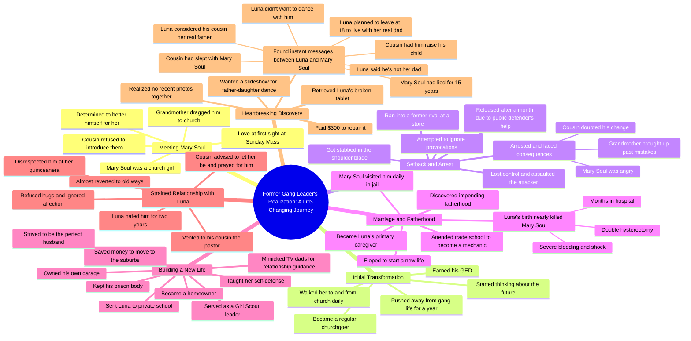

# Former Gang Leaders: Why I Left the Life

> 🌐 **Read this in:** [English](../../en/2026-06/tiktok-transcript-part-1-fyp-redditstories-viral-foryoupage-2f6f.md) · **中文**

> **Creator:** [@kick.me.pls00](https://www.tiktok.com/@kick.me.pls00) · **Views:** 12.2M · **Posted:** 2026-06-23 · **Niche:** entertainment
>
> **TL;DR:** The hook introduces a specific person and age, creating immediate intrigue and emotional investment.

[Watch original video →](https://vm.tiktok.com/ZNRTAn3nq/)

## Why This Went Viral

## 钩子（前3秒）
- **逐字开场白：** "前帮派头目。是什么让你意识到这不是你想要的生活？"
- **钩子模式：** 问题 + 身份标签（"前帮派头目"）
- **为何能让人停下滑动：** "帮派头目"与"意识到"之间的反差瞬间引发好奇。观众想看到一个危险人物的转折点——这预示着救赎故事或惊人反转。

## 情感节奏
- **节拍1——好奇：** "前帮派头目"设定对暴力过往的悬念。
- **节拍2——温暖/释然：** 遇见玛丽·索尔，坠入爱河，离开帮派——感觉像是一个干净的救赎故事。
- **节拍3——紧张：** 被刺伤、被捕、公设辩护人——风险升级，旧生活将他拉回。
- **节拍4——希望：** 脱罪、结婚、生子、建立郊区生活——情感高潮。
- **节拍5——缓慢灼烧的伤痛：** 露娜的拒绝（翻白眼、不拥抱）——微妙但日益加剧的痛苦。
- **节拍6——高潮（反转）：** 阅读短信——"他甚至不是我爸爸。"这是致命一击。之前的一切都被重新定义。
- **节拍7——崩溃与愤怒：** 妻子撒谎15年，表兄背叛了他——情感爆发。
- **高潮时刻：** "他甚至不是我爸爸"这句话——正是故事从救赎转向悲剧的瞬间。

## 关键词密度
1. **"玛丽·索尔"** ——锚定名称，重复以建立情感连接。
2. **"露娜"** ——女儿的名字，驱动父女纽带。
3. **"表兄"** ——重复作为可信赖的人物，然后作为背叛者——算法张力。
4. **"教堂"/"上帝"** ——宗教框架增加道德分量，触及信仰受众。
5. **"更好"/"未来"** ——在救赎弧线中重复——驱动情感拉力。
6. **"被刺伤"/"被捕"/"死或坐牢"** ——高风险关键词，触发算法参与（犯罪、生存）。
7. **"父亲"/"爸爸"** ——核心情感冲突——驱动触及范围（家庭内容）和拉力（背叛）。

- **算法触及驱动因素：** "帮派头目"、"被刺伤"、"被捕"、"父亲"、"背叛"——高参与度标签。
- **情感拉力驱动因素：** "玛丽·索尔"、"露娜"、"一见钟情"、"恨我"——让观众在心碎中继续观看。

## 为何能传播
1. **反转时机恰到好处。** 前半部分构建了一个救赎故事——然后"他甚至不是我爸爸"将其粉碎。观众切身感受到背叛，这迫使他们评论、分享或@朋友。*具体台词：* "他甚至不是我爸爸。"
2. **它利用了"不可靠叙述者"结构。** 讲述者将自己呈现为克服一切的英雄——然后揭示最终的背叛。这创造了"等等，什么？"的时刻，迫使人们重看和讨论。*具体台词：* "我的表兄，我信任的人……不仅和我妻子上床，还让我养大他的孩子。"
3. **它同时触发道德愤怒和同理心。** 观众对妻子和表兄感到愤怒，但对叙述者深感同情。这种情感鸡尾酒极具分享性——人们希望他人感受到自己所感受的。*具体台词：* "我妻子骗了我15年。"
4. **节奏模仿惊悚片。** 每个节拍都在升级——爱情、危险、救赎、拒绝、发现、背叛。没有冷场。观众无法移开视线。*具体证据：* 整个文本没有一句废话——每句话都在推进情节。
5. **以未解决的愤怒悬念结尾。** 故事在发现的那一刻停止——没有结局。观众情感悬空，这驱使他们到评论中寻找结局或分享以获得反应。*具体台词：* "却让我养大他的孩子。"

## 你可以借鉴什么
1. **以高风险身份+问题开头。** "前帮派头目。是什么让你意识到……"立即钩住人，因为它承诺一个转变故事。将其应用于任何领域："前瘾君子。是什么让你戒掉？"或"前CEO。是什么让你离开？"
2. **使用"虚假救赎"结构。** 构建一个干净、幸福的故事弧线——然后抽走地毯。观众情感投入前半部分，使后半部分冲击力更强。在你的下一个视频中，在引入反转之前设置一个"一切都很完美"的时刻。
3. **在结局之前结束。** 不要整齐地收尾。让观众停留在情感高潮中——他们会评论、分享或要求第二部分。这里的叙述者以"却让我养大他的孩子"结束——没有结局，只有赤裸裸的痛苦。这就是传播的原因。

## Mind Map

## Full Transcript (Generated by [免费 TikTok 文稿生成器](https://toktranscript.com/?utm_source=github&utm_medium=breakdown&utm_campaign=tool_attribution))

> 📝 Transcripts on this page are auto-generated and show the first 60%. Want to transcribe any TikTok in 30 seconds and get the full version? [Try TokTranscript free →](https://toktranscript.com/?utm_source=github&utm_medium=breakdown&utm_campaign=transcript_cta)

Former gang leaders. What made you realize it wasn't the life for you? I was 18 when I met Mary Soul. During that time, I was a gang leader with the Latin Kings. Mary Soul was a church girl. My grandmother dragged me to Sunday Mass, and when I saw her, to me, it was love at first sight. I asked my cousin, who was a friend of hers, if he could introduce us, but he refused. He didn't want me to mess with her. He didn't want me to ruin her. I had never met someone that I wanted to make myself better, to be with. That was her. When I found out that she was going to church almost every day, I hung out by the steps talking to her. I always walked her to and from church. She made me feel like there was more to the Latin Kings. One thing LED to another, and we ended up going on a date. I felt great. For a year, I pushed myself away from the gang life, got my GED, became a regular church goer, and was thinking about the future when I got unintentionally pulled back in. I was at a store and ran into someone that I used to have problems with. They were running their mouths, and I tried to ignore it. I swear I did. I just let them talk and I walked away. But then I got stabbed in the shoulder blade. The Pain hadn't hit yet, and I lost my mind. I beat the hell out of them. I got arrested, and suddenly it was like the crap I did to make my life better vanished. Mary Soul was pissed at me. My grandmother kept bringing up my past mistakes, and my cousin was telling me that he knew that I wasn't going to change. My public defender saw me trying to better myself, and by the Grace of god, got me off after a month in lock up. Despite being angry with me, Mary Soul did visit me almost daily. A month after I got out, I found out I was going to be a father. And I didn't want my kid to have a dad that was dead or in jail. We eloped. I went to a trade school to become a mechanic, and I busted my butt for my future family. When Luna was born, it was almost the worst day of my life. Mary Soul wouldn't stop bleeding. She went into shock, and they had to give her a double hysterectomy. She was in the hospital for months, and Luna became my world. I wanted her life to be the best. I wanted to give her the world. When Mary Soul was released, I promised her that our daughter will have a life far better than ours. And for years, I kept that promise. I saved enough money to move us to the suburbs, became homeowners. I was A Girl Scout leader, if you could believe that. I made sure Luna went to private school, made sure she knew how to defend herself, and always made sure I was the perfect husband. I didn't know my parents didn't have a positive male role model in my life, so I didn't know what a healthy relationship looked like. That's a lie. TV dads were my male role models, and I mimic them in the marriage they had on TV. As the years went by, I own my own garage. My cousin became a pastor, but still. My grandmother was still a pain in my ass. My relationship with my wife was stronger than ever. I made sure I kept my prison body. Luna hated me. She didn't want me to hug her. She rolled her eyes every time I told her I loved her, ignored me when I asked her about her day in school. It

*[Read the full transcript on TokTranscript →](https://toktranscript.com/plaza/tiktok-transcript-part-1-fyp-redditstories-viral-foryoupage-2f6f?utm_source=github&utm_medium=breakdown&utm_campaign=transcript_full)*

## Browse More

- All [entertainment](../../by-niche/zh-CN/entertainment.md) breakdowns
- All [Personal anecdote with a name](../../by-pattern/zh-CN/hook-personal-anecdote-with-a-name.md) examples

## Video Info

| | |
|---|---|
| Creator | [@kick.me.pls00](https://www.tiktok.com/@kick.me.pls00) |
| Original video | [https://vm.tiktok.com/ZNRTAn3nq/](https://vm.tiktok.com/ZNRTAn3nq/) |
| Original title | Part 1 #fyp #redditstories #viral #foryoupage  |
| Views | 12.2M (12200000) |
| Posted | 2026-06-23 |
| Duration | 0s |
| Niche | `entertainment` |
| Hook pattern | `Personal anecdote with a name` |
| Original language | `en` (this page translated by AI) |
| Available languages | en, zh-CN |
| Generated | 2026-06-24 by [TokTranscript](https://toktranscript.com/) |

---

*This breakdown is for educational analysis under fair use. Original video © [@kick.me.pls00](https://www.tiktok.com/@kick.me.pls00). All transcripts are auto-generated and may contain errors.*

*Want to analyze your own TikToks like this? [TokTranscript →](https://toktranscript.com/viral-breakdown?utm_source=github&utm_medium=breakdown&utm_campaign=footer_cta)*