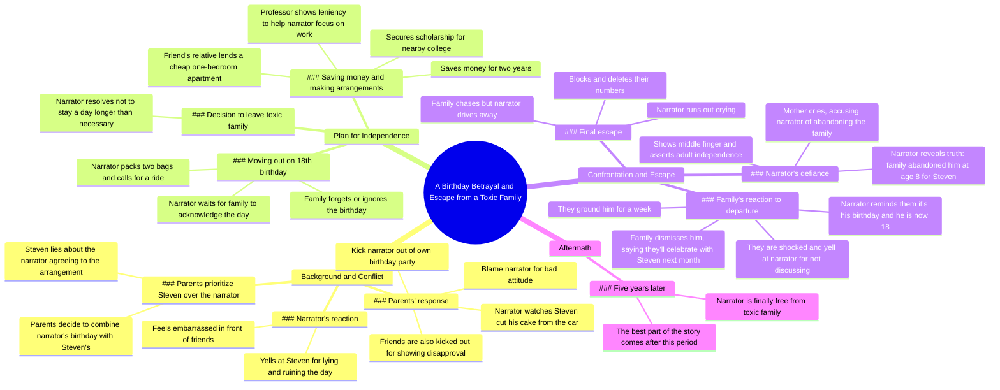

# Part 2: Confronting Steven Over the Birthday Lie

> 🌐 **Read this in:** [English](../../en/2026-06/tiktok-transcript-part-2-diy-storytime-fyp-foryou-tiktok-2744.md) · **中文**

> **Creator:** [@redditbybot1](https://www.tiktok.com/@redditbybot1) · **Views:** 2.5M · **Posted:** 2026-06-01 · **Niche:** entertainment
>
> **TL;DR:** The hook immediately introduces a shocking injustice, making viewers want to see how the narrator reacts.

[Watch original video →](https://vm.tiktok.com/ZS92StWtHmQm6-xWkLP/ This post is shared via TikTok Lite. Download TikTok Lite to enjoy more posts: https://www.tiktok.com/tiktoklite)

## Why This Went Viral

## 钩子（前3秒）
- **逐字开场白：** "当我问发生了什么事时，父母回答说，史蒂文的生日就在下个月，所以我们决定今天可以为你俩一起庆祝。"
- **钩子模式：** 场景 + 反差（属于个人的庆祝活动被他人劫持）
- **为何能让人停下滑动：** 这种即时的委屈感直击人心——生日派对被兄弟姐妹占用，还附带着一个谎言。它瞬间引发共情和愤怒，迫使观众追问"接下来发生了什么？"

## 情感节奏
- **按顺序的情感节点：**
  1. **好奇** — "发生了什么事？" 制造悬念
  2. **紧张** — 父母不公平的决定和史蒂文的谎言
  3. **愤怒** — 被赶出自己的生日派对，眼睁睁看着蛋糕被切
  4. **决心/坚定** — 攒钱，计划逃离
  5. **期待** — "大日子来临"——他们最终会在意吗？
  6. **绝望** — 他们完全忘记了他的18岁生日
  7. **反抗** — 竖起中指，哭着跑出去
  8. **宣泄** — "我终于自由了"
  9. **高潮** — "最精彩的部分在五年后到来"（反转）
- **高潮时刻：** 五年的时间跳跃——自由以及可能的复仇或成功的终极回报

## 关键词密度
- **重复最多的词语/短语：**
  - "生日"（9次）—— 算法层面：高参与度话题（庆祝、失望）
  - "史蒂文"（6次）—— 情感层面：反派角色，激发怨恨
  - "被赶出去"（3次）—— 情感层面：核心不公，引发同情
  - "家庭"（4次）—— 情感层面：身份认同、归属感、背叛
  - "忘记/被遗忘"（3次）—— 情感层面：忽视、遗弃
  - "18"（3次）—— 算法层面：里程碑事件，法律意义上的独立
  - "派对"（5次）—— 算法层面：视觉化、可分享的时刻
  - "被抛弃"（2次）—— 情感层面：叙事的高潮
- **算法覆盖范围：** "生日"、"18"、"派对" —— 高搜索量、贴近生活的事件
- **情感吸引力：** "被赶出去"、"忘记"、"被抛弃" —— 引发强烈反应（愤怒、悲伤、共鸣）

## 为何能广泛传播
1. **普遍的委屈感** — "他们把我赶出了我自己的生日派对" 是一个能引发共鸣的噩梦场景。观众会立刻把自己代入其中，并忍不住分享。
2. **不断升级的利害关系** — 每个情感节点都提升了情绪门槛：从被劫持的派对 → 被遗忘的18岁 → 离家出走 → 五年后的复仇。结尾的反转（"最精彩的部分在五年后到来"）制造了悬念，推动评论和分享。
3. **清晰的反派与受害者** — 史蒂文和父母是毫不含糊的反派角色。叙述者是令人同情的弱势方。这种二元对立让故事易于进行道德评判和分享（"你能相信吗？"）
4. **令人满意的结局** — 叙述者逃离并过得很好（由"终于自由了"和五年的时间跳跃暗示）。观众喜欢在经历苦难后看到圆满结局，这增加了分享性。
5. **强烈的情感反差** — 故事从屈辱 → 决心 → 绝望 → 胜利之间摇摆。这种情绪过山车让观众保持投入，并使视频令人难忘，值得推荐。

## 你可以借鉴的要点
1. **以微小的不公开场** — 用一个具体、不公平的时刻开始你的视频（比如派对被劫持）。不要先解释背景故事。观众应该在3秒内感到愤怒或好奇。
2. **使用"过去 vs. 现在"的时间跳跃** — 以类似"但这还不是结束。最精彩的部分在五年后到来"的悬念结尾。这暗示了续集或回报，并提高留存率。
3. **创造清晰的反派与受害者** — 给观众一个可以反对的人（史蒂文）和一个可以支持的人（叙述者）。使用反派的直接引语让他们显得真实且可恨。这能推动情感投入和分享。

## Mind Map

## Full Transcript (Generated by [免费 TikTok 文稿生成器](https://toktranscript.com/?utm_source=github&utm_medium=breakdown&utm_campaign=tool_attribution))

> 📝 Transcripts on this page are auto-generated and show the first 60%. Want to transcribe any TikTok in 30 seconds and get the full version? [Try TokTranscript free →](https://toktranscript.com/?utm_source=github&utm_medium=breakdown&utm_campaign=transcript_cta)

When I asked what was going on, my parents replied, Steven's birthday is just next month, so we decided today can be a Celebration for the both of you. He said he already talked to you about this and said you're happy to include him. I was so pissed and yelled at Steven. How dare you lie and ruin my day! Couldn't you have let me get just one day for myself? I was also embarrassed because this was in front of my friends. Steven acted all cute and innocent and replied, but we talked about this and you agreed. Why are you yelling at me, dear brother? We had definitely not talked about this or anything at all. My parents decided that I suddenly didn't deserve a party because of my attitude and kicked me out. Yep, they kicked me out of my own birthday party. I had to sit in the car and watch through the window as Steven cut the cake that was supposed to be for me. My friends tried to express their disapproval, but they were also kicked out. I decided then that I wouldn't stay with this toxic family a day more than I have to. I talked to my professor and he went a bit lenient on me in class so I could work hard on my job and save money. I saved up for two years. One of my friends had a relative that owned some real estate and was able to Lend me a one bedroom apartment for cheap in a nearby city. I had also secured a scholarship for a college near my apartment. I was all set to move out the day I turned 18. Well, the big day comes around and I'm slightly nervous. I was worried that if they threw a big party for me and made it up to me, I would forgive them. Guess what? They didn't even wish me a happy birthday. It was a holiday. So I lays around waiting for someone to remember what day it is. Eventually I just gave up and went to my room to finish packing. I wasn't taking too much with me, so I had just two bags that I could easily carry. I gave a call to one of my friend's older brother to come pick me up and made my way downstairs. Everyone was shocked that I was going somewhere wit

*[Read the full transcript on TokTranscript →](https://toktranscript.com/plaza/tiktok-transcript-part-2-diy-storytime-fyp-foryou-tiktok-2744?utm_source=github&utm_medium=breakdown&utm_campaign=transcript_full)*

## Browse More

- All [entertainment](../../by-niche/zh-CN/entertainment.md) breakdowns
- All [Betrayal Reveal](../../by-pattern/zh-CN/hook-betrayal-reveal.md) examples

## Video Info

| | |
|---|---|
| Creator | [@redditbybot1](https://www.tiktok.com/@redditbybot1) |
| Original video | [https://vm.tiktok.com/ZS92StWtHmQm6-xWkLP/ This post is shared via TikTok Lite. Download TikTok Lite to enjoy more posts: https://www.tiktok.com/tiktoklite](https://vm.tiktok.com/ZS92StWtHmQm6-xWkLP/ This post is shared via TikTok Lite. Download TikTok Lite to enjoy more posts: https://www.tiktok.com/tiktoklite) |
| Original title | Part 2 #diy #storytime #fyp #foryou #tiktok  |
| Views | 2.5M (2500000) |
| Posted | 2026-06-01 |
| Duration | 0s |
| Niche | `entertainment` |
| Hook pattern | `Betrayal Reveal` |
| Original language | `en` (this page translated by AI) |
| Available languages | en, zh-CN |
| Generated | 2026-06-02 by [TokTranscript](https://toktranscript.com/) |

---

*This breakdown is for educational analysis under fair use. Original video © [@redditbybot1](https://www.tiktok.com/@redditbybot1). All transcripts are auto-generated and may contain errors.*

*Want to analyze your own TikToks like this? [拆解你自己的 TikTok →](https://toktranscript.com/viral-breakdown?utm_source=github&utm_medium=breakdown&utm_campaign=footer_cta)*