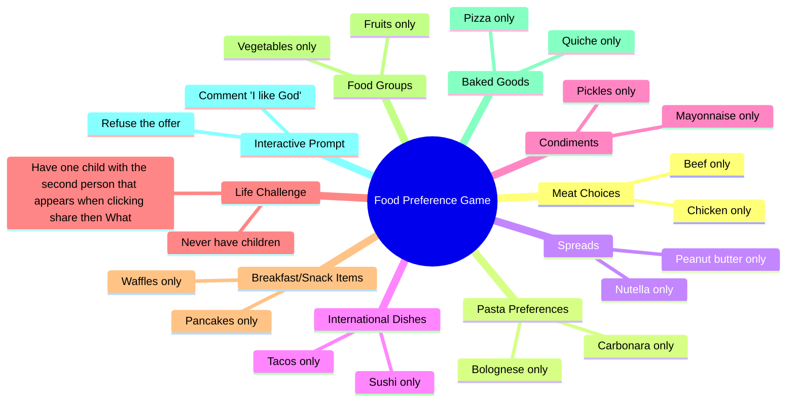

# Food Dilemma: Beef vs Chicken, Carbonara vs Bolognese

> 🌐 **Read this in:** [English](../../en/2026-06/tiktok-transcript-part-340-tu-pr-f-res-tupreferes-tupreferesquoi-dilemme-375f.md) · **中文**

> **Creator:** [@tu_preferes_n1](https://www.tiktok.com/@tu_preferes_n1) · **Views:** 1.8M · **Posted:** 2026-06-29 · **Niche:** food
>
> **TL;DR:** Immediately engages viewers by asking them to choose between two common food options.

[Watch original video →](https://vm.tiktok.com/ZSCUnxHmd/ تتم مشاركة هذا المنشور عبر TikTok Lite. نزّل TikTok Lite للاستمتاع بمزيد من المنشورات: https://www.tiktok.com/tiktoklite)

## Why This Went Viral

## 钩子（前3秒）
- **逐字内容：** "你更喜欢，食物版，你更愿意只吃牛肉还是只吃鸡肉？"
- **钩子模式：** 提问 + 细分领域（食物）+ 二选一
- **为何能阻止滑动：** "你更喜欢"的格式一眼就能认出是社交游戏。通过立即指定"食物版"，它传达了一个低风险、易共鸣且值得辩论的前提，诱使观众在移开视线前先在脑中作答。

## 情绪节奏
- **节拍1 – 好奇（0-3秒）：** 提问格式触发"我会选哪个？"的思维反应。
- **节拍2 – 轻度参与（3-10秒）：** 快速连续的选择（牛肉/鸡肉、奶油培根面/肉酱面）形成一种低投入、易上瘾的模式。
- **节拍3 – 紧张感飙升（10-12秒）：** "评论'我爱上帝'还是拒绝这个提议？"——这是转折点。荒谬、高风险的选项（上帝 vs. 拒绝提议）打破了食物模式，让观众为之一振。
- **节拍4 – 惊喜（12-15秒）：** WhatsApp挑战（"和点击分享后WhatsApp上显示的第二个人生一个孩子"）引入了现实世界的社交冒险，将赌注从假设提升到可执行。
- **节拍5 – 舒适回归（15-22秒）：** 回到安全、易共鸣的食物选择（华夫饼/可丽饼、蔬菜/水果、披萨/法式咸派），让观众在愉快的氛围中结束观看。
- **高潮时刻：** "评论'我爱上帝'还是拒绝这个提议？"这句话。这是最出人意料、最具梗潜力、最易分享的瞬间。

## 关键词密度
| 关键词/短语 | 频率（约） | 驱动因素 |
|----------------|---------------------|--------|
| "你更喜欢" | 9次 | **算法触达** – 高重复率，可搜索、符合趋势的短语 |
| "只吃" | 8次 | **情感吸引** – 营造有节奏、催眠般的模式 |
| "还是" | 9次 | **算法+情感** – 二选一结构既可预测又引人入胜 |
| "食物" | 1次（标题） | **算法** – 食物内容的细分关键词 |
| "上帝" / "拒绝这个提议" | 各1次 | **情感吸引** – 让视频令人难忘的冲击力词汇 |
| "WhatsApp" | 1次 | **情感吸引** – 触发社交分享和现实行动 |

## 为何能传播
1. **"你更喜欢"格式天生具有病毒性。** 这是一种低门槛的社交游戏，人们自然会在群体中玩。文本直接邀请评论（"评论'我爱上帝'还是拒绝这个提议？"），这提升了互动信号。
2. **荒谬的转折打破了模式。** 在10秒安全的食物选择后，视频突然问"我爱上帝还是拒绝这个提议？"——一个无厘头、高风险的问题。这个惊喜时刻值得剪辑和分享，因为它感觉像是系统出了故障。
3. **现实世界的社交冒险。** WhatsApp挑战（"和点击分享后WhatsApp上显示的第二个人生一个孩子"）将被动观看转变为主动参与。观众被激励打开应用、截图并分享——形成连锁反应。
4. **低风险开头，高风险结尾，皆易共鸣。** 前10秒普遍易共鸣（食物选择），吸引广泛受众。后10秒升级到荒谬，确保视频令人难忘且值得重看。
5. **评论诱饵明确。** "评论'我爱上帝'还是拒绝这个提议？"这句话直接命令互动。这不是建议；而是一个感觉像游戏的挑战。

## 你可以借鉴什么
1. **从安全、易共鸣的模式开始，然后打破它。** 用3-4个正常问题（食物、爱好、旅行）让观众进入节奏，然后抛出一个荒谬、高风险的问题。对比让转折效果更强。
2. **嵌入现实世界的社交冒险。** 要求观众在应用外做某事（例如，"把这个发给聊天列表里的第三个人"、"截图并发布结果"）。这将被动消费转变为主动分享。
3. **明确命令互动。** 不要只说"在下面评论"。要说"评论'我爱上帝'还是拒绝这个提议？"——让评论感觉像游戏中的一步，而不是一个请求。行动号召越具体、越有趣，回应率就越高。

## Mind Map

## Full Transcript (Generated by [TokTranscript](https://toktranscript.com/?utm_source=github&utm_medium=breakdown&utm_campaign=tool_attribution))

> 📝 Transcripts on this page are auto-generated and show the first 60%. Want to transcribe any TikTok in 30 seconds and get the full version? [Try TokTranscript free →](https://toktranscript.com/?utm_source=github&utm_medium=breakdown&utm_campaign=transcript_cta)

Tu préfères, version nourriture, tu préfères manger que du bœuf ou manger que du poulet ? Tu préfères manger que des pâtes carbonara ou manger que des pâtes bolognaises ? Tu préfères manger que du beurre de cacahuète ou manger que du Nutella ? Tu préfères manger que des sushis ou manger que des tacos ? Commenter j'aime Dieu ou refuser l'offre ? Tu préfères manger que de la mayonnaise ou manger que des cornichons ? Ne jamais avoir d'enfan

*[Read the full transcript on TokTranscript →](https://toktranscript.com/plaza/tiktok-transcript-part-340-tu-pr-f-res-tupreferes-tupreferesquoi-dilemme-375f?utm_source=github&utm_medium=breakdown&utm_campaign=transcript_full)*

## Browse More

- All [food](../../by-niche/zh-CN/food.md) breakdowns
- All [Interactive choice hook](../../by-pattern/zh-CN/hook-interactive-choice-hook.md) examples

## Video Info

| | |
|---|---|
| Creator | [@tu_preferes_n1](https://www.tiktok.com/@tu_preferes_n1) |
| Original video | [https://vm.tiktok.com/ZSCUnxHmd/ تتم مشاركة هذا المنشور عبر TikTok Lite. نزّل TikTok Lite للاستمتاع بمزيد من المنشورات: https://www.tiktok.com/tiktoklite](https://vm.tiktok.com/ZSCUnxHmd/ تتم مشاركة هذا المنشور عبر TikTok Lite. نزّل TikTok Lite للاستمتاع بمزيد من المنشورات: https://www.tiktok.com/tiktoklite) |
| Original title | Part 340 | Tu Préfères ? #tupreferes #tupreferesquoi #dilemme  |
| Views | 1.8M (1800000) |
| Posted | 2026-06-29 |
| Duration | 0s |
| Niche | `food` |
| Hook pattern | `Interactive choice hook` |
| Original language | `en` (this page translated by AI) |
| Available languages | en, zh-CN |
| Generated | 2026-06-30 by [TokTranscript](https://toktranscript.com/) |

---

*This breakdown is for educational analysis under fair use. Original video © [@tu_preferes_n1](https://www.tiktok.com/@tu_preferes_n1). All transcripts are auto-generated and may contain errors.*

*Want to analyze your own TikToks like this? [免费 TikTok 文稿生成器 →](https://toktranscript.com/viral-breakdown?utm_source=github&utm_medium=breakdown&utm_campaign=footer_cta)*