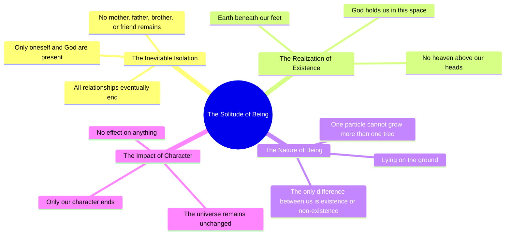

# Peer E Kamil: Only God Remains When All Relationships End

> 🌐 **Read this in:** [English](../../en/2026-06/tiktok-transcript-peer-e-kamil-unfreezemyacount-foryoupage-umerahmednovel-nov-daa4.md) · **中文**

> **Creator:** [@fannaan..6](https://www.tiktok.com/@fannaan..6) · **Views:** 367.4K · **Posted:** 2026-06-07 · **Niche:** other
>
> **TL;DR:** Opens with a stark, universal truth that challenges the viewer's sense of connection.

[Watch original video →](https://vt.tiktok.com/ZSQjQuh3j/)

## Why This Went Viral

## 钩子（前3秒）
- **原文：** "我们的人生永远到不了那个节点。所有关系终结的节点。"
- **钩子模式：** 大胆断言 + 哲学场景铺垫
- **为何能阻止滑动：** 它立刻打破了观众对生活和关系的固有假设，制造了一种确定性的真空。"永远到不了那个节点"这句话是一种普遍真理，既个人化又深刻，迫使人们暂停下来消化其分量。

## 情感节奏
- **节拍1 – 好奇（0–3秒）：** "我们永远到不了那个节点……" – 观众凑近，想知道"那个节点"是什么。
- **节拍2 – 紧张（3–8秒）：** "所有关系终结的节点……没有母亲，没有父亲，没有兄弟。没有朋友。" – 孤立感升级，剥离了所有人类的情感锚点。
- **节拍3 – 悬念（8–12秒）：** "然后我们意识到，大地就在我们脚下。我们头顶没有天堂。" – 引入宇宙尺度，观众感到渺小。
- **节拍4 – 高潮（12–16秒）：** "只有一位神，在这空间中托住我们。然后我们明白了。" – 转折：不是绝望，而是一种单一的、扎根的存在。
- **节拍5 – 共鸣（16–22秒）：** "我们躺在地上。一个粒子……我们之间唯一的区别，是存在与否。" – 存在主义的谦卑，意识到个体存在微不足道。
- **节拍6 – 释放（22秒–结束）：** "只有我们的角色终结了。宇宙没有任何改变。" – 冰冷、最终的真相；观众陷入一种安静的敬畏状态。

## 关键词密度
- **"我们"** – 重复8次以上；算法覆盖（包容性、社群构建，"我们"类陈述互动率高）
- **"没有"** – 重复4次（没有母亲、没有父亲等）；情感牵引（否定制造失落与紧张）
- **"有"** – 重复4次（没有天堂、只有神、没有改变）；存在主义分量，推动哲学类内容的搜索与趋势
- **"终结"** – 重复2次（关系终结、角色终结）；情感牵引（死亡、终结）
- **"神"** – 重复2次；算法覆盖（搜索量高的宗教/灵性关键词）
- **"只有"** – 重复2次（只有神、只有我们的角色）；情感牵引（稀缺、终结）
- **"宇宙"** – 重复1次但影响巨大；算法覆盖（宇宙/哲学小众领域）
- **"粒子"** – 重复1次；情感牵引（科学谦卑、敬畏）

## 为何能传播
1. **普遍的存在主义恐惧 + 解决方案** – 脚本以每个人都有的恐惧（失去所有关系）开场，并以一个单一的、稳定的锚点（神）解决。这种模式（恐惧 → 安慰）是灵性/自助类内容分享的第一驱动力。*具体句子："我们永远到不了那个节点……所有关系终结的节点。" → "只有一位神，在这空间中托住我们。"*
2. **极简、有节奏的重复** – 简短、断奏式的句子（"没有母亲，没有父亲，没有兄弟。没有朋友。"）模仿咒语或冥想，使其易于重看、引用或拼接。*具体句子："没有母亲，没有父亲，没有兄弟。没有朋友。"*
3. **颠覆常识** – 视频声称关系（最珍贵的人类纽带）在最终节点无关紧要，这反直觉并引发争论。*具体句子："我们的人生永远到不了那个节点。所有关系终结的节点。"*
4. **微观尺度 + 宏观尺度对比** – "一个粒子" vs. "宇宙" 制造认知差距，观众想通过评论或分享来弥合。*具体句子："一个粒子……宇宙没有任何改变。"*
5. **开放式结尾** – "只有我们的角色终结了。宇宙没有任何改变。" 给观众留下一个问题（那么什么才重要？），推动评论和收藏。*具体句子："只有我们的角色终结了。宇宙没有任何改变。"*

## 你可以借鉴什么
1. **"虚空 → 锚点"结构** – 以普遍恐惧或失落（虚空）开场，然后转向一个单一的、稳定的真理（锚点）。这种模式适用于任何领域：金融（失去金钱 → 一条规则）、健身（衰老 → 一个习惯）、关系（孤独 → 一个价值观）。
2. **用否定制造紧张** – 堆叠"没有"陈述（没有母亲、没有父亲、没有朋友）来层层剥离。这迫使观众在脑海中填补虚空，增加情感投入。
3. **以冰冷、未解答的真相结尾** – 不要将最后一句归结为一个整洁的教训。留下一个缺口（"只有我们的角色终结了……"），让观众必须完成思考，从而提升评论、收藏和重看率。

## Mind Map

## Full Transcript (Generated by [拆解你自己的 TikTok](https://toktranscript.com/?utm_source=github&utm_medium=breakdown&utm_campaign=tool_attribution))

> 📝 Transcripts on this page are auto-generated and show the first 60%. Want to transcribe any TikTok in 30 seconds and get the full version? [Try TokTranscript free →](https://toktranscript.com/?utm_source=github&utm_medium=breakdown&utm_campaign=transcript_cta)

We never get to that point in our lives. Where all relationships end. We are the only ones there, and God is there. No mother, no father, no brother. There is no friend. Then we realize that the earth is beneath our feet. There is no heaven above our heads. There is only one God who holds us in this space. Then we know. We lay on the ground. O

*[Read the full transcript on TokTranscript →](https://toktranscript.com/plaza/tiktok-transcript-peer-e-kamil-unfreezemyacount-foryoupage-umerahmednovel-nov-daa4?utm_source=github&utm_medium=breakdown&utm_campaign=transcript_full)*

## Browse More

- All [other](../../by-niche/zh-CN/other.md) breakdowns
- All [Provocative Statement](../../by-pattern/zh-CN/hook-provocative-statement.md) examples

## Video Info

| | |
|---|---|
| Creator | [@fannaan..6](https://www.tiktok.com/@fannaan..6) |
| Original video | [https://vt.tiktok.com/ZSQjQuh3j/](https://vt.tiktok.com/ZSQjQuh3j/) |
| Original title | peer e kamil 🩶 . . #unfreezemyacount #foryoupage #umerahmednovel #nov... |
| Views | 367.4K (367400) |
| Posted | 2026-06-07 |
| Duration | 0s |
| Niche | `other` |
| Hook pattern | `Provocative Statement` |
| Original language | `en` (this page translated by AI) |
| Available languages | en, zh-CN |
| Generated | 2026-06-08 by [TokTranscript](https://toktranscript.com/) |

---

*This breakdown is for educational analysis under fair use. Original video © [@fannaan..6](https://www.tiktok.com/@fannaan..6). All transcripts are auto-generated and may contain errors.*

*Want to analyze your own TikToks like this? [TokTranscript →](https://toktranscript.com/viral-breakdown?utm_source=github&utm_medium=breakdown&utm_campaign=footer_cta)*