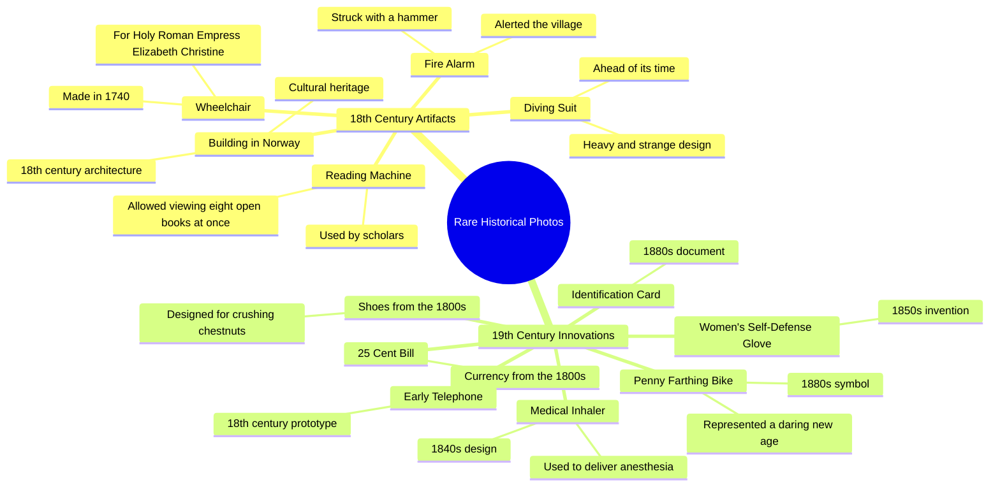

# Rare 1800s Historical Photos: Chestnut Crushing Shoes & More

> 🌐 **Read this in:** [English](../../en/2026-06/tiktok-transcript-rare-historical-photos-of-1800-historical-creepy-storytime-f-02cb.md) · **中文**

> **Creator:** [@venom_awais.0](https://www.tiktok.com/@venom_awais.0) · **Views:** 2.2M · **Posted:** 2026-06-08 · **Niche:** entertainment
>
> **TL;DR:** Opens with a bizarre, specific image that instantly piques curiosity.

[Watch original video →](https://www.tiktok.com/@venom_awais.0/video/7571907123735481608?q=storytimes&t=1780928009926)

## Why This Went Viral

## 钩子（前3秒）
- **逐字开场白：**"罕见历史照片。19世纪专为碾碎栗子而制的鞋子。"
- **钩子模式：** **场景 + 引人入胜的细节**——一个快速的视觉前提（"罕见历史照片"）紧接着一个离奇、具体的物品（"专为碾碎栗子而制的鞋子"）。
- **为何能阻止滑动：**"罕见"（稀缺性触发）与"碾碎栗子"（荒诞、出人意料、略带暴力感）的结合，瞬间制造了认知失调。观众必须停下来思考：*为什么鞋子要碾碎栗子？*

## 情感节奏
- **节拍1 – 好奇心（0–3秒）：**"罕见历史照片"打开了一个神秘盒子。碾碎栗子的鞋子呈现为一个怪异、近乎滑稽的画面。
- **节拍2 – 逐渐升级的吸引力（3–15秒）：**每件物品都是一次微型揭秘：潜水服（奇怪）、火灾报警器（物理动作）、阅读机（智力层面）。节奏是*展示 → 停顿 → 下一个*。
- **节拍3 – 悬念 + 紧张感（15–25秒）：**"1740年为皇后制作的轮椅"（皇室 + 残疾）、"25美分纸币"（经济奇闻）、"早期电话"（技术演变）。每件都像来自失落世界的拼图碎片。
- **节拍4 – 转折 / 高潮（25–30秒）：**"1850年代女性自卫手套"——一件暴力的、女权主义的文物，颠覆了"温柔过去"的预期。然后是"1880年代身份证"（监控）和"便士法辛自行车"（勇气的象征）。最后一张图片最具标志性，提供了令人满意的视觉收尾。
- **节拍5 – 行动号召（结尾）：**"挪威，点赞并订阅。只需一秒钟。"——打破了魔咒，但情感高峰已经过去。

## 关键词密度
| 关键词/短语 | 频率（约） | 驱动因素 |
|------------------|---------------------|--------|
| "18世纪" / "1800年代" | 8次以上 | **算法覆盖** – 历史时期是高搜索、低竞争的关键词。 |
| "罕见" | 2次（开头，隐含） | **情感吸引力** – 稀缺性使物品显得有价值、可分享。 |
| "鞋子" / "潜水服" / "轮椅" / "手套" | 5次以上 | **算法 + 情感** – 具体名词触发视觉记忆和好奇心。 |
| "专为……而制" / "用于" | 3次以上 | **情感吸引力** – 暗示用途，邀请观众想象使用场景。 |
| "超前于时代" | 1次（潜水服） | **情感吸引力** – 赞美过去，建立"他们和我们一样"的联系。 |
| "大胆" | 1次（便士法辛） | **情感吸引力** – 将最终画面与积极、令人向往的特质联系起来。 |

**算法驱动因素：**"18世纪"、"1800年代"、"罕见"——这些是可搜索、常青且低竞争的关键词。  
**情感驱动因素：**"鞋子"、"潜水服"、"轮椅"、"手套"——具体、怪异、可触摸的物品，触发好奇心和分享欲。

## 为何能传播
1. **"怪异物品级联"模式** – 每件物品都比上一件更奇怪。碾碎栗子的鞋子是荒诞的；自卫手套是黑暗的；便士法辛自行车是标志性的。视频是一个*好奇心阶梯*——观众会留下来看下一个是什么。*文字记录证据：*"19世纪专为碾碎栗子而制的鞋子" → "1850年代女性自卫手套" → "1880年代便士法辛自行车。"

2. **高"告诉朋友"价值** – 每件物品都是谈话的引子。"你知道有1740年的轮椅吗？"是一个低风险、高趣味的事实，人们会在晚餐时分享。*文字记录证据：*"1740年为神圣罗马帝国皇后伊丽莎白·克里斯蒂娜制作的轮椅"——一个具体、冷门、提及名人的事实。

3. **只暗示，不解释** – 视频从不解释*为什么*鞋子要碾碎栗子或*如何*使用潜水服。这创造了一个**好奇心缺口**，推动评论（人们提问、争论、猜测）。*文字记录证据：*任何物品之后都没有后续解释——只有物品名称。

4. **算法上的"刷屏性"** – 快速切换的格式（每2-3秒一件物品）保持高观看时长。视频约30秒，足够短，可以多次观看。*文字记录证据：*30秒内10件以上物品 = 高密度的"微型揭秘"。

5. **"挪威"式的无厘头** – 随机的"挪威，点赞并订阅"如此突兀，可能成为一个梗模板。它打破了催眠般的节奏，使行动号召感觉像是怪异的一部分。*文字记录证据：*"一座18世纪的挪威建筑。挪威，点赞并订阅。"——"挪威"的重复是奇怪、令人难忘且可分享的。

## 你可以借鉴什么
1. **"怪异物品清单"格式** – 选取任何小众领域（历史、科学、科技），收集5-10件*具体、怪异且视觉独特*的物品。使用模式：*[时间时期] + [物品] + [怪异用途]*。例如："一台1920年代需要曲柄的烤面包机。"

2. **每个事实都留白** – 永远不要解释*为什么*或*如何*。好奇心缺口推动评论、分享和重看。如果你解释了，就扼杀了神秘感。相反，每件物品后停顿一下，然后进入下一个。

3. **以最具标志性的画面结尾** – 便士法辛自行车是最易识别的物品。把它留到最后。最终的视觉画面应该是作为缩略图或梗图最易分享的那一个。在你的视频中，确定"英雄物品"并将其放在高潮部分。

## Mind Map

## Full Transcript (Generated by [TokTranscript](https://toktranscript.com/?utm_source=github&utm_medium=breakdown&utm_campaign=tool_attribution))

> 📝 Transcripts on this page are auto-generated and show the first 60%. Want to transcribe any TikTok in 30 seconds and get the full version? [Try TokTranscript free →](https://toktranscript.com/?utm_source=github&utm_medium=breakdown&utm_campaign=transcript_cta)

Rare historical photos. Shoes from the 1800s made for crushing chestnuts. An 18th century building in Norway. Norway like and subscribe. It only takes a second. An 18th century diving suit, heavy, strange and ahead of its time. An 18th century fire alarm you had to strike with a hammer to alert the village. An 18th century reading machine in that let scholars view eight open books at once. A 1740 wheelchair made for the 

*[Read the full transcript on TokTranscript →](https://toktranscript.com/plaza/tiktok-transcript-rare-historical-photos-of-1800-historical-creepy-storytime-f-02cb?utm_source=github&utm_medium=breakdown&utm_campaign=transcript_full)*

## Browse More

- All [entertainment](../../by-niche/zh-CN/entertainment.md) breakdowns
- All [Curiosity gap with specific oddity](../../by-pattern/zh-CN/hook-curiosity-gap-with-specific-oddity.md) examples

## Video Info

| | |
|---|---|
| Creator | [@venom_awais.0](https://www.tiktok.com/@venom_awais.0) |
| Original video | [https://www.tiktok.com/@venom_awais.0/video/7571907123735481608?q=storytimes&t=1780928009926](https://www.tiktok.com/@venom_awais.0/video/7571907123735481608?q=storytimes&t=1780928009926) |
| Original title | Rare historical photos of 1800 😱😰 #historical #creepy #storytime #for... |
| Views | 2.2M (2200000) |
| Posted | 2026-06-08 |
| Duration | 0s |
| Niche | `entertainment` |
| Hook pattern | `Curiosity gap with specific oddity` |
| Original language | `en` (this page translated by AI) |
| Available languages | en, zh-CN |
| Generated | 2026-06-09 by [TokTranscript](https://toktranscript.com/) |

---

*This breakdown is for educational analysis under fair use. Original video © [@venom_awais.0](https://www.tiktok.com/@venom_awais.0). All transcripts are auto-generated and may contain errors.*

*Want to analyze your own TikToks like this? [TokTranscript 转录工具 →](https://toktranscript.com/viral-breakdown?utm_source=github&utm_medium=breakdown&utm_campaign=footer_cta)*