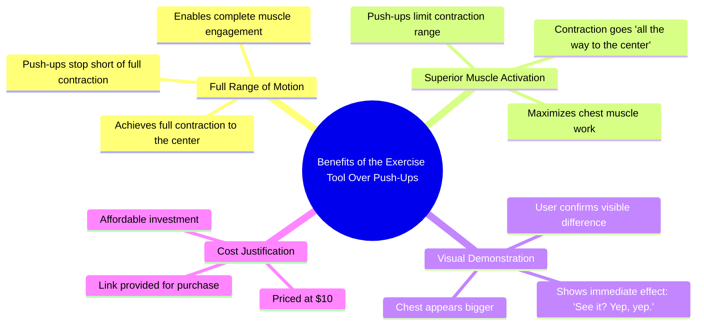

# No Broke Boys: Ab Coaster vs Push Ups for Core Contractions

> 🌐 **Read this in:** [English](../../en/2026-06/tiktok-transcript-replying-to-bighead-no-broke-boys-c7bd.md) · **中文**

> **Creator:** [@thevitalcart](https://www.tiktok.com/@thevitalcart) · **Views:** 3.1M · **Posted:** 2026-06-16 · **Niche:** fitness
>
> **TL;DR:** Directly challenges the viewer's financial status to provoke engagement.

[Watch original video →](https://vt.tiktok.com/ZSQbxPUF6/)

## Why This Went Viral

## 钩子（前3秒）
- **逐字开场白：**“老铁，听起来你连10块钱都掏不出来，因为这东西能让你收缩到核心深处。”
- **钩子模式：**大胆断言 + 直接挑战（指责对方小气）+ 对比（这个 vs. 俯卧撑）
- **为何能让人停下滑动：**开场就是人身攻击（“你连10块钱都掏不出来”），触发防御心理和好奇心。观众立刻想知道“这东西”是什么，以及这个说法是否属实。“收缩到核心深处”听起来既专业又直观，制造了知识缺口。

## 情绪节奏
- **节拍1 – 挑战/防御心理（0–2秒）：**“老铁，听起来你连10块钱都掏不出来”——观众感觉被点名。
- **节拍2 – 好奇心/紧张感（2–4秒）：**“这东西能让你收缩到核心深处”——模糊但有力的断言。
- **节拍3 – 对比/清晰化（4–6秒）：**“而俯卧撑只能停在那里”——简单对比让断言变得具体。
- **节拍4 – 演示/证明（6–9秒）：**“看到了吗？嗯，嗯。”——收缩的视觉确认。
- **节拍5 – 胜利/高潮（9–10秒）：**“我的胸肌比你的大。”——直接、嚣张的收尾，验证产品价值。
- **节拍6 – 行动号召（10秒）：**“链接就在那里。”——立即引导转化。

## 关键词密度
| 关键词/短语 | 频率（约） | 功能 |
|---|---|---|
| 收缩 | 3 | **算法覆盖** – 健身领域关键词，搜索量高 |
| 核心 | 2 | **情感吸引** – 暗示核心激活，更深层效果 |
| 10块钱 | 2 | **算法+情感** – 低价触发可负担性和错失恐惧 |
| 俯卧撑 | 2 | **算法覆盖** – 广泛健身术语，对比驱动搜索 |
| 比你的大 | 1 | **情感吸引** – 竞争性、自我驱动，易于分享 |
| 链接 | 1 | **转化** – 直接销售行动号召 |

## 为何能传播
1. **“你 vs. 我”的挑战制造分享性。**“我的胸肌比你的大”是直接挑衅，吸引朋友在评论区互相@。观众分享它来证明观点或引发争论。
2. **价格锚点（10块钱）消除障碍。**通过明确提及可负担性，视频预先解决了购买健身产品的头号反对理由。“你连10块钱都掏不出来”这句话让不买显得丢脸。
3. **对比钩子（这个 vs. 俯卧撑）一目了然。**即使不去健身房的人也知道俯卧撑是什么。视频不需要先验知识——对比是视觉和语言双重的。
4. **演示（“看到了吗？”）建立信任。**创作者不只是空谈，而是展示收缩的发生。这种视觉证据减少怀疑，提高转化意愿。
5. **“老铁”语气创造群体归属感。**随意、对抗但友好的语言让观众感觉像从可信赖的同伴那里得到内部建议，而不是品牌。

## 你可以借鉴什么
1. **以对观众身份的直接挑战开场。**不要说“这个产品很棒”，而是说“你错过了，因为你没有这个”。这触发防御心理，让他们继续看下去。
2. **用简单对比解释价值。**选一个常见的替代品（俯卧撑、深蹲等），用一句话说明你的解决方案为什么更好。保持二元对立：“这个能做到X，那个只能停在Y。”
3. **以竞争性、自我驱动的话结尾。**像“我的[身体部位]比你的大”或“我在这件事上比你强”这样的句子，因为引发比较和@而易于分享。谨慎使用以获得最大效果。

## Mind Map

## Full Transcript (Generated by [TikTok 转录工具](https://toktranscript.com/?utm_source=github&utm_medium=breakdown&utm_campaign=tool_attribution))

> 📝 Transcripts on this page are auto-generated and show the first 60%. Want to transcribe any TikTok in 30 seconds and get the full version? [Try TokTranscript free →](https://toktranscript.com/?utm_source=github&utm_medium=breakdown&utm_campaign=transcript_cta)

Big homie, it sounds like you just don't have $10 to spend because this gives you the freaking contraction that goes all the way to the center. Whereas a push UPS just gonna stop right there and you're not gonna get a

*[Read the full transcript on TokTranscript →](https://toktranscript.com/plaza/tiktok-transcript-replying-to-bighead-no-broke-boys-c7bd?utm_source=github&utm_medium=breakdown&utm_campaign=transcript_full)*

## Browse More

- All [fitness](../../by-niche/zh-CN/fitness.md) breakdowns
- All [Challenge/Insult Hook](../../by-pattern/zh-CN/hook-challenge-insult-hook.md) examples

## Video Info

| | |
|---|---|
| Creator | [@thevitalcart](https://www.tiktok.com/@thevitalcart) |
| Original video | [https://vt.tiktok.com/ZSQbxPUF6/](https://vt.tiktok.com/ZSQbxPUF6/) |
| Original title | Replying to @BigHead no broke boys |
| Views | 3.1M (3100000) |
| Posted | 2026-06-16 |
| Duration | 0s |
| Niche | `fitness` |
| Hook pattern | `Challenge/Insult Hook` |
| Original language | `en` (this page translated by AI) |
| Available languages | en, zh-CN |
| Generated | 2026-06-17 by [TokTranscript](https://toktranscript.com/) |

---

*This breakdown is for educational analysis under fair use. Original video © [@thevitalcart](https://www.tiktok.com/@thevitalcart). All transcripts are auto-generated and may contain errors.*

*Want to analyze your own TikToks like this? [TokTranscript 转录工具 →](https://toktranscript.com/viral-breakdown?utm_source=github&utm_medium=breakdown&utm_campaign=footer_cta)*