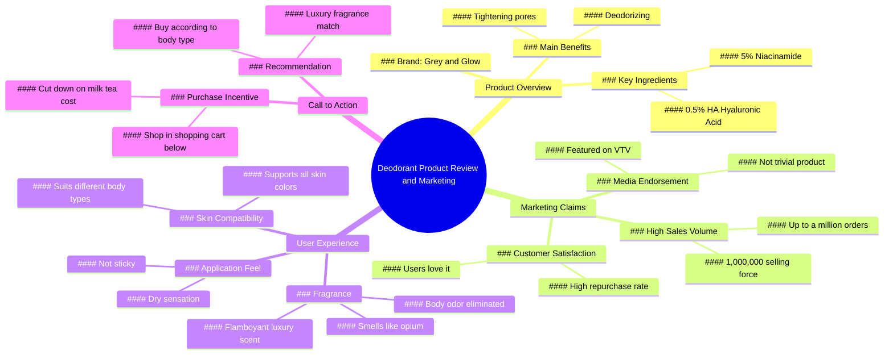

# Truth About Grace And Glow Deodorant Roll-On

> 🌐 **Read this in:** [English](../../en/2026-06/tiktok-transcript-s-th-t-v-l-n-kh-m-i-grace-and-glow-lannach-lankhumui-huongnu-6f75.md) · **中文**

> **Creator:** [@nguaca99](https://www.tiktok.com/@nguaca99) · **Views:** 1.5M · **Posted:** 2026-06-14 · **Niche:** beauty
>
> **TL;DR:** Opens with a million-sales claim to instantly establish credibility and intrigue.

[Watch original video →](https://l.facebook.com/l.php?u=https%3A%2F%2Fvt.tiktok.com%2FZSQxGyAGW%2F%3Ffbclid%3DIwZXh0bgNhZW0CMTAAYnJpZBExV0tIcWp4N3p2bmxRenB3eHNydGMGYXBwX2lkEDIyMjAzOTE3ODgyMDA4OTIAAR7auXdk5TTX38pANDsEmYY021o8C0Ndl37CX7AMxoSZw56WS_gEtn4_8obfWA_aem_y14H16E-0Vkj-zqe1wIX6w&h=AUC4DUhe59Df-FRdJl-wf3DhQiJC0_DRMKh7XUsxv7oXf8mcBo6c-iGXSbzq2XLs16gz1TZEUKdPOQFSWvRmJa-vRjoRFHzrgo6oFMDW2RFRpsGNdX_MvKgXWlaw5JUkRkU)

## Why This Went Viral

## 钩子（前3秒）
- **逐字原文：** "你难道还没有幻想吗？这款销量100万的力Ra可是好东西。"
- **钩子模式：** 大胆断言 + 社会证明（数字）
- **为何能阻止滑动：** 以直接、对抗性的挑战（"你难道还没有幻想吗？"）开场，瞬间制造认知失调，随后抛出巨大数字"100万"，传递权威感和错失恐惧。

## 情绪节奏
1. **好奇（0-3秒）：** "你难道还没有幻想吗？"——观众被惊醒，想知道自己错过了什么。
2. **怀疑→紧张（3-10秒）：** "这真的是止汗露吗？"——反问句制造疑虑，随后产品卖点堆叠（烟酰胺、透明质酸、收缩毛孔）。
3. **释然+认同（10-20秒）：** "我用这款止汗露，感觉干爽，不黏腻。闻起来像鸦片。"——个人证言化解疑虑，感官语言（"鸦片"、"张扬奢华"）带来愉悦感。
4. **紧迫+归属（20-30秒）：** "订单高达百万……你应该多买点。"——社会证明升级为错失恐惧。
5. **高潮（30-35秒）：** "有体味的AI身体知道。选一款适合身体的奢华香氛。"——转折：个性化+专属感（"AI身体"）将产品从商品提升为身份象征。
6. **行动号召（35秒至结束）：** "少喝一杯奶茶。随时在下方购物车下单。"——低成本牺牲被包装成明智决策，直接链接。

## 关键词密度
| 关键词/短语 | 频率（约） | 驱动因素 |
|---|---|---|
| "止汗露" | 5 | 算法——产品类别，可搜索 |
| "气味/有体味" | 4 | 情感——感官触发，共鸣感 |
| "百万"/"100万" | 2 | 算法——社会证明，病毒信号 |
| "买/购买" | 5 | 算法——购买意图，转化 |
| "奢华"/"张扬" | 2 | 情感——渴望，地位吸引力 |
| "身体" | 3 | 情感——个人化，身份驱动 |
| "AI" | 1 | 算法+情感——新奇感，科技热词 |

**算法驱动因素：** "止汗露"、"百万"、"买"——高搜索量，交易意图。
**情感吸引力：** "气味"、"奢华"、"身体"、"AI"——感官、身份、专属感。

## 为何能传播
1. **社会证明炸弹：** "销量100万的力Ra……订单高达百万"——原始数字触发从众行为；观众心想"如果百万人买了，肯定有效"。
2. **感官对比：** "闻起来像鸦片……张扬奢华" vs. "不黏腻，干爽"——解决常见痛点（止汗露黏腻），同时承诺异域奖励（鸦片香），形成难忘的二元对立。
3. **身份定位：** "有体味的AI身体知道……选一款适合身体的奢华香氛"——将产品定位为个性化、近乎算法化（"AI身体"），让观众感到被独特理解，而非大众营销。
4. **低门槛牺牲：** "少喝一杯奶茶"——微不足道的成本比较降低购买焦虑；观众合理化思考"只是一杯奶茶而已"。
5. **权威暗示：** "上过VTV的产品"——提及可信电视频道（VTV）作为第三方验证，增加超越网红炒作的公信力。

## 你可以借鉴的点
1. **以挑战开场，而非推销。** 从"你难道还没有幻想吗？"开始——一个对抗性问题迫使观众停下来思考，而非泛泛的"嘿，大家看看这个"。
2. **将痛点缓解与感官愉悦结合。** 将实用好处（"干爽，不黏腻"）与唤起性奖励（"闻起来像鸦片，张扬奢华"）配对——创造"问题解决+犒赏自己"的情绪循环。
3. **使用微不足道的成本比较。** "少喝一杯奶茶"——将价格锚定在日常小奢侈上，让购买感觉像无需动脑的牺牲。适用于任何10美元以下的产品。

## Mind Map

## Full Transcript (Generated by [我们用的转录工具](https://toktranscript.com/?utm_source=github&utm_medium=breakdown&utm_campaign=tool_attribution))

> 📝 Transcripts on this page are auto-generated and show the first 60%. Want to transcribe any TikTok in 30 seconds and get the full version? [Try TokTranscript free →](https://toktranscript.com/?utm_source=github&utm_medium=breakdown&utm_campaign=transcript_cta)

Don't you have illusions anymore. This 1,000,000 selling force Ra is a good thing. According to the information flow, the goods are sold as much as they are delicious. What's so easy to do? Is this really a deodorant bottle? Grey and Glow has 5% Niacinamide This hip, as they say, supports all skin colors. or ha 0.5% aid in deodorizing and tightening pores here no Please answer for me. I use this deodorant and it feels dry. It's not stuck. It smells like opium. It's a flamboyant luxury. The smell of the body is missing. Can anyone answer that? Since the day I used this, I've loved it. should follow I bo

*[Read the full transcript on TokTranscript →](https://toktranscript.com/plaza/tiktok-transcript-s-th-t-v-l-n-kh-m-i-grace-and-glow-lannach-lankhumui-huongnu-6f75?utm_source=github&utm_medium=breakdown&utm_campaign=transcript_full)*

## Browse More

- All [beauty](../../by-niche/zh-CN/beauty.md) breakdowns
- All [Social proof + curiosity gap](../../by-pattern/zh-CN/hook-social-proof-curiosity-gap.md) examples

## Video Info

| | |
|---|---|
| Creator | [@nguaca99](https://www.tiktok.com/@nguaca99) |
| Original video | [https://l.facebook.com/l.php?u=https%3A%2F%2Fvt.tiktok.com%2FZSQxGyAGW%2F%3Ffbclid%3DIwZXh0bgNhZW0CMTAAYnJpZBExV0tIcWp4N3p2bmxRenB3eHNydGMGYXBwX2lkEDIyMjAzOTE3ODgyMDA4OTIAAR7auXdk5TTX38pANDsEmYY021o8C0Ndl37CX7AMxoSZw56WS_gEtn4_8obfWA_aem_y14H16E-0Vkj-zqe1wIX6w&h=AUC4DUhe59Df-FRdJl-wf3DhQiJC0_DRMKh7XUsxv7oXf8mcBo6c-iGXSbzq2XLs16gz1TZEUKdPOQFSWvRmJa-vRjoRFHzrgo6oFMDW2RFRpsGNdX_MvKgXWlaw5JUkRkU](https://l.facebook.com/l.php?u=https%3A%2F%2Fvt.tiktok.com%2FZSQxGyAGW%2F%3Ffbclid%3DIwZXh0bgNhZW0CMTAAYnJpZBExV0tIcWp4N3p2bmxRenB3eHNydGMGYXBwX2lkEDIyMjAzOTE3ODgyMDA4OTIAAR7auXdk5TTX38pANDsEmYY021o8C0Ndl37CX7AMxoSZw56WS_gEtn4_8obfWA_aem_y14H16E-0Vkj-zqe1wIX6w&h=AUC4DUhe59Df-FRdJl-wf3DhQiJC0_DRMKh7XUsxv7oXf8mcBo6c-iGXSbzq2XLs16gz1TZEUKdPOQFSWvRmJa-vRjoRFHzrgo6oFMDW2RFRpsGNdX_MvKgXWlaw5JUkRkU) |
| Original title | Sự thật về lăn khử mùi Grace And Glow! #lannach #lankhumui #huongnuoc... |
| Views | 1.5M (1500000) |
| Posted | 2026-06-14 |
| Duration | 0s |
| Niche | `beauty` |
| Hook pattern | `Social proof + curiosity gap` |
| Original language | `en` (this page translated by AI) |
| Available languages | en, zh-CN |
| Generated | 2026-06-16 by [TokTranscript](https://toktranscript.com/) |

---

*This breakdown is for educational analysis under fair use. Original video © [@nguaca99](https://www.tiktok.com/@nguaca99). All transcripts are auto-generated and may contain errors.*

*Want to analyze your own TikToks like this? [TokTranscript 转录工具 →](https://toktranscript.com/viral-breakdown?utm_source=github&utm_medium=breakdown&utm_campaign=footer_cta)*