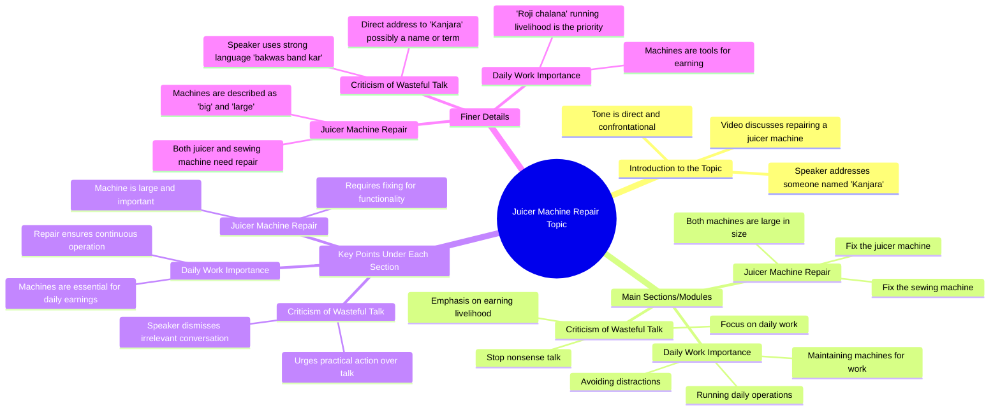

# Fix Your Juicer Machine, Stop Wasting Money

> 🌐 **Read this in:** [English](../../en/2026-06/tiktok-transcript-saraikimonkey-bandar-viraltiktok-ai-42f3.md) · **中文**

> **Creator:** [@qadirgra24k](https://www.tiktok.com/@qadirgra24k) · **Views:** 3.2M · **Posted:** 2026-06-16 · **Niche:** other
>
> **TL;DR:** The hook uses a repetitive, commanding tone about fixing machines, immediately creating a relatable and humorous frustration.

[Watch original video →](https://vt.tiktok.com/ZSQqssbnb/)

## Why This Went Viral

以下是所提供转录内容的病毒式传播分析。

---

## 钩子（前3秒）
- **逐字开场：** "把榨汁机修好，把缝纫机修好，现在你也在说大机器，闭嘴吧混蛋，把生计搞起来"
- **钩子模式：** **大胆主张 + 对比 + 攻击性。** 说话者驳斥"大机器"（榨汁机、缝纫机）无关紧要，并直接攻击听众（"闭嘴吧混蛋"）。
- **为何能阻止滑动：** 突然的高能量攻击性令人震惊。它打破了礼貌或教学类内容的模式。观众要么被冒犯，要么被吸引——他们必须知道*为什么*这个人对机器如此愤怒。

## 情感节奏
- **节拍：**
    1.  **紧张（0–3秒）：** 对"大机器"的攻击性驳斥制造了即时冲突。
    2.  **好奇（3–5秒）：** 短语"现在你也在说大机器"从攻击转向声称优越性。观众心想："等等，他说的*什么*机器？"
    3.  **悬念（5–7秒）：** "闭嘴吧"之后的停顿为高潮铺垫了期待。
    4.  **高潮（7秒）：** "把生计搞起来"——揭示真相。"机器"是对日常奋斗或生存的隐喻。
    5.  **共鸣/解脱：** 攻击性被重新定义为严厉的爱或激励性鞭策。观众意识到"大机器"是借口；真正的"机器"是他们自己的努力。
- **高潮时刻：** 台词"把生计搞起来"——这是抽象咆哮变成具体、可共鸣的行动号召的地方。

## 关键词密度
- **重复最多的词语/短语：**
    1.  **机器（Machine）** — 重复3次。*算法覆盖范围*（常见、可搜索的术语）但也*情感吸引力*（字面与隐喻的对比）。
    2.  **修好（Get it fixed）** — 重复两次。*情感吸引力*（暗示破损、需要修复）。
    3.  **废话（Nonsense）** — 高情感负荷。*情感吸引力*（轻蔑、对抗性）。
    4.  **混蛋（Miser/Scoundrel）** — 强烈侮辱。*情感吸引力*（制造震惊和记忆点）。
    5.  **生计（Daily bread/livelihood）** — 核心隐喻。*情感吸引力*（普遍、可共鸣）。
    6.  **大（Big/big）** — 重复以强调。*情感吸引力*（大小与价值的对比）。
- **算法驱动因素：** "机器"是关键可搜索术语。"生计"和"废话"因高情感共鸣推动互动（评论、分享）。

## 为何能传播
1.  **"反向诱饵转换"机制：** 视频以关于修理实体机器的攻击性咆哮开始，但转向关于你自己生活的隐喻。期待修理教程的观众会因激励性转折而留下。*具体台词：* "把榨汁机修好" → "把生计搞起来。"
2.  **高情感传染（愤怒 → 激励）：** 初始愤怒具有传染性。观众感到被攻击，然后当他们意识到目标是自己借口时感到解脱。这种情感过山车极具分享性。*具体台词：* "闭嘴吧混蛋。"
3.  **普遍共鸣（"奋斗"隐喻）：** "你自己的机器"的隐喻被任何努力工作的人立即理解。它绕过了文化差异，触及了全球性的"拼搏"心态。*具体台词：* "把生计搞起来。"
4.  **口头高潮（令人难忘且可引用）：** 最后一句"把生计搞起来"是一个完美、紧凑的高潮。它易于重复、引用和混音。这推动了用户生成内容（评论、接续）。*具体台词：* 整个最后短语。

## 你可以借鉴什么
1.  **"愤怒隐喻"钩子：** 从一个看似无关、关于常见物品（机器、工具、习惯）的攻击性抱怨开始。然后，在最后3秒，揭示它是观众自己生活或工作的隐喻。这创造了高留存率。
2.  **"侮辱到激励"弧线：** 使用直接、对抗的语气（例如，"闭嘴吧废话"）来吸引注意力，但确保结尾将攻击性重新定义为严厉的爱或激励性鞭策。观众必须感到*被点醒*但*不被攻击*。
3.  **"单行高潮"结构：** 围绕一个单一、可重复、有力的台词（此处："把生计搞起来"）构建整个视频。确保该台词是高潮。之前的一切都是铺垫。这使得视频易于引用和分享。

## Mind Map

## Full Transcript (Generated by [拆解你自己的 TikTok](https://toktranscript.com/?utm_source=github&utm_medium=breakdown&utm_campaign=tool_attribution))

> 📝 Transcripts on this page are auto-generated and show the first 60%. Want to transcribe any TikTok in 30 seconds and get the full version? [Try TokTranscript free →](https://toktranscript.com/?utm_source=github&utm_medium=breakdown&utm_campaign=transcript_cta)

जूसर मशीना ठीक करा लो, सलाई मशीना ठीक करा लो, अब बात हुता आप भी ता बड़ी व

*[Read the full transcript on TokTranscript →](https://toktranscript.com/plaza/tiktok-transcript-saraikimonkey-bandar-viraltiktok-ai-42f3?utm_source=github&utm_medium=breakdown&utm_campaign=transcript_full)*

## Browse More

- All [other](../../by-niche/zh-CN/other.md) breakdowns
- All [Repetitive command with escalating absurdity](../../by-pattern/zh-CN/hook-repetitive-command-with-escalating-absurdity.md) examples

## Video Info

| | |
|---|---|
| Creator | [@qadirgra24k](https://www.tiktok.com/@qadirgra24k) |
| Original video | [https://vt.tiktok.com/ZSQqssbnb/](https://vt.tiktok.com/ZSQqssbnb/) |
| Original title | کنجرا روزی اِچ لَت نہ مار 😂😂 #saraikimonkey #bandar #viraltiktok #ai ... |
| Views | 3.2M (3200000) |
| Posted | 2026-06-16 |
| Duration | 0s |
| Niche | `other` |
| Hook pattern | `Repetitive command with escalating absurdity` |
| Original language | `en` (this page translated by AI) |
| Available languages | en, zh-CN |
| Generated | 2026-06-17 by [TokTranscript](https://toktranscript.com/) |

---

*This breakdown is for educational analysis under fair use. Original video © [@qadirgra24k](https://www.tiktok.com/@qadirgra24k). All transcripts are auto-generated and may contain errors.*

*Want to analyze your own TikToks like this? [TokTranscript →](https://toktranscript.com/viral-breakdown?utm_source=github&utm_medium=breakdown&utm_campaign=footer_cta)*