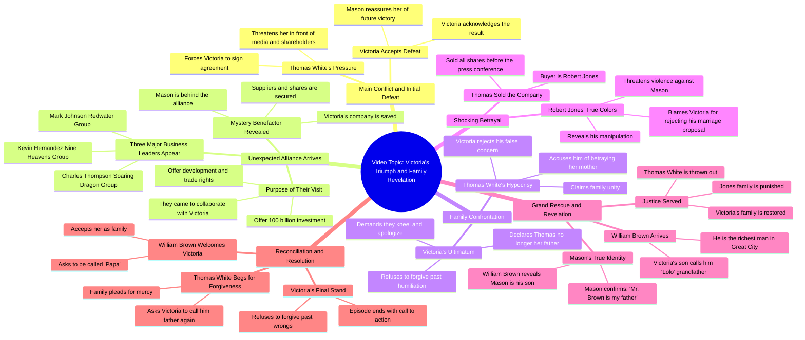

# Secret Billionaire Father's Child - Episode 8 Finale (Tag...

> 🌐 **Read this in:** [English](../../en/2026-06/tiktok-transcript-sekretong-anak-bilyonaryong-ama-episode-8-ang-pagwawakas-tag-e36e.md) · **中文**

> **Creator:** [@Drama Nation PH](https://www.tiktok.com/@Drama Nation PH) · **Views:** 2.2M · **Posted:** 2026-06-24 · **Niche:** entertainment
>
> **TL;DR:** The hook immediately establishes a high-stakes confrontation with a tone of reluctant surrender, drawing viewers into the conflict.

[Watch original video →](https://www.facebook.com/reel/2102636893638189)

## Why This Went Viral

## 钩子（前3秒）
- **逐字开场白：** "我接受这个结果。来吧。维多利亚，这一切都是你应得的。"
- **钩子模式：** 场景 + 大胆断言（一个角色看似认输，却立刻威胁另一个人）
- **为何能阻止滑动：** 瞬间建立紧张感和权力动态——一个角色似乎让步，但语气充满攻击性和不祥预感。观众被这种矛盾吸引，想看看这场对抗中谁会"赢"。

## 情感节奏
- **节拍：** 紧张（威胁）→ 好奇（维多利亚是谁？）→ 挫败（家族背叛）→ 希望（盟友到来）→ 胜利（权力反转）→ 震惊（新的背叛）→ 解脱（最终保护者出现）→ 结局（正义得到伸张）
- **悬念落点：** 当三位大老板为"怀特小姐"到来时——观众意识到一场巨大的权力转移正在发生。
- **转折：** 罗伯特·琼斯透露他买下了公司——一次升级风险的背叛。
- **高潮：** 布朗总裁揭露梅森是他的儿子——摧毁反派的终极权力反转。

## 关键词密度
- **"怀特小姐" / "维多利亚"** —— 提及20次以上；驱动身份和地位（通过角色名搜索实现算法覆盖）
- **"公司"** —— 提及10次以上；核心冲突（情感吸引力：家族 vs. 商业）
- **"股份" / "公司股份"** —— 提及8次以上；赌注和权力（算法：商业剧关键词）
- **"家族"** —— 提及12次以上；情感核心（情感吸引力：背叛与忠诚）
- **"布朗总裁" / "布朗先生"** —— 提及10次以上；终极权威人物（算法：角色权威加成）
- **"爷爷" / "孙子"** —— 提及6次以上；情感触发点（情感吸引力：家族纽带与保护）

## 为何能传播
1. **权力反转是核心病毒引擎。** 视频反复设置一个弱势角色（维多利亚）被欺负，然后通过强大盟友逐一登场来逆转局面。每一次登场都是一次多巴胺冲击。*具体台词："我们所有人都为怀特小姐而来！"*
2. **5分钟内多重转折。** 大多数短视频只有一个转折；这个视频有3-4个（盟友到来、罗伯特·琼斯的背叛、布朗总裁的揭露）。这能保持高留存率，因为观众会留下来看"接下来会发生什么"。*具体台词："他卖给了我。"*
3. **家族背叛 + 救赎弧线。** 情感赌注具有普遍性——观众喜欢看到反派家族被羞辱。结尾的"爷爷"揭露提供了宣泄感。*具体台词："梅森，他是我自己的儿子。"*
4. **悬念 + 行动号召。** 结尾（"点赞关注看更多剧集"）是直接的留存策略。视频显然是系列的一部分，因此观众有动力追看。*具体台词："点赞关注看更多剧集。"*
5. **高情感对比。** 视频从羞辱到胜利，再到震惊和宽慰——每一次情感转变都是一个"钩子"，重置观众的注意力。*具体台词："亲爱的……妈妈只在乎这个！"*

## 你可以借鉴的地方
1. **"盟友登场"模式。** 引入一个看似无力的角色，然后让一个强大人物出现保护他们。这能创造即时的情感回报。应用：在你的视频中，设置一个弱势方，然后揭示一个隐藏的支持者。
2. **叠加多重反转。** 不要满足于一个转折。在胜利之后，引入一次背叛。在背叛之后，引入一个更大的保护者。每一次反转都会重置观众的注意力跨度。应用：编写一个至少包含3次权力转移的脚本。
3. **以悬念 + 直接行动号召结尾。** 最后一句明确告诉观众关注以获取更多内容。这能把一个病毒视频变成一个能积累观众的系列。应用：始终以"点赞关注看下一集"结尾——即使是一个独立视频，也要暗示有续集。

## Mind Map

## Full Transcript (Generated by [TokTranscript](https://toktranscript.com/?utm_source=github&utm_medium=breakdown&utm_campaign=tool_attribution))

> 📝 Transcripts on this page are auto-generated and show the first 60%. Want to transcribe any TikTok in 30 seconds and get the full version? [Try TokTranscript free →](https://toktranscript.com/?utm_source=github&utm_medium=breakdown&utm_campaign=transcript_cta)

Tinatanggap ko ang resulta. Sige na. Victoria, lahat ng yan dapat lang na mangyari sa'yo. Victoria, alam mo na mangyayari kapag nilabanan mo pa ako. Got me in the right way, got me in the best way Now you got me thinking, you're not competition Think you gotta fit Hoy! Anong ibig sabihin niya? Sinasabi ko sa'yo. Hindi matatalo ang asawa ko ngayon. Magtatagumpay siya. Victoria, parang nabubuhayan ka. Huwag mo sabihin naniniwala ka sa lalaking niya. Victoria, walang dudang lahat naman sa River City. Alam nila na kaluguyo mo ang lalaking yan at puro papogi lang naman. at ang lakas ng loob ang gulo rito. Victoria, sa harap ng media at lahat ng shareholders, ang agreement na yan ay pipirma mo. Sa ayaw mo nung gusto mo. Mason, ang talo ay talo. Tatanggapin ko. Sa future, magkakaroon tayo ng pagkakataong bumangon. Honey, wag ka na mag-alala. Pag sinabi kong hindi ka matatalo, hindi ka talaga matatalo. Lantito na si Charles Thompson ng Storytrip Si Kevin Hernandez sa Nine Heavens Group at si Mr. Mark Johnson ng Redwater Group. Soring Dragon Group, Nine Heavens Group, Redwater Group, Pampira, mga bigate ng ibang syudad. Mga bigating boss, bakit sila nandito? Eh ang litlang naman ang River City. Ba't nandito sila? Dahil kaya kay Mason? Mr. Thompson, Mr. Hernandez, Mr. Jackson, bakit kayo naparisi? At ikaw si... Ah, ako si Thomas White. Ako ang chairman ng AW Group. Ako rin ang nagpatawag ng press conference nito. Bakit ba? Napabisita kayo. Hindi ba ang chairman ng AW? Di ba si chairman Victoria White yun? Mr. Thompson, bakit ninyo alam. Pero mahinang klase ang Victoria niya. Tinanggal na siya ng board of directors sa chairmanship niya. Hindi mo ba alam, kaming lahat ay nandito para kay Miss White? Ano ka mo? Sabi ko, kaming lahat nandito para kay Miss White! Tama ka, kaming lahat nandito para kay Miss White! Mr. Thompson, Mr. Hernandez, nagkakamali kayo. Walang kwenta yan si Victoria. Bakit ka ba siya hinahanap? Sino ba rito si Miss Victoria White? Ako po yun. Charles Thompson ng Soaring Dragon Group. Kevin Hernandez and Nine Heavens. Mark Jackson ng Redwater Group! Karangalan makilala kayo! Teka, sandali lang, mga sir. Anong ano nangyari yan Ah mga sir bakit kayo nandito Miss White, sinabihan kaming makipag-collaborate sa company mo. Makipag-collaborate sa akin? Tapa, Miss White, ano mang kailangan mo, yung kumpanya namin, bibigyan ka ng fans o kaya manpower. Miss White, bilang token ang aming sincerity, masahin po ninyo. 100 billion investment? Won feng development rights? At maritime trade rights? Sobro naman to! Hindi ko deserve ang kaputihan niyo! Miss White, masyado kang formal sa amin. Maliit na bagay lang yan kung tutuusin. Kahit nga ang mismong company ko, kaya kong ibigayin sa'yo kung iingin mo. Lala akin to, suwabi rin kong magsalita. Pero, hindi ko kayong tanggapin lahat to. Sabihin nyo, sinong nasa likod nito? Ah, si ano? Ah, alam mo, honey. Ibigay nila ang mga regalong to. Tanggapin mo na lang. Hindi kaya si Mason? Kapano? May pinirmahan kang vet agreement sa asawa ko, diba? Yung mga supplier, yan ah. Nailigtas na ang kumpanya. Di ba dapat yung shares nyo malilipot na yung lahat sa asawa ko? Ano na? Pirmahan nyo na! Ah, Victoria, pamilya tayong lahat dito. Bakit natin pinag-aawayan ang shares ng pamilya? Kahit nasa amin yung iba, pamilya pa rin naman tayo kita. Tama siya, Victoria. Walang masamang intensyon ng papa mo. Kapakanan lang ng kumpanya ang iniisip niya. Anong pamilya yan? Isang malaking kahibangan niya atay. Itong inaaway niya ang asawa ko at ang anak ko, hindi ko narinig ang mga salitang yan. Sis, Nagkamali talaga kami. Baka pwedeng patawarin mo na kami. Patawarin kayo? O sige, lumuhod kayo, humingi ng tawad at huwag na magpakita pa sa kanya ulit. Gawin nyo ngayon din! Ikaw! Victoria White, kailangan bang ipahiya mo kami? Ha? Sa harap pa ng ibang tao? Ipahiya kayo ngayon? Ni minsan ba inisip nyo ako? Nung pinahiya niyo ako sa harap na iba? Huwag mong kalimutan, ako pa rin ang iyong ama. Anong ama? Ang tulad mo, hindi ka rapat dapat maging ama ko Nung namatay si mama at pinakasalan mong babae niyan Sa puso ko, wala na akong ama Hoy Victoria, sumusobra ka na Nakalimutan mo, akong siyang nagpalaki sa'yo, di ba? Teka lang Thomas, hindi ka na talaga nahiya Paano mo katrinato nitong nagdaang taon? Ang pakikitungo mo kay mama at kay Daisy Ikaw ang mas nakakaalam ko nung tama Bumbuhi ko, hindi kita mapapatawad Abayaan mo na siya Luluhut ka ba? O pipirmahan mo ang mga papeles? Pirmahan? Asaka ba? Victoria, akala mo masasagit mo ang kumpanya dahil natalong mo ako para sabihin ko sa'yo. Kuli na ang lahat. Anong ibig sabihin? Sasabihin ko sa'yo ang totoo. Bago pa ang press conference, naibenta ko na lahat ng shares ng kumpanya. Hanggang sa kauli-uli yan. Anong sabi mo? Victoria, sige, panalo ka na. Pero ano pong magagawa ko? Wala na, di ba? Pero alam mo, kinamumuhi ang kita. Alam mo kung bakit? Dahil kayo ng maho mo ay talagang nakakabigil. Sinampal mo ko Ang kapal mo talaga Thomas White, ganino mo binenta ang kumpanya? Sagutin mo ako! Honey... Yun lang ang anahala ni Mama! Gayunan naman ngayon. Nai-beta ko na ang kumpanya! Sabihin mo sa akin, ganino mo binenta? Sa akin niya binenta. Sa akin niya binenta Si Robert Jones, ba't nandito siya? Huwag mong sabihin na si Robert na ang may-ari ng AW Group Robert, bakit nandito ka? Masaya raw dito eh, bawal ba ako matend? Mr. Jones, butit dumating ka na Magkakampi tayong dalawa, di ba? Hindi mo ako pwede mabayaan. Umayas ka nga! Sinong sinasabi mong kakampi mo, ha? Ha? Ibirinta na sa akin ang 

*[Read the full transcript on TokTranscript →](https://toktranscript.com/plaza/tiktok-transcript-sekretong-anak-bilyonaryong-ama-episode-8-ang-pagwawakas-tag-e36e?utm_source=github&utm_medium=breakdown&utm_campaign=transcript_full)*

## Browse More

- All [entertainment](../../by-niche/zh-CN/entertainment.md) breakdowns
- All [Resigned Acceptance](../../by-pattern/zh-CN/hook-resigned-acceptance.md) examples

## Video Info

| | |
|---|---|
| Creator | [@Drama Nation PH](https://www.tiktok.com/@Drama Nation PH) |
| Original video | [https://www.facebook.com/reel/2102636893638189](https://www.facebook.com/reel/2102636893638189) |
| Original title | Sekretong Anak Bilyonaryong Ama - Episode 8 | Ang pagwawakas (Tagalog Dubbed) |
| Views | 2.2M (2235826) |
| Posted | 2026-06-24 |
| Duration | 0s |
| Niche | `entertainment` |
| Hook pattern | `Resigned Acceptance` |
| Original language | `en` (this page translated by AI) |
| Available languages | en, zh-CN |
| Generated | 2026-06-25 by [TokTranscript](https://toktranscript.com/) |

---

*This breakdown is for educational analysis under fair use. Original video © [@Drama Nation PH](https://www.tiktok.com/@Drama Nation PH). All transcripts are auto-generated and may contain errors.*

*Want to analyze your own TikToks like this? [TokTranscript →](https://toktranscript.com/viral-breakdown?utm_source=github&utm_medium=breakdown&utm_campaign=footer_cta)*