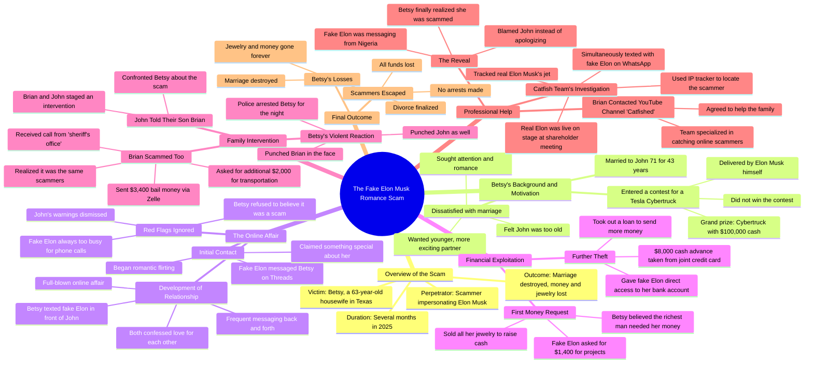

# Catfished Team Helps Betsy Expose Elon Musk Affair

> 🌐 **Read this in:** [English](../../en/2026-06/tiktok-transcript-shout-out-to-the-catfished-team-for-helping-betsy-and-for-pu-ef4a.md) · **中文**

> **Creator:** [@realraywilliam](https://www.tiktok.com/@realraywilliam) · **Views:** 3.9M · **Posted:** 2026-06-09 · **Niche:** entertainment
>
> **TL;DR:** Opens with an unbelievable, clickbait-worthy claim about Elon Musk to instantly grab attention.

[Watch original video →](https://www.tiktok.com/@realraywilliam/video/7626417709781110047?is_from_webapp=1&sender_device=pc&web_id=7626876829698491912)

## Why This Went Viral

## 钩子（前3秒）
- **逐字原文：** “所以埃隆·马斯克显然在和这位63岁的女人有染，这个故事太疯狂了”
- **模式：** 大胆断言 + 好奇心缺口（与一个不太可能的人有染）
- **为何能阻止滑动：** 将超级名人（埃隆·马斯克）与一个出人意料、带有年龄细节（63岁女人）的震惊信息结合，打破预期。“疯狂”一词暗示一个劲爆、难以置信的故事——立即引发错失恐惧症。

## 情感节奏
1. **好奇心** —— “埃隆·马斯克与一位63岁女人有染”（钩子）
2. **紧张感** —— 贝齐对婚姻不满，渴望年轻男人
3. **悬念** —— 她参加比赛，收到“埃隆”的消息
4. **怀疑（观众）** —— “他总是太忙”——观众知道这是骗局
5. **挫败感** —— 贝齐无视丈夫，卖掉珠宝，交出银行权限
6. **震惊** —— 她打了儿子和丈夫
7. **讽刺** —— 布莱恩也中了同样的骗局
8. **高潮** —— 钓鱼团队展示IP追踪器：“尼日利亚”
9. **共鸣/失望** —— 贝齐责怪丈夫，毫无悔改
- **高潮时刻：** “这个人实际上是从尼日利亚发消息的，抱歉，尼日利亚”——揭露真相，粉碎她的幻想。

## 关键词密度
- **埃隆·马斯克** —— 算法金矿（高搜索量的名人姓名）
- **贝齐** —— 情感锚点（观众与她的故事产生共鸣）
- **骗局 / 骗子** —— 提升传播量（高关注度、永恒话题）
- **假埃隆** —— 对比短语（制造紧张感，搜索关键词）
- **约翰（丈夫）** —— 情感牵引（同情受害者）
- **尼日利亚** —— 具体地点细节（增加可信度与冲击力）
- **钱 / 现金 / 银行账户** —— 触发财务焦虑（高互动率）
- **离婚** —— 情感钩子（关系戏剧）
- **打 / 打了** —— 本能动作（冲击价值）
- **被钓鱼** —— 品牌提及（社群交叉）

## 为何能传播
1. **难以置信但真实的前提** —— “63岁家庭主妇爱上假埃隆·马斯克爱情骗局”是一个荒谬到必须分享的标题。文字记录以“这个故事太疯狂了”开头——一种自我意识的邀请，让人告诉他人。
2. **多个迷你剧情反转** —— 贝齐打了儿子，布莱恩被同一伙骗子骗了，真相揭露后她责怪丈夫。每个反转都是一个新的可分享时刻。观众在每次“等等，什么？”的节奏中获得多巴胺刺激。
3. **可共情的受害者原型** —— 约翰是令人同情的、被背叛的丈夫。观众为他加油，对贝齐感到愤怒，然后产生怜悯。这种情感过山车推动评论和分享（“我无法相信她对他做了那种事”）。
4. **教育 + 娱乐混合体** —— 这是一个伪装成八卦故事的爱情骗局警示故事。人们分享它来警告他人（“这可能发生在你妈妈身上”）。“尼日利亚”IP追踪时刻既令人震惊又富有信息量。
5. **悬念式结尾** —— “假埃隆骗子们带着一切逃之夭夭”让观众感到不满，促使他们评论“后来发生了什么？”或搜索更新，提升停留时间和算法信号。

## 你可以借鉴什么
1. **以名人 + 矛盾开场** —— 在意外情境中提及名人（例如，“埃隆·马斯克”+“63岁家庭主妇”）。这立即打破观众的心理过滤。适用于任何热门人物：“泰勒·斯威夫特秘密约会一位72岁水管工”（当然，如果是真的）。
2. **每30秒堆叠迷你反转** —— 不要让故事陷入平缓。文字记录在:30（她想要年轻男人）、1:30（她参加比赛）、2:30（假埃隆）、3:30（打人）、4:30（布莱恩被骗）、5:30（尼日利亚揭露）处都有反转。规划你的故事，每20-40秒制造一个惊喜。
3. **以“无救赎”重击结尾** —— 最火爆的故事并不总是有幸福结局。贝齐责怪丈夫，骗子获胜。这制造了挫败感，推动评论（“她活该”/“我真为约翰感到难过”）。让你的观众带着需要发泄的强烈情感离开。

## Mind Map

## Full Transcript (Generated by [TokTranscript 转录工具](https://toktranscript.com/?utm_source=github&utm_medium=breakdown&utm_campaign=tool_attribution))

> 📝 Transcripts on this page are auto-generated and show the first 60%. Want to transcribe any TikTok in 30 seconds and get the full version? [Try TokTranscript free →](https://toktranscript.com/?utm_source=github&utm_medium=breakdown&utm_campaign=transcript_cta)

so Elon Musk is apparently having an affair with this 63 year old woman this story is wild now the woman's name is Betsy and like I said she's 63 and she's living in Texas and Betsy lives a regular life she's a housewife and a mom however Betsy has a big problem she's married to this guy John and they've been married for 43 years but now John 71 and Betsy starting to think that maybe he's a little too old for her and she decides that she doesn't wanna watch him grow even older or be around when he dies one day instead she wants to find a new man someone younger and more exciting someone who will give her lots of attention and get you know spicy in the bedroom then one day in 2025 she gets that chance because Betsy's scrolling around on her phone on threads when she sees an online contest and the winner of this contest will get a grand prize of a new Tesla cybertruck with $100,000 cash inside and Elon Musk himself will deliver the truck to the winner's house and Betsy's like I want that and so she enters the contest now she doesn't actually win the contest of course however something crazy does happen she's chilling at home one day and she gets a message probably on threads and the message is from Elon Musk himself and he's like Betsy this is Elon Musk I don't normally reach out like this but there's something special about you then he starts messaging her romantic things like he's flirting and Betsy thinks he's kind of fine so she starts flirting back and soon they're messaging back and forth a lot and eventually this develops into a full blown online affair and Betsy loves all this new attention she's getting and she makes no secret that she's having an online affair with Elon Musk in fact she'll text him right in front of her husband John like she just rubs it in his face now eventually as this relationship develops Elon confesses his love for Betsy and Betsy she loves him right back but strangely whenever she asks Elon to talk on the phone he's always too busy that's suspicious but whatever I guess they're in love I suppose okay here's the thing about this Elon guy she's talking to he's not really Elon Musk this person is a scammer and this is a romance scam and this may be obvious to like me and you and her husband John but it's not obvious to Betsy in fact whenever her husband John tells her that she's talking to an imposter she doesn't listen and she just keeps this relationship going and after a few months inevitably fake Elon starts hitting her up for money telling her that he needs some cash to fund his projects or whatever and yes Betsy actually believes him she believes that the richest man in the world a man whose wealth grows by like 600 million dollars a day really needs her to loan him like 14 hundred dollars now 14 hundred dollars is not a small amount of money especially not to Betsy and John in fact she doesn't actually have it so she starts selling all her things including pawning all her jewelry to come up with the cash to send him and to make it worse Betsy even gives fake Elon direct access to her bank account where he takes an extra $8,000 cash advance off her and John's joint credit card meanwhile poor John is still supporting Betsy he's cooking her dinner every night and trying to be the best husband that he can be so that he can win her back but ultimately that doesn't help because eventually Betsy drops a bomb on him she's filing for divorce she's gonna leave him for a guy pretending to be Elon Musk a guy she's never even spoken on the phone to and at this point poor John he doesn't know what to do so he goes and he tells their son this guy Brian so John tells Brian and the two of them decide to stage an intervention so Brian goes to his parents house and he and John confront Betsy and they try to get her to face reality Brian's like mom he's the richest man in the world of all the women on the earth why would he choose you and this of course pisses Betsy off and she flips out and she starts yelling you have no idea what you've just done Elon has satellites and he can aim them at the house and blow up your car and Brian's like mom you're a 63 year old housewife what do you have to offer him and Betsy gets even more mad and suddenly POW she punches Brian in the face and then POW she punches John too and eventually the police show up and they intervene and Bam they arrest her and they throw her in jail for the night the next day Brian gets a phone call and the person on the phone says this is the sheriff's office we just need the bail money and then we'll le

*[Read the full transcript on TokTranscript →](https://toktranscript.com/plaza/tiktok-transcript-shout-out-to-the-catfished-team-for-helping-betsy-and-for-pu-ef4a?utm_source=github&utm_medium=breakdown&utm_campaign=transcript_full)*

## Browse More

- All [entertainment](../../by-niche/zh-CN/entertainment.md) breakdowns
- All [Shocking Claim](../../by-pattern/zh-CN/hook-shocking-claim.md) examples

## Video Info

| | |
|---|---|
| Creator | [@realraywilliam](https://www.tiktok.com/@realraywilliam) |
| Original video | [https://www.tiktok.com/@realraywilliam/video/7626417709781110047?is_from_webapp=1&sender_device=pc&web_id=7626876829698491912](https://www.tiktok.com/@realraywilliam/video/7626417709781110047?is_from_webapp=1&sender_device=pc&web_id=7626876829698491912) |
| Original title | Shout out to the Catfished team for helping Betsy and for putting thi... |
| Views | 3.9M (3900000) |
| Posted | 2026-06-09 |
| Duration | 0s |
| Niche | `entertainment` |
| Hook pattern | `Shocking Claim` |
| Original language | `en` (this page translated by AI) |
| Available languages | en, zh-CN |
| Generated | 2026-06-10 by [TokTranscript](https://toktranscript.com/) |

---

*This breakdown is for educational analysis under fair use. Original video © [@realraywilliam](https://www.tiktok.com/@realraywilliam). All transcripts are auto-generated and may contain errors.*

*Want to analyze your own TikToks like this? [TokTranscript →](https://toktranscript.com/viral-breakdown?utm_source=github&utm_medium=breakdown&utm_campaign=footer_cta)*