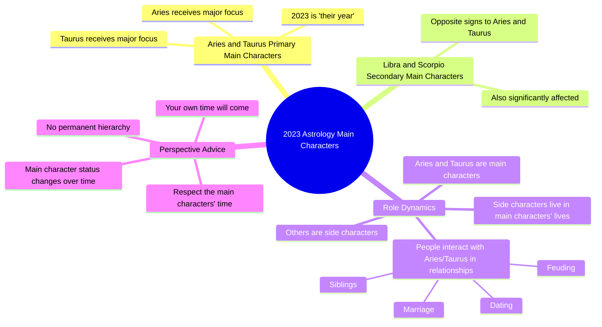

# Shoutout to Aries and Taurus for 2023

> 🌐 **Read this in:** [English](../../en/2026-06/tiktok-transcript-shoutout-to-aries-taurus-2f18.md) · **中文**

> **Creator:** [@marenaltman](https://www.tiktok.com/@marenaltman) · **Views:** 2.6M · **Posted:** 2026-06-28 · **Niche:** entertainment
>
> **TL;DR:** Declares a definitive, exclusive prediction that immediately positions the viewer as either a main character or a side character.

[Watch original video →](https://www.tiktok.com/@marenaltman/video/7180456466132798763)

## Why This Went Viral

## 钩子（前3秒）
- **逐字开场白：** "请记住，2023年的主角是白羊座和金牛座。"
- **钩子模式：** 大胆断言 + 占星权威（基于预测）。
- **为何能阻止滑动：** 它将观众定位为主角（讨好）或配角（引人好奇/激发竞争）。"主角"这个梗在当下文化中正流行——它触发了身份认同的自我审视。

## 情绪节奏
1. **好奇心** —— "2023年的主角"让观众想知道自己是否被包含在内。
2. **认同感** —— 白羊座/金牛座的观众感到被看见、被选中。
3. **紧张感** —— "你是个配角"对非白羊座/金牛座的观众造成轻微刺痛。
4. **解脱感** —— "你的时代会到来"释放了紧张感，并将等级秩序重新定义为暂时的。
5. **反抗/共鸣** —— "我才不在乎谁是主角"增添了一种叛逆、直截了当的语气，显得真实可信。
6. **高潮** —— "白羊座和金牛座明年将获得关注"——最终确认，奖励了圈内群体。

## 关键词密度
| 关键词/短语 | 出现频率 | 驱动因素 |
|------------------|------------------|--------|
| 主角 | 4次 | **情感吸引力** —— 身份、地位、叙事 |
| 白羊座 | 3次 | **算法覆盖** —— 可搜索的星座标签 |
| 金牛座 | 3次 | **算法覆盖** —— 可搜索的星座标签 |
| 配角 | 2次 | **情感吸引力** —— 对比、错失恐惧症 |
| 年/2023年 | 2次 | **算法覆盖** —— 时效性、趋势性 |
| 关注 | 1次 | **情感吸引力** —— 渴望、稀缺性 |
| 尊重 | 1次 | **情感吸引力** —— 权威、社会契约 |

**算法驱动因素：** 星座 + 年份 = 可搜索、可分享、可追踪趋势。
**情感驱动因素：** "主角" vs "配角" = 身份摩擦，驱动评论和收藏。

## 为何能传播
1. **基于身份的圈内/圈外框架** —— "你是个配角"迫使非白羊座/金牛座的观众评论"但我才是主角"或"我的星座什么时候轮到？" → 有效的互动诱饵。
2. **占星学 + 流行文化跨界** —— "主角"梗在TikTok上已经爆火。通过将其与星座预测结合，视频同时切入两个高互动领域。
3. **简短、断言式、不啰嗦** —— 脚本是90秒的纯粹断言。没有"也许"，没有模棱两可。确定性驱动收藏和分享（人们会发给白羊座/金牛座的朋友）。
4. **叛逆语气建立拟社会信任** —— "我才不在乎谁是主角"听起来像真人，而非照本宣科的占星师。这种真实感让观众更可能信任和分享。
5. **时间紧迫感** —— "2023年是他们的年份"制造了"机不可失"的感觉。观众收藏以便记住，分享以提醒朋友，或评论以争论。

## 你可以借鉴什么
1. **以二元身份钩子开头。** "你要么是X，要么是Y"迫使观众在前2秒内自我归类。适用于任何领域："本季度有两种投资者——你是哪一种？"
2. **利用"配角"紧张感驱动评论。** 明确告诉你的大部分观众他们不是焦点。他们会评论以捍卫自己的相关性，从而提升你的互动率。
3. **加入一句叛逆、不在乎的台词以建立信任。** 像"我才不在乎"这样的短语（或你所在领域的等效表达）表明你没有在迎合。这种感知到的诚实会增加可分享性，尤其对持怀疑态度的观众。

## Mind Map

## Full Transcript (Generated by [我们用的转录工具](https://toktranscript.com/?utm_source=github&utm_medium=breakdown&utm_campaign=tool_attribution))

> 📝 Transcripts on this page are auto-generated and show the first 60%. Want to transcribe any TikTok in 30 seconds and get the full version? [Try TokTranscript free →](https://toktranscript.com/?utm_source=github&utm_medium=breakdown&utm_campaign=transcript_cta)

Keep in mind that the main characters for 2023 are Aries and Taurus There is by far the most moving through the signs of Aries and Taurus Secondarily Libra and Scorpio the opposite signs So if you're in a house with dating married siblings whatever feuding with an Aries or a Taurus know that 2023 is their year You are a side character they're t

*[Read the full transcript on TokTranscript →](https://toktranscript.com/plaza/tiktok-transcript-shoutout-to-aries-taurus-2f18?utm_source=github&utm_medium=breakdown&utm_campaign=transcript_full)*

## Browse More

- All [entertainment](../../by-niche/zh-CN/entertainment.md) breakdowns
- All [Astrological Authority + Bold Claim](../../by-pattern/zh-CN/hook-astrological-authority-bold-claim.md) examples

## Video Info

| | |
|---|---|
| Creator | [@marenaltman](https://www.tiktok.com/@marenaltman) |
| Original video | [https://www.tiktok.com/@marenaltman/video/7180456466132798763](https://www.tiktok.com/@marenaltman/video/7180456466132798763) |
| Original title | shoutout to aries & taurus  |
| Views | 2.6M (2600000) |
| Posted | 2026-06-28 |
| Duration | 0s |
| Niche | `entertainment` |
| Hook pattern | `Astrological Authority + Bold Claim` |
| Original language | `en` (this page translated by AI) |
| Available languages | en, zh-CN |
| Generated | 2026-06-29 by [TokTranscript](https://toktranscript.com/) |

---

*This breakdown is for educational analysis under fair use. Original video © [@marenaltman](https://www.tiktok.com/@marenaltman). All transcripts are auto-generated and may contain errors.*

*Want to analyze your own TikToks like this? [TokTranscript 转录工具 →](https://toktranscript.com/viral-breakdown?utm_source=github&utm_medium=breakdown&utm_campaign=footer_cta)*