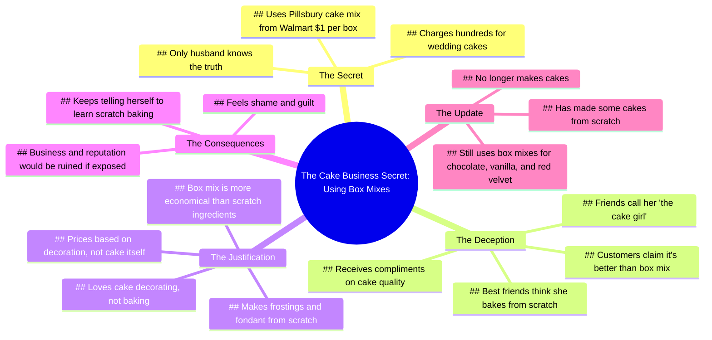

# Story Time: My Cake Business Secret Part 1

> 🌐 **Read this in:** [English](../../en/2026-06/tiktok-transcript-story-time-part-1-story-fyp-diy-foryoupage-viral-tiktok-7513.md) · **中文**

> **Creator:** [@jerryhlgiii](https://www.tiktok.com/@jerryhlgiii) · **Views:** 1.4M · **Posted:** 2026-06-02 · **Niche:** food
>
> **TL;DR:** The hook uses a high-stakes question to immediately engage curiosity, then delivers a jaw-dropping confession.

[Watch original video →](https://vm.tiktok.com/ZS92yvXCCNQSn-tbG0C/ This post is shared via TikTok Lite. Download TikTok Lite to enjoy more posts: https://www.tiktok.com/tiktoklite)

## Why This Went Viral

## 钩子（前3秒）
- "如果那个秘密泄露出去，会彻底毁掉你的人生，那是什么？"
- 类型：**大胆断言**（伪装成问题，使用高风险语言："毁掉你的人生"）
- 为何能让人停止滑动："毁掉你的人生"这句话会立即引发焦虑和好奇心。它承诺了一个后果严重的坦白，让观众感觉自己即将目睹某种禁忌或丑闻。

## 情感节奏
1. **好奇**（0:00–0:05）——开场问题提升了风险和神秘感。
2. **紧张**（0:05–0:20）——揭露："我用的是Pillsbury蛋糕预拌粉。"这个坦白制造了不协调感（专业烘焙师使用盒装预拌粉）。
3. **释然+幽默**（0:20–0:35）——"我烘焙技术很差"和"我整个人生都是谎言"用自嘲的方式缓和了气氛。
4. **共鸣**（0:35–0:50）——"人们称赞我的蛋糕……告诉我比盒装预拌粉蛋糕好吃多了。"这种讽刺创造了一个共同的"恍然大悟"时刻。
5. **高潮**（0:50–1:10）——"除了我丈夫，没人知道这件事。"秘密加深了，内疚感变得真实可感。
6. **脆弱**（1:10–1:30）——"有时候我觉得自己很丢脸。"情感回报——观众现在开始同情创作者。
7. **结局**（1:30–结束）——"实际上我已经不再做蛋糕了。"一个最后的转折，以有力的一击结束了故事弧线。

## 关键词密度
- **"蛋糕"**（14次）——算法覆盖：高流量、可搜索的关键词。
- **"盒装预拌粉"/"Pillsbury"**（6次）——情感吸引力：制造核心冲突（自制vs.捷径）。
- **"谎言"/"秘密"**（4次）——情感吸引力：推动忏悔、丑闻般的基调。
- **"差劲"/"讨厌"**（3次）——情感吸引力：原始、可共鸣的挫败感。
- **"声誉"/"生意"**（2次）——算法覆盖：触发商业/创业关键词。
- **"丈夫"**（1次）——情感吸引力：亲密、信任、保密。
- **"丢脸"**（1次）——情感吸引力：使创作者人性化的脆弱感。

## 为何能传播
1. **普遍的"肮脏秘密"模式**——每个人都有自己感到尴尬的捷径。"我整个人生都是谎言"这句话让观众想："我也做过类似的事。"这立即创造了可共鸣性和可分享性。
2. **高风险框架**——"毁掉你的人生"vs."Pillsbury蛋糕预拌粉"荒谬地不成比例。这种对比是喜剧的黄金。观众因为捕捉到这种讽刺而感到聪明，并想要分享它。
3. **自嘲式的脆弱**——"有时候我觉得自己很丢脸"和"我烘焙技术很差"不是防御性的。创作者坦然接受自己的缺点，这让观众支持他们而不是评判他们。这种情感安全感鼓励分享。
4. **具体、视觉化的细节**——"沃尔玛一盒1美元"，"加油、鸡蛋和水"，"我所有的糖霜和翻糖都是从头开始做的"。这些具体的细节让故事感觉真实且令人难忘。它们易于引用、易于制作成梗、易于复述。
5. **带有转折的结局**——"实际上我已经不再做蛋糕了。"这个结局出人意料（不是救赎弧线，而是安静的退出）。它让观众感到满足却又略带伤感，这使他们更有可能评论或分享来讨论这个结局。

## 你可以借鉴的
1. **以一个高风险的问题开头，但揭露的内容却平淡无奇。** 把你的坦白描述成会毁掉人生的，然后揭露一些滑稽的日常小事。期望与现实之间的差距就是钩子。
2. **使用"忏悔"结构，带有清晰的情感弧线。** 从神秘开始→揭露→自嘲→脆弱→结局。这能让观众一直看到最后，因为他们想要情感上的完结。
3. **植入一个具体、可重复的细节。** "沃尔玛1美元的Pillsbury蛋糕预拌粉"立即令人难忘。在你自己的视频中，选择一个具体、可共鸣的细节（品牌、价格、地点），让人们可以转述给朋友。这就是让故事传播的原因。

## Mind Map

## Full Transcript (Generated by [TokTranscript 转录工具](https://toktranscript.com/?utm_source=github&utm_medium=breakdown&utm_campaign=tool_attribution))

> 📝 Transcripts on this page are auto-generated and show the first 60%. Want to transcribe any TikTok in 30 seconds and get the full version? [Try TokTranscript free →](https://toktranscript.com/?utm_source=github&utm_medium=breakdown&utm_campaign=transcript_cta)

What's your secret that could literally ruin your life if it came out? I run a cake business. I charge people hundreds for wedding cakes. Every last one is made using Pillsbury cake mix I buy for $1 a box at Walmart. I suck at baking. Every time I've ever tried to make a cake from scratch, it sucked. But baking is like my whole deal. My friends all call me the cake girl. It's like my whole life is a lie. People compliment my cakes all the time. Telling me how delicious they are, telling me it's so much better than box mix cake. Telling me they could never bake a cake so delicious. Well guess what? For $1, they too can make a cake just as delicious. Just add oil, eggs, and water. In my defense, I love cake decorating. I make all of the frostings and fondant from scratch. I just hate baking ducking cakes. I base my prices mostly on the decoration of the cakes and not of the cake itself, if that makes sense. Still, no one knows about this except my husband. Even my best friends think I ducking slave over the oven mixing and baking these damn cakes. I've been doing this for y

*[Read the full transcript on TokTranscript →](https://toktranscript.com/plaza/tiktok-transcript-story-time-part-1-story-fyp-diy-foryoupage-viral-tiktok-7513?utm_source=github&utm_medium=breakdown&utm_campaign=transcript_full)*

## Browse More

- All [food](../../by-niche/zh-CN/food.md) breakdowns
- All [Rhetorical question + shocking reveal](../../by-pattern/zh-CN/hook-rhetorical-question-shocking-reveal.md) examples

## Video Info

| | |
|---|---|
| Creator | [@jerryhlgiii](https://www.tiktok.com/@jerryhlgiii) |
| Original video | [https://vm.tiktok.com/ZS92yvXCCNQSn-tbG0C/ This post is shared via TikTok Lite. Download TikTok Lite to enjoy more posts: https://www.tiktok.com/tiktoklite](https://vm.tiktok.com/ZS92yvXCCNQSn-tbG0C/ This post is shared via TikTok Lite. Download TikTok Lite to enjoy more posts: https://www.tiktok.com/tiktoklite) |
| Original title | Story time | Part 1 #story #fyp #diy #foryoupage #viral #tiktok  |
| Views | 1.4M (1400000) |
| Posted | 2026-06-02 |
| Duration | 0s |
| Niche | `food` |
| Hook pattern | `Rhetorical question + shocking reveal` |
| Original language | `en` (this page translated by AI) |
| Available languages | en, zh-CN |
| Generated | 2026-06-04 by [TokTranscript](https://toktranscript.com/) |

---

*This breakdown is for educational analysis under fair use. Original video © [@jerryhlgiii](https://www.tiktok.com/@jerryhlgiii). All transcripts are auto-generated and may contain errors.*

*Want to analyze your own TikToks like this? [TokTranscript →](https://toktranscript.com/viral-breakdown?utm_source=github&utm_medium=breakdown&utm_campaign=footer_cta)*