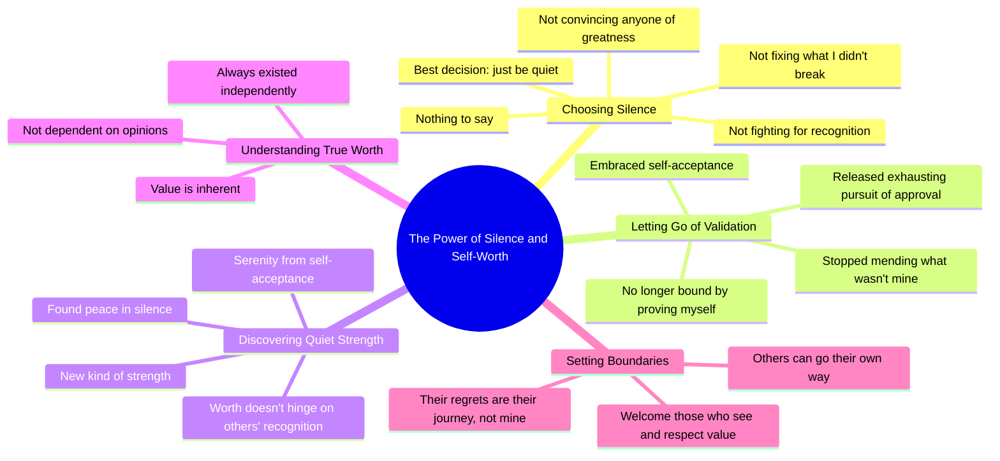

# The Best Thing I Ever Did Was Stay Quiet

> 🌐 **Read this in:** [English](../../en/2026-06/tiktok-transcript-the-best-i-have-ever-done-is-to-stay-quiet-denzelwashington-89b9.md) · **中文**

> **Creator:** [@motivation.wave8](https://www.tiktok.com/@motivation.wave8) · **Views:** 7.4M · **Posted:** 2026-06-02 · **Niche:** other
>
> **TL;DR:** Opens with a bold, counterintuitive statement that challenges the norm of self-promotion.

[Watch original video →](https://vm.tiktok.com/ZNR7YhfLK/)

## Why This Went Viral

## 钩子（前3秒）
- **逐字原文：** "我做过最棒的决定，就是保持沉默。"
- **钩子模式：** 大胆主张 + 反差（"最棒的决定"与"保持沉默"反直觉）
- **为何能让人停下滑动：** 它颠覆了一个普遍痛点——那种必须开口辩解、证明自己的压力。"最棒的决定"这句话立即制造认知失调（沉默通常被视为软弱），迫使观众暂停并思考*为什么*。

## 情绪节奏
- **节拍1 – 好奇 + 紧张：** "我做过最棒的决定……就是保持沉默。"观众期待一个成功故事，却得到了颠覆。
- **节拍2 – 压力释放：** "我不再试图说服任何人……不再试图修复我没打破的东西。"令人共鸣的解脱——观众长舒一口气。
- **节拍3 – 反抗 + 警告：** "你最好希望自己不会后悔。"紧张感再次飙升，但这次是*充满力量*的紧张。
- **节拍4 – 释然 / 平静：** "在沉默中，我找到了平静……一种安静的力量。"情感回报——观众感受到从挣扎到宁静的转变。
- **节拍5 – 最终边界：** "那些不懂的人，可以继续走他们的路。"自我价值的顶点——观众感到被允许设定同样的边界。

## 关键词密度
| 关键词/短语 | 次数（约） | 目的 |
|------------|-----------|------|
| "价值" / "值得" | 4 | 情感牵引：触及人类对认可的核心需求 |
| "安静" / "沉默" | 3 | 算法覆盖：低竞争、高参与度的概念 |
| "不" / "不再" | 5 | 对比驱动：从过去痛苦中创造情感释放 |
| "平静" / "安宁" | 2 | 情感共鸣：观众向往的理想状态 |
| "后悔" | 2 | 算法 + 情感：触发错失恐惧和内疚感 |
| "束缚" / "修复" / "证明" | 3 | 痛点重复：吸引那些困在讨好他人模式中的人 |

## 为何能传播
1. **普遍痛点，具体解法：** "我不再为让别人看到我的价值而战斗"直接点出了讨好他人的疲惫——这是数百万人无声的挣扎。观众会想：*那就是我。*
2. **给予许可的语言：** "那些不懂的人，可以继续走他们的路"充当了社交许可。观众分享它，是为了表明*我也受够了*或*我想解脱*。
3. **60秒内的情感弧线：** 视频从紧张 → 反抗 → 平静 → 设定边界，形成一个紧凑的循环。这极具分享性，因为它快速提供了完整的情感宣泄。
4. **算法友好的重复：** "价值"、"安静"、"后悔"是高参与度的关键词，能引发评论（人们辩护或赞同）和收藏（人们标记以提醒自己）。
5. **设定边界作为身份信号：** 结尾句（"那是他们的旅程，不是我的"）是一句可引用、可分享的"麦克风掉落"金句。观众将其复制粘贴到标题、故事和评论中——从而有机传播原始视频。

## 你可以借鉴什么
1. **以反直觉的真相开头：** 在你的下一个视频开头，用一个与普遍信念相矛盾的陈述（例如："我做过最棒的事，就是停止试图被人喜欢"）。认知失调会迫使观众暂停。
2. **用"不"字句释放紧张：** 列出你*不再*做的事情（例如："我不再解释自己。我不再为我的边界道歉。"）。这能立即创造共鸣和情感释放。
3. **以设定边界的"麦克风掉落"结尾：** 用一句让观众感到被允许做同样事情的话收尾（例如："你可以留下或离开——但我不会追你。"）。这是视频中最具分享性的部分——它成为观众采纳并传播的口头禅。

## Mind Map

## Full Transcript (Generated by [TikTok 转录工具](https://toktranscript.com/?utm_source=github&utm_medium=breakdown&utm_campaign=tool_attribution))

> 📝 Transcripts on this page are auto-generated and show the first 60%. Want to transcribe any TikTok in 30 seconds and get the full version? [Try TokTranscript free →](https://toktranscript.com/?utm_source=github&utm_medium=breakdown&utm_campaign=transcript_cta)

The best thing I ever decided to do was just be quiet. I have nothing to say. I'm not convincing anybody that I'm a great person and I'm not trying to fix anything I didn't break. I'm not fighting for anyone to see my worth. Whatever you do is on you. You better hope you don't regret it. In my silence, I found peace, no longer bound by the need to prove myself or to mend what wasn't mine to fix. I discovered a new kind of strength. It's a quiet strength born from knowing my value doesn't hinge on anyone else's recognition. I've let go o

*[Read the full transcript on TokTranscript →](https://toktranscript.com/plaza/tiktok-transcript-the-best-i-have-ever-done-is-to-stay-quiet-denzelwashington-89b9?utm_source=github&utm_medium=breakdown&utm_campaign=transcript_full)*

## Browse More

- All [other](../../by-niche/zh-CN/other.md) breakdowns
- All [Contrarian declaration](../../by-pattern/zh-CN/hook-contrarian-declaration.md) examples

## Video Info

| | |
|---|---|
| Creator | [@motivation.wave8](https://www.tiktok.com/@motivation.wave8) |
| Original video | [https://vm.tiktok.com/ZNR7YhfLK/](https://vm.tiktok.com/ZNR7YhfLK/) |
| Original title | The Best I Have Ever Done Is To Stay Quiet🤐.. #denzelwashington #usa ... |
| Views | 7.4M (7400000) |
| Posted | 2026-06-02 |
| Duration | 0s |
| Niche | `other` |
| Hook pattern | `Contrarian declaration` |
| Original language | `en` (this page translated by AI) |
| Available languages | en, zh-CN |
| Generated | 2026-06-03 by [TokTranscript](https://toktranscript.com/) |

---

*This breakdown is for educational analysis under fair use. Original video © [@motivation.wave8](https://www.tiktok.com/@motivation.wave8). All transcripts are auto-generated and may contain errors.*

*Want to analyze your own TikToks like this? [TokTranscript →](https://toktranscript.com/viral-breakdown?utm_source=github&utm_medium=breakdown&utm_campaign=footer_cta)*