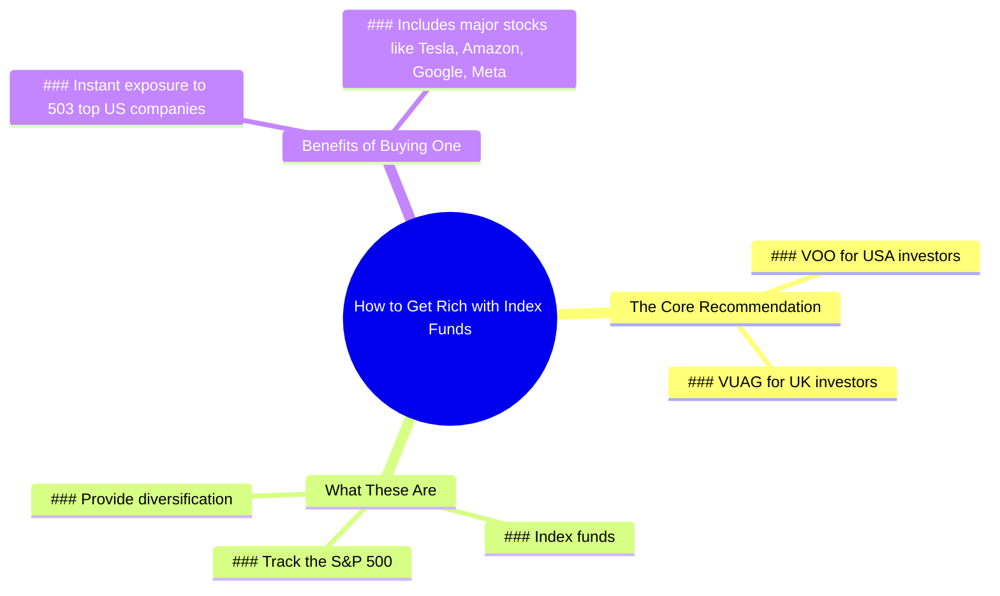

# 3 Best Stocks to Buy for Wealth Building

> 🌐 **Read this in:** [English](../../en/2026-06/tiktok-transcript-the-best-stocks-to-buy-to-get-rich-9632.md) · **中文**

> **Creator:** [@marktilbury](https://www.tiktok.com/@marktilbury) · **Views:** 1.4M · **Posted:** 2026-06-12 · **Niche:** finance
>
> **TL;DR:** The hook subverts the expectation of three stocks by offering 503, creating curiosity and surprise.

[Watch original video →](https://www.tiktok.com/@marktilbury/video/7473864079027850518)

## Why This Went Viral

## 钩子（前3秒）
- **逐字内容：** "如果你真是百万富翁，告诉我三只最能赚钱的股票。"
- **钩子模式：** 对比 + 大胆断言（观众期待"三只股票"的答案；创作者立即承诺给出*503*只）
- **为何能阻止滑动：** 前提设定了一个经典的"百万富翁揭秘"套路，然后瞬间颠覆预期。观众的大脑会停顿一下：*等等，503？不是三只。* 这种认知摩擦迫使观众暂停。

## 情绪节奏
1. **好奇（0–3秒）：** "如果你真是百万富翁……" —— 观众期待一个大师时刻。
2. **惊讶 + 紧张（3–5秒）：** "503"出现。观众心想：*这太离谱了，怎么可能？*
3. **困惑 → 兴趣（5–10秒）：** 抛出"VOO / VUAG" —— 不了解指数基金的观众会感到迷茫，从而产生知识缺口。
4. **清晰 + 释然（10–15秒）：** "这些是追踪标普500的指数基金……你就能拥有503家公司的股份。" —— 转折被解释，观众感觉自己变聪明了。
5. **共鸣（15–18秒）：** 点名特斯拉、亚马逊、谷歌、Meta —— 熟悉且令人向往的品牌，触发*"我也能拥有一部分"*的想法。
- **高潮：** "503"被揭示的那一刻 —— 这是情绪峰值，因为它将剧本从稀缺（3只股票）翻转成丰富（一次买入503家公司）。

## 关键词密度
| 词语/短语 | 数量（约） | 驱动因素 |
|---|---|---|
| 503 | 2 | **算法覆盖** —— 数字奇异性触发高点击率和观看时长 |
| 股票 / 指数基金 | 3 | **算法 + 情绪** —— 高意向金融关键词 + 安全信号 |
| 标普500 | 1 | **算法** —— 顶级金融搜索词 |
| 特斯拉、亚马逊、谷歌、Meta | 4 | **情绪吸引力** —— 令人向往的品牌创造欲望和信任 |
| 百万富翁 | 1 | **情绪** —— 身份触发，但仅用一次以避免点击诱饵惩罚 |
| VOO / VUAG | 2 | **算法** —— 特定代码驱动搜索和保存到观看列表的行为 |

## 为何能传播
1. **"503 vs. 3"的数学技巧创造了可分享的思维痒点。**
   - *字幕行：* "告诉我三只最好的股票……我要给你503只。"
   - 人们分享它，因为数字对比如此出乎意料，他们想看到别人的反应。

2. **它在18秒内揭开了复杂金融概念的神秘面纱。**
   - *字幕行：* "这些是追踪标普500的指数基金。"
   - 视频让观众感觉自己刚学到了一个"窍门" —— 低投入、高价值的知识，易于传递。

3. **品牌名称锚定建立即时信任和错失恐惧症。**
   - *字幕行：* "特斯拉、亚马逊、谷歌和Meta。"
   - 通过点名家喻户晓的巨头，创作者消除了建议显得可疑或投机的风险。观众会想：*"我认识这些公司——我会买。"*

4. **"嗯，实际上"的纠正感觉像内部信息。**
   - *字幕行：* "嗯，实际上，我要给你503只。"
   - 创作者将自己定位为"聪明的朋友"，纠正一个常见错误 —— 这种语气极具分享性，因为它让观众感觉自己掌握了一个秘密。

## 你可以借鉴什么
1. **使用"期望颠覆"钩子模式。**
   - 以一个常见问题开头（例如："存钱的最佳方法是什么？"），然后立即用一个更大、更令人惊讶的数字或概念反驳预期答案。

2. **在收尾处点名2–4个熟悉的品牌/实体。**
   - 即使建议很抽象，将其锚定到家喻户晓的名字（特斯拉、亚马逊等）能立即提升可信度和情感投入。

3. **保持整个视频在20秒以内，只有一个转折。**
   - 整个结构是：设定 → 转折 → 解释 → 收尾。没有废话。再长一点，"啊哈"时刻就会失去冲击力。每个片段瞄准一个清晰的"等等，什么？"时刻。

## Mind Map

## Full Transcript (Generated by [免费 TikTok 文稿生成器](https://toktranscript.com/?utm_source=github&utm_medium=breakdown&utm_campaign=tool_attribution))

> 📝 Transcripts on this page are auto-generated and show the first 60%. Want to transcribe any TikTok in 30 seconds and get the full version? [Try TokTranscript free →](https://toktranscript.com/?utm_source=github&utm_medium=breakdown&utm_campaign=transcript_cta)

If you're really a millionaire, tell me the three best stocks to buy to get rich. Well, actually, I'm gonna give you 503 you should buy. Um, isn't that gonna take a while? Well, just remember V O O. If you're in the USA, or V U A G. If you're in the UK. Wait, what ar

*[Read the full transcript on TokTranscript →](https://toktranscript.com/plaza/tiktok-transcript-the-best-stocks-to-buy-to-get-rich-9632?utm_source=github&utm_medium=breakdown&utm_campaign=transcript_full)*

## Browse More

- All [finance](../../by-niche/zh-CN/finance.md) breakdowns
- All [Unexpected twist](../../by-pattern/zh-CN/hook-unexpected-twist.md) examples

## Video Info

| | |
|---|---|
| Creator | [@marktilbury](https://www.tiktok.com/@marktilbury) |
| Original video | [https://www.tiktok.com/@marktilbury/video/7473864079027850518](https://www.tiktok.com/@marktilbury/video/7473864079027850518) |
| Original title | The best stocks to buy to get rich 🤑  |
| Views | 1.4M (1400000) |
| Posted | 2026-06-12 |
| Duration | 0s |
| Niche | `finance` |
| Hook pattern | `Unexpected twist` |
| Original language | `en` (this page translated by AI) |
| Available languages | en, zh-CN |
| Generated | 2026-06-14 by [TokTranscript](https://toktranscript.com/) |

---

*This breakdown is for educational analysis under fair use. Original video © [@marktilbury](https://www.tiktok.com/@marktilbury). All transcripts are auto-generated and may contain errors.*

*Want to analyze your own TikToks like this? [TikTok 转录工具 →](https://toktranscript.com/viral-breakdown?utm_source=github&utm_medium=breakdown&utm_campaign=footer_cta)*