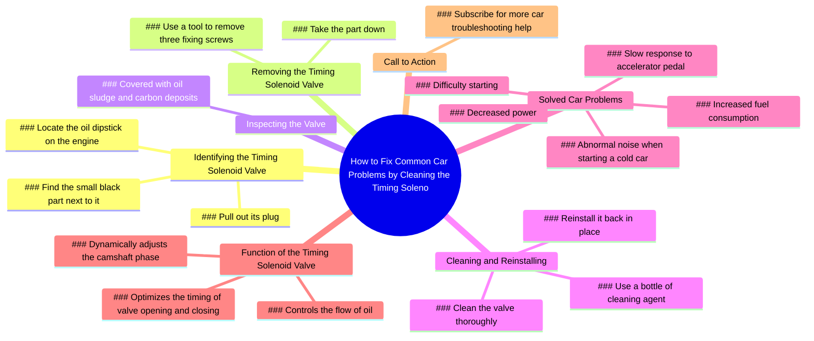

# How to Fix Car Hard Start, Power Loss, High Fuel Consumption

> 🌐 **Read this in:** [English](../../en/2026-06/tiktok-transcript-the-car-is-difficult-to-start-the-power-decreases-and-the-fu-6292.md) · **中文**

> **Creator:** [@zhxtfjxn9922hqym](https://www.tiktok.com/@zhxtfjxn9922hqym) · **Views:** 734.4K · **Posted:** 2026-06-20 · **Niche:** tech
>
> **TL;DR:** Starts with a simple challenge to engage viewers immediately.

[Watch original video →](https://www.tiktok.com/t/ZTBt617bo/)

## Why This Went Viral

## 钩子（前3秒）
- **逐字内容：** "你能在发动机上找到机油尺吗？然后你就能找到它旁边那个黑色的小零件。"
- **钩子模式：** 提问 + 指令序列（基于挑战）
- **为何能阻止滑动：** 它挑战观众的知识（"你能找到……吗？"），同时承诺一个可操作、低成本的解决方案。这个问题瞬间引发好奇心和自我测试，让驾驶者停下来看看自己是否知道答案。

## 情感节奏
- **节拍1 – 好奇心：** "你能找到机油尺吗？" → 观众自我测试。
- **节拍2 – 能力提升：** "拔掉它的插头……拆下三颗螺丝" → 简单的步骤建立信心。
- **节拍3 – 发现（紧张感）：** "上面全是油泥和积碳" → 恶心的揭示引发厌恶感 + "啊哈"时刻。
- **节拍4 – 解脱 + 奖励：** "清洗干净再装回去……所有问题都解决了" → 紧张感解除，观众感到自己有能力。
- **节拍5 – 验证：** "你给我点了个赞" → 隐含的社会认同。
- **节拍6 – 收尾：** "你学会了吗？订阅" → 直接行动号召。
- **高潮时刻：** 油泥/积碳的揭示——这是视觉上的回报，让修复显得紧迫且令人满足。

## 关键词密度
| 词语/短语 | 频率（约） | 作用 |
|-------------|-------------|------|
| "机油" | 4 | 算法：高搜索量、汽车保养术语 |
| "发动机" | 2 | 算法：广泛的汽车维修关键词 |
| "清洗" / "清洁" | 2 | 情感 + 搜索：暗示解决方案、满足感 |
| "问题" / "解决" | 3 | 情感：触发痛点缓解 |
| "你" | 6 | 情感：直接称呼、个性化 |
| "订阅" / "学会" | 2 | 算法：互动/留存信号 |
| "积碳" / "油泥" | 2 | 情感：恶心感 + 紧迫感（视觉触发） |

## 为何能传播
1. **普遍痛点钩子** – "你能找到机油尺吗？"是一个低门槛的入口，几乎任何驾驶者都能回答，瞬间将观众带入。  
   *文本证据：* "你能在发动机上找到机油尺吗？然后你就能找到它旁边那个黑色的小零件。"

2. **视觉"恶心"回报** – 油泥/积碳的揭示是一个直观、可分享的时刻。人们喜欢前后对比或脏变干净的转变。  
   *文本证据：* "上面全是油泥和积碳。"

3. **问题-解决方案压缩** – 列出5种以上常见汽车抱怨（冷启动噪音、启动困难、油耗增加、反应迟钝、动力下降），全部指向一个简单的修复，让视频感觉像作弊码。  
   *文本证据：* "异响……启动困难……油耗增加……反应迟钝……动力下降，全都解决了。"

4. **直接称呼 + 游戏化** – "你给我点了个赞"这句话创造了一个隐含的社会契约，鼓励观众实际点赞。  
   *文本证据：* "你给我点了个赞。"

5. **低行动门槛** – 修复只需一个工具和清洁剂，无需昂贵零件，让人觉得容易上手且适合DIY。  
   *文本证据：* "拿一瓶清洗剂，清洗干净再装回去。"

## 你可以借鉴的
1. **"你能找到X吗？"挑战** – 以简单的测试问题开始任何教程，让观众因知道答案而感觉聪明，然后在此基础上展开。这适用于任何DIY或操作指南领域（家居维修、科技、烹饪）。

2. **问题堆叠回报** – 列出3-5个观众有共鸣的具体痛点，然后揭示一个简单的修复方法。这能创造"一个怪招"式的病毒传播。可用于汽车、健康、生产力或金融内容。

3. **隐含社会认同语句** – 说"你给我点了个赞"而不是"请点赞"。它预设观众已经采取了行动，创造微妙的社交推动力，提升互动率。

## Mind Map

## Full Transcript (Generated by [免费 TikTok 文稿生成器](https://toktranscript.com/?utm_source=github&utm_medium=breakdown&utm_campaign=tool_attribution))

> 📝 Transcripts on this page are auto-generated and show the first 60%. Want to transcribe any TikTok in 30 seconds and get the full version? [Try TokTranscript free →](https://toktranscript.com/?utm_source=github&utm_medium=breakdown&utm_campaign=transcript_cta)

Can you find the oil dipstick on the engine? Then you can find the small black part next to it. Pull out its plug. Next, take a tool, remove the three fixing screws on it, and then take it down. It's not hard to find that it's covered with oil sludge and carbon deposits. Then take a bottle of cleaning agent, clean it and reinstall it back in place. Smart you are to realise that the problems of your car, such as abnormal noise when starting a cold car, difficulty starting, increased fuel consumption, slow response 

*[Read the full transcript on TokTranscript →](https://toktranscript.com/plaza/tiktok-transcript-the-car-is-difficult-to-start-the-power-decreases-and-the-fu-6292?utm_source=github&utm_medium=breakdown&utm_campaign=transcript_full)*

## Browse More

- All [tech](../../by-niche/zh-CN/tech.md) breakdowns
- All [Challenge question](../../by-pattern/zh-CN/hook-challenge-question.md) examples

## Video Info

| | |
|---|---|
| Creator | [@zhxtfjxn9922hqym](https://www.tiktok.com/@zhxtfjxn9922hqym) |
| Original video | [https://www.tiktok.com/t/ZTBt617bo/](https://www.tiktok.com/t/ZTBt617bo/) |
| Original title | The car is difficult to start, the power decreases, and the fuel cons... |
| Views | 734.4K (734400) |
| Posted | 2026-06-20 |
| Duration | 0s |
| Niche | `tech` |
| Hook pattern | `Challenge question` |
| Original language | `en` (this page translated by AI) |
| Available languages | en, zh-CN |
| Generated | 2026-06-21 by [TokTranscript](https://toktranscript.com/) |

---

*This breakdown is for educational analysis under fair use. Original video © [@zhxtfjxn9922hqym](https://www.tiktok.com/@zhxtfjxn9922hqym). All transcripts are auto-generated and may contain errors.*

*Want to analyze your own TikToks like this? [TokTranscript 转录工具 →](https://toktranscript.com/viral-breakdown?utm_source=github&utm_medium=breakdown&utm_campaign=footer_cta)*