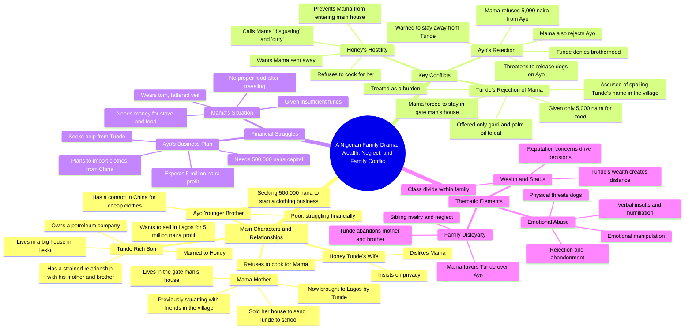

# The Chosen Son Part 1: Mother Sent to Gatekeeper House

> 🌐 **Read this in:** [English](../../en/2026-06/tiktok-transcript-the-chosen-son-part-1-storytelling-motherandson-storytime-st-376f.md) · **中文**

> **Creator:** [@morufatajani_stories](https://www.tiktok.com/@morufatajani_stories) · **Views:** 16.5M · **Posted:** 2026-06-08 · **Niche:** other
>
> **TL;DR:** Immediately establishes conflict and emotional stakes by revealing a son's cruel treatment of his mother.

[Watch original video →](https://www.tiktok.com/@morufatajani_stories/video/7643911442588060950?q=storytimes&t=1780928009926)

## Why This Went Viral

## 钩子（前3秒）
- **逐字开场白：**"妈妈，那个小房子就是你住的地方。这个，是看门人的房子。"
- **钩子模式：**场景+大胆断言（儿子直接让母亲住仆人房，制造即时冲突）
- **为何能阻止滑动：**儿子将亲生母亲贬去看门人房子的极度无耻与残忍，配上母亲震惊的"为什么？"——观众瞬间感到愤怒，并好奇背后的故事。

## 情感节奏
- **节拍1 – 震惊/愤怒（0:00–0:30）：**儿子打发母亲；观众对不敬行为感到厌恶。
- **节拍2 – 紧张（0:30–1:00）：**母亲透露她为供他上学卖掉了所有。儿子用煤气灯效应反驳（"别道德绑架我"）。妻子加剧残忍。
- **节拍3 – 同情/绝望（1:00–2:00）：**母亲独白（"为什么我亲生儿子这么恨我？"）。她饿了，只给了木薯粉和棕榈油。
- **节拍4 – 希望/解脱转折（2:00–3:00）：**介绍阿约（二儿子）带着一个商业想法——新主角登场。
- **节拍5 – 拒绝/绝望（3:00–4:00）：**阿约也被富哥哥拒绝，并被母亲残忍打发。
- **节拍6 – 高潮（4:00–4:30）：**母亲尽管阿约善良，却侮辱并拒绝他。虐待循环完成。
- **高潮时刻：**母亲的台词"离我远点，你这个混蛋"——终极背叛，她站在了虐待儿子的一边。

## 关键词密度
| 关键词/短语 | 频率（约） | 驱动因素 |
|----------------|---------------------|--------|
| "妈妈"/"母亲" | 15+ | 情感拉力——家庭愧疚感、文化尊重 |
| "没用"/"被诅咒" | 8 | 算法覆盖——强烈负面情绪触发互动 |
| "兄弟" | 10 | 情感拉力——手足竞争、背叛 |
| "钱"/"5000奈拉" | 7 | 算法覆盖——经济困境是普遍话题 |
| "看门人房子"/"小房子" | 4 | 情感拉力——阶级与不尊重的视觉象征 |
| "败坏我的名声"/"声誉" | 4 | 情感拉力——羞耻感、社会地位 |
| "我恨她"/"我恨那个女人" | 3 | 算法覆盖——极端情绪驱动评论 |
| "求求你"/"乞求" | 6 | 情感拉力——绝望、权力失衡 |

- **算法驱动因素：**"没用"、"钱"、"恨"——高情绪词汇触发观看时长和评论。
- **情感拉力驱动因素：**"妈妈"、"兄弟"、"看门人房子"——触及家庭责任、背叛和阶级羞耻感。

## 为何能传播
1. **普遍的家庭背叛叙事** – 文本触及原始神经：一个儿子拒绝为他牺牲的母亲。像"我卖掉房子和我所有的一切供你上学"这样的台词，让任何为家庭牺牲过的人瞬间产生共鸣。
2. **极端情感对比** – 视频在残忍（儿子："别让他用那恶心肮脏的眼泪碰你"）和绝望（母亲："我好饿"）之间摇摆。这种过山车式体验让观众持续观看和评论。
3. **双重平行拒绝** – 两个儿子（通德和阿约）都被母亲拒绝，但方式相反。母亲也虐待善良儿子的反转（"离我远点，你这个混蛋"）制造震惊并推动分享。
4. **阶级与羞耻触发** – "在村里败坏我的名声"和"看门人房子"触及对社会声誉的深层文化恐惧，尤其在集体主义社会中。观众分享以讨论或谴责。
5. **悬念商业副线** – 阿约的"50万奈拉"商业想法引入希望和潜在的救赎弧线，让观众想看下一部分——提升系列留存率。

## 你可以借鉴什么
1. **以令人震惊、道德错误的话语开场** – 不要慢慢引入。从让观众倒吸一口凉气的台词开始（例如"那个小房子就是你住的地方"）。这能瞬间阻止滑动。
2. **使用"三重拒绝"结构** – 一个角色（母亲）以相反方式拒绝两个不同的儿子（一个残忍，一个忽视）。这创造分层的情感张力和多个评论话题点。
3. **在视频中段插入"商业想法"钩子** – 即使在家庭剧中，也要加入具体的财务数字（"50万奈拉创业"）。这给观众一个理由继续看下一集，并创造"这怎么解决？"的悬念。

## Mind Map

## Full Transcript (Generated by [TikTok 转录工具](https://toktranscript.com/?utm_source=github&utm_medium=breakdown&utm_campaign=tool_attribution))

> 📝 Transcripts on this page are auto-generated and show the first 60%. Want to transcribe any TikTok in 30 seconds and get the full version? [Try TokTranscript free →](https://toktranscript.com/?utm_source=github&utm_medium=breakdown&utm_campaign=transcript_cta)

Mama, that small house is where you will be staying. This one here, this gate man house. Why? Why not inside the main house? No, Mama, the main house is for me and my wife. She likes her privacy. She said she wouldn't want you to dirty the new house. If you don't want, you can go and continue squatting at your friend's place in the village. How can you say that to me, knowing I sold my house and everything I have to send you to school? Even now that I am happy that you finally look my way since all these years that I've been suffering in the village, Mama, please don't blackmail me. Did I send you to sell your house? You gave birth to me. Am I not entitled to you sending me to school and spending money on me? Honey, please don't exhaust your energy on her. And don't let him touch you with that disgusting, dirty tears. Let's go inside. He's a child. Tandie, please calm down, my love. Don't let her stress you. I still don't understand why you brought her here from the village. Why couldn't she just stay there? Because people in the village were talking. They say a rich man like me has allowed his own mother to suffer, squatting with friends and sleeping in bad conditions. She was spoiling my name. That's why I brought her. But now I'm regretting it. I hate her. I don't even know how Much I hate that woman, then forget about her. Don't let her disturb your peace. What kind of life is this? Why does my own son hate me so much? He doesn't even care if I cry or die. And that wife of his, she's even worse. Instead of cautioning him, she's the one stopping me from entering the main house so I don't dirty it. Aah, I'm so hungry, Mama. What do you want again? I'm hungry. Please give me something to eat. Okay, wait. Here. Go and cook it yourself. Gary and palm oil. But I don't have anything to cook with. I've been travelling since morning. Please just give me proper food. Mama, don't disturb me. This is exactly why I didn't want you in the main house. The cook is not around. Mix the Gary with the palm oil and eat it. Tomorrow we will think of something. What is going on out there? It's your mother. She's disturbing my life. I gave her food and she's still complaining. Send her away. I don't want to hear her voice or see her face. Tell her to go back to where she came from, tonde. My son, please wait. I'm sorry to disturb you. Your wife says she cannot be cooking for me. Please give me a little money to buy a stove, a small cooker and some food stuff. Why you looking at me like that? Is my wife wrong? Is she your cook? Is she Your maid. I'm not insulting her. I'm only telling you why I need the money. I've been travelling since yesterday and I'm very hungry. I don't want to know, Mama. I don't want to know. Buy whatever you want to buy with that, Tunda. This is only 5,000 naira. Things are very expensive now. This money cannot buy anything meaningful. You, this ungrateful woman. Instead of thanking me, you're complaining. If you don't get out of my way, I will jam you with this car. I'm leaving. Who? Tunda. I have to get up. How much for the stove? Aah, it's so heavy. Ah, madam, this money is too small for this kind of heavy load. Why didn't you tell me your price before carrying it? You just carried my load without saying anything. Now you're complaining. Okay, Ma, no problem. You can go. Ayo, how are you, Sophie? I'm fine. How are you, Ayo? I have a business idea I want to discuss with you. It requires some money, but I think it can change our life. You know, I don't have money. Eva, just listen first. I have a contact in China supplying clothes very cheaply. We can order in bulk, ship them to Nigeria and sell here in Lagos. With 500,000 naira, we can start. After selling, we can make up to 5 million naira profit. 5 million naira? Are you serious? Yes, but we need the capital first. Where will I see 500,000 naira? I don't have that. Kind of money. Never say never. I've been telling you to go and meet your brother today. He's very rich now. He owns a petroleum company. Why is he not helping you? You already know my brother. He doesn't care about me or mama. Going to him will be a waste of time. Please try again. This time, go and beg him. The way you're living is not good enough. I'm

*[Read the full transcript on TokTranscript →](https://toktranscript.com/plaza/tiktok-transcript-the-chosen-son-part-1-storytelling-motherandson-storytime-st-376f?utm_source=github&utm_medium=breakdown&utm_campaign=transcript_full)*

## Browse More

- All [other](../../by-niche/zh-CN/other.md) breakdowns
- All [Shocking Revelation](../../by-pattern/zh-CN/hook-shocking-revelation.md) examples

## Video Info

| | |
|---|---|
| Creator | [@morufatajani_stories](https://www.tiktok.com/@morufatajani_stories) |
| Original video | [https://www.tiktok.com/@morufatajani_stories/video/7643911442588060950?q=storytimes&t=1780928009926](https://www.tiktok.com/@morufatajani_stories/video/7643911442588060950?q=storytimes&t=1780928009926) |
| Original title | THE CHOSEN SON PART 1 #storytelling #motherandson  #storytime #storie... |
| Views | 16.5M (16500000) |
| Posted | 2026-06-08 |
| Duration | 0s |
| Niche | `other` |
| Hook pattern | `Shocking Revelation` |
| Original language | `en` (this page translated by AI) |
| Available languages | en, zh-CN |
| Generated | 2026-06-09 by [TokTranscript](https://toktranscript.com/) |

---

*This breakdown is for educational analysis under fair use. Original video © [@morufatajani_stories](https://www.tiktok.com/@morufatajani_stories). All transcripts are auto-generated and may contain errors.*

*Want to analyze your own TikToks like this? [我们用的转录工具 →](https://toktranscript.com/viral-breakdown?utm_source=github&utm_medium=breakdown&utm_campaign=footer_cta)*