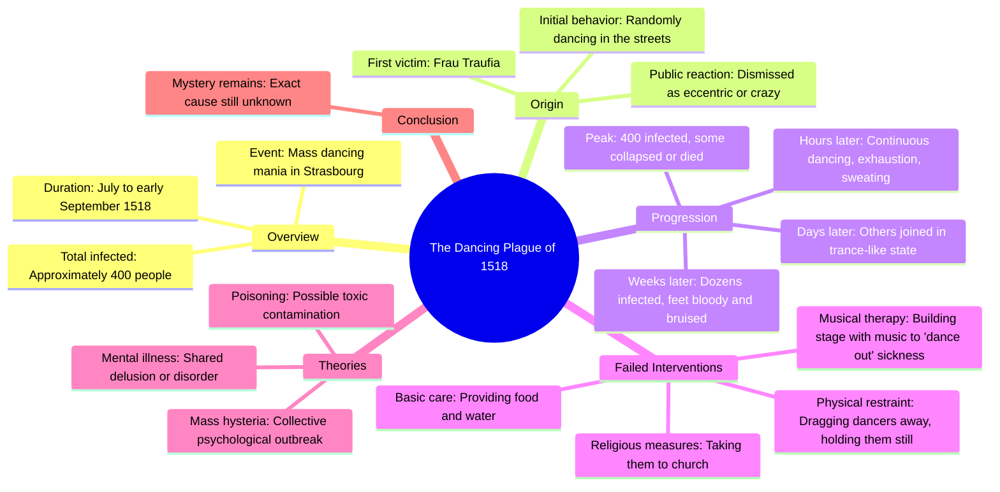

# The Dancing Plague of 1518 in Strasbourg

> 🌐 **Read this in:** [English](../../en/2026-06/tiktok-transcript-the-dancing-plague-fyp-history-dff4.md) · **中文**

> **Creator:** [@hoodieguyofficial1](https://www.tiktok.com/@hoodieguyofficial1) · **Views:** 3.2M · **Posted:** 2026-06-08 · **Niche:** entertainment
>
> **TL;DR:** Forces the viewer to visualize a bizarre, shocking scene, instantly grabbing attention.

[Watch original video →](https://www.tiktok.com/@hoodieguyofficial1/video/7645737088154897695?is_from_webapp=1&sender_device=pc&web_id=7575836601122965009)

## Why This Went Viral

## 钩子（前3秒）
- **逐字开场白：** "想象你走出家门，看到几十个邻居疯狂跳舞，直到双脚流血、昏倒在地。"
- **钩子模式：** 场景 + 本能反差（平凡的"走出家门" vs. 极端的"疯狂跳舞直到双脚流血"）
- **为何能让人停下滑动：** 画面如此离奇怪诞，瞬间引发认知失调——大脑无法调和"邻居跳舞"与"流血昏倒"，迫使观众留下来寻找解释。

## 情绪节奏
1. **好奇（0-3秒）：** "想象你走出家门……"——将荒诞前提个人化
2. **震惊+难以置信（3-10秒）：** "这真的发生在1518年"——将荒诞扎根于现实
3. **逐渐升级的不安（10-30秒）：** 几小时过去→几天过去→人们加入→双脚流血——紧张感如恐怖片般层层递进
4. **绝望（30-45秒）：** "人们试图把他们拖走……按住他们……带他们去教堂"——小镇的失败干预加剧了无力感
5. **高潮（45-55秒）：** "甚至有人据报道因精疲力竭而死"——最高风险时刻
6. **开放式谜团（55秒至结尾）：** "直到今天，我们仍然不知道"——留下令人难忘的未解之音
- **高潮时刻：** "甚至有人据报道因精疲力竭而死"——从"奇怪的舞蹈"到"有人死亡"的转折

## 关键词密度
| 词/短语 | 次数 | 功能 |
|---------|------|------|
| "跳舞" | 6 | 算法覆盖（高搜索量关键词） |
| "人们" | 8 | 情感共鸣（可关联性、群体行为） |
| "停止/停不下来" | 5 | 紧张感驱动（核心谜团：为什么停不下来？） |
| "双脚流血/血淋淋" | 3 | 本能冲击（令人难忘、易于传播的画面） |
| "小时/天/月" | 4 | 升级锚点（时间压缩制造恐怖感） |
| "加入/加入者" | 3 | 传染触发（让观众思考"我会加入吗？"） |
| "死亡/死去" | 2 | 风险提升（从怪异升级到悲剧） |

- **算法驱动：** "舞蹈瘟疫"、"1518"、"斯特拉斯堡"——好奇心搜索量高的历史关键词
- **情感驱动：** "流血"、"昏倒"、"恍惚"、"停不下来"——本能、基于恐惧的语言，触发分享

## 为何能传播
1. **基于现实的荒诞前提**——"这真的发生了"将荒谬画面转化为真正的谜团，让观众因了解冷门历史而感觉聪明，并被迫分享"你信吗？"的事实
2. **传染结构呼应内容本身**——视频像舞蹈瘟疫一样传播：一个人（特劳菲亚夫人）→少数加入者→大规模感染。观众通过分享下意识地重演这一现象
3. **未解结局制造认知痒点**——"直到今天，我们仍然不知道"留下开放谜团，触发蔡格尼克效应（人们分享不完整的内容，通过讨论寻求闭合）
4. **本能、易传播的画面**——"双脚流血"、"昏倒在地"、"浑身湿透"是留在记忆中的视觉短语，易于复述，使视频适合口口相传
5. **对失控的普遍恐惧**——舞蹈瘟疫触及原始焦虑：如果你的身体违背你的意志行动怎么办？这一情感钩子超越了小众历史兴趣

## 你可以借鉴什么
1. **以"想象你……"开头+怪诞对比**——通过将观众置于场景中，立即用惊人细节打破预期，将荒诞个人化。适用于任何历史谜团或怪异事实。
2. **用时间升级作为紧张阶梯**——"几小时过去……几天过去……几个月过去"创造自然、易于遵循的结构。适用于任何逐渐恶化或变得更奇怪的故事。
3. **以未解问题结尾**——"直到今天，我们仍然不知道"迫使观众评论他们的理论，提升互动信号。始终在视频最后5秒留下一个未解的线索。

## Mind Map

## Full Transcript (Generated by [TokTranscript](https://toktranscript.com/?utm_source=github&utm_medium=breakdown&utm_campaign=tool_attribution))

> 📝 Transcripts on this page are auto-generated and show the first 60%. Want to transcribe any TikTok in 30 seconds and get the full version? [Try TokTranscript free →](https://toktranscript.com/?utm_source=github&utm_medium=breakdown&utm_campaign=transcript_cta)

Imagine you walked outside and saw dozens of your neighbors violently dancing until their feet bled and collapsed unconscious. This actually happened in 1518 in a town called Strasbourg, all starting with this woman right here named Frau Traufia, one day randomly walking outside of her house and dancing in the streets. At first, people thought nothing of it. Maybe she just like dancing, or it was a little bit crazy. But this is where things got weird. As hours passed, she just didn't stop, looking completely exhausted, drenched in sweat, and somehow kept moving all throughout day and night. It only got worse because people strangely started joining her one by one, dancing in this weird trance like state. Still, it was only a few people, so no one too concerned yet. But as days passed, not only weren't they stopping, but people kept joining in, at one point reaching dozens of people. Now the town was worried, hoping they would just eventually stop on their own. But no

*[Read the full transcript on TokTranscript →](https://toktranscript.com/plaza/tiktok-transcript-the-dancing-plague-fyp-history-dff4?utm_source=github&utm_medium=breakdown&utm_campaign=transcript_full)*

## Browse More

- All [entertainment](../../by-niche/zh-CN/entertainment.md) breakdowns
- All [Imaginary scenario](../../by-pattern/zh-CN/hook-imaginary-scenario.md) examples

## Video Info

| | |
|---|---|
| Creator | [@hoodieguyofficial1](https://www.tiktok.com/@hoodieguyofficial1) |
| Original video | [https://www.tiktok.com/@hoodieguyofficial1/video/7645737088154897695?is_from_webapp=1&sender_device=pc&web_id=7575836601122965009](https://www.tiktok.com/@hoodieguyofficial1/video/7645737088154897695?is_from_webapp=1&sender_device=pc&web_id=7575836601122965009) |
| Original title | The dancing plague… #fyp #history  |
| Views | 3.2M (3200000) |
| Posted | 2026-06-08 |
| Duration | 0s |
| Niche | `entertainment` |
| Hook pattern | `Imaginary scenario` |
| Original language | `en` (this page translated by AI) |
| Available languages | en, zh-CN |
| Generated | 2026-06-09 by [TokTranscript](https://toktranscript.com/) |

---

*This breakdown is for educational analysis under fair use. Original video © [@hoodieguyofficial1](https://www.tiktok.com/@hoodieguyofficial1). All transcripts are auto-generated and may contain errors.*

*Want to analyze your own TikToks like this? [TokTranscript 转录工具 →](https://toktranscript.com/viral-breakdown?utm_source=github&utm_medium=breakdown&utm_campaign=footer_cta)*