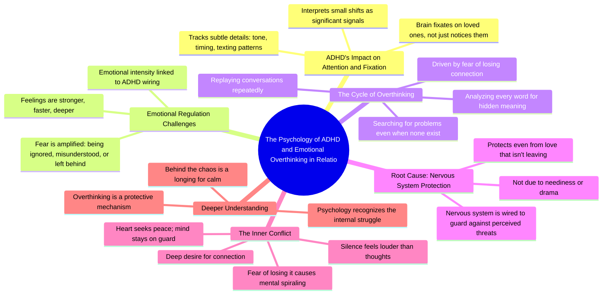

# The Hardest Part of ADHD: Hyperfixation on Loved Ones

> 🌐 **Read this in:** [English](../../en/2026-06/tiktok-transcript-the-truth-about-adhd-no-one-talks-about-adhdawareness-psycho-400d.md) · **中文**

> **Creator:** [@taraminds](https://www.tiktok.com/@taraminds) · **Views:** 4.1M · **Posted:** 2026-06-21 · **Niche:** other
>
> **TL;DR:** It immediately validates a hidden struggle by framing it as a psychological fact, making viewers feel seen.

[Watch original video →](https://vm.tiktok.com/ZNRT1DEf1/)

## Why This Went Viral

## 钩子（前3秒）
- **逐字开场白：**“根据心理学，患有多动症最困难的部分之一是”
- **钩子模式：**大胆断言 + 身份标签（“患有多动症”）
- **为何能阻止滑动：**“最困难的部分之一”这句话暗示了一个具体的、内部人才懂的痛点。患有多动症（或怀疑自己有此症状）的观众会立刻感到被理解。“心理学”一词增加了权威性，让这个说法听起来有研究支持，而非个人轶事。

## 情感节奏
- **节拍：**
  1. **好奇**——“最困难的部分之一”（是什么？）
  2. **认同**——“你的大脑会执着于……语气、时机、回复信息”（观众点头）
  3. **紧张**——“害怕被忽视、被误解、被抛下”（焦虑感上升）
  4. **认可**——“不是因为你缺乏安全感……不是因为你小题大做”（如释重负）
  5. **共鸣**——“你的神经系统天生就为了保护你，甚至防范那些并未离去的爱”（情感释放）
  6. **高潮**——“唯一比你思绪更响亮的，是你害怕打破的沉默”（富有诗意、易于传播的句子）
- **悬念**落在对恐惧的描述上；**转折**是将“缺陷”重新定义为“保护机制”。

## 关键词密度
- **重复最多的词语/短语：**
  - *ADHD / 多动症*——算法触发词（搜索量高）
  - *恐惧*——情感吸引力（驱动基于焦虑的互动）
  - *大脑 / 思维 / 神经系统*——权威性 + 共鸣感
  - *执着于 / 反复回想 / 分析*——反映观众行为的动作动词
  - *爱 / 连接 / 沉默*——情感共鸣（易于分享）
- **算法覆盖驱动因素：**“心理学”、“多动症”——小众、高意图、低竞争标签
- **情感吸引力驱动因素：**“恐惧”、“沉默”、“平静”——触发评论和收藏行为

## 为何能传播
1. **身份认同**——“不是因为你缺乏安全感……不是因为你小题大做”直接反驳了羞耻叙事。观众会截图并分享给伴侣或朋友，作为自己并非“有问题”的证据。
2. **诗意收尾**——“唯一比你思绪更响亮的，是你害怕打破的沉默”是一句值得引用的句子。它会被转发到Instagram故事、Twitter和TikTok的合拍视频中。
3. **高评论诱饵**——文案以“关注我，获取更多理解混乱的心理学内容”结尾。这会引发“我感觉被看见了”和“这就是我”之类的评论，从而提升互动信号。
4. **共鸣性微痛点**——“反复回想对话，分析每一个字”是多动症的普遍体验。这会触发“@某人”的行为，尤其是在多动症伴侣或朋友之间。
5. **权威与共情的融合**——“根据心理学”+“一颗只渴望平静的心”建立了信任。观众会觉得创作者既是专家又是盟友，从而更有可能关注。

## 你可以借鉴的点
1. **以特定痛点的身份钩子开头**——使用“患[疾病/身份]最困难的部分之一是”来立即筛选并吸引目标受众。避免使用“你有没有过……”这类泛泛的问题。
2. **将缺陷重新定义为保护机制**——不要说“你过度思考是因为你焦虑”，而要说“你的神经系统天生就为了保护你”。这能减少羞耻感，增加分享性。
3. **以诗意且可引用的句子结尾**——最后5秒应包含一句听起来像推文或标题的句子。这句话将成为你的病毒式传播燃料。先写好它，再围绕它构建视频内容。

## Mind Map

## Full Transcript (Generated by [TokTranscript](https://toktranscript.com/?utm_source=github&utm_medium=breakdown&utm_campaign=tool_attribution))

> 📝 Transcripts on this page are auto-generated and show the first 60%. Want to transcribe any TikTok in 30 seconds and get the full version? [Try TokTranscript free →](https://toktranscript.com/?utm_source=github&utm_medium=breakdown&utm_campaign=transcript_cta)

according to psychology one of the hardest parts of having a d H d is this when you really care about someone your brain doesn't just notice them it fixates their tone their timing the way they text back every tiny shift starts to feel like a signal because a d H d doesn't just affect attention it affects emotional regulation you feel things stronger faster deeper especially fear fear of being ignored misunderstood or left behind so you start replaying conversations analysing every word searching for what went wrong even when nothing did you want connection more than anything but the fear of losing it makes your brain spin in circles not because

*[Read the full transcript on TokTranscript →](https://toktranscript.com/plaza/tiktok-transcript-the-truth-about-adhd-no-one-talks-about-adhdawareness-psycho-400d?utm_source=github&utm_medium=breakdown&utm_campaign=transcript_full)*

## Browse More

- All [other](../../by-niche/zh-CN/other.md) breakdowns
- All [Relatable Revelation](../../by-pattern/zh-CN/hook-relatable-revelation.md) examples

## Video Info

| | |
|---|---|
| Creator | [@taraminds](https://www.tiktok.com/@taraminds) |
| Original video | [https://vm.tiktok.com/ZNRT1DEf1/](https://vm.tiktok.com/ZNRT1DEf1/) |
| Original title | The Truth About ADHD No One Talks About' #ADHDAwareness #PsychologyFa... |
| Views | 4.1M (4100000) |
| Posted | 2026-06-21 |
| Duration | 0s |
| Niche | `other` |
| Hook pattern | `Relatable Revelation` |
| Original language | `en` (this page translated by AI) |
| Available languages | en, zh-CN |
| Generated | 2026-06-22 by [TokTranscript](https://toktranscript.com/) |

---

*This breakdown is for educational analysis under fair use. Original video © [@taraminds](https://www.tiktok.com/@taraminds). All transcripts are auto-generated and may contain errors.*

*Want to analyze your own TikToks like this? [TokTranscript →](https://toktranscript.com/viral-breakdown?utm_source=github&utm_medium=breakdown&utm_campaign=footer_cta)*