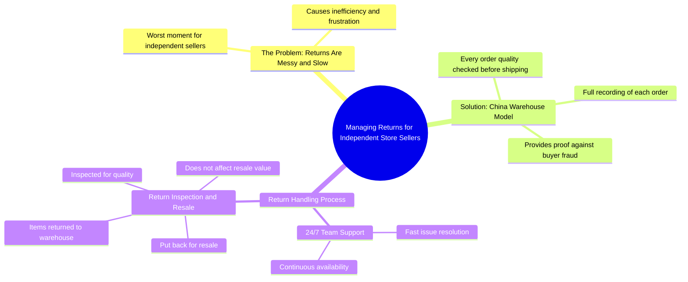

# The Worst Moment for Independent Store Sellers: Returns

> 🌐 **Read this in:** [English](../../en/2026-06/tiktok-transcript-the-worst-moment-for-independent-store-sellers-warehousing-d-4afa.md) · **中文**

> **Creator:** [@baimao.supply.cha](https://www.tiktok.com/@baimao.supply.cha) · **Views:** 569.4K · **Posted:** 2026-06-10 · **Niche:** other
>
> **TL;DR:** Opens with a relatable pain point to hook sellers frustrated with returns.

[Watch original video →](https://www.tiktok.com/@baimao.supply.cha/video/7618015090142416142?q=BM%20supplychain%20&t=1779417036152)

## Why This Went Viral

## 钩子（前3秒）
- **逐字开场白：** "独立店铺卖家最糟糕的时刻，退货。"
- **钩子模式：** 大胆断言 + 痛点识别（"最糟糕的时刻"与隐含解决方案之间的对比）
- **为何能阻止滑动：** 立即点出目标受众（电商卖家）普遍且情绪化的问题，创造即时共鸣和错失恐惧症（FOMO）。"最糟糕"一词暗示高利害关系。

## 情感节奏
1. **痛苦（0-3秒）：** "最糟糕的时刻" – 引发挫败感，共同受苦。
2. **好奇（3-6秒）：** "你熟悉中国的仓库吗？" – 打开知识缺口，暗示秘密解决方案。
3. **紧张（6-12秒）：** "首先……质量检查……如果买家试图做任何事，有证据" – 建立控制和正义的希望。
4. **解脱（12-18秒）：** "其次，24/7团队快速处理退货问题" – 提供摆脱痛苦的具体途径。
5. **高潮（18-22秒）：** "第三，退回物品……进行检查和转售。它不影响转售。" – 最终回报：无经济损失。情感释放。
- **转折：** 解决方案被框定为简单的三步系统，而非复杂策略。

## 关键词密度
- **退货**（3次） – 算法覆盖（电商高搜索量词）
- **中国的仓库**（2次） – 细分关键词，驱动定向流量
- **质量检查**（2次） – 情感吸引力（信任、可靠性）
- **证据**（1次） – 情感（安全、正义）
- **24/7**（1次） – 情感（安心、便利）
- **转售**（2次） – 算法 + 情感（利润保护）
- **快速**（1次） – 情感（即时解脱）
- **买家**（2次） – 算法（常见电商术语）
- **最糟糕的时刻**（1次） – 情感钩子，非算法

**驱动因素：** "退货"和"中国的仓库"是高CPC关键词。"证据"和"转售"创造情感共鸣。

## 为何能传播
1. **痛苦优先框架：** "独立店铺卖家最糟糕的时刻" – 立即围绕共同挫败感团结细分受众。观众标记同样受此问题困扰的同行。
2. **三步解决方案结构：** 编号列表（"首先……其次……第三"）易于记忆和分享。观众可以在评论或私信中复述。
3. **用证据建立信任：** "发货前全程记录"和"如果买家试图做任何事，有证据" – 解决核心恐惧（诈骗）并提供具体防御，使解决方案显得可信。
4. **零损失高潮：** "不影响转售" – 最后一句消除最后一个异议。这是可分享的亮点："你可以转售退回的物品。"
5. **全球与本地对比：** "中国的仓库" vs. "独立店铺卖家" – 营造"内幕知识"氛围。观众感觉学到能让自己占优势的秘密。

## 你可以借鉴的
1. **以痛点而非解决方案开场：** 说出受众经历的最糟糕时刻。不要以"如何解决退货"开始 – 而以"最糟糕的时刻是退货"开始。
2. **使用编号列表（首先/其次/第三）：** 它表明结构，提高留存率，并使内容易于复述。观众能轻松记住"这三件事"。
3. **以零损失保证结尾：** 最后一行应消除最大异议。对任何问题，问："什么能让这个解决方案完美？"（例如，"且不影响转售"）。那就是你的结束句。

## Mind Map

## Full Transcript (Generated by [TokTranscript 转录工具](https://toktranscript.com/?utm_source=github&utm_medium=breakdown&utm_campaign=tool_attribution))

> 📝 Transcripts on this page are auto-generated and show the first 60%. Want to transcribe any TikTok in 30 seconds and get the full version? [Try TokTranscript free →](https://toktranscript.com/?utm_source=github&utm_medium=breakdown&utm_campaign=transcript_cta)

The worst moment for independent store sellers, returns. Cause for the returns are messy and slow. Are you familiar with warehouses in China? First, every order is quality checked and fully recorded before shipping. So you've got proof if a buyer tri

*[Read the full transcript on TokTranscript →](https://toktranscript.com/plaza/tiktok-transcript-the-worst-moment-for-independent-store-sellers-warehousing-d-4afa?utm_source=github&utm_medium=breakdown&utm_campaign=transcript_full)*

## Browse More

- All [other](../../by-niche/zh-CN/other.md) breakdowns
- All [Problem-Agitate](../../by-pattern/zh-CN/hook-problem-agitate.md) examples

## Video Info

| | |
|---|---|
| Creator | [@baimao.supply.cha](https://www.tiktok.com/@baimao.supply.cha) |
| Original video | [https://www.tiktok.com/@baimao.supply.cha/video/7618015090142416142?q=BM%20supplychain%20&t=1779417036152](https://www.tiktok.com/@baimao.supply.cha/video/7618015090142416142?q=BM%20supplychain%20&t=1779417036152) |
| Original title | The worst moment for independent store sellers? #warehousing #dropshi... |
| Views | 569.4K (569400) |
| Posted | 2026-06-10 |
| Duration | 0s |
| Niche | `other` |
| Hook pattern | `Problem-Agitate` |
| Original language | `en` (this page translated by AI) |
| Available languages | en, zh-CN |
| Generated | 2026-06-11 by [TokTranscript](https://toktranscript.com/) |

---

*This breakdown is for educational analysis under fair use. Original video © [@baimao.supply.cha](https://www.tiktok.com/@baimao.supply.cha). All transcripts are auto-generated and may contain errors.*

*Want to analyze your own TikToks like this? [TokTranscript 转录工具 →](https://toktranscript.com/viral-breakdown?utm_source=github&utm_medium=breakdown&utm_campaign=footer_cta)*