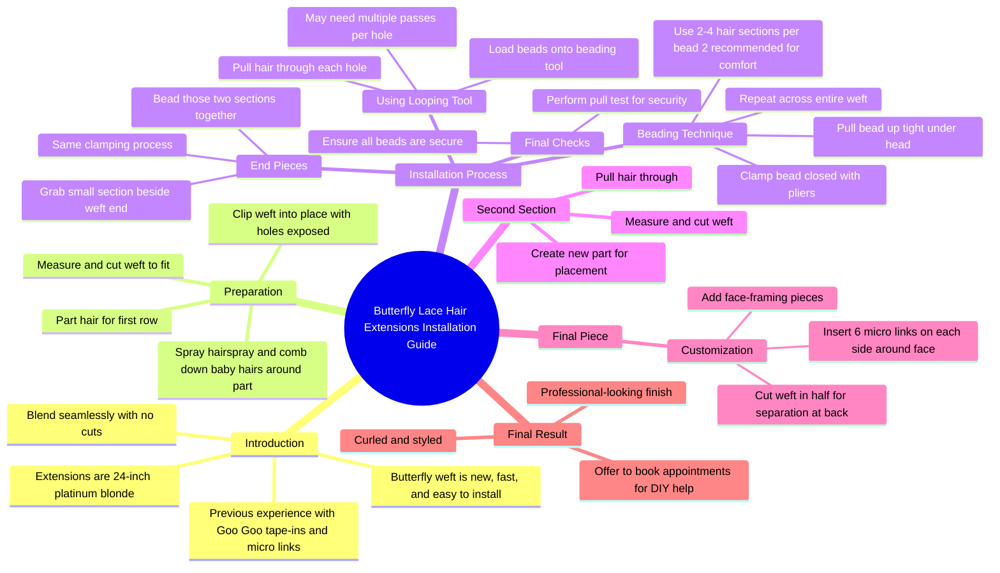

# Platinum Blonde 24 Inch Extensions Blend Seamlessly

> 🌐 **Read this in:** [English](../../en/2026-06/tiktok-transcript-they-eat-everytime-googoohair-official-bbb8.md) · **中文**

> **Creator:** [@rrileynelson](https://www.tiktok.com/@rrileynelson) · **Views:** 652.4K · **Posted:** 2026-06-21 · **Niche:** beauty
>
> **TL;DR:** Immediately challenges a common assumption to grab attention.

[Watch original video →](https://www.tiktok.com/@rrileynelson/video/7611739967366139149)

## Why This Went Viral

## 钩子（前3秒）
- **原话开头：** "它们拉直后看起来不是最好的。卷起来后你看起来更好看。"
- **钩子模式：** **对比**（"拉直后不是最好" vs. "卷起来后更好"）+ **大胆断言**（直接告诉观众他们做错了什么）
- **为何能阻止滑动：** 它挑战了一个常见假设（直发=最佳造型），并立即制造紧张感——观众会想"等等，我一直做错了？"这种个人化、近乎纠正的语气激发了好奇心和自我怀疑，迫使他们继续观看以验证这个说法是否属实。

## 情绪节奏
1. **好奇心 + 轻微不安**（0–3秒）："它们拉直后看起来不是最好的"——观众感觉被点名。
2. **抗拒 → 好奇**（3–10秒）："总之，这是我的24英寸铂金色接发"——从批评转向解决方案，通过产品展示建立信任。
3. **期待**（10–30秒）："每个人都在热议安装有多快"——社会认同激发兴奋感。
4. **紧张感**（30秒–2分钟）：逐步技术指导（"拉出一大束头发……夹紧它"）——观众感受到复杂性，对是否成功产生悬念。
5. **解脱 + 奖励**（2分钟–结尾）："全部卷好并完成"——最终展示带来回报，情绪释放。
6. **高潮时刻：** 最后的"全部卷好并完成"镜头——转变验证了开头的说法，满足了积累的紧张感。

## 关键词密度
- **"接发"**（x6）——算法：高搜索量的美容术语。
- **"珠子" / "珠"**（x8）——情感：暗示精确、技术、可信度。
- **"夹紧" / "夹"**（x5）——情感：创造触觉、视觉动作；强化"我知道我在做什么"。
- **"分区"**（x4）——算法：常见的接发安装关键词；情感：展示过程。
- **"卷"**（x3）——情感：直接呼应钩子；激发对最终造型的渴望。
- **"无缝"**（x1）——算法：接发质量的高意图关键词。
- **"简单"**（x2）——情感：对抗紧张感；承诺可实现的结果。
- **"安装"**（x3）——算法：搜索友好；将视频定位为教程。

## 为何能传播
1. **问题–解决弧线加上转折：** 开头（"拉直后不是最好的"）将一个常见错误重新定义为可解决的问题。那些觉得自己的接发看起来假的观众会分享它，因为"终于有人说实话了。"
   *文字记录证据：* "它们拉直后看起来不是最好的。卷起来后你看起来更好看。"
2. **高感知价值 + 低入门门槛：** 视频承诺"快速"和"简单"的安装（但展示了详细步骤）——观众觉得自己可以复制，因此保存/分享作为操作指南。
   *文字记录证据：* "每个人都在热议安装有多快，应用有多简单。"
3. **转变的视觉证明：** 最后的"卷好并完成"镜头是一个视频中的前后对比——社交媒体上最易分享的格式。
   *文字记录证据：* "然后这是最终结果。全部卷好并完成。"
4. **权威 + 亲和力融合：** 创作者使用技术术语（"串珠工具"、"微链接"），但也承认个人偏好（"我个人觉得一次只放两片更舒服"）——建立信任并人性化过程。
   *文字记录证据：* "我个人觉得一次只在一个珠子里放两片更舒服。"
5. **带有排他性的行动号召：** "私信我预约"创建了一个低摩擦、高意图的转化路径——尝试失败的人会参与互动，推动评论和重复观看。
   *文字记录证据：* "如果你觉得自己在家做不了，私信我预约。"

## 你可以借鉴什么
1. **以纠正性断言开头，而非赞美。** 不要说"这太棒了"，而是说"你做错了——这是解决办法。"它能立即激发好奇心，并将你定位为权威。
2. **展示混乱的中间过程，而不仅仅是完美的结局。** 详细、略显繁琐的安装步骤（串珠、夹紧、拉拽）建立信任，使最终展示更令人满意。观众分享是因为他们"学到了东西"。
3. **以直接对抗开头紧张感的视觉回报结尾。** 最后的"卷好并完成"镜头在视觉上证明了钩子。始终以展示你在前3秒承诺的解决方案的结果来结束。

## Mind Map

## Full Transcript (Generated by [TokTranscript](https://toktranscript.com/?utm_source=github&utm_medium=breakdown&utm_campaign=tool_attribution))

> 📝 Transcripts on this page are auto-generated and show the first 60%. Want to transcribe any TikTok in 30 seconds and get the full version? [Try TokTranscript free →](https://toktranscript.com/?utm_source=github&utm_medium=breakdown&utm_campaign=transcript_cta)

They're not gonna look the best straighten. You look better when they're curled. Anyways, these are my twenty four inch platinum blonde extensions. Blending seamlessly with no cuts. Alright guys, y'all have seen me try goo goo's tape ins. And y'all have seen me try their micro link extensions. But now we have a butterfly left. Everybody's ranting and raving about how fast the install is and how easy it is to apply. So we're gonna test that out today. I'm only walking out to the first row, so I better be listening. First we're gonna part our hair. We want that first row to go. And then we're gonna measure it out and cut it where it fits best. Now you're gonna grab some hairspray and a comb and comb down all those little baby hairs around the part so we don't snag them. After that, you're gonna grab the clips that google supplied with the hair and clip it into place with those holes exposed. Then we're gonna use our little looping tool. We're gonna pull a good amount of hair out of each one of those little holes. You might have to go through them a few times to get some hair. Load some beads onto the beating tool. Now i've seen some hair stylist grab three, even four little sections for this to make the installation quicker. I personally felt more comfortable only putting two pieces in a bead at a time. Once the beads on There, you're gonna pull it up as tight under the head as you can and clamp it together. You're gonna follow that process throughout the whole weft, except for on the end pieces. There's two sections in every bead. Scooping that bead all the way up to the scalp, and then leveling those pliers out to my head and clamping. Once you get to the ends of th

*[Read the full transcript on TokTranscript →](https://toktranscript.com/plaza/tiktok-transcript-they-eat-everytime-googoohair-official-bbb8?utm_source=github&utm_medium=breakdown&utm_campaign=transcript_full)*

## Browse More

- All [beauty](../../by-niche/zh-CN/beauty.md) breakdowns
- All [Contrasting advice](../../by-pattern/zh-CN/hook-contrasting-advice.md) examples

## Video Info

| | |
|---|---|
| Creator | [@rrileynelson](https://www.tiktok.com/@rrileynelson) |
| Original video | [https://www.tiktok.com/@rrileynelson/video/7611739967366139149](https://www.tiktok.com/@rrileynelson/video/7611739967366139149) |
| Original title | they eat EVERYTIME @googoohair_official  |
| Views | 652.4K (652400) |
| Posted | 2026-06-21 |
| Duration | 0s |
| Niche | `beauty` |
| Hook pattern | `Contrasting advice` |
| Original language | `en` (this page translated by AI) |
| Available languages | en, zh-CN |
| Generated | 2026-06-22 by [TokTranscript](https://toktranscript.com/) |

---

*This breakdown is for educational analysis under fair use. Original video © [@rrileynelson](https://www.tiktok.com/@rrileynelson). All transcripts are auto-generated and may contain errors.*

*Want to analyze your own TikToks like this? [免费 TikTok 文稿生成器 →](https://toktranscript.com/viral-breakdown?utm_source=github&utm_medium=breakdown&utm_campaign=footer_cta)*