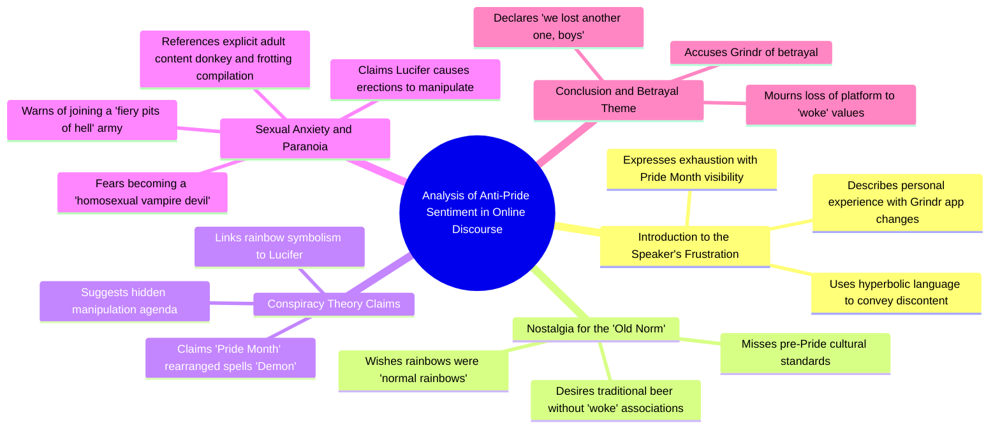

# Tired of Pride Month Rainbows on Grinder

> 🌐 **Read this in:** [English](../../en/2026-06/tiktok-transcript-this-month-brings-me-great-distress-as-you-could-clearly-tel-cb8f.md) · **中文**

> **Creator:** [@jamynon](https://www.tiktok.com/@jamynon) · **Views:** 1.6M · **Posted:** 2026-06-04 · **Niche:** other
>
> **TL;DR:** Opens with a relatable frustration that immediately flips into absurdity, hooking viewers with unexpected humor.

[Watch original video →](https://www.tiktok.com/t/ZP8s2uBVo/)

## Why This Went Viral

## 钩子（前3秒）
- **逐字开场白：** "才过了一天，我就已经对这些无处不在的彩虹感到恶心和厌倦了。"
- **钩子模式：** 大胆声明 + 情绪化抱怨（厌恶/挫败感）+ 即时文化引用（骄傲月）
- **为何能让人停下滚动：** 这句话利用了一个两极分化的文化热点（骄傲月），并带有夸张、发自内心的厌恶。它暗示着"我即将说些有争议/嘲讽的话"——观众会停下来看看说话者是认真的还是在讽刺。

## 情绪节奏
1. **愤怒/烦躁**（0:00–0:15）——"对彩虹感到恶心和厌倦"、"觉醒"、"我怀念过去的常态"——营造一种虚假的抱怨语气。
2. **困惑/好奇**（0:15–0:25）——"拼出骄傲月……它显示的是恶魔"——引入荒谬的伪逻辑，让观众怀疑这是否是真的。
3. **升级的荒谬**（0:25–0:35）——"路西法正试图从阴影中给我打飞机"——转折点：这是讽刺，不是真心话。紧张感瞬间转化为喜剧。
4. **高潮**（0:30–0:35）——"同性恋吸血鬼恶魔……地狱的烈火深渊"——最极端、最荒谬的说法。笑声/认同感达到顶峰。
5. **释放**（0:35–结尾）——"兄弟们，我们又失去一个了"——对网络迷因文化的经典回扣。以会心一笑的幽默收尾。

## 关键词密度
| 词语/短语 | 次数 | 驱动因素 |
|-------------|-------|--------|
| "彩虹" | 3 | 算法（热门话题）+ 情绪（骄傲月的象征） |
| "恶心和厌倦" | 3 | 情绪牵引（夸张的挫败感） |
| "觉醒" | 2 | 算法（文化战争关键词）+ 情绪（身份认同触发） |
| "正常" | 2 | 情绪（怀旧，"过去的常态"） |
| "恶魔" / "路西法" | 3 | 情绪（冲击力，荒谬性） |
| "Grinder" | 2 | 算法（应用名称，可搜索） |
| "阴茎" / "勃起" | 2 | 情绪（禁忌，惊讶，病毒式冲击） |

- **算法覆盖范围：** "彩虹"、"觉醒"、"骄傲月"、"Grinder"——这些都是搜索量高、热门或有争议的词汇，平台会优先推送。
- **情绪牵引力：** "恶心和厌倦"、"恶魔"、"路西法"、"阴茎"——这些词能引发本能反应（厌恶、大笑、震惊），从而驱动分享。

## 为何能传播
1. **双重虚张声势的讽刺**——视频前15秒听起来像是一段真正的恐同咆哮，然后转向荒诞喜剧。被愚弄的观众会把它当作"看看这个疯子"来分享，而看懂讽刺的观众则会把它当作"这太搞笑了"来分享。两种反应都能推动互动。
2. **冲击力升级**——"路西法正试图从阴影中给我打飞机"这句话如此具体和荒谬，以至于令人难忘。观众会在评论和私信中逐字引用，形成有机的迷因。
3. **文化战争诱饵**——开场使用了"觉醒"、"骄傲月"、"正常啤酒"——所有这些触发词都能吸引支持者和反对者。双方出于不同原因（嘲讽 vs. 认同）分享它，使传播效果加倍。
4. **适合迷因的收尾语**——"兄弟们，我们又失去一个了"是一个广为人知的网络用语，表明"这是个玩笑"。它奖励了那些坚持看完荒谬内容的观众，并使视频感觉像一个内部笑话。
5. **禁忌 + 幽默**——将恐同言论与露骨的性内容（"阴茎"、"勃起"）结合起来虽然冒险，但令人难忘。违反禁忌会触发自动分享（"你必须看看这个"）。

## 你可以借鉴什么
1. **"假装严肃"的开场**——以一个可信的、情绪化的抱怨开始，听起来像真的持续5-10秒。然后通过一个荒谬的转折揭示这是讽刺。这会创造一个"抓到你了"的时刻，观众会想分享它来看看别人的反应。
2. **升级的荒谬阶梯**——从一个前提（彩虹 = 恶魔）开始，将其推向最荒谬的结论（路西法给你打飞机把你变成吸血鬼）。走得越远，收尾语就越容易被分享。
3. **迷因编码的收尾**——以一个广为人知的网络用语（"兄弟们，我们又失去一个了"）结束，表明"这是个玩笑"，并为观众提供一个现成的分享标题。它把你的视频变成了一个别人可以混搭的模板。

## Mind Map

## Full Transcript (Generated by [TokTranscript 转录工具](https://toktranscript.com/?utm_source=github&utm_medium=breakdown&utm_campaign=tool_attribution))

> 📝 Transcripts on this page are auto-generated and show the first 60%. Want to transcribe any TikTok in 30 seconds and get the full version? [Try TokTranscript free →](https://toktranscript.com/?utm_source=github&utm_medium=breakdown&utm_campaign=transcript_cta)

It's only been one day and I'm already sick and tired of these rainbows everywhere. I wake up to check my favourite app, grinder, just to find out they went woke. No, this can't be! I am sick and tired of all this Pride Month stuff. I just want rainbows to be normal rainbows. I don't like the new norm. I miss the old norm. I wanna drink normal beer. I'm tired of everything being woke and I just wish there was an adult cartoon animated sitcom that echoed these exact same beliefs. And if you spell out Pride Month and put the two words together and split it down the middle, what does it say? Demon. And that's not a coincidence. Who else is a demon? Lucifer. And what happens to

*[Read the full transcript on TokTranscript →](https://toktranscript.com/plaza/tiktok-transcript-this-month-brings-me-great-distress-as-you-could-clearly-tel-cb8f?utm_source=github&utm_medium=breakdown&utm_campaign=transcript_full)*

## Browse More

- All [other](../../by-niche/zh-CN/other.md) breakdowns
- All [Contrarian Complaint](../../by-pattern/zh-CN/hook-contrarian-complaint.md) examples

## Video Info

| | |
|---|---|
| Creator | [@jamynon](https://www.tiktok.com/@jamynon) |
| Original video | [https://www.tiktok.com/t/ZP8s2uBVo/](https://www.tiktok.com/t/ZP8s2uBVo/) |
| Original title | This month brings me great distress as you could clearly tell from my... |
| Views | 1.6M (1600000) |
| Posted | 2026-06-04 |
| Duration | 0s |
| Niche | `other` |
| Hook pattern | `Contrarian Complaint` |
| Original language | `en` (this page translated by AI) |
| Available languages | en, zh-CN |
| Generated | 2026-06-05 by [TokTranscript](https://toktranscript.com/) |

---

*This breakdown is for educational analysis under fair use. Original video © [@jamynon](https://www.tiktok.com/@jamynon). All transcripts are auto-generated and may contain errors.*

*Want to analyze your own TikToks like this? [免费 TikTok 文稿生成器 →](https://toktranscript.com/viral-breakdown?utm_source=github&utm_medium=breakdown&utm_campaign=footer_cta)*