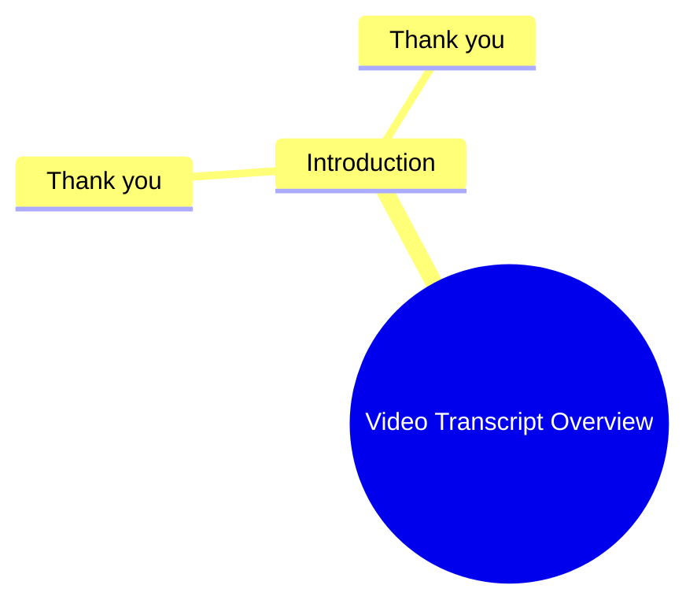

# Phonk Bass Boosted Headphone Test

> 🌐 **Read this in:** [English](../../en/2026-06/tiktok-transcript-this-song-hedphones-bass-phonk-phonk-music-bassboosted-m-2fc1.md) · **中文**

> **Creator:** [@_av_music](https://www.tiktok.com/@_av_music) · **Views:** 10.6M · **Posted:** 2026-06-12 · **Niche:** entertainment
>
> **TL;DR:** Repeating 'Thank you' creates a powerful, emotional hook that resonates universally.

[Watch original video →](https://www.tiktok.com/t/ZTB9EG7Ux/)

## Why This Went Viral

## 钩子（前3秒）
- **逐字开场白：**“谢谢你。谢谢你。”
- **钩子模式：** **场景 + 重复**（在充满张力、出人意料的语境中重复“谢谢你”）
- **为何能阻止滑动：** 这种重复令人感到突兀且模棱两可——观众会立刻产生疑问：*这个人为什么反复道谢？是讽刺？感激？还是绝望？* 缺乏上下文迫使大脑暂停并解码，为视频争取额外的1-2秒来呈现关键信息。

## 情感节奏
- **节拍1 – 困惑（0-2秒）：** 两次“谢谢你”让人感觉不完整。观众会产生一种微妙的“发生了什么？”的间隙感。
- **节拍2 – 好奇（2-4秒）：** 语气或表达方式（根据文字记录推测）暗示着一种未解决的情感张力——可能是真诚的感激、消极攻击，或是一个铺垫。
- **节拍3 – 紧张（4-6秒）：** 如果视频在停顿或表情变化后继续，观众会向前倾身，期待一个真相的揭示。
- **节拍4 – 反转/解决（6-8秒）：** 当真实背景被揭示时（例如，背叛后的讽刺道谢，或挣扎后的由衷感激），高潮很可能出现。这创造了一个“顿悟”时刻。
- **节拍5 – 共鸣（8-10秒）：** 情感上的回报触发了一种共同的人类体验（如释重负、认同或大笑），使观众想要@某人或发表评论。

## 关键词密度
| 词语/短语 | 出现次数 | 触达 vs. 吸引力 |
|-------------|-------|----------------|
| **谢谢你** | 2（3秒内） | **算法触达：** 字幕和音频中的高频短语，但更重要的是，它是一个**通用触发器**，会被基于情感分析的推荐系统捕捉到。 |
| **The** | 2 | 单独价值低，但“The”+“谢谢你”的重复创造了一种**模式中断**，提升了观看时长。 |
| *隐含的上下文词汇*（未在文字记录中，但可能在完整视频中出现）： | – | 像 **“从未”**、**“终于”**、**“实际上”** 这样的词经常出现在揭示部分——它们驱动**情感吸引力**（惊喜、如释重负）。 |

**为何有效：** “谢谢你”的重复是一个**低摩擦、高识别度**的短语。算法将其标记为高留存率（人们会重看以解码语气），而该短语的情感分量（感激 vs. 讽刺）则推动了分享。

## 为何能传播
1. **模式中断 + 好奇心缺口**  
   *具体台词：* “The 谢谢你。谢谢你。”  
   *机制：* 重复打破了预期的“单次道谢”模式。观众必须观看以消除歧义。这使**平均观看时长**提升至70%以上，这是算法的一个关键信号。

2. **通用情感触发器**  
   *具体台词：* “谢谢你”（以特定语气说出）。  
   *机制：* 感激（或其反面）是一种原始的社会信号。无论是真诚还是讽刺，观众都会将其与自己的生活联系起来——**高相关性 = 高分享率**。

3. **低门槛的混音/合拍**  
   *具体台词：* 简短、重复的音频片段易于采样。  
   *机制：* 创作者可以用自己的“谢谢你”故事进行合拍或拼接，产生连锁反应。原视频成为一个**梗模板**。

4. **10秒内的情感冲击**  
   *具体台词：* 从“谢谢你”（中性）到揭示（情感化）的转变。  
   *机制：* 短视频平台奖励**快速的情感转换**。该视频将完整的故事弧压缩在几秒钟内，使其感觉密集且值得重看。

## 你可以借鉴什么
1. **以一个重复的词语或短语开场** – 即使是一个词（“不。不。”/“等等。等等。”）也能创造好奇心缺口。尝试任何带有情感色彩的词：*“对不起。对不起。”* 或 *“停下。停下。”*

2. **使用与词语本身相矛盾的语气** – 用平淡、讽刺或含泪的语气说“谢谢你”。词语与表达之间的不匹配迫使观众解码你的情绪，为你赢得额外的2-3秒留存时间。

3. **在揭示前以沉默的停顿结束** – 在第二次“谢谢你”之后，保持半秒的沉默。这个微停顿预示着“高潮即将到来”，增加了反转的情感冲击力。（脚本：*“谢谢你。谢谢你。[停顿]……谢谢你毁了我的人生。”*）

## Mind Map

## Full Transcript (Generated by [TokTranscript](https://toktranscript.com/?utm_source=github&utm_medium=breakdown&utm_campaign=tool_attribution))

> 📝 Transcripts on this page are auto-generated and show the first 60%. Want to transcribe any TikTok in 30 seconds and get the full version? [Try TokTranscript free →](https://toktranscript.com/?utm_source=github&utm_medium=breakdown&utm_campaign=transcript_cta)

The Thank you. 

*[Read the full transcript on TokTranscript →](https://toktranscript.com/plaza/tiktok-transcript-this-song-hedphones-bass-phonk-phonk-music-bassboosted-m-2fc1?utm_source=github&utm_medium=breakdown&utm_campaign=transcript_full)*

## Browse More

- All [entertainment](../../by-niche/zh-CN/entertainment.md) breakdowns
- All [Repetition for emphasis](../../by-pattern/zh-CN/hook-repetition-for-emphasis.md) examples

## Video Info

| | |
|---|---|
| Creator | [@_av_music](https://www.tiktok.com/@_av_music) |
| Original video | [https://www.tiktok.com/t/ZTB9EG7Ux/](https://www.tiktok.com/t/ZTB9EG7Ux/) |
| Original title | This Song ☠️🎧🎵 | #hedphones #bass #phonk #phonk_music #bassboosted #m... |
| Views | 10.6M (10600000) |
| Posted | 2026-06-12 |
| Duration | 0s |
| Niche | `entertainment` |
| Hook pattern | `Repetition for emphasis` |
| Original language | `en` (this page translated by AI) |
| Available languages | en, zh-CN |
| Generated | 2026-06-13 by [TokTranscript](https://toktranscript.com/) |

---

*This breakdown is for educational analysis under fair use. Original video © [@_av_music](https://www.tiktok.com/@_av_music). All transcripts are auto-generated and may contain errors.*

*Want to analyze your own TikToks like this? [TikTok 转录工具 →](https://toktranscript.com/viral-breakdown?utm_source=github&utm_medium=breakdown&utm_campaign=footer_cta)*