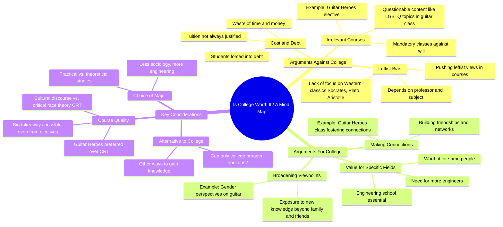

# College: Is It Entirely Useless for Growth?

> 🌐 **Read this in:** [English](../../en/2026-06/tiktok-transcript-tiktok-video-7594956396702092557-7611.md) · **中文**

> **Creator:** [@charliekirkdebateclips](https://www.tiktok.com/@charliekirkdebateclips) · **Views:** 733.7K · **Posted:** 2026-06-17 · **Niche:** other
>
> **TL;DR:** Directly challenges a common anti-college stance with a provocative question.

[Watch original video →](https://vt.tiktok.com/ZSQGevBWX/)

## Why This Went Viral

## 钩子（前3秒）
- **逐字开场白：** “我听过你们反对大学的意见，我想问你们是否认为它完全没用。”
- **钩子模式：** **提问 + 对比** —— 通过询问他们是否认为大学*完全*没用，直接挑战观众假定的立场（反对大学）。
- **为何能阻止滑动：** 它将演讲者塑造成一个*倾听*反对意见的人，然后转向一个高风险的二元选择（有用 vs. 无用）。这立即制造了认知紧张——对大学有强烈看法的观众*必须*知道他们即将被肯定还是被攻击。

## 情感节奏
- **节拍1——好奇 + 紧张：** “我听过你们反对大学的意见……它完全没用吗？”——观众感到被挑战，身体前倾。
- **节拍2——理性框架：** “只有大学能做到吗？它值得这个代价吗？”——提出两个微妙的子问题，延迟了答案的揭晓。
- **节拍3——共鸣 + 认同：** “你们中有多少人上过自己认为浪费时间的课？”——观众点头同意；紧张感略有下降。
- **节拍4——惊喜 + 幽默：** “《吉他英雄》？那比批判性种族理论好，所以我完全支持。”——意外转向文化战争领域，引发互动高峰。
- **节拍5——升级（高潮）：** “你认为他们在灌输左翼观点吗……？”——直接点出意识形态紧张。观众的情感投入急剧上升。
- **节拍6——解决 + 收尾：** “不幸的是，大学里并不总是这样。谢谢。上帝保佑你们。”——以温和、近乎田园诗般的语调结束，释放紧张感。

**高潮时刻：** 问题“你认为他们在向我们灌输左翼观点吗？”——这是视频核心意识形态冲突浮出水面的地方。

## 关键词密度
| 关键词/短语 | 频率（约） | 功能 |
|---|---|---|
| “大学” | 5 | **算法覆盖** —— 高流量、常青搜索词 |
| “没用 / 浪费时间” | 3 | **情感吸引** —— 触发防御或认同 |
| “拓宽视野” | 3 | **情感吸引** —— 将辩论框定为成长 vs. 停滞 |
| “人脉” | 2 | **情感吸引** —— 社会证明/社交价值 |
| “左翼观点 / CRT” | 2 | **算法 + 情感** —— 文化战争诱饵驱动分享 |
| “值得这个代价” | 2 | **算法** —— 成本效益辩论具有高搜索性 |
| “《吉他英雄》” | 2 | **情感吸引** —— 具体、 relatable、幽默的例子 |
| “上帝保佑你们” | 1 | **情感吸引** —— 表明身份（保守/宗教） |

**驱动因素：** “大学” + “左翼观点” + “CRT” 是算法燃料；“没用”、“拓宽视野”、“人脉” 驱动情感共鸣。

## 为何能传播
1. **文化战争桥梁：** 演讲者将一个热点问题（CRT、教育中的左翼偏见）置于一个*看似中立*的问题（“大学没用吗？”）之中。这让双方都感到被倾听——反对大学的人得到认同，支持大学的人得到微妙的辩护。**具体台词：** “那比批判性种族理论好，所以我完全支持”——一句话内立即制造两极分化又团结一致。

2. **可共鸣的微观冲突：** 观众提到的“《吉他英雄》”例子如此具体和荒谬，以至于成为一个适合做成梗的瞬间。观众会截图或引用它。**具体台词：** “它在文化话语之下……这如何给吉他赋予性别？”

3. **苏格拉底式反转：** 演讲者不攻击——他请求许可（“我能问观众一个问题吗？”）。这化解了敌意，让观众*想要*参与。**具体台词：** “你们中有多少人上过自己认为浪费时间或金钱的课？”

4. **身份信号：** 结尾的“上帝保佑你们”是一个低调的文化旗帜。它告诉保守派观众“这个人和我是一边的”，而不过于政治化。**具体台词：** “谢谢。上帝保佑你们。”

5. **未解决的紧张感：** 视频没有给出明确答案就结束了——“不幸的是，大学里并不总是这样。”这留下了辩论空间，鼓励评论和分享。**具体台词：** “你们在传统上深入学习苏格拉底、柏拉图和亚里士多德吗？不幸的是，大学里并不总是这样。”

## 你可以借鉴什么
1. **“许可”转折：** 在提出一个敏感问题之前，先获得口头同意（“我能问观众一个问题吗？”）。这让观众感到被尊重，并降低他们的防备。*应用：* 在你的下一个视频中，在抛出有争议的观点之前，先说“我想问你一件事——可以吗？”

2. **具体荒谬陷阱：** 使用一个超具体、略显荒谬的例子（比如“《吉他英雄》”）来阐述一个更大的观点。它成为一个可分享的金句。*应用：* 不要说“有些课没用”，而是说出一个真实的、奇怪的课程名称。

3. **带有身份标签的温和结尾：** 用一个微妙表明你所属群体的短语结束（“上帝保佑你们”、“继续努力”、“保持好奇”）。这创造了情感上的收尾，让观众觉得他们与一个像他们一样的人建立了联系。*应用：* 选择一个标志性的结束语并持续使用。

## Mind Map

## Full Transcript (Generated by [TikTok 转录工具](https://toktranscript.com/?utm_source=github&utm_medium=breakdown&utm_campaign=tool_attribution))

> 📝 Transcripts on this page are auto-generated and show the first 60%. Want to transcribe any TikTok in 30 seconds and get the full version? [Try TokTranscript free →](https://toktranscript.com/?utm_source=github&utm_medium=breakdown&utm_campaign=transcript_cta)

I've heard your opinions against college, and I want to ask if you think it's entirely useless. If we are making connections and broadening our current viewpoints and opinions with new knowledge that we were not taught by family and friends, it can. The question is, can only college do that? Hmm. That's the operative question. And secondly, is it worth the cost? For some people, of course college is worth it. I mean, do you guys have an engineering school here? Yes, yes. I mean, we. We. We obviously need more engineers. Um, I think we need, uh, a lot less people studying sociology, let me put it that way. Understandable. So, can I ask a question to the audience? I'm curious, how many of you guys have to take classes that you consider a waste of time or money? I do. Yeah. I will say that. So, yeah, that's. That's against your will. Uh huh. People have to go into debt then. Yeah. So you gotta kind of wrestle with that, right? Yeah. But I feel like there are still big takeaways that you can take from this class. Like, for example, one of my elective classes is Guitar Heroes, which that has nothing to do with neuroscience, but I'm enjoying every single second of it, and I've already made friends and can in larger connections that are. Along with my major. Guitar heroes? Yes. It's. Wow. Yeah. It's about history of guitarists, and, you know, they even I remember earlier, was that a. Was that an elective or was that mandatory? Is that core? It's under cultural discour

*[Read the full transcript on TokTranscript →](https://toktranscript.com/plaza/tiktok-transcript-tiktok-video-7594956396702092557-7611?utm_source=github&utm_medium=breakdown&utm_campaign=transcript_full)*

## Browse More

- All [other](../../by-niche/zh-CN/other.md) breakdowns
- All [Challenge + Question](../../by-pattern/zh-CN/hook-challenge-question.md) examples

## Video Info

| | |
|---|---|
| Creator | [@charliekirkdebateclips](https://www.tiktok.com/@charliekirkdebateclips) |
| Original video | [https://vt.tiktok.com/ZSQGevBWX/](https://vt.tiktok.com/ZSQGevBWX/) |
| Original title | TikTok video #7594956396702092557 |
| Views | 733.7K (733700) |
| Posted | 2026-06-17 |
| Duration | 0s |
| Niche | `other` |
| Hook pattern | `Challenge + Question` |
| Original language | `en` (this page translated by AI) |
| Available languages | en, zh-CN |
| Generated | 2026-06-18 by [TokTranscript](https://toktranscript.com/) |

---

*This breakdown is for educational analysis under fair use. Original video © [@charliekirkdebateclips](https://www.tiktok.com/@charliekirkdebateclips). All transcripts are auto-generated and may contain errors.*

*Want to analyze your own TikToks like this? [免费 TikTok 文稿生成器 →](https://toktranscript.com/viral-breakdown?utm_source=github&utm_medium=breakdown&utm_campaign=footer_cta)*