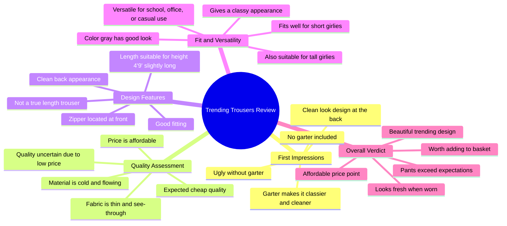

# Trending Loose Pants For Women

> 🌐 **Read this in:** [English](../../en/2026-06/tiktok-transcript-trending-loose-pants-for-women-0616.md) · **中文**

> **Creator:** [@itsme.gela](https://www.tiktok.com/@itsme.gela) · **Views:** 5.8M · **Posted:** 2026-06-20 · **Niche:** other
>
> **TL;DR:** Opens with a provocative question that challenges viewers' expectations and hooks curiosity.

[Watch original video →](https://www.tiktok.com/@itsme.gela/video/7651590801629220104)

## Why This Went Viral

## 钩子（前3秒）
- **逐字开场白：** "真的更可爱吗？流行裤子 来加强 他以前的那个档次 现在又有新款裤子流行了 你以为我会被打败吗"
- **钩子模式：** **提问 + 对比**（一个直接挑战观众假设的问题，随后在"流行"与"档次"之间形成对比）
- **为何能让人停下滑动：** "真的更可爱吗？"这个问题立刻制造了怀疑和好奇。它挑战了观众对流行单品的固有看法，让人想看到最终结论。

## 情绪节奏
- **节拍1 – 好奇 / 怀疑：** "真的更可爱吗？"—— 观众被引导去质疑潮流。
- **节拍2 – 紧张 / 期待：** "你以为我会被打败吗？当它真的很便宜时，你会被审视" —— 在价格与品质之间制造冲突。
- **节拍3 – 惊喜 / 反转：** "我首先注意到的是，它没有吊袜带。而这就是我告诉你它丑的地方" —— 揭示了一个具体且意想不到的缺陷。
- **节拍4 – 释然 / 认可：** "在后面，我也会展示他设计的干净造型……以它的价格来说，这条还不错" —— 批评语气缓和，给出平衡的评价。
- **节拍5 – 高潮 / 共鸣：** "这条裤子真的失败了 为了看起来有档次……我明白你们为什么喜欢它 她真的很漂亮" —— 给出最终结论：尽管最初持怀疑态度，但产品确实不错，带来令人满意的收尾。
- **节拍6 – 行动号召（隐含）：** "我就把它放进我的黄色购物篮里" —— 暗示购买意图，邀请观众也这样做。

## 关键词密度
- **"裤子"**（重复8次以上）—— **算法覆盖：** 高频、产品专属关键词，触发时尚/潮流标签。
- **"便宜" / "实惠"**（重复4次以上）—— **情感吸引：** 激发追求性价比和价格敏感的观众。
- **"档次" / "更有档次"**（重复5次以上）—— **情感吸引：** 吸引人的语言，迎合身份和风格追求。
- **"吊袜带" / "加吊袜带"**（重复3次以上）—— **算法覆盖：** 独特、小众的术语，使视频区别于普通评测。
- **"合身" / "合身度"**（重复4次以上）—— **情感吸引：** 解决常见痛点（对矮个子/高个子女孩的合身度）。
- **"流行"**（重复3次以上）—— **算法覆盖：** 高流量、时效性强的关键词，提升可发现性。
- **"干净"**（重复3次以上）—— **情感吸引：** 正面的美学描述词，强化产品吸引力。
- **"身高" / "矮个子女孩" / "高个子女孩"**（重复2次以上）—— **情感吸引：** 包容性语言，建立社区感和共鸣。

## 为何能传播
1. **从怀疑到认可的叙事弧：** 视频以疑问开头（"真的更可爱吗？"），以正面结论结尾（"她真的很漂亮"）。这个弧线映射了观众自身的内心辩论，使结局令人满意且易于分享。
2. **具体且出乎意料的批评：** "它没有吊袜带……这就是我告诉你它丑的地方" —— 这是一个高度具体、小众的抱怨，显得真实且专业。这让视频感觉像真实的评测，而非付费广告。
3. **包容性的合身度语言：** "它仍然适合我的身高 四九只是有点长……对于矮个子女孩 还有高个子女孩" —— 直接解决了常见痛点（对娇小和高挑女性的合身度），扩大了受众范围，并鼓励在这些群体中分享。
4. **价格与品质的张力：** "当它真的很便宜时，你会被审视……以它的价格来说，这条还不错" —— 创作者承认了对廉价商品的怀疑，然后验证了购买行为。这建立了信任，减少了购买后的后悔感，使观众更愿意购买和分享。
5. **可操作的购买号召：** "我就把它放进我的黄色购物篮里" —— 一个简单、视觉化且令人难忘的短语，表明创作者的购买意图。这充当了社会证明的触发器，促使观众也这样做。

## 你可以借鉴的点
1. **以怀疑性问题开头：** 用一个直接、具有挑战性的问题（"真的更可爱吗？"）开场，制造怀疑，迫使观众观看以寻找答案。这适用于任何产品评测或潮流评论。
2. **用具体、小众的缺陷建立可信度：** 不要泛泛地赞美，而是指出一个独特、意想不到的缺陷（例如"没有吊袜带"）。这让你看起来像专家，并建立信任，即使你最终推荐了该产品。
3. **针对受众的特定痛点：** 明确提及一个常见问题（例如对矮个子/高个子女孩的合身度），并展示产品如何解决它。这使视频在该小众群体中高度相关且易于分享。

## Mind Map

## Full Transcript (Generated by [免费 TikTok 文稿生成器](https://toktranscript.com/?utm_source=github&utm_medium=breakdown&utm_campaign=tool_attribution))

> 📝 Transcripts on this page are auto-generated and show the first 60%. Want to transcribe any TikTok in 30 seconds and get the full version? [Try TokTranscript free →](https://toktranscript.com/?utm_source=github&utm_medium=breakdown&utm_campaign=transcript_cta)

Is it really cuter? Trending Trousers to strength The class he used to be There is another new one Trousers trending now Did you think I would be beaten When it's really cheap you get checked out You know it's cheaper because on a horse One take one so that's what I chinecked out And since he's cheap I'm just not sure His quality This is what gray looks like The first thing I noticed here is that he doesn't have a garter And that's what I'm telling you is ugly Really when garterizing because there is no garter The classier the cleaner In the back, I will also open the one He designed the clean look For his price, the one is fine Cloth because he can't see Through because he expected cheap I really am going to be He is thin to see So through the His zipper is here ahead and te The beauty of Fitting And this is his back, isn't it just clean And in the conversation at length He still fits my height Four nine is just a bit long He 

*[Read the full transcript on TokTranscript →](https://toktranscript.com/plaza/tiktok-transcript-trending-loose-pants-for-women-0616?utm_source=github&utm_medium=breakdown&utm_campaign=transcript_full)*

## Browse More

- All [other](../../by-niche/zh-CN/other.md) breakdowns
- All [Rhetorical Question](../../by-pattern/zh-CN/hook-rhetorical-question.md) examples

## Video Info

| | |
|---|---|
| Creator | [@itsme.gela](https://www.tiktok.com/@itsme.gela) |
| Original video | [https://www.tiktok.com/@itsme.gela/video/7651590801629220104](https://www.tiktok.com/@itsme.gela/video/7651590801629220104) |
| Original title | Trending Loose Pants For Women |
| Views | 5.8M (5800000) |
| Posted | 2026-06-20 |
| Duration | 0s |
| Niche | `other` |
| Hook pattern | `Rhetorical Question` |
| Original language | `en` (this page translated by AI) |
| Available languages | en, zh-CN |
| Generated | 2026-06-21 by [TokTranscript](https://toktranscript.com/) |

---

*This breakdown is for educational analysis under fair use. Original video © [@itsme.gela](https://www.tiktok.com/@itsme.gela). All transcripts are auto-generated and may contain errors.*

*Want to analyze your own TikToks like this? [拆解你自己的 TikTok →](https://toktranscript.com/viral-breakdown?utm_source=github&utm_medium=breakdown&utm_campaign=footer_cta)*