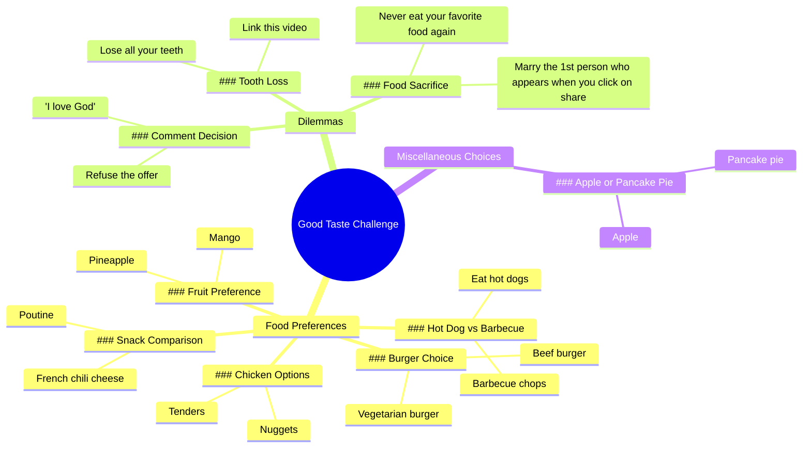

# Beef Burger or Veggie Burger? Food Preference Quiz

> 🌐 **Read this in:** [English](../../en/2026-06/tiktok-transcript-tu-pr-f-res-quoi-tupreferes-quiz-tiktokfrance-nourriture-fr-3d22.md) · **中文**

> **Creator:** [@la_dalle_food](https://www.tiktok.com/@la_dalle_food) · **Views:** 481.9K · **Posted:** 2026-06-03 · **Niche:** food
>
> **TL;DR:** Challenges the viewer's taste, creating immediate personal investment.

[Watch original video →](https://vm.tiktok.com/ZS92mBLBVx8w1-PSMJw/ تتم مشاركة هذا المنشور عبر TikTok Lite. نزّل TikTok Lite للاستمتاع بمزيد من المنشورات: https://www.tiktok.com/tiktoklite)

## Why This Went Viral

## 钩子（前3秒）
- **逐字开场白：** "我们来看看你的品味如何"
- **钩子模式：** 大胆断言/挑战
- **为何能阻止滑动：** 它发出直接的个人挑战（"我们来看看*你*的品味如何"），瞬间制造错失恐惧症和自尊心参与感。观众觉得必须证明自己，从而被迫停留并互动。

## 情绪节奏
1. **好奇 + 挑战**（0–3秒）："我们来看看你的品味如何"——自尊心受到考验。
2. **戏谑张力**（3–15秒）：快速二选一（汉堡 vs. 素菜、菠萝 vs. 芒果）——观众在脑中做选择，建立微小赌注。
3. **升级的荒诞感**（15–25秒）："掉光所有牙齿或分享此视频"——转折引入高赌注幽默和社交压力。
4. **高潮**（25–28秒）："嫁给点击分享时出现的第一个人"——最离谱、最具传播性的威胁落地。
5. **放松 + 奖励**（28–30秒）：回归安全简单的选择（嫩肉条 vs. 鸡块）——情绪冷却，令人满足。

## 关键词密度
| 词/短语 | 次数 | 功能 |
|---------|------|------|
| "或" | 10 | 结构——驱动二选一格式（算法友好模式） |
| "更喜欢" / "更喜欢1" | 2 | 情感吸引——触发个人身份认同 |
| "吃" | 3 | 情感吸引——食物具有普遍共鸣 |
| "掉光所有牙齿" | 1 | 病毒钩子——荒诞、高赌注、令人难忘 |
| "分享此视频" | 1 | 直接行动号召——算法传播驱动（分享） |
| "嫁给第一个人" | 1 | 社交压力——情感吸引 + 分享激励 |
| "评论" | 1 | 直接行动号召——驱动互动指标 |
| "拒绝这个提议" | 1 | 情感吸引——制造张力/选择 |

**算法驱动因素：** "或"（模式识别）、"分享此视频"（分享信号）、"评论"（互动信号）。  
**情感吸引：** "掉光所有牙齿"、"嫁给第一个人"、"拒绝这个提议"——荒诞、高赌注、令人难忘。

## 为何能传播
1. **二选一格式迫使脑力参与。** 每个"或"都创造微决策，让观众在脑中保持锁定——他们无法被动观看。*台词原文："你更喜欢1个牛肉汉堡还是1个素菜汉堡"*
2. **升级的荒诞感创造可分享的冲击价值。** "掉光所有牙齿"的威胁如此荒谬，变得令人难忘且有趣，让观众想展示给朋友。*台词原文："掉光所有牙齿或分享此视频"*
3. **内置社交压力形成病毒循环。** "嫁给点击分享时出现的第一个人"直接强制分享行为——这是一个自我实现的病毒机制。*台词原文："嫁给点击分享时出现的第一个人"*
4. **低赌注开头、高赌注中间、安全结尾。** 情绪弧线防止观众过早离开（简单选择），而荒诞中间创造分享冲动，安全结尾感觉像奖励。*台词原文："菠萝或芒果"（低）→ "掉光所有牙齿"（高）→ "嫩肉条或鸡块"（安全）*
5. **直接互动行动号召嵌入内容本身。** "评论'我爱上帝'或拒绝这个提议"迫使观众输入内容——任何评论都能提升算法。*台词原文："评论'我爱上帝'或拒绝这个提议"*

## 你可以借鉴什么
1. **"二选一 + 升级"结构。** 从3-5个无害、有共鸣的选择开始（食物、颜色、简单偏好），然后突然飙升到荒诞、高赌注的威胁。这创造意外转折，触发分享冲动。
2. **将分享行动号召嵌入威胁中。** 不要说"分享此视频"，而是说"掉光所有牙齿或分享此视频"——威胁让行动显得紧迫有趣，而非推销感。
3. **以安全简单的选择结尾。** 在荒诞高潮之后，回归低赌注二选一（嫩肉条 vs. 鸡块）。这给观众带来满足的情绪释放，让整个体验感觉有趣而非咄咄逼人。

## Mind Map

## Full Transcript (Generated by [TokTranscript 转录工具](https://toktranscript.com/?utm_source=github&utm_medium=breakdown&utm_campaign=tool_attribution))

> 📝 Transcripts on this page are auto-generated and show the first 60%. Want to transcribe any TikTok in 30 seconds and get the full version? [Try TokTranscript free →](https://toktranscript.com/?utm_source=github&utm_medium=breakdown&utm_campaign=transcript_cta)

we'll see if you have good taste do you prefer 1 beef burger or 1 vegetarian burger pineapple or mango French chili cheese or Putin comment I love God or refuse the offer eat hot dogs or barbecue chops lose all your teeth or link 

*[Read the full transcript on TokTranscript →](https://toktranscript.com/plaza/tiktok-transcript-tu-pr-f-res-quoi-tupreferes-quiz-tiktokfrance-nourriture-fr-3d22?utm_source=github&utm_medium=breakdown&utm_campaign=transcript_full)*

## Browse More

- All [food](../../by-niche/zh-CN/food.md) breakdowns
- All [Challenge/Test](../../by-pattern/zh-CN/hook-challenge-test.md) examples

## Video Info

| | |
|---|---|
| Creator | [@la_dalle_food](https://www.tiktok.com/@la_dalle_food) |
| Original video | [https://vm.tiktok.com/ZS92mBLBVx8w1-PSMJw/ تتم مشاركة هذا المنشور عبر TikTok Lite. نزّل TikTok Lite للاستمتاع بمزيد من المنشورات: https://www.tiktok.com/tiktoklite](https://vm.tiktok.com/ZS92mBLBVx8w1-PSMJw/ تتم مشاركة هذا المنشور عبر TikTok Lite. نزّل TikTok Lite للاستمتاع بمزيد من المنشورات: https://www.tiktok.com/tiktoklite) |
| Original title | tu préfères quoi ? #tupreferes #quiz #tiktokfrance🇨🇵 #nourriture #fr  |
| Views | 481.9K (481900) |
| Posted | 2026-06-03 |
| Duration | 0s |
| Niche | `food` |
| Hook pattern | `Challenge/Test` |
| Original language | `en` (this page translated by AI) |
| Available languages | en, zh-CN |
| Generated | 2026-06-06 by [TokTranscript](https://toktranscript.com/) |

---

*This breakdown is for educational analysis under fair use. Original video © [@la_dalle_food](https://www.tiktok.com/@la_dalle_food). All transcripts are auto-generated and may contain errors.*

*Want to analyze your own TikToks like this? [TokTranscript →](https://toktranscript.com/viral-breakdown?utm_source=github&utm_medium=breakdown&utm_campaign=footer_cta)*