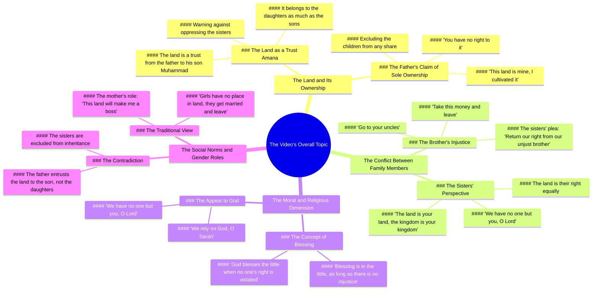

# Father Abandons Will and Trust, Chooses Money Over Daughters

> 🌐 **Read this in:** [English](../../en/2026-06/tiktok-transcript-video-1e53.md) · **中文**

> **Creator:** [@dima.storys](https://www.tiktok.com/@dima.storys) · **Views:** 576.6K · **Posted:** 2026-06-18 · **Niche:** other
>
> **TL;DR:** Opens with a powerful moral charge, framing sisters as a sacred trust, immediately engaging viewers with a universal ethical dilemma.

[Watch original video →](https://www.tiktok.com/@dima.storys/video/7644265026403962145)

## Why This Went Viral

## 钩子（前3秒）
- **逐字开场白：** "你的姐妹们是托付在你手中的信任"
- **钩子模式：** **道德/情感主张** —— 一句直接而沉重的伦理陈述，以父辈警告的口吻呈现。
- **为何能让人停下滑动：** 它利用了根深蒂固的文化价值观（荣誉、保护姐妹），并立即暗示一场高风险的家族冲突。观众的大脑会意识到：*这关乎正义、背叛或遗产争夺* —— 一个普遍的情感触发器。

## 情感节奏
1. **好奇 + 紧张** —— "你的姐妹们是托付在你手中的信任" 设定了一种道德责任。
2. **对比 / 不公** —— "这块土地是她们的权利，就像它是你的权利一样" 引入了不公平感。
3. **升级（愤怒）** —— "别压迫她们，我的儿子" → 父权权威 + 威胁。
4. **共鸣（姐妹的声音）** —— "女孩们对土地没有权利，她们结婚后就消失了" —— 一种赤裸、痛苦的刻板印象。
5. **高潮（对峙）** —— "这块土地是我的" —— 兄弟宣称所有权，触发核心冲突。
6. **转折（向真主祈求）** —— "主啊，我们除了您别无依靠" —— 从愤怒转向绝望，创造情感释放。
7. **解决（道德教训）** —— "只要没有侵占他人的权利，真主会祝福微薄之物" —— 以宗教伦理的冲击收尾。

**高潮时刻：** 兄弟挑衅地说："这块土地全是我的，没人能从我这里拿走一分钱。"

## 关键词密度
| 词语/短语 | 频率与作用 |
|-------------|------------------|
| **الارض**（土地） | 重复次数最多 —— 驱动**算法关键词密度**（主题：遗产/财产纠纷） |
| **حق**（权利） | 在道德语境中重复 —— **情感吸引力**（正义/不公） |
| **بتاعتي/بتاعك**（我的/你的） | 所有权短语 —— **算法 + 情感**（冲突标志） |
| **امانة**（信任） | 关键道德框架 —— **情感共鸣**（文化/宗教责任） |
| **ربنا**（真主） | 在情感高峰使用 —— **算法覆盖**（宗教内容）+ **情感权威** |
| **اخواتك/اخونا**（姐妹/兄弟） | 家庭术语 —— **情感吸引力**（手足背叛） |
| **ظلم**（压迫） | 强烈的负面情绪 —— **情感触发器**（不公） |
| **فلوس**（金钱） | 实际利害 —— **算法**（财务纠纷内容） |

**算法驱动因素：** 土地、权利、金钱、真主 —— 在阿拉伯家庭/法律剧内容中搜索量和趋势量高。

**情感驱动因素：** 信任、压迫、你的姐妹、我的 —— 触发同理心、愤怒和道德愤慨。

## 为何能传播
1. **普遍的家庭冲突 + 特定的文化框架** —— 这段文字捕捉了兄弟姐妹之间真实的遗产纠纷，在整个阿拉伯世界（及以外）都能引起共鸣。"女孩们对土地没有权利，她们结婚后就消失了" 这句话是一个赤裸、有争议的性别刻板印象，立即引发辩论和分享。
2. **道德高地 + 宗教收尾** —— 视频以宗教道德结尾（"只要没有侵占他人的权利，真主会祝福微薄之物"），提供了情感上的解决，使其作为"教训"或"提醒"而具有分享性。观众会标记朋友/家人来传播信息。
3. **双重视角（受害者 vs. 反派）** —— 文字中包含了姐妹的恳求和兄弟的挑衅。这创造了一种**"选边站"的动态** —— 观众在评论中参与、争论，并分享以证明自己的立场。
4. **高情感赌注 + 悬念** —— 高潮（"这块土地全是我的，没人能从我这里拿走一分钱"）是一句有力、可引用的台词，可以剪辑成独立的钩子。它引发愤怒和同情，推动分享。
5. ** relatable 的生活场景** —— 遗产纠纷在许多文化中几乎是普遍经历。具体的"姐妹 vs. 兄弟"角度是一个热点问题，保证情感投入和评论大战。

## 你可以借鉴什么
1. **以带有道德负担的陈述开场** —— 不要以"大家好"开始。从一个暗示信任破裂或道德责任的句子开始。例如："你父母的积蓄不是你的遗产——它们是一份信任。" 这迫使观众停下来思考。
2. **使用"受害者 vs. 反派"的结构** —— 给一个角色清晰、富有同情心的声音（姐妹为自己的权利恳求），另一个角色挑衅、自私的台词（兄弟宣称所有权）。这能立即创造冲突并推动参与（评论、分享、标记）。
3. **以宗教或伦理的妙语收尾** —— 即使你的内容不是宗教性的，也要用一个感觉最终且智慧的普遍道德教训来结束。例如："通过不义赚来的钱永远不会持久。" 这给了观众一个理由，将视频作为"教训"或"提醒"分享给他人。

## Mind Map

## Full Transcript (Generated by [TokTranscript](https://toktranscript.com/?utm_source=github&utm_medium=breakdown&utm_campaign=tool_attribution))

> 📝 Transcripts on this page are auto-generated and show the first 60%. Want to transcribe any TikTok in 30 seconds and get the full version? [Try TokTranscript free →](https://toktranscript.com/?utm_source=github&utm_medium=breakdown&utm_campaign=transcript_cta)

اخواتك البنات امانة في ايدك الارض دي حقهم زي ما هي حقك بالضبط اوعى تظلمهم يا ابني الارض دي هي اللي هتخليني باشا البنات ما لهمش في الارض يتجوزو ويغورو خدو الفلوس دي استدرو نفسكم بيها الارض دي بتاعتي انا انا اللي شهيت فيها وكبرتها وانتو ما لكوش فيها حاجة هي دي الامانة اللي بابا استامنك عليها يا محمد مش عايز اشوف وشكم هنا تاني الشقة دي بتاعتي روحو 

*[Read the full transcript on TokTranscript →](https://toktranscript.com/plaza/tiktok-transcript-video-1e53?utm_source=github&utm_medium=breakdown&utm_campaign=transcript_full)*

## Browse More

- All [other](../../by-niche/zh-CN/other.md) breakdowns
- All [Moral Responsibility](../../by-pattern/zh-CN/hook-moral-responsibility.md) examples

## Video Info

| | |
|---|---|
| Creator | [@dima.storys](https://www.tiktok.com/@dima.storys) |
| Original video | [https://www.tiktok.com/@dima.storys/video/7644265026403962145](https://www.tiktok.com/@dima.storys/video/7644265026403962145) |
| Original title | الأب ساب الوصية والأمانة.. وهو اختار طريق تاني خالص وفضل الفلوس والأر... |
| Views | 576.6K (576600) |
| Posted | 2026-06-18 |
| Duration | 0s |
| Niche | `other` |
| Hook pattern | `Moral Responsibility` |
| Original language | `en` (this page translated by AI) |
| Available languages | en, zh-CN |
| Generated | 2026-06-19 by [TokTranscript](https://toktranscript.com/) |

---

*This breakdown is for educational analysis under fair use. Original video © [@dima.storys](https://www.tiktok.com/@dima.storys). All transcripts are auto-generated and may contain errors.*

*Want to analyze your own TikToks like this? [TokTranscript →](https://toktranscript.com/viral-breakdown?utm_source=github&utm_medium=breakdown&utm_campaign=footer_cta)*