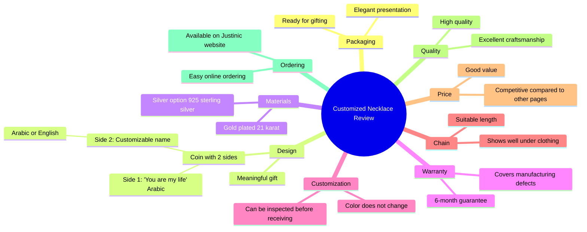

# Customized Necklace Gift With Two-Sided Coin Design

> 🌐 **Read this in:** [English](../../en/2026-06/tiktok-transcript-video-6676.md) · **中文**

> **Creator:** [@Just Uniques](https://www.tiktok.com/@Just Uniques) · **Views:** 337.3K · **Posted:** 2026-06-07 · **Niche:** other
>
> **TL;DR:** Opens with a strong superlative claim about the necklace being one of the best customized ones, immediately grabbing attention.

[Watch original video →](https://www.facebook.com/share/r/1HQ2H7of9d/)

## Why This Went Viral

以下是所提供阿拉伯语文本的病毒式传播分析。

## 钩子（前3秒）
- **原文：** "دي تقريبا من أحلى النكلس الـ Customized اللي عملتها في حياته" （这大概是我这辈子做过的最漂亮的定制项链之一）。
- **钩子模式：** **大胆断言**（最高级表述：“最漂亮的之一”）。
- **为何能让人停下滑动：** 说话者做出了一个明确且高风险的品质断言。观众立刻想看到这件获得如此高度赞誉的物品，从而瞬间引发视觉好奇心。

## 情感节奏
- **节拍1：好奇（0–3秒）：** 关于项链之美的断言。
- **节拍2：期待（3–8秒）：** 开箱/包装展示（"لم بتيجي في الـ Packaging ده"）。
- **节拍3：情感共鸣（8–15秒）：** “双面硬币”设计被展示，一面写着“你是我的生命”（انت عمري）。这是**转折点**——从产品评测转向情感价值。
- **节拍4：信任与安心（15–25秒）：** 技术规格（21K金、925银、6个月保修、可调节）。这消除了观众对质量不佳的担忧。
- **节拍5：验证与行动号召（25–30秒）：** 与竞争对手的价格比较，然后是最终认可（"حلوة وده شجعني ان انا طلبها"）。**高潮**是情感化的“你是我的生命”展示，而非价格。

## 关键词密度
- **重复最多的词语/短语：**
    - **"دهب عيار 21" / "فضة عيار 925"** （21K金 / 925银）：推动**算法覆盖**（奢侈品买家高意向搜索词）。
    - **"Customized" / "الاسم"** （定制 / 名字）：推动**情感吸引力**（个性化 = 高价值）。
    - **"هدية meaningful"** （有意义的礼物）：推动**情感吸引力**（送礼场景）。
    - **"جودة" / "الحفرة تحفة"** （质量 / 杰作）：推动**信任**（减少购买焦虑）。
    - **"سايد" / "Coin 2 Sides"** （面 / 双面硬币）：推动**视觉独特性**（特定设计特征）。
    - **"Price" / "comparing"** （价格 / 比较）：推动**算法覆盖**（比价搜索查询）。

## 为何能传播
- **1. “满足感开箱”+ 情感回报：** 视频以标准开箱开始（对ASMR/满足感观众有高留存率），但随后揭示个性化信息（"انت عمري"）。这种混合形式同时吸引了*审美*和*情感*受众。
- **2. “送礼即用”框架：** 台词“عشان لو عايزك يبيع ديه لحد بقى جاهزة على التقديم على طول”（所以如果你想把它卖给某人，它已经准备好可以立即赠送）直接针对*正在寻找礼物*的观众。这使得视频成为问题的解决方案，而不仅仅是产品展示。
- **3. 价格比较作为社会证明：** "الـ price بتاعها حلو قوي comparing لـ pages تانية كتير"（与许多其他页面相比，它的价格非常好）。这是一种经典的**价值破解**策略。通过明确说明比竞争对手便宜，减少了“我该买吗？”的犹豫。
- **4. “信任堆叠”：** 说话者在短时间内叠加了多个信任信号：保修（6个月）、材料纯度（21K/925）、定制（名字）和可调节长度。这在观众想到任何异议之前就消除了它们。
- **5. “你是我的生命”转折：** 最具病毒性的时刻是特定的刻字“انت عمري”。这是一句极具分享性的浪漫台词。观众会在评论中@他们的伴侣，从而触发算法。

## 你可以借鉴的点
- **1. 以最高级表述开头：** 以“这是我做过的最漂亮/最好/最独特的[产品]”开始你的视频。这迫使观众留下来验证你的说法。
- **2. “送礼即用”脚本：** 明确说明物品“已准备好赠送”或“以礼盒形式送达”。这使你的潜在受众从“想要它的人”翻倍为“需要送它的人”。
- **3. “价格比较”结尾：** 以“而且与[竞争对手类型]相比，这个价格很棒”结束视频。这是一种直接、低成本的触发购买决策的方式，通过消除价格焦虑来实现。

## Mind Map

## Full Transcript (Generated by [TokTranscript 转录工具](https://toktranscript.com/?utm_source=github&utm_medium=breakdown&utm_campaign=tool_attribution))

> 📝 Transcripts on this page are auto-generated and show the first 60%. Want to transcribe any TikTok in 30 seconds and get the full version? [Try TokTranscript free →](https://toktranscript.com/?utm_source=github&utm_medium=breakdown&utm_campaign=transcript_cta)

دي تقريبا من أحلى النكلس الـ Customized اللي عملتها في حياته ولم بتيجي في الـ Packaging ده عشان لو عايزك يبيع ديه لحد بقى جاهزة على التقديم على طول الـ Design بتاعها عجبني قوي عشان الـ Coin 2 Sides سايد بيهم مكتوب انت عمري والـ Sides التاني تقداري تكتب الاسم اللي انت عايزيه سواء بالعربي أو بالإنجلش فحسيتها بجده هتكون هدية meaningful جدا النكلس بكون مطلية دهب عيار 21 ومتاح كمان ان انت تطليها فضة عيار 925 احلى حاجة عندهم ان هما عندهم دمون 6 شهور ضد اي عيوب صنعها متاح كمان ان انت تعيني الح

*[Read the full transcript on TokTranscript →](https://toktranscript.com/plaza/tiktok-transcript-video-6676?utm_source=github&utm_medium=breakdown&utm_campaign=transcript_full)*

## Browse More

- All [other](../../by-niche/zh-CN/other.md) breakdowns
- All [Superlative + Specific](../../by-pattern/zh-CN/hook-superlative-specific.md) examples

## Video Info

| | |
|---|---|
| Creator | [@Just Uniques](https://www.tiktok.com/@Just Uniques) |
| Original video | [https://www.facebook.com/share/r/1HQ2H7of9d/](https://www.facebook.com/share/r/1HQ2H7of9d/) |
| Original title | سلسلتك انتي محدش تاني لابسها🥰 |
| Views | 337.3K (337301) |
| Posted | 2026-06-07 |
| Duration | 0s |
| Niche | `other` |
| Hook pattern | `Superlative + Specific` |
| Original language | `en` (this page translated by AI) |
| Available languages | en, zh-CN |
| Generated | 2026-06-08 by [TokTranscript](https://toktranscript.com/) |

---

*This breakdown is for educational analysis under fair use. Original video © [@Just Uniques](https://www.tiktok.com/@Just Uniques). All transcripts are auto-generated and may contain errors.*

*Want to analyze your own TikToks like this? [TokTranscript 转录工具 →](https://toktranscript.com/viral-breakdown?utm_source=github&utm_medium=breakdown&utm_campaign=footer_cta)*