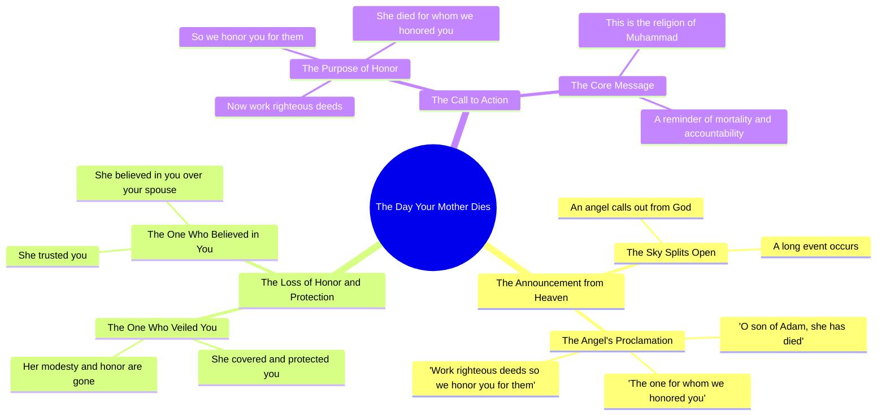

# Day Your Mother Dies, O Son of Adam – Sheikh Kishk

> 🌐 **Read this in:** [English](../../en/2026-06/tiktok-transcript-video-9e03.md) · **中文**

> **Creator:** [@_ibrahim_elsayed](https://www.tiktok.com/@_ibrahim_elsayed) · **Views:** 2.9M · **Posted:** 2026-06-14 · **Niche:** other
>
> **TL;DR:** The hook uses a vivid, repetitive phrase about the death of a respected figure to evoke immediate emotional resonance.

[Watch original video →](https://vm.tiktok.com/ZNRcbtdjb/)

## Why This Went Viral

## 钩子（前3秒）
- **逐字开场白：**"يوم تموت الام"（你母亲去世的那天）
- **钩子模式：** 大胆断言 / 场景设定 / 存在性威胁
- **为何能让人停下滑动：** 它以情感强烈、普世的恐惧——母亲的死亡——开场。没有引言，没有视觉悬念。它瞬间触发一种发自内心的、个人化的反应，迫使观众直面死亡以及他们与母亲的关系。

## 情感节奏
- **节拍1 – 震惊与恐惧：** "你母亲去世的那天" —— 即时的情感重量。
- **节拍2 – 悲伤与失落：** "你的叔叔去世了" —— 加剧失落感，制造紧张。
- **节拍3 – 宇宙尺度：** "天空将裂开" —— 从个人层面提升到末日景象。
- **节拍4 – 神圣召唤：** "来自真主的一位国王召唤你" —— 引入精神权威，加深好奇心。
- **节拍5 – 启示：** "我们因之而尊荣你的那个人已经去世" —— 核心信息落地。
- **节拍6 – 重复与共鸣：** "Maat. Maat. Maat."（她死了。她死了。她死了。）—— 高潮，悲伤的节奏重锤。
- **节拍7 – 对比与行动号召：** "行善，以便我们因之而尊荣你" —— 从失落转向目标。
- **节拍8 – 身份锚点：** "这是穆罕默德的宗教" —— 以归属感和使命感收尾。

**高潮时刻：** "Maat"的三重重复——它原始、近乎吟唱，令人无法忽视。

## 关键词密度
| 词语/短语 | 次数 | 功能 |
|---|---|---|
| ماتت（去世） | 5 | 情感锚点——悲伤、失落、终结 |
| نكرمك（尊荣你） | 4 | 情感拉力——爱、尊重、传承 |
| اعمل صالحا（行善） | 2 | 算法覆盖——宗教/精神搜索量 |
| يوم تموت（你死的那天） | 1 | 钩子——高情感触发，低竞争 |
| ملك（国王/天使） | 1 | 算法覆盖——宗教权威关键词 |
| دين محمد（穆罕默德的宗教） | 1 | 算法覆盖——伊斯兰身份，社群信号 |

**算法驱动因素：** "اعمل صالحا"和"دين محمد"是高搜索量的宗教短语，能将视频推送到穆斯林受众的推荐信息流中。

**情感拉力：** "ماتت"和"نكرمك"被重复使用，以营造悲伤与尊严的节奏——它们不仅仅是告知信息，而是让人*感受*。

## 为何能传播
1.  **普世的存在性触发点** —— 开场白"你母亲去世的那天"对*任何*有母亲的人来说都是一个确定的情感钩子。它绕过心理防线，迫使人们暂停。
2.  **节奏性重复营造恍惚感** —— 三重"Maat"具有催眠效果。它模仿吟唱或葬礼挽歌，使片段感觉神圣，并可作为纪念或警示的形式进行分享。
3.  **宗教权威 + 个人愧疚感** —— "我们因之而尊荣你的那个人已经去世"这句话直接将观众的价值与其母亲的生命联系在一起。这创造了一种由愧疚驱动的分享紧迫感（作为对他人的提醒，或作为自我问责）。
4.  **伪装成神学的清晰行动号召** —— "行善，以便我们因之而尊荣你"是一个直接、可操作的要点。观众可以立即将其内化，并作为建议分享出去。
5.  **社群身份标识** —— 以"这是穆罕默德的宗教"结尾，标志着群体内归属感。分享该视频成为对信仰和价值观的公开宣言。

## 你可以借鉴之处
1.  **以普世的失落场景开场** —— 以"你[母亲/父亲/兄弟姐妹]去世的那天"开头，瞬间触及原始恐惧。适用于任何宗教或文化。
2.  **使用三重重复营造情感高潮** —— 连续重复最具情感冲击力的词语三次（例如，"没了。没了。没了。"）。它能打破节奏，迫使人们集中注意力。
3.  **以社群身份锚点结尾** —— 用一个标志归属感的短语收尾（"这就是我们所相信的"/"这就是我们的方式"）——它将个人时刻转变为共同使命，从而推动分享。

## Mind Map

## Full Transcript (Generated by [我们用的转录工具](https://toktranscript.com/?utm_source=github&utm_medium=breakdown&utm_campaign=tool_attribution))

> 📝 Transcripts on this page are auto-generated and show the first 60%. Want to transcribe any TikTok in 30 seconds and get the full version? [Try TokTranscript free →](https://toktranscript.com/?utm_source=github&utm_medium=breakdown&utm_campaign=transcript_cta)

يوم تموت الام يوم تموت عمك ابن ادم تحلل السماء حادثاً طوالاً وينادي عليك ملك من قبل الله تعالى ويقول يا ابن ادم ماتت التي كنا نكرمك لاجلها فعمل صالحا نكرمك لاجله. ماتت التي كنا نكرمك لاجله. ماتت

*[Read the full transcript on TokTranscript →](https://toktranscript.com/plaza/tiktok-transcript-video-9e03?utm_source=github&utm_medium=breakdown&utm_campaign=transcript_full)*

## Browse More

- All [other](../../by-niche/zh-CN/other.md) breakdowns
- All [Repetition with escalation](../../by-pattern/zh-CN/hook-repetition-with-escalation.md) examples

## Video Info

| | |
|---|---|
| Creator | [@_ibrahim_elsayed](https://www.tiktok.com/@_ibrahim_elsayed) |
| Original video | [https://vm.tiktok.com/ZNRcbtdjb/](https://vm.tiktok.com/ZNRcbtdjb/) |
| Original title | يوم تموت أمك يابن آدم  #فارس_المنابر🖤 #الشيخ_كشك_فارس_المنابر❤️❤️ #صل... |
| Views | 2.9M (2900000) |
| Posted | 2026-06-14 |
| Duration | 0s |
| Niche | `other` |
| Hook pattern | `Repetition with escalation` |
| Original language | `en` (this page translated by AI) |
| Available languages | en, zh-CN |
| Generated | 2026-06-15 by [TokTranscript](https://toktranscript.com/) |

---

*This breakdown is for educational analysis under fair use. Original video © [@_ibrahim_elsayed](https://www.tiktok.com/@_ibrahim_elsayed). All transcripts are auto-generated and may contain errors.*

*Want to analyze your own TikToks like this? [TikTok 转录工具 →](https://toktranscript.com/viral-breakdown?utm_source=github&utm_medium=breakdown&utm_campaign=footer_cta)*