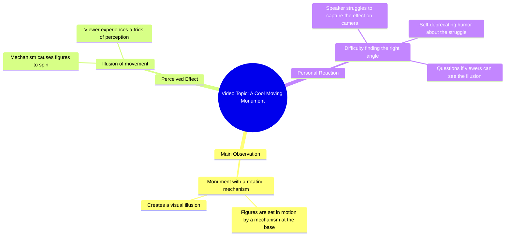

# Chinese Rotating Monument Mechanism Illusion

> 🌐 **Read this in:** [English](../../en/2026-06/tiktok-transcript-video-f1b0.md) · **中文**

> **Creator:** [@zubarefff](https://www.tiktok.com/@zubarefff) · **Views:** 516.2K · **Posted:** 2026-06-17 · **Niche:** other
>
> **TL;DR:** Opens with a direct address and a promise of something impressive, creating immediate curiosity.

[Watch original video →](https://www.tiktok.com/@zubarefff/video/6862304433431137538)

## Why This Went Viral

## 钩子（前3秒）
- **逐字开场白：** "瞧，各位，又一个非常酷的纪念碑。"
- **钩子模式：** 场景 + 反差（先设定"酷纪念碑"的期待，再将其颠覆）
- **为何能阻止滑动：** 友好直接的称呼（"各位"）和"非常酷"的承诺立即引发好奇。但真正的钩子是自信铺垫与随后自嘲笑点之间的*错位*——它诱使观众期待惊叹，却奉上喜剧。

## 情感节奏
- **节拍1（好奇+期待）：** "瞧，各位，又一个非常酷的纪念碑。" → 观众期待看到令人印象深刻的东西。
- **节拍2（紧张+困惑）：** "下面有个装置……让这些雕像旋转。" → 描述营造出惊奇感。
- **节拍3（悬念）：** "而且它酷到能制造出这样的错觉，以至于……" → 停顿（"不知道你们能不能看到"）加剧期待。
- **节拍4（高潮——反转+释然）：** "制造出一种错觉，好像我是个傻逼，找不到合适的角度。" → 笑点落地。紧张感释放为笑声或惊讶。
- **节拍5（共鸣）：** 观众意识到整个铺垫都是关于创作者自身失败的一本正经的笑话。

## 关键词密度
- **"错觉"**（иллюзия）——重复两次，构成核心笑点的框架（"错觉"不是纪念碑，而是创作者的无能）。
- **"酷"**（крутой/круто）——重复两次，建立期待与现实之间的反差。
- **"纪念碑"**（памятник）——锚定视觉主题，推动算法覆盖（旅行/艺术内容）。
- **"傻逼"**（долбоеб）——情感笑点，高冲击力，推动分享性（震惊值+幽默）。
- **"角度"**（ракурс）——视频创作者的术语，与观众自身的挣扎产生共鸣。
- **"旋转"**（вращаться）——描述性词汇，增加视觉背景，但情感吸引力较低。

**算法驱动因素：** "纪念碑"、"装置"、"旋转"——这些是可搜索的细分术语，帮助视频出现在旅行/艺术/好奇类信息流中。  
**情感吸引力：** "傻逼"、"错觉"、"酷"——这些创造了反差和自嘲幽默，使视频具有共鸣性和可分享性。

## 为何能传播
1. **意外的自黑：** 整个视频是一个诱饵转换。观众被设定为看到酷纪念碑，但笑点是创作者承认自己是白痴。这颠覆了"旅行/艺术惊叹"类型，使其令人难忘且易于分享。  
   *具体台词：* "制造出一种错觉，好像我是个傻逼，找不到合适的角度。"

2. **可共鸣的失败：** 每个创作者都曾为找到合适角度而挣扎。这个笑话对任何拍摄内容的人来说都是普遍的。这将一个细分的观察转化为广泛共鸣的时刻。  
   *具体台词：* "不知道你们能不能看到。制造出一种错觉……"

3. **面无表情的表演：** 语气完全平淡且实事求是，这放大了喜剧效果。观众感觉自己与创作者共享这个笑话。  
   *具体台词：* 整个台词以零语调讽刺的方式呈现。

4. **简短紧凑的结构：** 3句话。没有废话。笑点快速落地，非常适合短视频循环和重复观看。  
   *具体台词：* 整个台词就是视频本身。

5. **口碑传播触发器：** "傻逼"是一个强烈、略带禁忌的词，人们会引用和分享，因为在"酷纪念碑"视频的语境中，它既有趣又令人惊讶。  
   *具体台词：* "制造出一种错觉，好像我是个傻逼。"

## 你可以借鉴什么
1. **诱饵转换钩子：** 从一个通用的积极设定开始（"这太酷了……"），然后用自嘲或荒谬的反转来颠覆它。这适用于任何类型（旅行、DIY、教程、评测）。
2. **面无表情的喜剧表演：** 用零情感说出笑点。平淡语气与荒谬内容之间的反差使笑话更有冲击力。
3. **可共鸣的失败作为通用角度：** 不要展示成功，而是展示自己的无能。这能建立联系，让视频感觉像与观众分享的内部笑话。

## Mind Map

## Full Transcript (Generated by [拆解你自己的 TikTok](https://toktranscript.com/?utm_source=github&utm_medium=breakdown&utm_campaign=tool_attribution))

> 📝 Transcripts on this page are auto-generated and show the first 60%. Want to transcribe any TikTok in 30 seconds and get the full version? [Try TokTranscript free →](https://toktranscript.com/?utm_source=github&utm_medium=breakdown&utm_campaign=transcript_cta)

Вот, ребятки, еще очень крутой памятник. Внизу есть механизм, который заставляет эти фигуры вращаться. И вот настолько круто создается иллюзия, ч

*[Read the full transcript on TokTranscript →](https://toktranscript.com/plaza/tiktok-transcript-video-f1b0?utm_source=github&utm_medium=breakdown&utm_campaign=transcript_full)*

## Browse More

- All [other](../../by-niche/zh-CN/other.md) breakdowns
- All [Curiosity gap with promise of coolness](../../by-pattern/zh-CN/hook-curiosity-gap-with-promise-of-coolness.md) examples

## Video Info

| | |
|---|---|
| Creator | [@zubarefff](https://www.tiktok.com/@zubarefff) |
| Original video | [https://www.tiktok.com/@zubarefff/video/6862304433431137538](https://www.tiktok.com/@zubarefff/video/6862304433431137538) |
| Original title | #китай #смех |
| Views | 516.2K (516200) |
| Posted | 2026-06-17 |
| Duration | 0s |
| Niche | `other` |
| Hook pattern | `Curiosity gap with promise of coolness` |
| Original language | `en` (this page translated by AI) |
| Available languages | en, zh-CN |
| Generated | 2026-06-20 by [TokTranscript](https://toktranscript.com/) |

---

*This breakdown is for educational analysis under fair use. Original video © [@zubarefff](https://www.tiktok.com/@zubarefff). All transcripts are auto-generated and may contain errors.*

*Want to analyze your own TikToks like this? [TokTranscript 转录工具 →](https://toktranscript.com/viral-breakdown?utm_source=github&utm_medium=breakdown&utm_campaign=footer_cta)*