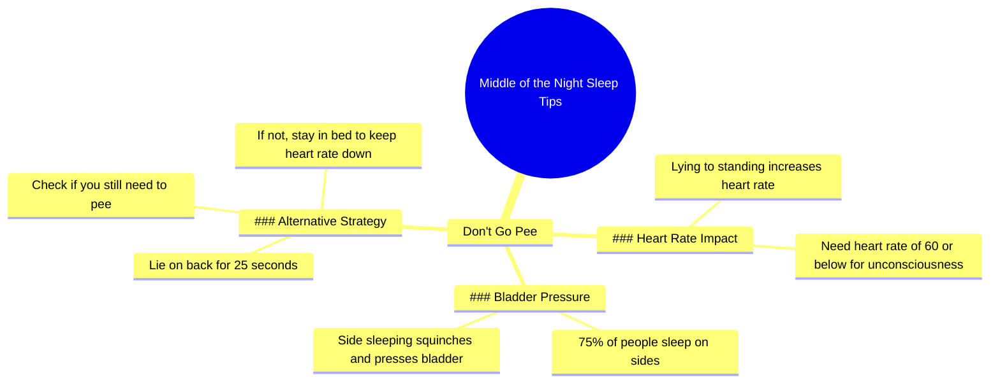

# Why You Shouldn't Pee When Waking Up at Night

> 🌐 **Read this in:** [English](../../en/2026-06/tiktok-transcript-waking-up-in-the-middle-of-the-night-and-immediately-getting-e708.md) · **中文**

> **Creator:** [@thesleepdoctor](https://www.tiktok.com/@thesleepdoctor) · **Views:** 1.2M · **Posted:** 2026-06-15 · **Niche:** other
>
> **TL;DR:** Challenges a common habit to grab attention.

[Watch original video →](https://www.tiktok.com/@thesleepdoctor/video/7629164280289512717)

## Why This Went Viral

## 钩子（前3秒）
- **逐字开场白：**"现在我们来聊聊半夜醒来这件事。第一点，别去上厕所。"
- **钩子模式：**反直觉指令（"别去上厕所"）+ 编号列表框架（"第一点"）
- **为何能阻止滑动：**它直接违背了一个普遍且根深蒂固的行为（醒来上厕所）。观众会立刻想："等等，什么？这不好吗？"——从而制造了一个需要填补的信息缺口。

## 情绪节奏
1. **好奇心**——"现在我们来聊聊半夜醒来这件事"暗示即将分享一个秘密或技巧。
2. **轻微紧张感**——"别去上厕所"感觉不对劲，制造认知失调。
3. **解释/释然**——引入心率科学，让反直觉的建议显得合理。
4. **共鸣**——"75%的人侧睡"——观众会认出自己。
5. **可操作转折**——"仰卧25秒"——一个微小、低成本的修正。
6. **高潮**——"如果你不需要上厕所，就待在床上，保持心率平稳。"整个论点归结为一个可重复的单一要点。

## 关键词密度
- **"心率"**（3次）——算法驱动：健康/睡眠领域关键词。
- **"上厕所"/"去洗手间"**（5次）——情感吸引：禁忌、 relatable、略带幽默。
- **"半夜"**（2次）——情感吸引：普遍的睡眠中断。
- **"保持心率平稳"**（2次）——算法+情感：明确的益处陈述。
- **"仰卧"**（2次）——可操作：驱动收藏和分享。
- **"75%"**——算法：具体数据提升可信度。
- **"膀胱"**——情感：制造身体共鸣。

**算法驱动因素：**"心率"、"75%"、"睡眠"——这些触发健康/睡眠内容推荐系统。
**情感吸引：**"上厕所"、"半夜"、"膀胱"——这些感觉个人化、略带尴尬且高度 relatable。

## 为何能传播
1. **普遍痛点+反直觉解决方案**——几乎每个人都曾半夜醒来上厕所。告诉他们*不要*这样做，足以让人震惊并观看。脚本直接说："人们醒来……他们对自己说，反正醒了，不如去上个厕所，对吧？"——这反映了观众自己的内心独白。
2. **微可操作的科学**——"仰卧25秒"测试如此具体且低门槛，观众今晚就能尝试。这种可测试性驱动评论（"试过了，有效！"）和分享（"你一定要看这个"）。
3. **通过机制建立权威**——创作者不只是说"别上厕所"。他们解释了*为什么*（心率飙升）。"为了进入无意识状态，你需要心率在60或以下"这句话听起来像内行知识，建立信任。
4. ** relatable 的自我诊断**——"75%的人侧睡，而且他们会蜷缩起来"让观众想："那就是我！"这种个人共鸣触发"@某人"的分享行为。
5. **低尝试门槛**——建议零成本、零产品、零努力。最后一句"待在床上，保持心率平稳"是一个简单、易记的指令，回归核心洞察。

## 你可以借鉴什么
1. **以禁止性指令开头。** 用"不要[常见行为]"来制造即时认知摩擦。你的钩子应该让人们想*"等等，我做过——我错了吗？"*
2. **给出一个25秒的解决方案。** 提供一个极其具体、低成本的测试（时间+姿势+动作）。具体性=可记忆性=可分享性。
3. **将建议锚定在一个单一指标上。** 选择一个可衡量的数字（心率、步数、分钟数、次数），让每个技巧都回归到它。这创造了一种心理"粘合剂"，使整个视频感觉像一个连贯的想法，而不是一个列表。

## Mind Map

## Full Transcript (Generated by [TokTranscript](https://toktranscript.com/?utm_source=github&utm_medium=breakdown&utm_campaign=tool_attribution))

> 📝 Transcripts on this page are auto-generated and show the first 60%. Want to transcribe any TikTok in 30 seconds and get the full version? [Try TokTranscript free →](https://toktranscript.com/?utm_source=github&utm_medium=breakdown&utm_campaign=transcript_cta)

Now let's talk about the middle of the night. So number one, don't go pee. People wake up in the middle of the night, they say to themselves, well, I'm up. I might as well go pee, right? Here's the problem. Remember I told you the big metric was in order to enter into a state of unconsciousness, you need a heart rate of 60 or below, right? What do you think happens to your heart rate when you go from a lying position to a seated position to a standing position, walk across the room, your heart rate goes straight up. So what we want to do is keep your heart rate down. So if you don't really have

*[Read the full transcript on TokTranscript →](https://toktranscript.com/plaza/tiktok-transcript-waking-up-in-the-middle-of-the-night-and-immediately-getting-e708?utm_source=github&utm_medium=breakdown&utm_campaign=transcript_full)*

## Browse More

- All [other](../../by-niche/zh-CN/other.md) breakdowns
- All [Contrarian advice](../../by-pattern/zh-CN/hook-contrarian-advice.md) examples

## Video Info

| | |
|---|---|
| Creator | [@thesleepdoctor](https://www.tiktok.com/@thesleepdoctor) |
| Original video | [https://www.tiktok.com/@thesleepdoctor/video/7629164280289512717](https://www.tiktok.com/@thesleepdoctor/video/7629164280289512717) |
| Original title | Waking up in the middle of the night and immediately getting up to pe... |
| Views | 1.2M (1200000) |
| Posted | 2026-06-15 |
| Duration | 0s |
| Niche | `other` |
| Hook pattern | `Contrarian advice` |
| Original language | `en` (this page translated by AI) |
| Available languages | en, zh-CN |
| Generated | 2026-06-16 by [TokTranscript](https://toktranscript.com/) |

---

*This breakdown is for educational analysis under fair use. Original video © [@thesleepdoctor](https://www.tiktok.com/@thesleepdoctor). All transcripts are auto-generated and may contain errors.*

*Want to analyze your own TikToks like this? [拆解你自己的 TikTok →](https://toktranscript.com/viral-breakdown?utm_source=github&utm_medium=breakdown&utm_campaign=footer_cta)*