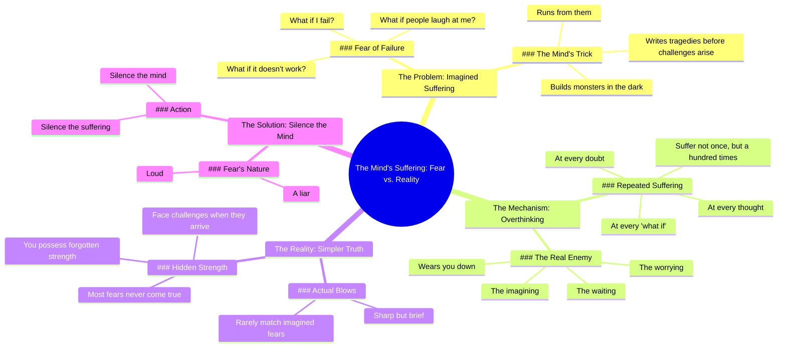

# We Suffer More in Imagination Than in Reality

> 🌐 **Read this in:** [English](../../en/2026-06/tiktok-transcript-we-suffer-more-in-imagination-than-in-reality-seneca-stoicis-2c7e.md) · **中文**

> **Creator:** [@gloryofachilles](https://www.tiktok.com/@gloryofachilles) · **Views:** 5.0M · **Posted:** 2026-06-28 · **Niche:** entertainment
>
> **TL;DR:** Opens with relatable anxieties then flips with a stoic truth.

[Watch original video →](https://vt.tiktok.com/ZSCAayhFb/)

## Why This Went Viral

## 钩子（前3秒）
- **逐字开场白：**“但如果我失败了怎么办？如果行不通怎么办？如果别人嘲笑我怎么办？”
- **钩子模式：** 问题连击（快速连珠炮式的反问，映射内心的疑虑）
- **为何能阻止滑动：** 它立刻说出了观众自己未说出口的焦虑，产生一种“这说的是我”的强烈冲击。三个问题在社交严重性上逐步升级（失败→结果→羞耻），在观众划走之前就牢牢抓住了他们的注意力。

## 情感节奏
1. **焦虑（0–3秒）：** 问题连击通过点出常见恐惧引发轻微不适。
2. **认同（3–6秒）：** “我们在想象中遭受的痛苦比现实中更多”——一句耳熟能详的斯多葛派名言，带来慰藉。
3. **紧张感累积（6–12秒）：** “它在黑暗中制造怪物……编写悲剧”——将心智描绘成敌人。悬念上升。
4. **对比转折（12–15秒）：** “但现实。现实更简单。”——转折在此处落地。“更简单”这个词预示着解决方案。
5. **高潮（15–20秒）：** “打击来临时，尖锐却短暂。”——核心见解以有力、富有诗意的节奏呈现。
6. **赋能（20–28秒）：** “你将用自己都忘记拥有的力量去面对它。”——情感释放与自我信任。
7. **最终一击（28–30秒）：** “恐惧声音很大，但它是个骗子。静下心来，你就平息了痛苦。”——行动号召，如同麦克风掉落般有力。

## 关键词密度
| 词语/短语 | 频率 | 功能 |
|---|---|---|
| **如果……怎么办** | 4次 | 算法层面：焦虑内容搜索量高。情感层面：引发认同感。 |
| **想象 / 想象中** | 3次 | 情感层面：对比内心与外在的痛苦。 |
| **现实** | 3次 | 算法层面：关联“斯多葛主义”和“正念”关键词。 |
| **遭受 / 痛苦** | 3次 | 情感层面：与痛苦产生共鸣。 |
| **恐惧** | 2次 | 算法层面：高参与度话题。情感层面：点出对立面。 |
| **心智** | 3次 | 情感层面：将敌人拟人化。 |
| **静心 / 静下来** | 2次 | 算法层面：关联冥想/心理健康。情感层面：提供解决方案。 |

## 为何能广泛传播
1. **普遍痛点 + 即时缓解：** 开篇问题（“如果我失败了怎么办？”）正是90%的人对自己说的话。视频在3秒内给出答案（“我们在想象中遭受的痛苦比现实中更多”），带来认知和缓解的多巴胺冲击。*台词原文：“我们在想象中遭受的痛苦比现实中更多。”*
2. **有节奏、易分享的语言：** 脚本使用简短有力的句子，带有节拍般的韵律（“它在黑暗中制造怪物，然后逃离它们”）。这使得它易于引用、混剪或转发——这是短视频病毒式传播的通行证。*台词原文：“恐惧声音很大，但它是个骗子。”*
3. **“转折”引发“稍后保存”的冲动：** “想象”与“现实”之间的对比如此清晰，以至于观众会保存视频以便重看或发送给朋友。*台词原文：“但现实。现实更简单。”*
4. **感觉实至名归的赋能弧线：** 视频不仅仅是安慰——它构建了一个论证。从恐惧到力量的情感旅程让结局感觉像是个人的突破，从而引发诸如“我需要这个”的评论。*台词原文：“你将用自己都忘记拥有的力量去面对它。”*
5. **算法关键词叠加：** “如果……怎么办”、“恐惧”、“痛苦”、“心智”、“静心”——这些都是焦虑、斯多葛主义和心理健康内容的高搜索量词汇。该视频可从多个角度被发现。*台词原文：“静下心来，你就平息了痛苦。”*

## 你可以借鉴的
1. **以观众的心声开头：** 以你的受众对自己低语的准确问题或疑虑开始你的视频。不要解释——只需呼应。钩子成为一面镜子，而不是推销。
2. **使用“对比转折”结构：** 围绕一个清晰的对比（想象与现实、恐惧与力量、等待与影响）来构建你的整个脚本。转折词（“但”）向大脑发出信号，奖励即将到来。
3. **以一句可引用、有节奏的金句结尾：** 最后3秒应该是一个独立的句子，可以被截图、分享或用作标题。让它押韵或有节奏感（“恐惧声音很大，但它是个骗子”）。这就是你的病毒种子。

## Mind Map

## Full Transcript (Generated by [TokTranscript 转录工具](https://toktranscript.com/?utm_source=github&utm_medium=breakdown&utm_campaign=tool_attribution))

> 📝 Transcripts on this page are auto-generated and show the first 60%. Want to transcribe any TikTok in 30 seconds and get the full version? [Try TokTranscript free →](https://toktranscript.com/?utm_source=github&utm_medium=breakdown&utm_campaign=transcript_cta)

But what if I fail? What if it doesn't work? What if people laugh at me? We suffer more in imagination than in reality. The mind is a strange thing. It builds monsters in the dark, then runs from them. It writes tragedies before life has even whispered a challenge. And so you suffer not once, but a hundred times. At every thought, every doubt, every what if. But reality. Reality is simpler. The blow, when it comes,

*[Read the full transcript on TokTranscript →](https://toktranscript.com/plaza/tiktok-transcript-we-suffer-more-in-imagination-than-in-reality-seneca-stoicis-2c7e?utm_source=github&utm_medium=breakdown&utm_campaign=transcript_full)*

## Browse More

- All [entertainment](../../by-niche/zh-CN/entertainment.md) breakdowns
- All [Rhetorical questions + contrast](../../by-pattern/zh-CN/hook-rhetorical-questions-contrast.md) examples

## Video Info

| | |
|---|---|
| Creator | [@gloryofachilles](https://www.tiktok.com/@gloryofachilles) |
| Original video | [https://vt.tiktok.com/ZSCAayhFb/](https://vt.tiktok.com/ZSCAayhFb/) |
| Original title | We suffer more in imagination than in reality.  #seneca #stoicism #st... |
| Views | 5.0M (5000000) |
| Posted | 2026-06-28 |
| Duration | 0s |
| Niche | `entertainment` |
| Hook pattern | `Rhetorical questions + contrast` |
| Original language | `en` (this page translated by AI) |
| Available languages | en, zh-CN |
| Generated | 2026-06-29 by [TokTranscript](https://toktranscript.com/) |

---

*This breakdown is for educational analysis under fair use. Original video © [@gloryofachilles](https://www.tiktok.com/@gloryofachilles). All transcripts are auto-generated and may contain errors.*

*Want to analyze your own TikToks like this? [我们用的转录工具 →](https://toktranscript.com/viral-breakdown?utm_source=github&utm_medium=breakdown&utm_campaign=footer_cta)*