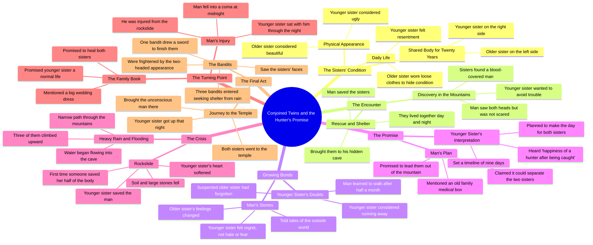

# Best Movie Recaps: Editing & Narrating Top Film Stories

> 🌐 **Read this in:** [English](../../en/2026-06/tiktok-transcript-welcome-to-my-channel-here-i-edit-and-narrating-the-best-mov-e49d.md) · **中文**

> **Creator:** [@bryanmoviefacts](https://www.tiktok.com/@bryanmoviefacts) · **Views:** 3.9M · **Posted:** 2026-06-14 · **Niche:** entertainment
>
> **TL;DR:** Immediately introduces a bizarre, high-stakes scenario that compels viewers to learn more.

[Watch original video →](https://vt.tiktok.com/ZSQQuNRR9/)

## Why This Went Viral

## 钩子（前3秒）
- **原话开头：** "一个女人和她的姐姐。她们在同一个身体里生活了二十年。姐姐在左边。她控制着身体的大部分。"
- **钩子模式：** **场景 + 好奇反差** —— 立即呈现一个不可能的身体状况（两人共享一个身体），并带有清晰的视觉区分（左/右，控制权失衡）。
- **为何能阻止滑动：** 前提如此离奇而具体，大脑无法归类 —— 它迫使观众产生"什么？怎么？谁？"的反应。"二十年"这个细节增加了时间锚定的风险层次，暗示着一个漫长而悬而未决的故事。

## 情绪节奏
- **好奇心飙升**（0-5秒）："两人在同一个身体里" —— 立即产生认知失调。
- **紧张 + 不安**（5-15秒）：描述躲藏、宽松衣物、"陌生女人"、瓦砾、浑身是血的男人。
- **悬念平台期**（15-30秒）：男人看到两个头，颤抖，救了她们。妹妹的怀疑（"姐姐忘了"）建立了关系张力。
- **解脱 + 温暖**（30-45秒）：男人讲故事，妹妹感到后悔而非憎恨。"小心脏的每一面墙都变成了一座桥。"
- **虚假希望 / 转折**（45-60秒）：分离的承诺被许下 —— 但妹妹听到了"猎人得手后的快乐"。恐惧回归。
- **高潮**（60-75秒）：暴雨，洞穴被淹，狭窄小路，落石。男人救了妹妹的那一半 —— "二十年来第一次，有人觉得丑。他救了一半身体。"
- **最终飙升（危险 + 悬念）**（75秒至结尾）：强盗出现，看到两个头，拔剑。视频在结局前戛然而止。

## 关键词密度
| 词/短语 | 出现次数（约） | 驱动因素 |
|---|---|---|
| "姐姐" / "妹妹" / "姐姐" | ~25 | **情感牵引** —— 亲情纽带是核心 |
| "身体" / "一半" | ~12 | **算法覆盖** —— 视觉化、可分享、独特概念 |
| "山" / "洞穴" | ~8 | **场景锚定** —— 营造一个封闭的、神话般的世界 |
| "救" / "救了" | ~6 | **情感牵引** —— 英雄主义、牺牲、情感宣泄 |
| "血" / "受伤" / "昏迷" | ~5 | **紧张 + 留存** —— 风险让观看时长居高不下 |
| "两个头" / "丑" | ~4 | **算法覆盖** —— 震撼、难忘、可点击 |
| "承诺" / "快乐" | ~4 | **情感牵引** —— 希望与背叛的张力 |

## 为何能传播
1. **不可能的前提 = 即时好奇心引擎。** "两人共用一个身体"是一个如此奇怪的钩子，观众*必须*知道更多。文字稿以此开头，确保前3秒成为绝对的停留点。
2. **神话般的叙事结构，无需铺垫。** 每一行都推进情节（洞穴、救援、承诺、背叛、风暴、强盗）。没有废话 —— 这保持了高留存率，并使视频易于重看或复述。
3. **情绪过山车让观众欲罢不能。** 视频在温暖（男人讲故事）和恐惧（猎人隐喻、雨、强盗）之间摇摆。每个情绪节拍都很短（3-5秒），防止无聊，并鼓励评论如"我无法移开视线。"
4. **开放式悬念推动分享。** 最后一行（"拔剑结束在那里"）在动作中途戛然而止。观众被迫分享或评论以猜测、讨论或要求第二部分。
5. **普世主题 + 具体意象 = 可分享。** "拯救一个'丑陋'的人"、"兄弟姐妹的牺牲"、"选择爱而非恐惧" —— 这些是情感共鸣的原型。具体细节（两个头、洞穴、浑身是血的男人）使其感觉原创而新鲜，而非泛泛而谈。

## 你可以借鉴什么
1. **在前3秒用一个"什么？！"的前提开场。** 不要铺垫 —— 立即抛出最奇怪、最具体的事实。"两个姐妹在同一个身体里生活了20年"比"这是一个关于连体双胞胎的故事"更好。
2. **每场戏用3句话的情绪过山车。** 这个文字稿中的每一段都是一个微型故事：设定 → 紧张 → 转折。在你自己的视频中，强迫自己每5-10秒改变一次情绪基调（好奇 → 恐惧 → 希望 → 恐惧）。
3. **以一个需要反应的悬念结尾。** 不要解决。在最高紧张时刻（剑举起、门打开、秘密揭露）切断。这会迫使评论、分享和"第二部分"的请求 —— 这些都是算法信号。

## Mind Map

## Full Transcript (Generated by [TokTranscript](https://toktranscript.com/?utm_source=github&utm_medium=breakdown&utm_campaign=tool_attribution))

> 📝 Transcripts on this page are auto-generated and show the first 60%. Want to transcribe any TikTok in 30 seconds and get the full version? [Try TokTranscript free →](https://toktranscript.com/?utm_source=github&utm_medium=breakdown&utm_campaign=transcript_cta)

A woman and her older sister. Both were in the same body for twenty years. The older sister was on the left. He had control over most of his body. It was beautiful and beautiful. The little one was on the right. Not to be confused with face and face. The older sister always wears loose clothes. So that half of his body is hidden. Look outside and see a strange woman. One day on both sides of the mountain. And then they took one of the rubble. Then came the sound. And the great ones were removed. A man was covered in blood. The little one said, “Don’t get into other people’s troubles. ” Get out of here and open your eyes. He saw both heads. Not scared, not scared. Trembling Then he took his hands and saved them. He did not see his sister die. Then both of them came to him, and they both came to him. Where he was hiding from the world. Then the morning and the evening came. The little man was doubtful. My sister has forgotten. Then, for the first half of the month, the son of man was able to walk. The little one was going to run away, or he was going to run away. And he didn’t do anything great. The mountains of the mountains. Tell stories of the outside world. The big hairs of the hair. The little one was not afraid. No hate. Whenever he looked at it, he would only regret it. It is not as if he were a sick man. Who needs care. This feeling won the heart of the great sister. Even small walls sometimes shake. One day he took hold of his hand and promised As soon as the foot is full, it will lead them out of the mountain. And together I told him that an old one in his family medical box. The two sisters. They can be separated. He said, “I want to be happy. Who did he hold? “He will make it his own. The little one heard something else. The happiness of a hunter after being caught. The

*[Read the full transcript on TokTranscript →](https://toktranscript.com/plaza/tiktok-transcript-welcome-to-my-channel-here-i-edit-and-narrating-the-best-mov-e49d?utm_source=github&utm_medium=breakdown&utm_campaign=transcript_full)*

## Browse More

- All [entertainment](../../by-niche/zh-CN/entertainment.md) breakdowns
- All [Curiosity gap with shocking premise](../../by-pattern/zh-CN/hook-curiosity-gap-with-shocking-premise.md) examples

## Video Info

| | |
|---|---|
| Creator | [@bryanmoviefacts](https://www.tiktok.com/@bryanmoviefacts) |
| Original video | [https://vt.tiktok.com/ZSQQuNRR9/](https://vt.tiktok.com/ZSQQuNRR9/) |
| Original title | Welcome to my channel, here I Edit and narrating the best Movie Recap... |
| Views | 3.9M (3900000) |
| Posted | 2026-06-14 |
| Duration | 0s |
| Niche | `entertainment` |
| Hook pattern | `Curiosity gap with shocking premise` |
| Original language | `en` (this page translated by AI) |
| Available languages | en, zh-CN |
| Generated | 2026-06-15 by [TokTranscript](https://toktranscript.com/) |

---

*This breakdown is for educational analysis under fair use. Original video © [@bryanmoviefacts](https://www.tiktok.com/@bryanmoviefacts). All transcripts are auto-generated and may contain errors.*

*Want to analyze your own TikToks like this? [TokTranscript 转录工具 →](https://toktranscript.com/viral-breakdown?utm_source=github&utm_medium=breakdown&utm_campaign=footer_cta)*