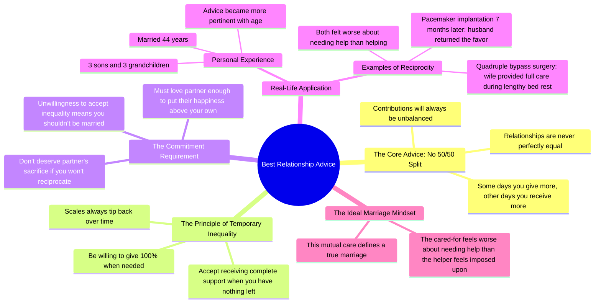

# Best Relationship Advice From a Father

> 🌐 **Read this in:** [English](../../en/2026-06/tiktok-transcript-what-s-the-best-relationship-advice-you-ve-ever-gotten-reddi-c803.md) · **中文**

> **Creator:** [@etherstories](https://www.tiktok.com/@etherstories) · **Views:** 3.9M · **Posted:** 2026-06-23 · **Niche:** entertainment
>
> **TL;DR:** Opens with a relatable, universal question that immediately engages viewers and promises a valuable answer.

[Watch original video →](https://vm.tiktok.com/ZNRTAUBpa/)

## Why This Went Viral

## 钩子（前3秒）
- **开场白原文：** "你听过最好的感情建议是什么？"
- **钩子模式：** 提问（开放式、个人化、普适性）
- **为何能让人停止滑动：** 这个问题瞬间引发共鸣，触及人类普遍的好奇心——每个人都曾寻求或收到过感情建议。它承诺从一个父亲角色那里得到个人化、权威性的答案，暗示着情感深度与智慧。"最好……"的措辞制造出高赌注、确定性的主张，令人无法忽视。

## 情感节奏
- **节拍1 – 好奇（0-5秒）：** 问题吸引注意，随后讲述者将其置于个人背景中（"我父亲在我刚结婚时给了我这个建议"）。
- **节拍2 – 紧张（5-15秒）：** 讲述者描述自己感到"被压榨"以及"怀疑"工作量不均——这制造了可共鸣的冲突。
- **节拍3 – 智慧化解（15-30秒）：** 父亲给出核心建议："世上没有所谓的50/50对半分。"这是转折点——它重新定义了问题。
- **节拍4 – 情感共鸣（30-40秒）：** 父亲的话"如果你不够爱你的妻子，不愿把她的幸福置于自己之上"成为道德高潮。
- **节拍5 – 证明与回报（40-55秒）：** 讲述者分享44年的婚姻、手术和相互照顾——用真实生活证据验证了建议。
- **节拍6 – 感恩与收尾（55-60秒）：** "谢了，老爸。"——一个温柔、余韵悠长的结尾，收束了整个情感弧线。

**高潮时刻：** 父亲的话"如果你不够爱你的妻子，不愿把她的幸福置于自己之上，那么当她为你这样做时，你也不配得到。"

## 关键词密度
- **"建议"** – 3次（将视频定位为智慧分享，提升搜索性）
- **"妻子"** – 5次（情感吸引力，可共鸣的关系锚点）
- **"50/50对半分"** – 3次（令人难忘的短语，成为核心概念）
- **"付出"/"需要"** – 合计6次（推动努力不均的核心张力）
- **"婚姻"/"已婚"** – 5次（普适话题，搜索量高）
- **"爱"** – 3次（情感共鸣，感情类内容的算法关键词）
- **"年"** – 3次（"44年"等时间标记暗示长久与可信度）

**算法传播驱动力：** "建议"、"婚姻"、"感情"——这些是高流量、常青的搜索词。**情感吸引力驱动力：** "爱"、"妻子"、"付出"——这些触发共情与可共鸣性。

## 为何能传播
1. **普适问题，具体解法** —— 视频触及几乎人人都会遇到的婚姻紧张（工作量不均），并提供了一个反直觉、令人难忘的重新定义（"没有50/50"）。父亲的建议简单、可引用、易分享。*具体台词：* "世上没有所谓的50对50对半分。"
2. **时间证明的情感证据** —— 讲述者不仅给出建议，还用44年婚姻和两次重大手术来证明。这建立了可信度和情感分量。*具体台词：* "我和妻子结婚44年了……我做过四重搭桥手术……她植入了心脏起搏器。"
3. **代际智慧传承** —— 父亲形象（已故）成为永恒的权威。"谢了，老爸"的结尾创造了一个催泪、可分享的时刻，致敬了传承。*具体台词：* "我父亲已经去世7年了……谢了，老爸。"
4. **可共鸣的冲突，令人满意的解决** —— 开头的挫败感（感到"被压榨"）是许多已婚人士的感受，但很少被如此清晰地讨论。解决方案（接受暂时的不平等）像是一张允许不完美的通行证。*具体台词：* "如果你不愿意接受这种暂时不平等的情况，那你就不该结婚。"
5. **高度可引用，低门槛分享** —— 核心建议可以提取为独立引文。观众无需观看完整视频即可截图或转发。*具体台词：* "有些日子你需要付出更多……下周你可能需要她的支持。"

## 你可以借鉴什么
1. **使用承诺确定答案的问题钩子。** 以"你听过最好的[X]是什么？"开头——它是开放式的，但暗示你拥有终极答案。这触发好奇心，让观众持续观看。
2. **构建"问题→重新定义→证明"的弧线。** 首先描述一个常见的挫败感（努力不均）。然后给出一个反直觉的重新定义（没有50/50）。最后用真实生活证据（44年、手术）来支撑。这个模式适用于任何可以挑战传统智慧的话题。
3. **以简短、情感化的呼应结尾。** "谢了，老爸"只有三个字，却承载了整个视频的情感分量。一个简短、个人化的告别（感谢某人、提及名字或一句感恩的话）让视频感觉完整且易于分享。

## Mind Map

## Full Transcript (Generated by [拆解你自己的 TikTok](https://toktranscript.com/?utm_source=github&utm_medium=breakdown&utm_campaign=tool_attribution))

> 📝 Transcripts on this page are auto-generated and show the first 60%. Want to transcribe any TikTok in 30 seconds and get the full version? [Try TokTranscript free →](https://toktranscript.com/?utm_source=github&utm_medium=breakdown&utm_campaign=transcript_cta)

What's the best relationship advice you've ever gotten? My father gave me this advice shortly after I got married to the love of my life. He knew a thing or 3 about lifelong love. When my mother passed away, they had just celebrated their 63rd anniversary. I was working long hours and feeling put upon when I would come home to my wife needing help with the housework and the baby. She didn't come right out and accuse me of slacking, but I felt the suspicions. I was lamenting to my dad that I just wanted a 50 to 50 split, thinking in my naivete that would be an egalitarian solution. He nodded and in his own no nonsense way, gave me the sages piece of life's wisdom. There is no such thing as a 50 to 50 split. Things will always be unequal between partners. Some days you will be called on to give more because your wife needs more help. But the scales always tip back, and next week you may need her support. At times you may be called on to give 100%, or you may need her complete support because you have nothing left to give. Here's the important part. If you are not willing to accept this temporarily unequal state of affairs, then you shouldn't be married. If you don't love 

*[Read the full transcript on TokTranscript →](https://toktranscript.com/plaza/tiktok-transcript-what-s-the-best-relationship-advice-you-ve-ever-gotten-reddi-c803?utm_source=github&utm_medium=breakdown&utm_campaign=transcript_full)*

## Browse More

- All [entertainment](../../by-niche/zh-CN/entertainment.md) breakdowns
- All [Question Hook](../../by-pattern/zh-CN/hook-question-hook.md) examples

## Video Info

| | |
|---|---|
| Creator | [@etherstories](https://www.tiktok.com/@etherstories) |
| Original video | [https://vm.tiktok.com/ZNRTAUBpa/](https://vm.tiktok.com/ZNRTAUBpa/) |
| Original title | What's the best relationship advice you've ever gotten? #reddit #redd... |
| Views | 3.9M (3900000) |
| Posted | 2026-06-23 |
| Duration | 0s |
| Niche | `entertainment` |
| Hook pattern | `Question Hook` |
| Original language | `en` (this page translated by AI) |
| Available languages | en, zh-CN |
| Generated | 2026-06-24 by [TokTranscript](https://toktranscript.com/) |

---

*This breakdown is for educational analysis under fair use. Original video © [@etherstories](https://www.tiktok.com/@etherstories). All transcripts are auto-generated and may contain errors.*

*Want to analyze your own TikToks like this? [我们用的转录工具 →](https://toktranscript.com/viral-breakdown?utm_source=github&utm_medium=breakdown&utm_campaign=footer_cta)*