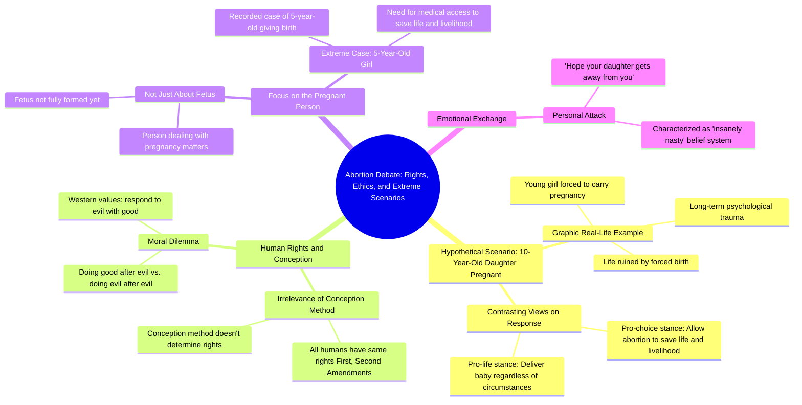

# 10-Year-Old Daughter Pregnancy Dilemma

> 🌐 **Read this in:** [English](../../en/2026-06/tiktok-transcript-yikessss-ce18.md) · **中文**

> **Creator:** [@charliekirkdebateclips](https://www.tiktok.com/@charliekirkdebateclips) · **Views:** 30.1M · **Posted:** 2026-06-14 · **Niche:** other
>
> **TL;DR:** Starts with a shocking hypothetical to immediately engage and provoke emotional response.

[Watch original video →](https://vt.tiktok.com/ZSQQunsGf/)

## Why This Went Viral

## 钩子（前3秒）
- **原话开场：**“所以，如果你有个10岁的女儿，她怀孕了，她要生孩子，她会活下来。不，等等。哦，她要生孩子，她会活下来，你愿意让她经历这一切，生下她的孩子吗？”
- **钩子模式：** 令人震惊的假设场景 + 结结巴巴的表述（营造出原始、未经修饰的紧迫感）
- **为何能让人停下刷屏：** 极端年龄（10岁）、露骨的设定（生育）以及说话者自己的磕绊（“不，等等”）都暗示着一场高风险、情绪激烈的辩论——观众会本能地凑近，想看看接下来会发生什么。

## 情绪节奏
1. **震惊与厌恶**（0-5秒）：“10岁女儿生孩子”直击本能神经。
2. **困惑与好奇**（5-15秒）：说话者结巴 + “这说得太露骨了”制造紧张感——观众会问：“这是真的吗？”
3. **道德失调**（15-30秒）：“答案是肯定的” vs. “这太疯狂了”——两种对立的情感极点相互碰撞。
4. **升级与陷阱**（30-50秒）：“哪张超声波是哪张？”陷阱问题迫使观众选边站。
5. **挫败与愤怒**（50-90秒）：打断（“等等”、“不，不，不”）让热度升高；双方互相抢话。
6. **高潮——道德高地**（90-110秒）：“西方之所以伟大，是因为我们在邪恶之后行善，而不是在邪恶之后继续作恶”——一句引人共鸣、值得引用的台词，重新定义了整场辩论。
7. **最后一击**（110秒至结束）：“我希望你女儿过上非常幸福的生活，并且远离你”——人身攻击，锁定了病毒式传播的“戏剧性”回报。

## 关键词密度
| 关键词/短语 | 频率 | 功能 |
|---|---|---|
| “女儿” | 8 | 情感拉动——触发父母的同理心 |
| “生孩子/怀孕” | 6 | 令人震惊、露骨——激发好奇心 |
| “邪恶” | 4 | 道德框架——算法传播（极化话题） |
| “人权” | 3 | 政治触发——算法传播 |
| “自由” | 2 | 核心意识形态冲突——情感共鸣 |
| “细胞/胎儿/生命” | 5 | 非人化 vs. 人格辩论——推动参与度 |
| “犯罪” | 2 | 道德判断——情感拉动 |
| “听着”（重复） | 5 | 打断标记——暗示冲突（让观众继续观看） |

- **算法传播驱动因素：** “邪恶”、“人权”、“自由”——这些是YouTube/TikTok推荐系统会放大的高参与度政治关键词。
- **情感拉动驱动因素：** “女儿”、“生孩子”、“细胞”——这些触及原始同理心和厌恶感，促使观众评论或分享。

## 为何能传播
1. **震惊 + 个性化：** “10岁女儿”的假设极端且具体。它迫使观众想象自己的孩子，让抽象的辩论变得切身。*对话原文：“如果你有个10岁的女儿……你愿意让她经历这一切吗？”*
2. **打断式戏剧：** 持续的抢话（“不，等等”、“听着，听着，听着”）模仿实时争吵。观众会留下来看谁“赢”——高留存率。*对话原文：“不，不，不，我在说话。”*
3. **陷阱问题（超声波）：** “哪个婴儿是哪个？”的挑战是经典的辩论陷阱。它把对手逼入死角，制造出令人满意的“抓到你了”时刻，观众会分享。*对话原文：“我有两张超声波……哪张是哪张？”*
4. **可引用的高潮：** “在邪恶之后行善，而不是在邪恶之后继续作恶”是一句精炼、听起来很有道德感的金句。它很容易被剪辑出来作为独立引语分享，推动跨平台传播。
5. **人身攻击的结局：** “我希望你女儿远离你”是终极的参与诱饵——它引发愤怒、辩护和回复。观众觉得必须评论自己的看法。*对话原文：“我希望你女儿过上非常幸福的生活，并且远离你。”*

## 你可以借鉴什么
1. **以令人震惊的假设（个性化）开头：** 不要直接陈述观点，而是把它框定为“如果你的[家人]遇到这种情况会怎样？”——这会在逻辑介入之前迫使情感投入。
2. **利用“打断循环”提高留存率：** 策略性地打断自己或对手（例如，“等等，让我问你一个问题”）来重置观众的注意力，让他们继续观看下一记重拳。
3. **尽早埋下一个陷阱问题：** 提出一个对方没有“好”答案的问题（例如，“哪张超声波是哪张？”）。这会创造一个辩论高潮，观众会重播和分享，以看到那个“抓到你了”的时刻。

## Mind Map

## Full Transcript (Generated by [免费 TikTok 文稿生成器](https://toktranscript.com/?utm_source=github&utm_medium=breakdown&utm_campaign=tool_attribution))

> 📝 Transcripts on this page are auto-generated and show the first 60%. Want to transcribe any TikTok in 30 seconds and get the full version? [Try TokTranscript free →](https://toktranscript.com/?utm_source=github&utm_medium=breakdown&utm_campaign=transcript_cta)

So if you had a daughter and she was 10 and she got. And she was gonna give birth and she would. No, wait. Oh, and she was gonna give birth and she was gonna live, would you want her to go through that and carry her baby? That's awfully graphic. It's no, but it's a real life scenario that happens to many people. The answer is yes. The baby would be delivered. Oh, okay, great. So I. That's insane. Um. But let me tell you why. No, hold on, let me ask you a question. There's two ultrasounds I have. One is a baby conceived in. One is a baby conceived by a loving couple. Which one is which? You don't know exactly. Cause it's all human rights. But it's all human beings matter. It's. But it's about your daughter who's has to give birth to it. And it's gonna be tortured by that for the rest of her life. You are not gonna take away every freedom she's ever gonna have. That's gonna ruin her life. She's gonna grow up and she's gonna be attached to another thing. And it's not a victimless crime. At the point is how you were conceived is irrelevant what human rights you get. But when you. Hold on one second. If a person conceived in walks on the side of the street, it's not like they don't get First Amendment rights or Second Amendment rights. It's not about that person. The worst Thing to do to that, the daughter, is to then say, hey, we're gonna go the being in inside of you. They wouldn't even know. Like, listen, they. They wouldn't know. Listen, listen, listen, listen. But wouldn't it. Wouldn't it be a better story to say it wouldn't. no. Evil happened, and we do something good in the face of evil. No, instead of saying we're gonna do evil and then for the being, because we're gonna. We're gonna. We're gonna pander to the evil. No, what makes. What makes the west great is that we do good after evil, not evil

*[Read the full transcript on TokTranscript →](https://toktranscript.com/plaza/tiktok-transcript-yikessss-ce18?utm_source=github&utm_medium=breakdown&utm_campaign=transcript_full)*

## Browse More

- All [other](../../by-niche/zh-CN/other.md) breakdowns
- All [Hypothetical Scenario](../../by-pattern/zh-CN/hook-hypothetical-scenario.md) examples

## Video Info

| | |
|---|---|
| Creator | [@charliekirkdebateclips](https://www.tiktok.com/@charliekirkdebateclips) |
| Original video | [https://vt.tiktok.com/ZSQQunsGf/](https://vt.tiktok.com/ZSQQunsGf/) |
| Original title | Yikessss |
| Views | 30.1M (30100000) |
| Posted | 2026-06-14 |
| Duration | 0s |
| Niche | `other` |
| Hook pattern | `Hypothetical Scenario` |
| Original language | `en` (this page translated by AI) |
| Available languages | en, zh-CN |
| Generated | 2026-06-15 by [TokTranscript](https://toktranscript.com/) |

---

*This breakdown is for educational analysis under fair use. Original video © [@charliekirkdebateclips](https://www.tiktok.com/@charliekirkdebateclips). All transcripts are auto-generated and may contain errors.*

*Want to analyze your own TikToks like this? [TokTranscript →](https://toktranscript.com/viral-breakdown?utm_source=github&utm_medium=breakdown&utm_campaign=footer_cta)*