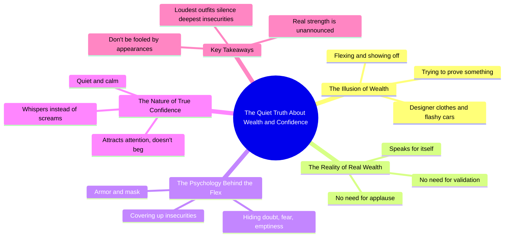

# Wealthy People Don’t Need to Show Off

> 🌐 **Read this in:** [English](../../en/2026-06/tiktok-transcript-you-ever-notice-how-the-loudest-people-in-the-room-are-usual-4cd4.md) · **中文**

> **Creator:** [@carlosthewizardalvarez](https://www.tiktok.com/@carlosthewizardalvarez) · **Views:** 1.5M · **Posted:** 2026-06-03 · **Niche:** finance
>
> **TL;DR:** Warns the viewer to reconsider a common assumption, creating immediate curiosity.

[Watch original video →](https://www.tiktok.com/@carlosthewizardalvarez/video/7562245352363920671)

## Why This Went Viral

## 钩子（前3秒）
- **逐字开场白：**"当你看到有人从头到脚穿着名牌服装，像是什么都搞定了似的炫耀时，要小心。"
- **钩子模式：**警告 + 对比（警惕一种常见行为，然后暗示相反的真相）
- **为何能让人停下滑动：**它立即触发自我反思（"我是不是也这样？"）和社会评判（"我认识这样的人"）。"要小心"这个词营造出一种隐藏危险或内幕知识的氛围，让观众感觉自己即将得知一个秘密。

## 情感节奏
- **节拍1 – 好奇/警觉：**"当你看到有人……要小心"——观众的大脑切换到模式识别状态
- **节拍2 – 紧张：**"真正富有的人，他们根本不需要证明任何东西。"——与浮夸形象直接矛盾，制造认知失调
- **节拍3 – 认同/释然：**"真正的财富不言自明。"——观众感到自己的怀疑得到了证实
- **节拍4 – 转折/洞察：**"穿着越张扬……越可能只是在掩盖更深层的东西。"——从观察升级到心理诊断
- **节拍5 – 共鸣：**"真正的自信，不会咆哮，而是低语。"——可引用的高潮，情感上令人满足
- **节拍6 – 行动号召（隐含）：**"所以下次你看到有人拼命表现的时候……"——重新定义未来行为，给观众一个全新的视角

## 关键词密度
| 关键词/短语 | 出现次数（约） | 驱动因素 |
|---|---|---|
| "财富"/"富有" | 4 | 算法 + 追求型搜索 |
| "自信"/"自信的" | 3 | 情感吸引力，自我提升 |
| "张扬"/"最张扬" | 4 | 对比钩子，易记性 |
| "安静"/"低语" | 3 | 情感吸引力，可品牌化的短语 |
| "证明"/"认可" | 3 | 心理触发（不安全感） |
| "盔甲"/"面具" | 2 | 视觉隐喻，可分享的意象 |
| "真正" | 5 | 权威标记，真实性信号 |

- **算法驱动因素：**"财富"、"真正"——搜索量高，金融/自我提升领域的常青话题
- **情感吸引力：**"低语"、"最张扬"、"盔甲"——创造心理意象和情感对比，触发分享

## 为何能传播
1. **社会身份认同** – 视频验证了那些已经相信"浮夸=不安全感"的观众，让他们觉得自己很聪明、得到了确认。台词："房间里最张扬的人，通常是最没有安全感的。"
2. **可分享的对比公式** – 每个句子都是二元对立（张扬 vs. 安静，虚假 vs. 真实，咆哮 vs. 低语）。这让信息容易记住和重复。台词："真正的自信，不会咆哮，而是低语。"
3. **内幕知识回报** – 视频将自己定位为揭示隐藏的真相（"真相是"、"最有趣的部分是"）。观众分享是为了显得自己见多识广。台词："真正富有的人，他们根本不需要证明任何东西。"
4. **情感宣泄** – 它释放了对地位炫耀文化的积压挫败感。高潮部分（"盔甲"、"面具"、"空虚"）为许多人心中有但说不出的感受提供了语言表达。
5. **普遍适用性** – 这个信息适用于金钱、地位、人际关系、职业。任何人都可以将其应用到自己的情境中，扩大了分享受众。

## 你可以借鉴什么
1. **以警告开头，而不是承诺。**"当你看到……要小心"立即制造紧张感和权威感。把"教你如何……"换成"当心……"来触发好奇心。
2. **每三句话以对比结尾。**在"X是Y"和"X不是Y，而是Z"之间交替。这创造了一种有节奏、可引用的结构，便于剪辑和分享。
3. **用物理隐喻表达抽象概念。**"盔甲"、"面具"、"低语"、"咆哮"——把情感变成可触摸的物体。这让信息视觉化、易记，增加了口头分享的几率（"就是那个盔甲的说法"）。

## Mind Map

## Full Transcript (Generated by [TikTok 转录工具](https://toktranscript.com/?utm_source=github&utm_medium=breakdown&utm_campaign=tool_attribution))

> 📝 Transcripts on this page are auto-generated and show the first 60%. Want to transcribe any TikTok in 30 seconds and get the full version? [Try TokTranscript free →](https://toktranscript.com/?utm_source=github&utm_medium=breakdown&utm_campaign=transcript_cta)

Be careful when you see somebody dressed from head to toe in designer clothes flexing like they got it all figured out. Because here's the truth. Really wealthy people, they don't need to prove a damn thing. They're not concerned with showing off. They don't care whether you think they're rich or not. Why? Because real wealth speaks for itself. It doesn't need validation. It doesn't need applause. And here's the funniest part. The louder the outfit, the flashier the car, the bigger the flex, the more likely it's just covering up something deeper. The loudest people in the room are usually the most insecure. That drip, that shine, a lot of times it's just a

*[Read the full transcript on TokTranscript →](https://toktranscript.com/plaza/tiktok-transcript-you-ever-notice-how-the-loudest-people-in-the-room-are-usual-4cd4?utm_source=github&utm_medium=breakdown&utm_campaign=transcript_full)*

## Browse More

- All [finance](../../by-niche/zh-CN/finance.md) breakdowns
- All [Cautionary reversal](../../by-pattern/zh-CN/hook-cautionary-reversal.md) examples

## Video Info

| | |
|---|---|
| Creator | [@carlosthewizardalvarez](https://www.tiktok.com/@carlosthewizardalvarez) |
| Original video | [https://www.tiktok.com/@carlosthewizardalvarez/video/7562245352363920671](https://www.tiktok.com/@carlosthewizardalvarez/video/7562245352363920671) |
| Original title | You ever notice how the loudest people in the room... are usually the... |
| Views | 1.5M (1500000) |
| Posted | 2026-06-03 |
| Duration | 0s |
| Niche | `finance` |
| Hook pattern | `Cautionary reversal` |
| Original language | `en` (this page translated by AI) |
| Available languages | en, zh-CN |
| Generated | 2026-06-04 by [TokTranscript](https://toktranscript.com/) |

---

*This breakdown is for educational analysis under fair use. Original video © [@carlosthewizardalvarez](https://www.tiktok.com/@carlosthewizardalvarez). All transcripts are auto-generated and may contain errors.*

*Want to analyze your own TikToks like this? [TikTok 转录工具 →](https://toktranscript.com/viral-breakdown?utm_source=github&utm_medium=breakdown&utm_campaign=footer_cta)*