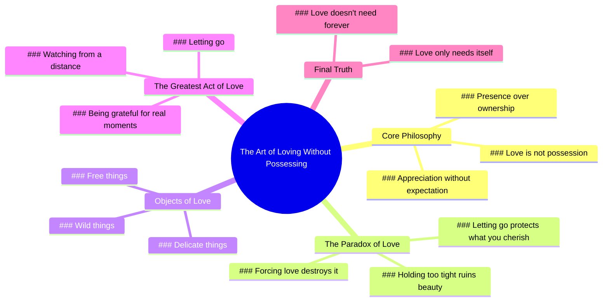

# Letting Go of Love Without Possession

> 🌐 **Read this in:** [English](../../en/2026-06/tiktok-transcript-you-have-to-let-it-go-not-because-it-didn-t-matter-not-becau-6f93.md) · **中文**

> **Creator:** [@growthinpeace_](https://www.tiktok.com/@growthinpeace_) · **Views:** 370.4K · **Posted:** 2026-06-10 · **Niche:** other
>
> **TL;DR:** Subverts the expected action of picking a flower, creating immediate intrigue and emotional depth.

[Watch original video →](https://vt.tiktok.com/ZSQDQb3SD/)

## Why This Went Viral

## 钩子（前3秒）
- **逐字开场白：** "我曾深爱一朵花，爱到不忍摘下，只任它独自绽放。"
- **钩子模式：** **场景 + 反差**（一个具体的、视觉化的记忆，配上一个出人意料的行为——通过*不占有*来表达爱）
- **为何能让人停下刷屏：** 这句话颠覆了默认的"爱=占有"假设，瞬间制造认知失调。"花"这个词具体而普遍，让隐喻立刻可感，而转折（"任它独自绽放"）则引发对深层含义的好奇。

## 情感节奏
1. **好奇**（0–3秒）："我曾深爱一朵花，爱到不忍摘下，只任它独自绽放。"——为什么爱意味着放手？
2. **共鸣 + 反思**（3–10秒）："并非所有你爱的都注定要握在手中……有时爱不在于占有，而在于陪伴。"——观众感到被理解；它映照出他们曾感知却从未听人言说的隐秘真相。
3. **张力**（10–15秒）："我明白了……强求、紧握、抓得太牢，反而会毁掉你最初爱上的那个东西。"——一句警示，提升了情感赌注。
4. **释放 + 美感**（15–25秒）："爱最伟大的举动，不总是索取，而是放手，是远远地看着它绽放……"——张力化解为一种平和、近乎神圣的画面。
5. **高潮 / 情感巅峰**（25–30秒）："因为爱并不总需要一个永远。它只需要它自己。"——最后一句如箴言般落地；它是将整个隐喻串联成一个可分享的洞见的主题句。

## 关键词密度
| 关键词 / 短语 | 数量（约） | 功能 |
|----------------|------------|------|
| 爱 / 深爱 / 爱着 | 8 | **情感拉力**——驱动分享的核心人类欲望（普遍、令人向往） |
| 不 / 从未 | 6 | **算法触达**——对比词创造高互动（否定引发注意） |
| 放手 / 离开 | 3 | **情感拉力**——观众渴望践行或理解的关键行动 |
| 占有 / 陪伴 | 2 | **情感拉力**——使信息易于记忆的二元对比 |
| 永远 | 1 | **情感拉力**——落地高潮的高冲击力词（也触发怀旧） |
| 绽放 / 野生 / 自由 | 3 | **算法触达**——诗意、视觉化的关键词，提升观看时长和可分享性 |

**为何有效：** "爱"的重复将视频锚定在高共情、高分享的情感中。否定词（"不"、"从未"）制造摩擦，让观众持续倾听以寻求解答。诗意的名词（"绽放"、"野生"、"自由"）对算法友好，因为它们在情感分析中得分高，并鼓励收藏。

## 为何能传播
1. **普遍隐喻 + 个人告白**——花的隐喻能被任何曾爱过却无法留住的人瞬间理解。"我曾深爱……"的框架让它感觉像在分享一个秘密，而非说教。*具体台词："我曾深爱一朵花，爱到不忍摘下，只任它独自绽放。"*
2. **30秒内的情感闭环**——视频在不到半分钟内呈现完整的情感弧线（好奇→张力→释放→洞见）。这使其高度可分享，因为观众感到获得了令人满足的"顿悟"时刻，而无需投入时间。*具体台词："因为爱并不总需要一个永远。它只需要它自己。"*
3. **高"收藏"价值**——脚本读起来像一首诗意的肯定句。观众收藏它以便重看、发给正在经历分手的朋友，或用作文案。收藏是强烈的算法信号。*具体台词："爱最伟大的举动，不总是索取，而是放手，是远远地看着它绽放。"*
4. **对比驱动的求知欲**——每一句都设置张力并予以化解："不摘→放手"、"占有→陪伴"、"索取→放手"。这种模式让观众持续投入，因为每个句子都像一次微小的启示。*具体台词："有时爱不在于占有，而在于陪伴。"*

## 你可以借鉴什么
1. **以具体的感官记忆开场**——不要用"爱是放手"，而是以"我曾深爱一朵花……"开头。具体的画面让抽象的概念变得真实而个人化。将此应用于任何主题："我曾深爱一份工作，爱到没有后备计划就辞职。"
2. **使用"不是X，而是Y"的结构**——这种对比模式（占有 vs. 陪伴，索取 vs. 放手）能瞬间创造清晰度和记忆点。将你的核心信息写成否定+正面重构的形式。示例："成功不是24/7地拼命工作，而是知道何时休息。"
3. **以一句箴言结尾**——最后一句应是一个自成一体的引语，观众可以截图、转发或纹在身上。让它简短、有节奏、略带矛盾。示例："爱并不总需要一个永远。它只需要它自己。"

## Mind Map

## Full Transcript (Generated by [我们用的转录工具](https://toktranscript.com/?utm_source=github&utm_medium=breakdown&utm_campaign=tool_attribution))

> 📝 Transcripts on this page are auto-generated and show the first 60%. Want to transcribe any TikTok in 30 seconds and get the full version? [Try TokTranscript free →](https://toktranscript.com/?utm_source=github&utm_medium=breakdown&utm_campaign=transcript_cta)

I once loved a flower so much, instead of picking it, I left it alone. Not everything you love is meant to be held. Not everything you admire is meant to be yours. Sometimes love isn't about possession. It's about presence. It's about appreciation without expectation. I've Learned that the deeper you love for something or someone, the more you realise that forcing it, keeping it, holding on too tight can ruin the very thing you fell in love with. 

*[Read the full transcript on TokTranscript →](https://toktranscript.com/plaza/tiktok-transcript-you-have-to-let-it-go-not-because-it-didn-t-matter-not-becau-6f93?utm_source=github&utm_medium=breakdown&utm_campaign=transcript_full)*

## Browse More

- All [other](../../by-niche/zh-CN/other.md) breakdowns
- All [Unexpected twist on a common metaphor](../../by-pattern/zh-CN/hook-unexpected-twist-on-a-common-metaphor.md) examples

## Video Info

| | |
|---|---|
| Creator | [@growthinpeace_](https://www.tiktok.com/@growthinpeace_) |
| Original video | [https://vt.tiktok.com/ZSQDQb3SD/](https://vt.tiktok.com/ZSQDQb3SD/) |
| Original title | You have to let it go.. Not because it didn't matter. Not because it ... |
| Views | 370.4K (370400) |
| Posted | 2026-06-10 |
| Duration | 0s |
| Niche | `other` |
| Hook pattern | `Unexpected twist on a common metaphor` |
| Original language | `en` (this page translated by AI) |
| Available languages | en, zh-CN |
| Generated | 2026-06-11 by [TokTranscript](https://toktranscript.com/) |

---

*This breakdown is for educational analysis under fair use. Original video © [@growthinpeace_](https://www.tiktok.com/@growthinpeace_). All transcripts are auto-generated and may contain errors.*

*Want to analyze your own TikToks like this? [TikTok 转录工具 →](https://toktranscript.com/viral-breakdown?utm_source=github&utm_medium=breakdown&utm_campaign=footer_cta)*