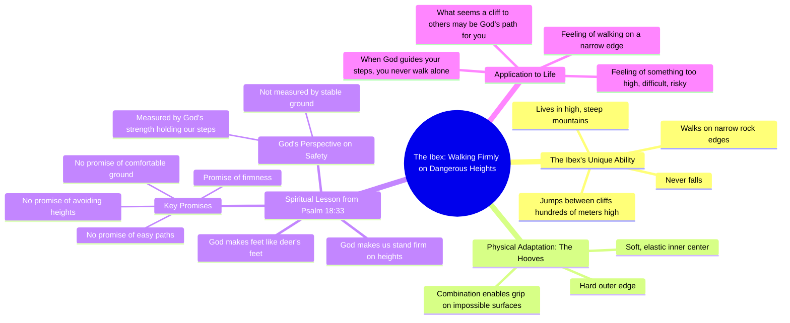

# Mountain Goat Walks Dangerous Cliff Edges Without Falling

> 🌐 **Read this in:** [English](../../en/2026-07/tiktok-transcript-1-3m-views-63k-reactions-dios-cre-un-animal-capaz-de-caminar-92a5.md) · **中文**

> **Creator:** [@Historias Millonarias](https://www.tiktok.com/@Historias Millonarias) · **Views:** 656.9K · **Posted:** 2026-07-06 · **Niche:** other
>
> **TL;DR:** Opens with a surprising claim about a goat's ability to walk dangerous cliffs without falling, immediately engaging curiosity.

[Watch original video →](https://www.facebook.com/share/r/17rzqCACkj/)

## Why This Went Viral

## 钩子（前3秒）
- **逐字开场白：** "你知道吗，上帝创造了一种能在世界上最危险的悬崖上行走的动物？"
- **钩子模式：** **问题 + 大胆断言**（反问式"你知道吗……？"搭配一个关于神圣造物的极端、近乎难以置信的陈述）
- **为何能阻止滑动：** 好奇心缺口问题（"你知道吗……？"）与最高级断言（"世界上最危险的"）的结合瞬间引发好奇。"上帝"一词也暗示了信仰角度，瞄准了特定受众，他们会因灵性内容而更投入。

## 情感节奏
1. **好奇心** – "你知道吗，上帝创造了一种动物……？"（打开知识缺口）
2. **敬畏/惊叹** – 描述山羊不可思议的壮举（"在如此狭窄的岩石边缘行走……从不坠落"）
3. **紧张感** – 问题"这怎么可能？"制造悬念
4. **揭示** – 解释蹄子的双重结构（坚硬外缘+柔软中心）→ 智力满足感
5. **共鸣/灵性升华** – 引用诗篇18:33，然后重新诠释："不承诺平坦的道路……承诺的是稳固"
6. **个人应用（高潮）** – "也许今天你感觉自己正走在狭窄的边缘……记住这只山羊"
7. **安慰/解决** – 最终保证："你从不独行"

**高潮时刻：** 这句台词"因为上帝带你去的那些地方常常是高处的、暴露的、不确定的……但上帝从不以地面看起来有多稳固来衡量你的安全。"

## 关键词密度
| 词语/短语 | 频率（约） | 驱动因素 |
|------------|-----------|----------|
| **上帝** | 5 | 算法（信仰细分领域）+ 情感（权威性） |
| **山羊** | 3 | 细分领域特异性（自然+隐喻） |
| **高处/悬崖/边缘** | 6 | 情感（紧张、危险） |
| **稳固/坚定** | 3 | 情感（解决、信任） |
| **道路/行走** | 4 | 情感（人生旅程的隐喻） |
| **从不** | 3 | 情感（保证、对比） |

- **算法驱动因素：** "上帝"（高流量信仰关键词）、"山羊"（低竞争、高参与度的自然好奇心）
- **情感吸引力：** "高处"、"悬崖"、"稳固"、"从不"——这些词创造了紧张-缓解的弧线，并强化了核心隐喻。

## 为何能传播
1. **普适隐喻 + 特定细分领域** – 山羊是一个真实的动物事实，变成了灵性隐喻。这种双重吸引力同时吸引了自然爱好者和信仰受众。（文稿："它们的蹄子外面有坚硬的边缘，内部有柔软有弹性的中心。"）
2. **经文权威 + 情感重构** – 视频引用了一节著名的经文（诗篇18:33），并以一种新颖、个人化的方式重新诠释。这给观众带来了他们想要分享的"顿悟"时刻。（文稿："不承诺平坦的道路……承诺的是稳固。"）
3. **高潮处的个性化** – 视频直接针对观众当前的痛苦（"也许今天你感觉自己正走在狭窄的边缘……"）。这使它感觉像是一条个人化的信息，增加了可分享性。
4. **紧张 → 缓解的结构** – 视频围绕山羊的能力制造悬念，然后以灵性教训作为解决。这种情感弧线保持了高留存率，并使结尾感觉值得期待。
5. **强有力的行动号召（隐含）** – 最后一句"你从不独行"是一个强有力的、可分享的陈述，观众会将其转发为状态或标题。

## 你可以借鉴什么
1. **以"你知道吗……？" + 极端事实开头** – 任何视频都以好奇心缺口问题和最高级断言开场。这种模式适用于各个细分领域（自然、科学、历史、信仰），因为它触发了立即填补缺口的需要。
2. **用具体物体作为抽象真理的隐喻** – 山羊的蹄子（坚硬外缘+柔软中心）成为灵性稳固的有形象征。在你的下一个视频中，找到一个能直观代表你核心信息的具体物体或动物。
3. **以直接针对"你"的陈述结尾，重构常见挣扎** – 不要给出泛泛的结论，而是针对观众当前的情感状态（"也许今天你感觉……"）并提供重构。这会把被动观众变成主动分享者，让他们感到被看见。

## Mind Map

## Full Transcript (Generated by [我们用的转录工具](https://toktranscript.com/?utm_source=github&utm_medium=breakdown&utm_campaign=tool_attribution))

> 📝 Transcripts on this page are auto-generated and show the first 60%. Want to transcribe any TikTok in 30 seconds and get the full version? [Try TokTranscript free →](https://toktranscript.com/?utm_source=github&utm_medium=breakdown&utm_campaign=transcript_cta)

¿Sabías que Dios creó un animal capaz de caminar por los precipicios más peligrosos del mundo? Sin caer jamás, la cabra montés habita en montañas altas y escarpadas. Camina por bordes de roca tan estrechos que apenas cabe una pisada. Salta entre peñascos a cientos de metros de altura. Y nunca cae. ¿Cómo es posible? Sus pezuñas tienen un borde duro por fuera, y un centro suave y elástico por dentro. Esa combinación le permite agarrarse a superficies que parecen imposibles, donde cualquier otro animal vería solo peligro y vacío. Ella ve un camino. Salmo 18, 33 lo describe así. Él hace mis pies como de siervas y me hace estar firme sobre mis alturas. Observa bien lo que dice. No promete caminos fáciles. No promete terrenos cómodos. No promete que nunca enfrentarás alturas. Promete algo mucho más poderoso, firmeza. Porque los lugares donde Dios te lleva muchas veces son

*[Read the full transcript on TokTranscript →](https://toktranscript.com/plaza/tiktok-transcript-1-3m-views-63k-reactions-dios-cre-un-animal-capaz-de-caminar-92a5?utm_source=github&utm_medium=breakdown&utm_campaign=transcript_full)*

## Browse More

- All [other](../../by-niche/zh-CN/other.md) breakdowns
- All [Curiosity gap + surprising fact](../../by-pattern/zh-CN/hook-curiosity-gap-surprising-fact.md) examples

## Video Info

| | |
|---|---|
| Creator | [@Historias Millonarias](https://www.tiktok.com/@Historias Millonarias) |
| Original video | [https://www.facebook.com/share/r/17rzqCACkj/](https://www.facebook.com/share/r/17rzqCACkj/) |
| Original title | 1.3M views · 63K reactions | Dios creó un animal capaz de caminar por los precipicios más peligrosos del mundo... sin caer jamás... #fblifestyle #amorpropio #abundancia #Historias #reelsviralfb | Historias Millonarias |
| Views | 656.9K (656940) |
| Posted | 2026-07-06 |
| Duration | 0s |
| Niche | `other` |
| Hook pattern | `Curiosity gap + surprising fact` |
| Original language | `en` (this page translated by AI) |
| Available languages | en, zh-CN |
| Generated | 2026-07-08 by [TokTranscript](https://toktranscript.com/) |

---

*This breakdown is for educational analysis under fair use. Original video © [@Historias Millonarias](https://www.tiktok.com/@Historias Millonarias). All transcripts are auto-generated and may contain errors.*

*Want to analyze your own TikToks like this? [TokTranscript 转录工具 →](https://toktranscript.com/viral-breakdown?utm_source=github&utm_medium=breakdown&utm_campaign=footer_cta)*