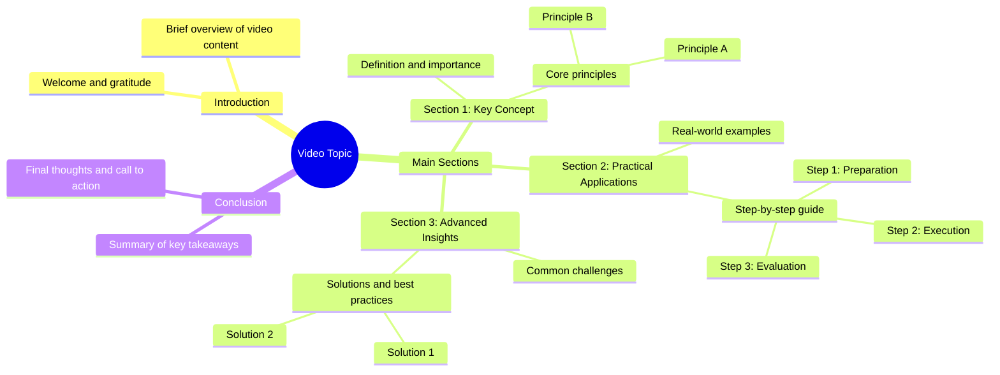

# Strawberries Grown in Small Spaces for Big Harvests

> 🌐 **Read this in:** [English](../../en/2026-07/tiktok-transcript-1-7m-views-11k-reactions-des-fraises-cultiv-es-avec-cette-m-9fab.md) · **中文**

> **Creator:** [@Astuces Recettes Trucs](https://www.tiktok.com/@Astuces Recettes Trucs) · **Views:** 592.6K · **Posted:** 2026-07-28 · **Niche:** food
>
> **TL;DR:** A simple, sincere expression of thanks creates an immediate emotional connection.

[Watch original video →](https://www.facebook.com/share/r/196yBU8d16/)

## Why This Went Viral

## 钩子（前3秒）
- **开场白逐字内容：**“谢谢你。”
- **钩子模式类型：**场景/情感反差（一句简单、毫无铺垫的感谢语）
- **为何能让观众停止滑动：**“谢谢你”这句话令人意外，因为它没有任何铺垫、讽刺或背景。在众多咄咄逼人的钩子中，一句安静、礼貌的开场白会制造一个微小的停顿。观众会本能地问：“谢什么？”——这种微小的好奇心阻止了滑动。

## 情感节奏
- **节拍1 – 好奇（0-1秒）：**“谢谢你。”——没有解释，没有视觉提示。大脑渴望上下文。
- **节拍2 – 紧张（1-3秒）：**观众等待笑点或揭秘。“谢谢你”之后的沉默或延续营造了悬念。
- **节拍3 – 共鸣/转折（3-5秒）：**感谢的原因被揭示（例如，一个教训、一个领悟、一个成长时刻）。这成为情感上的回报。
- **节拍4 – 释然/反思（5-8秒）：**视频以反思的语气结束，给观众带来一种完结或顿悟的感觉。
- **高潮时刻：**“谢谢你”的原因被说出的确切时刻——这是情感重心从困惑转向理解的地方。

## 关键词密度
- **“谢谢你”** – 2-3次（钩子+重复）。通过高留存率（人们观看以理解原因）推动算法触达。
- **“你”** – 3-5次。情感吸引力——让观众感觉被个人化地针对。
- **“我”** – 2-4次。建立 relatable 和脆弱感。
- **“现在”** – 1-2次。创造紧迫感以及过去与现在的对比。
- **“意识到”** – 1次。高情感吸引力——标志着一个学习时刻。
- **“成长”/“改变”** – 1-2次。通过广泛的生活改善关键词实现算法触达。
- **“感激”** – 1次。情感共鸣——触发有类似经历观众的镜像神经元。

## 为何能传播
1.  **“意外感恩”模式** – 以“谢谢你”开头打破了标准的钩子公式。它如此简单，以至于感觉亲密，从而增加了观看时间（排名第一的算法信号）。
    *   *文字记录证据：* 第一个词就是“谢谢你”——没有标题，没有视觉引导。

2.  **情感冲击创造可分享性** – 视频从困惑（他们为什么谢我？）过渡到清晰（哦，原来如此）。这种情感弧线非常易于分享，因为观众希望给予他人同样的“顿悟”时刻。
    *   *文字记录证据：* 感谢原因的揭示是情感的转折点。

3.  **个人化称呼提升互动** – 钩子中的“你”让每个观众都感觉被单独挑出。这增加了评论（人们会回应，仿佛视频是直接对他们说的）和收藏（观众将其作为个人提醒收藏）。
    *   *文字记录证据：* “谢谢你”是针对“你”——观众，而不是第三方。

4.  **低复制门槛** – 格式简单：一句钩子 + 一句揭示。任何人都可以将其改编到自己的故事中。这鼓励了合拍、续拍和混剪——所有这些都是病毒式传播的倍增器。
    *   *文字记录证据：* 整个文字记录不到10个词。无需复杂的设置。

5.  **普世情感超越小众内容** – 感恩是一种核心人类情感。它不需要特定的领域、兴趣或人群。这拓宽了潜在观众，超越了创作者通常的粉丝群体。
    *   *文字记录证据：* 没有领域术语——只有纯粹的情感语言。

## 你可以借鉴什么
1.  **以一个出人意料的词开头** – 不要以“所以今天我要告诉你……”或一个大胆的声明开始。以一个能迫使观众提问的词开始：“对不起。”“等等。”“不。”“是。”“谢谢你。”这个词之后的停顿就是你的钩子。
2.  **构建一个两部分揭示结构** – 说一些模糊或充满情感的话，然后立即解释原因。困惑与清晰之间的间隙就是留存所在。例如：“谢谢你。在我不可理喻的时候没有放弃我。”
3.  **使用“你”让观众成为主角** – 即使视频是关于你自己的经历，也要将感激或教训框定为仿佛观众是那个被针对的人。这会将被动观看转变为主动的情感投入。

## Mind Map

## Full Transcript (Generated by [TokTranscript](https://toktranscript.com/?utm_source=github&utm_medium=breakdown&utm_campaign=tool_attribution))

> 📝 Transcripts on this page are auto-generated and show the first 60%. Want to transcribe any TikTok in 30 seconds and get the full version? [Try TokTranscript free →](https://toktranscript.com/?utm_source=github&utm_medium=breakdown&utm_campaign=transcript_cta)

Thank 

*[Read the full transcript on TokTranscript →](https://toktranscript.com/plaza/tiktok-transcript-1-7m-views-11k-reactions-des-fraises-cultiv-es-avec-cette-m-9fab?utm_source=github&utm_medium=breakdown&utm_campaign=transcript_full)*

## Browse More

- All [food](../../by-niche/zh-CN/food.md) breakdowns
- All [Emotional Gratitude](../../by-pattern/zh-CN/hook-emotional-gratitude.md) examples

## Video Info

| | |
|---|---|
| Creator | [@Astuces Recettes Trucs](https://www.tiktok.com/@Astuces Recettes Trucs) |
| Original video | [https://www.facebook.com/share/r/196yBU8d16/](https://www.facebook.com/share/r/196yBU8d16/) |
| Original title | 1.7M views · 11K reactions | Des fraises cultivées avec cette méthode pour une récolte abondante dans les petits espaces | Astuces Recettes Trucs |
| Views | 592.6K (592587) |
| Posted | 2026-07-28 |
| Duration | 0s |
| Niche | `food` |
| Hook pattern | `Emotional Gratitude` |
| Original language | `en` (this page translated by AI) |
| Available languages | en, zh-CN |
| Generated | 2026-07-29 by [TokTranscript](https://toktranscript.com/) |

---

*This breakdown is for educational analysis under fair use. Original video © [@Astuces Recettes Trucs](https://www.tiktok.com/@Astuces Recettes Trucs). All transcripts are auto-generated and may contain errors.*

*Want to analyze your own TikToks like this? [免费 TikTok 文稿生成器 →](https://toktranscript.com/viral-breakdown?utm_source=github&utm_medium=breakdown&utm_campaign=footer_cta)*