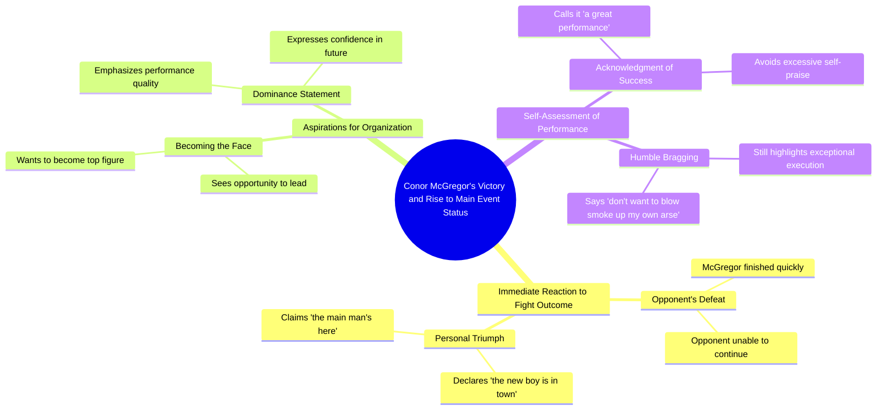

# Paddy Pimblett Reacts to Main Event Outcome Mid-Interview

> 🌐 **Read this in:** [English](../../en/2026-07/tiktok-transcript-1-9m-views-29k-reactions-classic-paddy-paddy-pimblett-reacts-7da8.md) · **中文**

> **Creator:** [@UFC](https://www.tiktok.com/@UFC) · **Views:** 728.7K · **Posted:** 2026-07-12 · **Niche:** entertainment
>
> **TL;DR:** Immediately grabs attention by expressing shock at a major fighter's quick defeat.

[Watch original video →](https://www.facebook.com/share/r/1Bc1vVqdut/)

## Why This Went Viral

## 钩子（前3秒）
- **逐字开场白：** "我要和他换拳，我得抱摔进去。发生什么了？天哪，麦格雷戈已经完了？"
- **钩子模式：** 场景中断 + 大胆断言（一位顶级拳手在惊人冷门中"完了"）
- **为何能留住观众：** 即时的混乱和难以置信（"天哪"）预示着高风险、出乎意料的事件。观众被迫去看麦格雷戈——这位全球格斗偶像——到底发生了什么。

## 情绪节奏
- **第一拍（好奇）：** "我要和他换拳，我得抱摔进去。"——设定战斗场景。
- **第二拍（震惊/紧张）：** "发生什么了？天哪，麦格雷戈已经完了？"——突然、戏剧性地揭示一位巨星落败。
- **第三拍（释然/傲慢）：** "好吧，他完蛋了，新王驾到……"——说话者从难以置信转向自我庆贺。
- **第四拍（共鸣/转折）：** "我不想自吹自擂，但这是什么表现啊。"——谦逊式炫耀作为高潮；说话者在假装谦虚的同时宣称胜利。
- **高潮时刻：** "我现在可以成为组织的门面了"——终极权力转移，巩固了冷门。

## 关键词密度
| 关键词/短语 | 出现频率 | 算法覆盖 | 情感吸引力 |
|-------------|----------|----------|------------|
| 麦格雷戈 | 2次 | 高（品牌名称，可搜索） | 触发粉丝忠诚/愤怒 |
| 完了/完蛋了 | 2次 | 中（冲突信号） | 制造终结感、赌注感 |
| 新王/老大 | 2次 | 低（口语化） | 彰显统治力、黑马崛起 |
| 组织的门面 | 1次 | 中（权力短语） | 励志、宣称头衔 |
| 表现 | 1次 | 低（通用词） | 自我赞美、认可 |
| 自吹自擂 | 1次 | 低（独特习语） | 幽默、自我认知 |

- **算法驱动因素：** "麦格雷戈"（可搜索名字）、"完了"（冲突/冷门触发互动）。
- **情感吸引力：** "新王"、"组织的门面"——黑马到冠军的叙事；"自吹自擂"——亲切、有趣的谦逊。

## 为何能传播
1. **巨星冷门的冲击**——"麦格雷戈已经完了？"立刻吸引想看巨人陨落的粉丝。这段文字利用了一个普遍的体育叙事：旧王已死，新王万岁。
2. **自知之明的傲慢**——"我不想自吹自擂"是完美的谦逊式炫耀。它既自负又让人卸下防备，让观众将其作为表情包或反应片段分享。
3. **清晰的权力转移**——"我现在可以成为组织的门面了"是一个直接、可营销的声明。它引发争论（他真的是门面吗？）并在评论中激发粉丝互动。
4. **简短、有力、对话式**——这段文字读起来像现场反应，而非剧本。这种真实性鼓励分享，尤其是在TikTok或Instagram Reels等平台上，原始时刻比精心制作的内容更受欢迎。
5. **可共鸣的黑马能量**——说话者将自己定位为推翻"老大"的"新王"。这种大卫对歌利亚的叙事在体育、商业和个人成长受众中具有普遍的可分享性。

## 你可以借鉴什么
1. **以震惊揭示开头**——以关于知名人物或事件的直接、出乎意料的陈述开场（例如："他们刚解雇了CEO"或"冠军刚刚输了"）。不要铺垫；立即抛出重磅炸弹。
2. **用谦逊式炫耀作为高潮**——在宣称胜利后，加上一句自嘲的话，比如"我不想自吹自擂"，让傲慢变得可共鸣且易于传播。
3. **宣称头衔或权力转移**——以清晰、大胆的新地位声明结尾（"我现在可以成为组织的门面了"）。这给观众一个可以引用、争论或转发的要点。

## Mind Map

## Full Transcript (Generated by [TokTranscript](https://toktranscript.com/?utm_source=github&utm_medium=breakdown&utm_campaign=tool_attribution))

> 📝 Transcripts on this page are auto-generated and show the first 60%. Want to transcribe any TikTok in 30 seconds and get the full version? [Try TokTranscript free →](https://toktranscript.com/?utm_source=github&utm_medium=breakdown&utm_campaign=transcript_cta)

I'll exchange with him, I need to shoot in. What's happened? Oh my God, McGregor's done already? Well he's finished, the new boy is in town, the main man's here, you know what I mean? I can become the fac

*[Read the full transcript on TokTranscript →](https://toktranscript.com/plaza/tiktok-transcript-1-9m-views-29k-reactions-classic-paddy-paddy-pimblett-reacts-7da8?utm_source=github&utm_medium=breakdown&utm_campaign=transcript_full)*

## Browse More

- All [entertainment](../../by-niche/zh-CN/entertainment.md) breakdowns
- All [Shock and disbelief](../../by-pattern/zh-CN/hook-shock-and-disbelief.md) examples

## Video Info

| | |
|---|---|
| Creator | [@UFC](https://www.tiktok.com/@UFC) |
| Original video | [https://www.facebook.com/share/r/1Bc1vVqdut/](https://www.facebook.com/share/r/1Bc1vVqdut/) |
| Original title | 1.9M views · 29K reactions | Classic Paddy 😂 Paddy Pimblett reacts to the outcome of the main event mid interview! #UFC329 | UFC |
| Views | 728.7K (728716) |
| Posted | 2026-07-12 |
| Duration | 0s |
| Niche | `entertainment` |
| Hook pattern | `Shock and disbelief` |
| Original language | `en` (this page translated by AI) |
| Available languages | en, zh-CN |
| Generated | 2026-07-13 by [TokTranscript](https://toktranscript.com/) |

---

*This breakdown is for educational analysis under fair use. Original video © [@UFC](https://www.tiktok.com/@UFC). All transcripts are auto-generated and may contain errors.*

*Want to analyze your own TikToks like this? [TokTranscript →](https://toktranscript.com/viral-breakdown?utm_source=github&utm_medium=breakdown&utm_campaign=footer_cta)*