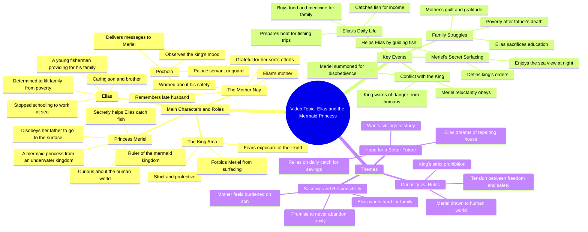

# Elias and Serina: The Secret Friend Part 2

> 🌐 **Read this in:** [English](../../en/2026-07/tiktok-transcript-12m-views-548k-reactions-part-2-si-elias-at-ang-kanyang-lihi-76c9.md) · **中文**

> **Creator:** [@Rey Martin Bas Lim](https://www.tiktok.com/@Rey Martin Bas Lim) · **Views:** 6.7M · **Posted:** 2026-07-17 · **Niche:** other
>
> **TL;DR:** Opens with a relatable scarcity problem and a generous solution, hooking viewers into the family's struggle.

[Watch original video →](https://www.facebook.com/share/v/1LqfGBiwkQ/)

## Why This Went Viral

## 钩子（前3秒）
- **逐字开场白：**"哎呀，我们的鱼一下子就没了，我买了些水果和药给您，烤鸡就是我们的菜了。"
- **钩子模式：**以情感背景（家庭关怀+牺牲）设定场景。这是一个**对比**钩子：匮乏（"鱼没了"）vs.丰盛（"水果、药、鸡肉"）。
- **为何能让人停下滑动：**瞬间建立起一个 relatable、暖心的家庭动态——贫困、辛勤劳作和慷慨。观众感受到资源有限的紧张感，以及儿子为母亲付出的温暖。具体细节（"水果和药"）增添了真实感，使其显得真实且扣人心弦。

## 情感节奏
- **节拍：**好奇（鱼怎么了？）→温暖（儿子买食物/药）→紧张（母亲担忧，"这么多水果"）→宽慰（儿子安抚）→悬念（公主梅里尔被愤怒的父亲叫走）→冲突（父亲禁止去地面）→共情（儿子的挣扎："你不得不辍学"）→希望（儿子发誓供养）→行动（埃利亚斯再次出海）→悬念（被陌生角色跟踪）。
- **高潮：**父亲愤怒的台词："够了，梅里尔。我不想你再上到地面去了。"这揭示了奇幻转折（塞壬），并提高了风险——埃利亚斯的善良可能暴露他们。
- **转折：**从现实贫困剧到奇幻（塞壬、王国）的转变是情感支点，重新吸引观众。

## 关键词密度
- **最强词汇/短语：**"鱼"（isda）、"家庭"（pamilya）、"孩子"（anak）、"父亲"（ama）、"大海"（dagat）、"小心"（mag-ingat）、"美人鱼"（sirena）、"贫困"（hirap）、"承诺"（pangako）、"服从"（masusunod）。
- **算法覆盖：**"鱼"、"大海"、"美人鱼"推动搜索和发现（小众奇幻+钓鱼内容）。"家庭"、"贫困"、"孩子"触发情感共鸣和分享性。
- **情感吸引力：**"承诺"、"小心"、"服从"放大了忠诚、牺牲和责任感——这些是感觉个人化的普世主题。

## 为何能传播
1. ** relatable 的贫困到希望弧线：**儿子的台词"现在对我来说最重要的是让我们摆脱贫困"是普遍挣扎。观众看到自己或认识的人，驱动共情和分享。
2. **意外的奇幻转折：**父亲的揭示（"真的有美人鱼"）将类型从生活片段翻转为奇幻。这种惊喜让观众持续观看并评论（"我还以为是真的！"）。
3. **悬念结尾：**最后一句——"我们必须跟踪他，才能知道他在哪里撒网捕鱼"——创造了"接下来会发生什么？"的循环。观众被迫评论或等待第二部分，提高留存率。
4. **真实对话+表演：**像"别担心我，妈"这样的台词感觉自然，而非剧本化。这种情感真实让观众信任内容，并将其分享为"治愈"或"催泪"。
5. **家庭+奇幻组合：**母子纽带（"谢谢你，孩子"）搭配美人鱼传说，同时触及两个高参与度细分领域（家庭剧+奇幻），扩大覆盖范围。

## 你可以借鉴什么
1. **以微冲突开场：**用一个小问题（鱼没了）开场，立即展示角色（儿子买食物/药）。这在5秒内设定风险和情感。
2. **用类型转换作为留存工具：**从现实（贫困/钓鱼）开始，然后揭示奇幻元素（塞壬）。这会让观众惊讶，促使他们重看或评论。
3. **以直接行动号召结尾，引出第二部分：**最后一句（"我们必须跟踪他"）是自然的悬念。明确暗示后续，以提高系列参与度。

## Mind Map

## Full Transcript (Generated by [TokTranscript 转录工具](https://toktranscript.com/?utm_source=github&utm_medium=breakdown&utm_campaign=tool_attribution))

> 📝 Transcripts on this page are auto-generated and show the first 60%. Want to transcribe any TikTok in 30 seconds and get the full version? [Try TokTranscript free →](https://toktranscript.com/?utm_source=github&utm_medium=breakdown&utm_campaign=transcript_cta)

Ay, naubos po agad yung isdana nila kuko at eto po, namili ako ng mga prutas at gamot nyo po at inihaw po na manok yung magiging ulam natin. Ang dami nitong prutas na binili mo anak, at saka ang sarap nga ng magiging ulam natin. At ngayon lang ulit ako makakatikim nito. Kuya Elias, ang sarap po ng ulam natin ngayon at meron pang prutas. Marami kasi akong nahuli kanina, kaya meron tayong pambili ng ganito ngayon. Sana ganito kasarap parati yung kinakain natin, Kuya Elias. Elias. Huwag ka mag-alala, meme. Magsusumikap ang kuya mo na makahuli ng marami parate. Princess Mariel, kanina ka pa po hinahanap ng mahal na hari. Bakit ako hinahanap ni Ama Pocholo at anong sadya niya? Hindi ko rin alam, mahal na prinsesa, at tangging tugon niya lang nahanapin ka. Medyo galit ba si ama nang hinahanap niya ako, Pocholo? Medyo nakasimangot nga yung mukha ng mahal na hari at halatang galit. Sige, Pocholo, at tayo nang umuwi dun sa palasyo. Anak, ba't nandiyan ka pa sa labas at gabing gabi na at ang lamig dito? Nagpapahangin lang, Nay, at ang sarap tingnan nung dagat napakakalmado. Salamat pala, anak, sa gamot at masarap na pagkain ngayon. Wala yun, Nay. Alam nyo naman na ibibigay ko lahat para sa pamilya natin. Pasensya ka na, anak. At ikaw na yung tumaguyod ng pamilya natin simula nang mawala yung tatay mo. Napilitan ka pang huminto sa pag-aaral para lang pumalaot sa dagat araw-araw. Pagpasensyahan muna ako, anak. Huwag nyo na po ako alalahanin Nay Ang importante sa akin ngayon na makaahon tayo sa hirap at pangako hindi ko papabayaan tong pamilya natin Ama nandito na po ako at sabi ni Pocholo hinahanap niyo daw ako Meriel sangka na naman bagaling Umusad ka naman ba sa ibabaw ng dagat Bakit po ama? Bawal po ba umusad pa ibabaw at adganda ng tanawin dun sa itaas? Ikaw talaga bata ka? Ba't ba ang tiga

*[Read the full transcript on TokTranscript →](https://toktranscript.com/plaza/tiktok-transcript-12m-views-548k-reactions-part-2-si-elias-at-ang-kanyang-lihi-76c9?utm_source=github&utm_medium=breakdown&utm_campaign=transcript_full)*

## Browse More

- All [other](../../by-niche/zh-CN/other.md) breakdowns
- All [Immediate problem + solution](../../by-pattern/zh-CN/hook-immediate-problem-solution.md) examples

## Video Info

| | |
|---|---|
| Creator | [@Rey Martin Bas Lim](https://www.tiktok.com/@Rey Martin Bas Lim) |
| Original video | [https://www.facebook.com/share/v/1LqfGBiwkQ/](https://www.facebook.com/share/v/1LqfGBiwkQ/) |
| Original title | 12M views · 548K reactions | Part 2: Si Elias at ang kanyang lihim na kaibigan na Serina 🧜‍♀️ #aianimation #AIStoryteller #mermaid #viralreels | Rey Martin Bas Lim |
| Views | 6.7M (6705114) |
| Posted | 2026-07-17 |
| Duration | 0s |
| Niche | `other` |
| Hook pattern | `Immediate problem + solution` |
| Original language | `en` (this page translated by AI) |
| Available languages | en, zh-CN |
| Generated | 2026-07-18 by [TokTranscript](https://toktranscript.com/) |

---

*This breakdown is for educational analysis under fair use. Original video © [@Rey Martin Bas Lim](https://www.tiktok.com/@Rey Martin Bas Lim). All transcripts are auto-generated and may contain errors.*

*Want to analyze your own TikToks like this? [TokTranscript →](https://toktranscript.com/viral-breakdown?utm_source=github&utm_medium=breakdown&utm_campaign=footer_cta)*