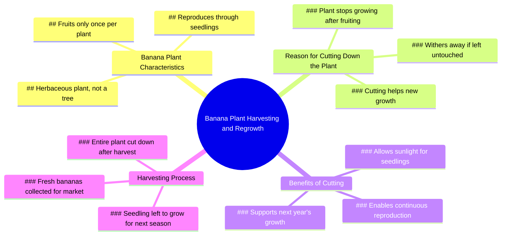

# Why Banana Trees Are Cut Down After Harvest

> 🌐 **Read this in:** [English](../../en/2026-07/tiktok-transcript-14m-views-231k-reactions-why-banana-trees-get-cut-down-after-e7e0.md) · **中文**

> **Creator:** [@Dr.Bota](https://www.tiktok.com/@Dr.Bota) · **Views:** 7.2M · **Posted:** 2026-07-13 · **Niche:** other
>
> **TL;DR:** Creates immediate curiosity and action-oriented tension.

[Watch original video →](https://www.facebook.com/reel/1444700600748952)

## Why This Went Viral

## 钩子（前3秒）
- **原话开场：** "嘿，快点把新鲜香蕉摘下来。不错！这拿到市场上肯定能卖个好价钱。"
- **钩子模式：** 场景 + 反差（紧急行动 vs. 即将到来的冲突）
- **为何能吸引人：** 对利润的兴奋（"好价钱"）与震撼行为（"砍掉整株植物"）之间形成的即时张力，制造了认知失调，迫使观众追问："他们为什么要毁掉价值来源？"

## 情感节奏
- **节拍1：好奇** – "快点，把新鲜香蕉摘下来" 营造了一个快速、有利可图的场景。
- **节拍2：震惊/困惑** – "你在干什么？为什么要把整株植物砍掉？" — 观众与角色产生同样的困惑。
- **节拍3：紧张** – "香蕉树只结一次果……它们会慢慢枯萎" — 一个合乎逻辑、近乎悲伤的解释。
- **节拍4：转折/释然** – "香蕉树其实是草本植物……砍掉它们有助于新苗生长" — 将破坏重新定义为再生。
- **节拍5：惊喜/喜剧** – "这就是你砍倒我的借口吗？" — 植物的拟人化打破了教育性的语气。
- **节拍6：解决 + 愉悦** – "我又活过来了！" — 幼苗的隐喻落地，生命的循环充满希望。
- **高潮时刻：** 揭示植物是"草本"且幼苗可见——整个视频依赖于这个事实性的转折。

## 关键词密度
| 关键词/短语 | 数量（约） | 作用 |
|------------|------------|------|
| "香蕉" | 6 | 算法覆盖（高搜索量词） |
| "砍/砍倒" | 4 | 情感吸引（暴力/动作） |
| "生长" | 3 | 情感吸引（希望/再生） |
| "活着" | 2 | 情感吸引（惊喜/释然） |
| "好价钱" | 1 | 算法覆盖（金钱相关触发词） |
| "草本" | 1 | 算法覆盖（教育性/好奇心缺口） |
| "幼苗" | 1 | 情感吸引（视觉锚点，希望） |

- **算法驱动因素：** "香蕉"（高搜索量）、"好价钱"（金钱钩子）、"草本"（教育性细分领域，低竞争）。
- **情感驱动因素：** "砍倒"（暴力）、"活着"（释然）、"生长"（乐观）。

## 为何能传播
1. **常见误解的教育性转折** – 大多数人认为砍掉香蕉树会杀死它。"香蕉树其实是草本植物"这句话颠覆了这一认知。这是一个经典的"我不知道"时刻，推动分享。
2. **拟人化创造模因潜力** – "这就是你砍倒我的借口吗？" 将植物变成了一个角色。这句话极具引用价值，可被用于模因、混音或反应视频。
3. **视觉前后对比** – "砍倒"的动作在视觉上具有冲击力，但幼苗的揭示（"看下面"）在视觉上充满希望。这种对比本身令人满足，在短视频平台上循环播放效果极佳。
4. **30秒内的情感过山车** – 视频从贪婪 → 震惊 → 悲伤 → 释然 → 喜悦。这种压缩的情感弧线已被证明能提高完播率和分享率（人们希望他人也能感受到同样的转折）。
5. **普适的人生哲理** – "砍倒你有助于它获得更多阳光" 这句话是牺牲与重生的隐喻。这使得视频超越了园艺技巧的范畴，鼓励跨人群分享（农民、父母、企业家）。

## 你可以借鉴的
1. **"破坏 → 再生"框架** – 从一个看似糟糕的行动开始，然后揭示它实际上是有益的。适用于修剪植物、删除旧内容、解雇客户或结束一段关系。钩子是表面的损失；转折是隐藏的收益。
2. **将物体拟人化** – 给无生命的东西（植物、工具、代码、产品）赋予声音。"这就是你砍倒我的借口吗？" 能瞬间创造角色和幽默。在任何教程或讲解中使用这一点，以增加个性。
3. **以视觉回报结尾** – 幼苗的揭示是整个视频成功的原因。不要只是解释转折——要展示它。在你的下一个视频中，计划一个单帧或镜头，以视觉方式确认课程内容（例如，前后对比、特写、延时摄影）。那个图像就是会被保存和分享的内容。

## Mind Map

## Full Transcript (Generated by [TokTranscript 转录工具](https://toktranscript.com/?utm_source=github&utm_medium=breakdown&utm_campaign=tool_attribution))

> 📝 Transcripts on this page are auto-generated and show the first 60%. Want to transcribe any TikTok in 30 seconds and get the full version? [Try TokTranscript free →](https://toktranscript.com/?utm_source=github&utm_medium=breakdown&utm_campaign=transcript_cta)

Hey, hurry up and take the fresh bananas. Nice! That should sell for a fortune in the market. What are you doing? Why are you chopping down the whole plant? Banana plants only fruit once. After that, they stop growing, and even if you leave them, they'll just wither away. So you just cut everything down like that? Banana plants are actually herbaceous plants. T

*[Read the full transcript on TokTranscript →](https://toktranscript.com/plaza/tiktok-transcript-14m-views-231k-reactions-why-banana-trees-get-cut-down-after-e7e0?utm_source=github&utm_medium=breakdown&utm_campaign=transcript_full)*

## Browse More

- All [other](../../by-niche/zh-CN/other.md) breakdowns
- All [Urgent command with reward](../../by-pattern/zh-CN/hook-urgent-command-with-reward.md) examples

## Video Info

| | |
|---|---|
| Creator | [@Dr.Bota](https://www.tiktok.com/@Dr.Bota) |
| Original video | [https://www.facebook.com/reel/1444700600748952](https://www.facebook.com/reel/1444700600748952) |
| Original title | 14M views · 231K reactions | Why Banana Trees Get Cut Down After Harvest | Dr.Bota |
| Views | 7.2M (7164577) |
| Posted | 2026-07-13 |
| Duration | 0s |
| Niche | `other` |
| Hook pattern | `Urgent command with reward` |
| Original language | `en` (this page translated by AI) |
| Available languages | en, zh-CN |
| Generated | 2026-07-14 by [TokTranscript](https://toktranscript.com/) |

---

*This breakdown is for educational analysis under fair use. Original video © [@Dr.Bota](https://www.tiktok.com/@Dr.Bota). All transcripts are auto-generated and may contain errors.*

*Want to analyze your own TikToks like this? [TokTranscript 转录工具 →](https://toktranscript.com/viral-breakdown?utm_source=github&utm_medium=breakdown&utm_campaign=footer_cta)*