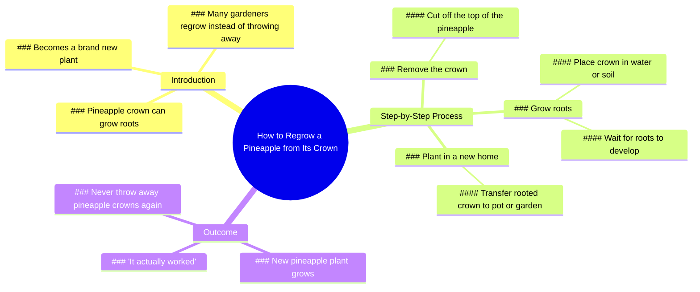

# How to Grow a New Pineapple From the Top

> 🌐 **Read this in:** [English](../../en/2026-07/tiktok-transcript-2-6m-views-58k-reactions-don-t-throw-away-this-part-of-a-pin-14df.md) · **中文**

> **Creator:** [@Dr.Bota](https://www.tiktok.com/@Dr.Bota) · **Views:** 1.4M · **Posted:** 2026-07-12 · **Niche:** other
>
> **TL;DR:** The pineapple speaks, creating immediate curiosity and humor.

[Watch original video →](https://www.facebook.com/reel/1014524507730017)

## Why This Went Viral

## 钩子（前3秒）
- **逐字开场白：** "嘿，你是来收割我的菠萝的吗？"
- **钩子模式：** 场景 + 拟人化（会说话的菠萝）
- **为何能阻止滑动：** 观众立刻被一个会说话的菠萝搞得晕头转向，这违背了现实。问题直接又荒谬，瞬间引发"什么鬼？"的好奇心。

## 情感节奏
- **节拍1 – 惊喜/喜剧（0–3秒）：** 会说话的菠萝打破预期。
- **节拍2 – 困惑/紧张（3–8秒）：** "你为什么剪掉我的头发？" – 观众不知道发生了什么。
- **节拍3 – 疼痛/解脱（8–12秒）：** "哎哟，嘿，轻点" → 植物感到疼痛的肢体喜剧。
- **节拍4 – 期待（12–18秒）：** "哇，看看那些根" – 回报开始成形。
- **节拍5 – 解决/满足（18–22秒）：** "哇，真的成功了" – 实验成功。
- **节拍6 – 教育/收尾（22秒至结束）：** "这就是为什么许多园丁会重新种植菠萝" – 传授经验。
- **高潮时刻：** "哇，真的成功了" – 好奇心得到回报的情感巅峰。

## 关键词密度
- **菠萝**（4次）– 核心对象，驱动搜索和话题相关性。
- **冠芽**（3次）– 特定园艺术语，表明细分领域权威性。
- **根**（3次）– 生物过程，园艺/植物内容的算法钩子。
- **生长**（2次）– 动作动词，在DIY/园艺中搜索量高。
- **新的**（2次）– 转变触发器，"前后对比"内容的情感吸引力。
- **扔掉**（2次）– 减少浪费的角度，契合可持续发展趋势。
- **成功**（1次）– 成功信号，驱动满足感和分享性。

**算法覆盖驱动词：** "菠萝"、"冠芽"、"根"、"生长" – 均为高搜索量的园艺关键词。  
**情感吸引力驱动词：** "扔掉"、"成功"、"新的" – 创造共鸣和回报感。

## 为何能传播
1. **荒谬的前提瞬间抓住注意力：** 会说话的菠萝如此出人意料，观众必须观看才能解决认知失调。第一句话（"收割我的菠萝"）是一个需要答案的问题。
2. **情感过山车压缩在30秒内：** 从惊喜 → 困惑 → 疼痛 → 期待 → 满足 → 教育。这种快速的情感循环提高了留存率和完播率。
3. **"我再也不会扔掉菠萝冠芽了"是一个病毒式行动号召：** 这是一个个人转变的声明，观众想要模仿。它暗示了一个简单、低成本的技巧，他们可以自己尝试。
4. **伪装成娱乐的教育：** 园艺课（"冠芽可以生根"）只在观众投入情感后才呈现。这提高了信息留存率，并在DIY/园艺社区中增加了分享性。
5. **"真的成功了"的时刻触发多巴胺冲击：** 高潮（根可见，新植物）是一个清晰、视觉化的回报。观众感受到替代性的成功，驱使他们与朋友分享这个"技巧"。

## 你可以借鉴什么
1. **从无生命物体的拟人化开始：** 给一个常见物品（菠萝、牛油果、种子包）赋予声音。这能立即创造好奇心和情感投入，无需昂贵的视觉效果。
2. **为任何教程内容使用"痛苦 → 解脱"的弧线：** 不要只展示解决方案，先展示问题或"痛苦"（例如，切冠芽、"哎哟"时刻）。解脱（根生长）感觉更有价值。
3. **以个人转变声明结尾：** "我再也不会扔掉[X]了"是一个强大、可重复的模板。它将一个通用技巧变成个人启示，让观众觉得他们发现了一个值得分享的秘密。

## Mind Map

## Full Transcript (Generated by [TikTok 转录工具](https://toktranscript.com/?utm_source=github&utm_medium=breakdown&utm_campaign=tool_attribution))

> 📝 Transcripts on this page are auto-generated and show the first 60%. Want to transcribe any TikTok in 30 seconds and get the full version? [Try TokTranscript free →](https://toktranscript.com/?utm_source=github&utm_medium=breakdown&utm_campaign=transcript_cta)

Hey, are you here to harvest my pineapple? Whoa, what are you doing? Why'd you cut my hair off? What are you doing with me? You can't even eat me. Why would I eat you? I need you to grow a new pineapple. But first, you need some roots. Ouch, hey, easy. Later. Wow, look at all those roots. Time to get you a new home. You know what? This place is pretty nice. I think I'

*[Read the full transcript on TokTranscript →](https://toktranscript.com/plaza/tiktok-transcript-2-6m-views-58k-reactions-don-t-throw-away-this-part-of-a-pin-14df?utm_source=github&utm_medium=breakdown&utm_campaign=transcript_full)*

## Browse More

- All [other](../../by-niche/zh-CN/other.md) breakdowns
- All [Unexpected personification](../../by-pattern/zh-CN/hook-unexpected-personification.md) examples

## Video Info

| | |
|---|---|
| Creator | [@Dr.Bota](https://www.tiktok.com/@Dr.Bota) |
| Original video | [https://www.facebook.com/reel/1014524507730017](https://www.facebook.com/reel/1014524507730017) |
| Original title | 2.6M views · 58K reactions | Don’t Throw Away This Part Of A Pineapple | Dr.Bota |
| Views | 1.4M (1374511) |
| Posted | 2026-07-12 |
| Duration | 0s |
| Niche | `other` |
| Hook pattern | `Unexpected personification` |
| Original language | `en` (this page translated by AI) |
| Available languages | en, zh-CN |
| Generated | 2026-07-13 by [TokTranscript](https://toktranscript.com/) |

---

*This breakdown is for educational analysis under fair use. Original video © [@Dr.Bota](https://www.tiktok.com/@Dr.Bota). All transcripts are auto-generated and may contain errors.*

*Want to analyze your own TikToks like this? [TokTranscript →](https://toktranscript.com/viral-breakdown?utm_source=github&utm_medium=breakdown&utm_campaign=footer_cta)*