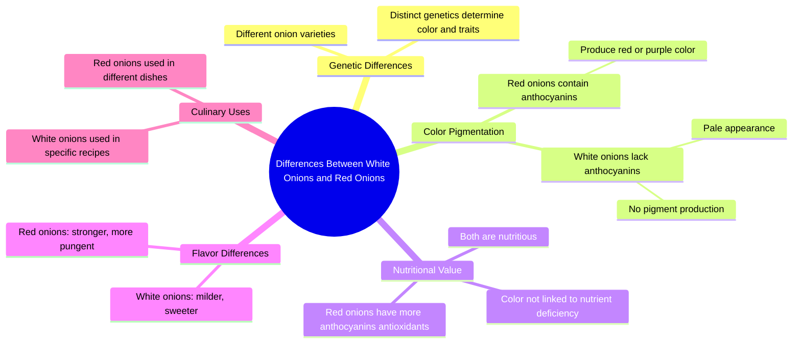

# 2.7M views · 51K reactions | What’s the Difference Between White and Red Onions? | Dr.Bota

> 🌐 **Read this in:** [English](../../en/2026-07/tiktok-transcript-2-7m-views-51k-reactions-what-s-the-difference-between-white-90e3.md) · **中文**

> **Creator:** [@Dr.Bota](https://www.tiktok.com/@Dr.Bota) · **Views:** 1.4M · **Posted:** 2026-07-24 · **Niche:** other
>
> **TL;DR:** Personifies onions and challenges a common assumption about paleness and health.

[Watch original video →](https://www.facebook.com/share/r/1Y2HTtwKy7/?mibextid=wwXIfr)

## Why This Went Viral

## Hook (first 3 seconds)
- **Verbatim opening:** "Dude, why are you so pale? Aren't you getting enough nutrients?"
- **Hook pattern:** **Scene + Question** — a confrontational dialogue between two personified onions, framed as a judgment about health.
- **Why it stops scroll:** The viewer expects a normal cooking or nutrition video, but instead gets a dramatic, absurd argument between two vegetables. The unexpected personification and the "pale = unhealthy" stereotype triggers immediate curiosity and amusement.

## Emotional Rhythm
- **Beat 1 (Curiosity + Surprise):** White onion is accused of being unhealthy. Viewer is confused but entertained.
- **Beat 2 (Tension):** White onion defends itself ("I'm getting just as many nutrients as you are"). Red onion escalates with a scientific-sounding insult ("can't even make anthocyanins").
- **Beat 3 (Relief + Laughter):** White onion fires back with vanity ("my skin is so fair"). The conflict is absurd, not serious.
- **Beat 4 (Climax):** The "Expert" character enters — a calm, authoritative voice that shatters the drama with a factual explanation about genetics and pigments.
- **Beat 5 (Resolution + Resonance):** The tension is resolved with a clear, educational payoff. Viewer feels both entertained and informed.

## Keyword Density
| Keyword / Phrase | Count | Driver |
|------------------|-------|--------|
| "onion" / "onions" | 6 | **Algorithmic reach** — high search volume for food content |
| "nutrients" / "nutritious" | 3 | **Emotional pull** — taps into health anxiety |
| "anthocyanins" | 2 | **Algorithmic reach** — niche science term boosts discovery |
| "pale" / "fair" | 3 | **Emotional pull** — triggers body-image humor |
| "different" / "difference" | 3 | **Algorithmic reach** — comparison/contrast queries |
| "jealous" | 1 | **Emotional pull** — social rivalry, relatable drama |
| "variety" / "special variety" | 2 | **Emotional pull** — identity/status appeal |

## Why It Spreads
1. **Absurd premise + educational payoff** — The personified onion argument is hilarious and unexpected, but the expert's calm explanation delivers real value. Viewers share because it's "funny *and* I learned something." (Lines: "I'm a white onion… Expert, what's the difference?")
2. **Low barrier to entry, high shareability** — The video is short, visually simple, and requires zero prior knowledge. Anyone who eats onions gets it. The "two characters arguing" format is universally relatable. (Line: "You're everywhere.")
3. **Emotional rollercoaster in <30 seconds** — It cycles through surprise, tension, laughter, and resolution. This rapid emotional shift triggers dopamine and makes the video feel "complete" — a key factor in re-watches and shares. (Lines: "Sounds like you're just jealous" → "Expert, what's the difference?")
4. **Niche science word as a discovery hook** — "Anthocyanins" is a specific, searchable term that signals credibility and educates the algorithm. It also makes the viewer feel smart for learning it. (Line: "Looks to me like you can't even make anthocyanins.")
5. **Personification of everyday objects** — Giving a white onion a voice and personality makes a boring topic (onion varieties) into a character-driven drama. This is a proven format for viral short-form content (e.g., talking animals, sentient food).

## What You Can Steal
1. **The "Argument → Expert" structure** — Start with two characters arguing over a trivial, emotional point (e.g., "Which fruit is better?"), then cut to a calm expert who resolves it with facts. This creates tension and a satisfying payoff.
2. **Personify a boring object** — Take any everyday item (onion, avocado, phone charger) and give it a voice, a personality flaw (vanity, jealousy), and a conflict with another object. This instantly makes any topic entertaining.
3. **Use a niche science word early** — Drop one specific, searchable term (like "anthocyanins") in the first 10 seconds. It signals expertise, boosts algorithm discoverability, and makes viewers feel like they're learning something exclusive.

## Mind Map

## Full Transcript (Generated by [TokTranscript](https://toktranscript.com/?utm_source=github&utm_medium=breakdown&utm_campaign=tool_attribution))

> 📝 Transcripts on this page are auto-generated and show the first 60%. Want to transcribe any TikTok in 30 seconds and get the full version? [Try TokTranscript free →](https://toktranscript.com/?utm_source=github&utm_medium=breakdown&utm_campaign=transcript_cta)

Dude, why are you so pale? Aren't you getting enough nutrients? Man, you're clueless. I'm getting just as many nutrients as you are. I'm a white onion. A white onion? Never heard of that. Looks to me like you can't even make anthocyanins. Sounds like you're just jealous because my skin is so fair. Jealous? Look at you. You don't even look fully ripe. I'm a special variety. That's what makes me different, unlike you. You're everywhere. Expert, what's the difference between white onions and red onions? White onions and red onio

*[Read the full transcript on TokTranscript →](https://toktranscript.com/plaza/tiktok-transcript-2-7m-views-51k-reactions-what-s-the-difference-between-white-90e3?utm_source=github&utm_medium=breakdown&utm_campaign=transcript_full)*

## Browse More

- All [other](../../by-niche/zh-CN/other.md) breakdowns
- All [Personification & Challenge](../../by-pattern/zh-CN/hook-personification-challenge.md) examples

## Video Info

| | |
|---|---|
| Creator | [@Dr.Bota](https://www.tiktok.com/@Dr.Bota) |
| Original video | [https://www.facebook.com/share/r/1Y2HTtwKy7/?mibextid=wwXIfr](https://www.facebook.com/share/r/1Y2HTtwKy7/?mibextid=wwXIfr) |
| Original title | 2.7M views · 51K reactions | What’s the Difference Between White and Red Onions? | Dr.Bota |
| Views | 1.4M (1393419) |
| Posted | 2026-07-24 |
| Duration | 0s |
| Niche | `other` |
| Hook pattern | `Personification & Challenge` |
| Original language | `en` (this page translated by AI) |
| Available languages | en, zh-CN |
| Generated | 2026-07-25 by [TokTranscript](https://toktranscript.com/) |

---

*This breakdown is for educational analysis under fair use. Original video © [@Dr.Bota](https://www.tiktok.com/@Dr.Bota). All transcripts are auto-generated and may contain errors.*

*Want to analyze your own TikToks like this? [TokTranscript 转录工具 →](https://toktranscript.com/viral-breakdown?utm_source=github&utm_medium=breakdown&utm_campaign=footer_cta)*